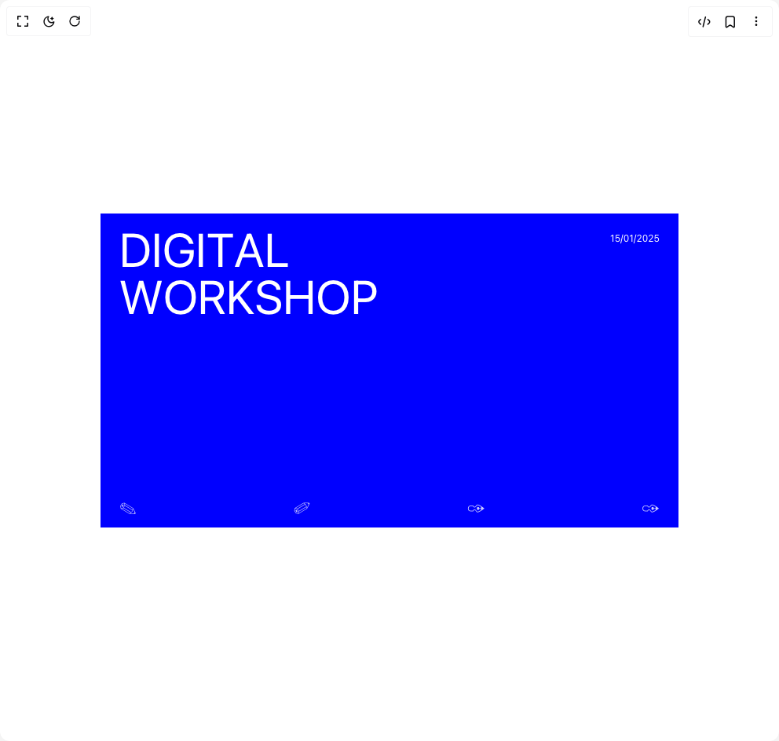

# Build Text Cursor Proximity in BuilderStudio

> Build this component in our Agentic IDE: [BuilderStudio](https://builderstudio.dev).
>
> Join the BuilderStudio community on [Discord](https://discord.gg/QdWeSGCqfe) and [Reddit](https://reddit.com/r/builderstudio).



## Component

- Author group: `danielpetho`
- Component: `text-cursor-proximity`
- Variant: `default`
- Rendered HTML snapshot: [`rendered.html`](rendered.html)

## BuilderStudio prompt

You are implementing a React component based on a component reference.

## Component identity

- Author: danielpetho
- Component slug: text-cursor-proximity
- Demo slug: default
- Title: text-cursor-proximity
- Description: 

## Goal

Recreate this component in a React + TypeScript + Tailwind CSS project. Preserve the visual layout, spacing, colors, border radius, shadows, interaction behavior, animation behavior, responsive behavior, and dark mode behavior shown in the rendered demo.

## Implementation requirements

- Use React and TypeScript.
- Use Tailwind CSS classes whenever possible.
- Keep the component self-contained unless the source files require helper components.
- If the source uses CSS variables, custom CSS, animations, or keyframes, include them.
- If the source uses external packages, list and use the required packages.
- Preserve accessibility attributes, button semantics, links, keyboard behavior, and ARIA attributes when visible in the source.
- Do not replace the component with a simplified placeholder.
- Return complete production-ready code.

## Dependencies

No reference metadata available.

## Rendered DOM snapshot

This is the rendered demo HTML extracted from the live preview. Use it to verify structure, class names, visible content, and layout.

```html
<div id="root"><div class="relative flex items-center justify-center h-screen w-full m-auto p-16 bg-background text-foreground"><div class="absolute lab-bg inset-0 size-full"><div class="absolute inset-0 bg-[radial-gradient(#00000021_1px,transparent_1px)] dark:bg-[radial-gradient(#ffffff22_1px,transparent_1px)]"></div></div><div class="flex w-full justify-center relative"><div class="w-full h-full flex flex-col items-center justify-center p-6 sm:p-12 md:p-16 lg:p-24"><div class="relative w-full cursor-pointer overflow-hidden justify-start items-start flex text-white" style="background-color: rgb(0, 0, 255); min-height: 400px; height: 100%;"><div class="flex flex-col justify-center uppercase leading-none pt-4 pl-6"><span class="text-3xl will-change-transform sm:text-6xl md:text-6xl lg:text-7xl font-overusedGrotesk inline"><span class="inline-block whitespace-nowrap"><span class="inline-block" aria-hidden="true" style="transform: scale(1.00338); color: rgb(255, 254, 255);">D</span><span class="inline-block" aria-hidden="true" style="transform: scale(1.00089); color: rgb(255, 255, 255);">I</span><span class="inline-block" aria-hidden="true" style="transform: scale(1.00016); color: rgb(255, 255, 255);">G</span><span class="inline-block" aria-hidden="true" style="transform: scale(1.00002); color: rgb(255, 255, 255);">I</span><span class="inline-block" aria-hidden="true" style="transform: scale(1); color: rgb(255, 255, 255);">T</span><span class="inline-block" aria-hidden="true" style="transform: scale(1); color: rgb(255, 255, 255);">A</span><span class="inline-block" aria-hidden="true" style="transform: scale(1); color: rgb(255, 255, 255);">L</span></span><span class="sr-only">DIGITAL</span></span><span class="leading-none text-3xl will-change-transform sm:text-6xl md:text-6xl lg:text-7xl font-overusedGrotesk inline"><span class="inline-block whitespace-nowrap"><span class="inline-block" aria-hidden="true" style="transform: scale(1.00008); color: rgb(255, 255, 255);">W</span><span class="inline-block" aria-hidden="true" style="transform: scale(1.00001); color: rgb(255, 255, 255);">O</span><span class="inline-block" aria-hidden="true" style="transform: scale(1); color: rgb(255, 255, 255);">R</span><span class="inline-block" aria-hidden="true" style="transform: scale(1); color: rgb(255, 255, 255);">K</span><span class="inline-block" aria-hidden="true" style="transform: scale(1); color: rgb(255, 255, 255);">S</span><span class="inline-block" aria-hidden="true" style="transform: scale(1); color: rgb(255, 255, 255);">H</span><span class="inline-block" aria-hidden="true" style="transform: scale(1); color: rgb(255, 255, 255);">O</span><span class="inline-block" aria-hidden="true" style="transform: scale(1); color: rgb(255, 255, 255);">P</span></span><span class="sr-only">WORKSHOP</span></span></div><div class="absolute bottom-2 flex w-full justify-between px-6"><span class="text-2xl opacity-80" style="font-family: serif;">✎</span><span class="text-2xl opacity-80" style="font-family: serif;">✐</span><span class="text-2xl opacity-80" style="font-family: serif;">✑</span><span class="text-2xl opacity-80" style="font-family: serif;">✑</span></div><span class="absolute top-6 right-6 hidden sm:block text-xs inline"><span class="inline-block whitespace-nowrap"><span class="inline-block" aria-hidden="true" style="transform: scale(1); color: rgb(255, 255, 255);">1</span><span class="inline-block" aria-hidden="true" style="transform: scale(1); color: rgb(255, 255, 255);">5</span><span class="inline-block" aria-hidden="true" style="transform: scale(1); color: rgb(255, 255, 255);">/</span><span class="inline-block" aria-hidden="true" style="transform: scale(1); color: rgb(255, 255, 255);">0</span><span class="inline-block" aria-hidden="true" style="transform: scale(1); color: rgb(255, 255, 255);">1</span><span class="inline-block" aria-hidden="true" style="transform: scale(1); color: rgb(255, 255, 255);">/</span><span class="inline-block" aria-hidden="true" style="transform: scale(1); color: rgb(255, 255, 255);">2</span><span class="inline-block" aria-hidden="true" style="transform: scale(1); color: rgb(255, 255, 255);">0</span><span class="inline-block" aria-hidden="true" style="transform: scale(1); color: rgb(255, 255, 255);">2</span><span class="inline-block" aria-hidden="true" style="transform: scale(1); color: rgb(255, 255, 255);">5</span></span><span class="sr-only">15/01/2025</span></span></div></div></div></div></div>
```

## Reference source files

No reference source files were available.
