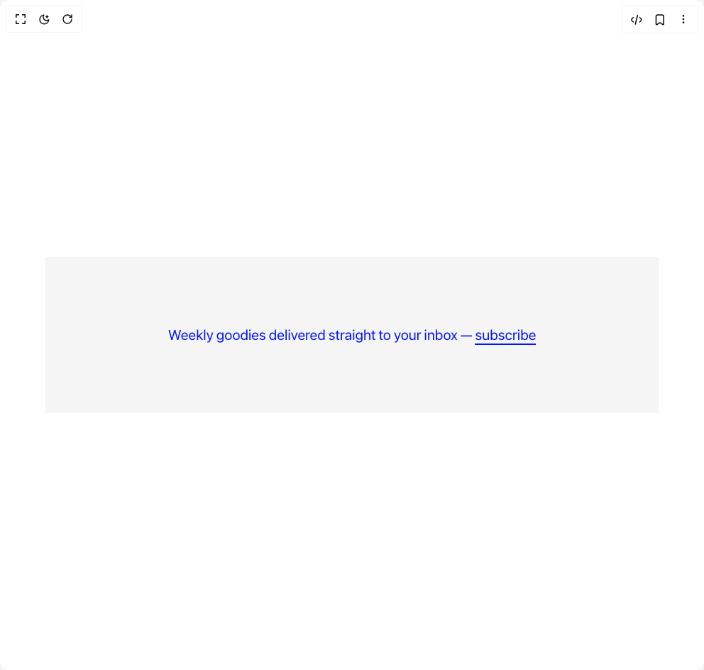

# Build Underline To Background in BuilderStudio

> Build this component in our Agentic IDE: [BuilderStudio](https://builderstudio.dev).
>
> Join the BuilderStudio community on [Discord](https://discord.gg/QdWeSGCqfe) and [Reddit](https://reddit.com/r/builderstudio).



## Component

- Author group: `danielpetho`
- Component: `underline-to-background`
- Variant: `default`
- Rendered HTML snapshot: [`rendered.html`](rendered.html)

## BuilderStudio prompt

You are implementing a React component based on a component reference.

## Component identity

- Author: danielpetho
- Component slug: underline-to-background
- Demo slug: default
- Title: underline-to-background
- Description: 

## Goal

Recreate this component in a React + TypeScript + Tailwind CSS project. Preserve the visual layout, spacing, colors, border radius, shadows, interaction behavior, animation behavior, responsive behavior, and dark mode behavior shown in the rendered demo.

## Implementation requirements

- Use React and TypeScript.
- Use Tailwind CSS classes whenever possible.
- Keep the component self-contained unless the source files require helper components.
- If the source uses CSS variables, custom CSS, animations, or keyframes, include them.
- If the source uses external packages, list and use the required packages.
- Preserve accessibility attributes, button semantics, links, keyboard behavior, and ARIA attributes when visible in the source.
- Do not replace the component with a simplified placeholder.
- Return complete production-ready code.

## Dependencies

No reference metadata available.

## Rendered DOM snapshot

This is the rendered demo HTML extracted from the live preview. Use it to verify structure, class names, visible content, and layout.

```html
<div id="root"><div class="relative flex items-center justify-center h-screen w-full m-auto p-16 bg-background text-foreground"><div class="absolute lab-bg inset-0 size-full"><div class="absolute inset-0 bg-[radial-gradient(#00000021_1px,transparent_1px)] dark:bg-[radial-gradient(#ffffff22_1px,transparent_1px)]"></div></div><div class="flex w-full justify-center relative"><div class="w-full h-full flex flex-col items-center justify-center bg-[#f5f5f5]"><h2 class="text-[#0015ff] text-xl p-12 md:p-24" style="opacity: 1;"><span class="inline-block mr-1" style="opacity: 1;">Weekly</span><span class="inline-block mr-1" style="opacity: 1;">goodies</span><span class="inline-block mr-1" style="opacity: 1;">delivered</span><span class="inline-block mr-1" style="opacity: 1;">straight</span><span class="inline-block mr-1" style="opacity: 1;">to</span><span class="inline-block mr-1" style="opacity: 1;">your</span><span class="inline-block mr-1" style="opacity: 1;">inbox</span><span class="inline-block mr-1" style="opacity: 1;">—</span><span class="inline-block" style="opacity: 1;"><span class="relative inline-block cursor-pointer cursor-pointer" style="--underline-height: 2px; --underline-padding: 0.2px;"><div class="absolute bg-current w-full" aria-hidden="true" style="height: var(--underline-height); bottom: calc(-1 * var(--underline-padding));"></div><span class="text-current relative">subscribe</span></span></span></h2></div></div></div></div>
```

## Reference source files

No reference source files were available.
