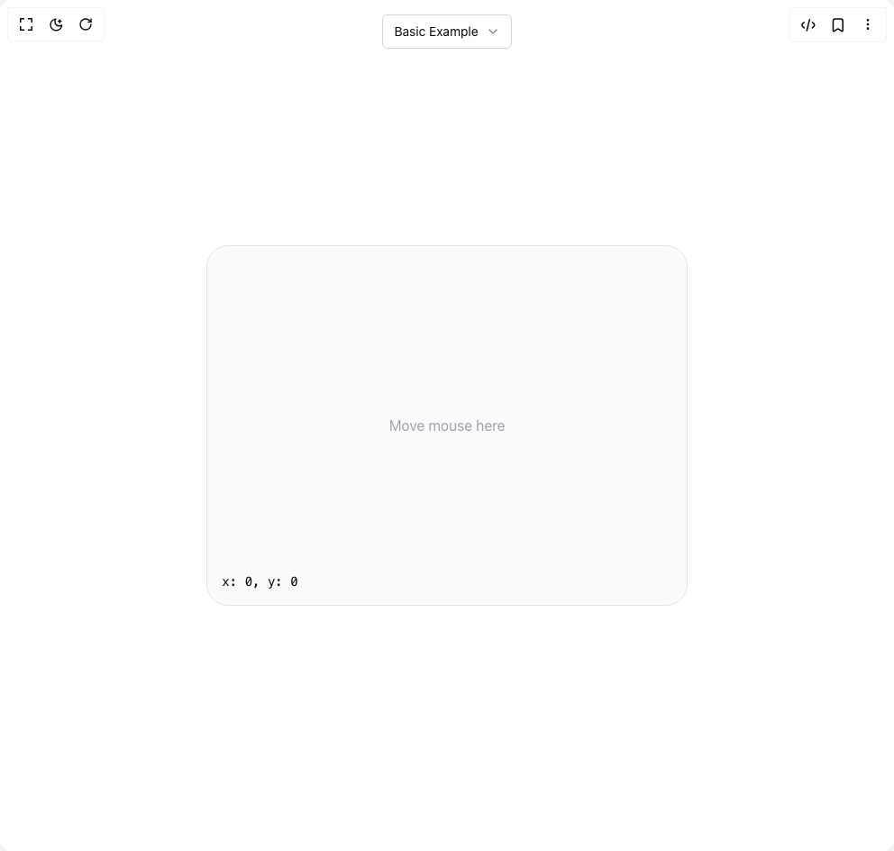

# Build Use Mouse Position in BuilderStudio

> Build this component in our Agentic IDE: [BuilderStudio](https://builderstudio.dev).
>
> Join the BuilderStudio community on [Discord](https://discord.gg/QdWeSGCqfe) and [Reddit](https://reddit.com/r/builderstudio).



## Component

- Author group: `danielpetho`
- Component: `use-mouse-position`
- Variant: `default`
- Rendered HTML snapshot: [`rendered.html`](rendered.html)

## BuilderStudio prompt

You are implementing a React component based on a component reference.

## Component identity

- Author: danielpetho
- Component slug: use-mouse-position
- Demo slug: default
- Title: use-mouse-position
- Description: 

## Goal

Recreate this component in a React + TypeScript + Tailwind CSS project. Preserve the visual layout, spacing, colors, border radius, shadows, interaction behavior, animation behavior, responsive behavior, and dark mode behavior shown in the rendered demo.

## Implementation requirements

- Use React and TypeScript.
- Use Tailwind CSS classes whenever possible.
- Keep the component self-contained unless the source files require helper components.
- If the source uses CSS variables, custom CSS, animations, or keyframes, include them.
- If the source uses external packages, list and use the required packages.
- Preserve accessibility attributes, button semantics, links, keyboard behavior, and ARIA attributes when visible in the source.
- Do not replace the component with a simplified placeholder.
- Return complete production-ready code.

## Dependencies

No reference metadata available.

## Rendered DOM snapshot

This is the rendered demo HTML extracted from the live preview. Use it to verify structure, class names, visible content, and layout.

```html
<div id="root"><div class="relative flex items-center justify-center h-screen w-full m-auto p-16 bg-background text-foreground"><div class="absolute lab-bg inset-0 size-full"><div class="absolute inset-0 bg-[radial-gradient(#00000021_1px,transparent_1px)] dark:bg-[radial-gradient(#ffffff22_1px,transparent_1px)]"></div></div><div class="absolute z-10 top-4 right-14 flex flex-col items-end gap-1"><button type="button" role="combobox" aria-controls="radix-«r0»" aria-expanded="false" aria-autocomplete="none" dir="ltr" data-state="closed" class="flex w-full items-center justify-between rounded-md border border-input bg-background px-3 py-2 text-sm ring-offset-background placeholder:text-muted-foreground focus:outline-none focus:ring-2 focus:ring-ring focus:ring-offset-2 disabled:cursor-not-allowed disabled:opacity-50 [&amp;&gt;span]:line-clamp-1 gap-2 h-8"><span style="pointer-events: none;">Basic Example</span><svg xmlns="http://www.w3.org/2000/svg" width="24" height="24" viewBox="0 0 24 24" fill="none" stroke="currentColor" stroke-width="2" stroke-linecap="round" stroke-linejoin="round" class="lucide lucide-chevron-down h-4 w-4 opacity-50" aria-hidden="true"><path d="m6 9 6 6 6-6"></path></svg></button></div><div class="flex w-full justify-center relative"><div class="w-full min-h-screen flex items-center justify-center p-8"><div class="w-4/6 h-[400px] rounded-3xl border relative bg-slate-50 overflow-hidden"><div class="w-4 h-4 bg-blue-500 rounded-full absolute" style="left: -8px; top: -8px;"></div><div class="absolute bottom-4 left-4 font-mono text-sm">x: 0, y: 0</div><div class="w-full h-full flex items-center justify-center text-gray-400">Move mouse here</div></div></div></div></div></div>
```

## Reference source files

No reference source files were available.
