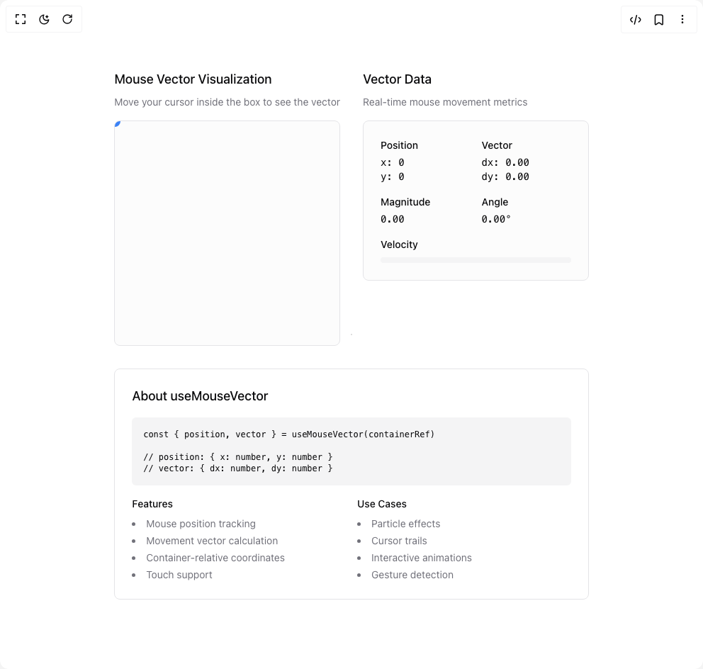

# Build Use Mouse Vector in BuilderStudio

> Build this component in our Agentic IDE: [BuilderStudio](https://builderstudio.dev).
>
> Join the BuilderStudio community on [Discord](https://discord.gg/QdWeSGCqfe) and [Reddit](https://reddit.com/r/builderstudio).



## Component

- Author group: `danielpetho`
- Component: `use-mouse-vector`
- Variant: `default`
- Rendered HTML snapshot: [`rendered.html`](rendered.html)

## BuilderStudio prompt

You are implementing a React component based on a component reference.

## Component identity

- Author: danielpetho
- Component slug: use-mouse-vector
- Demo slug: default
- Title: use-mouse-vector
- Description: 

## Goal

Recreate this component in a React + TypeScript + Tailwind CSS project. Preserve the visual layout, spacing, colors, border radius, shadows, interaction behavior, animation behavior, responsive behavior, and dark mode behavior shown in the rendered demo.

## Implementation requirements

- Use React and TypeScript.
- Use Tailwind CSS classes whenever possible.
- Keep the component self-contained unless the source files require helper components.
- If the source uses CSS variables, custom CSS, animations, or keyframes, include them.
- If the source uses external packages, list and use the required packages.
- Preserve accessibility attributes, button semantics, links, keyboard behavior, and ARIA attributes when visible in the source.
- Do not replace the component with a simplified placeholder.
- Return complete production-ready code.

## Dependencies

No reference metadata available.

## Rendered DOM snapshot

This is the rendered demo HTML extracted from the live preview. Use it to verify structure, class names, visible content, and layout.

```html
<div id="root"><div class="relative flex items-center justify-center h-screen w-full m-auto p-16 bg-background text-foreground"><div class="absolute lab-bg inset-0 size-full"><div class="absolute inset-0 bg-[radial-gradient(#00000021_1px,transparent_1px)] dark:bg-[radial-gradient(#ffffff22_1px,transparent_1px)]"></div></div><div class="flex w-full justify-center relative"><div class="grid grid-cols-1 md:grid-cols-2 gap-8 p-8 max-w-4xl mx-auto"><div class="space-y-4"><div class="space-y-2"><h3 class="text-lg font-medium">Mouse Vector Visualization</h3><p class="text-sm text-muted-foreground">Move your cursor inside the box to see the vector</p></div><div class="relative aspect-square w-full border rounded-lg bg-muted/30 overflow-hidden"><div class="absolute w-4 h-4 bg-blue-500 rounded-full" style="left: -8px; top: -8px;"></div><svg class="absolute inset-0 w-full h-full pointer-events-none" style="overflow: visible;"><line x1="0" y1="0" x2="0" y2="0" stroke="#3b82f6" stroke-width="2" pathLength="1" stroke-dashoffset="0px" stroke-dasharray="1px 1px"></line></svg></div></div><div class="space-y-4"><div class="space-y-2"><h3 class="text-lg font-medium">Vector Data</h3><p class="text-sm text-muted-foreground">Real-time mouse movement metrics</p></div><div class="space-y-4 p-6 border rounded-lg bg-muted/30"><div class="grid grid-cols-2 gap-4"><div><div class="text-sm font-medium mb-1">Position</div><div class="font-mono text-sm">x: 0<br>y: 0</div></div><div><div class="text-sm font-medium mb-1">Vector</div><div class="font-mono text-sm">dx: 0.00<br>dy: 0.00</div></div><div><div class="text-sm font-medium mb-1">Magnitude</div><div class="font-mono text-sm">0.00</div></div><div><div class="text-sm font-medium mb-1">Angle</div><div class="font-mono text-sm">0.00°</div></div></div><div class="mt-4"><div class="text-sm font-medium mb-2">Velocity</div><div class="h-2 bg-muted rounded-full overflow-hidden"><div class="h-full bg-blue-500" style="width: 0px;"></div></div></div></div></div><div class="md:col-span-2"><div class="space-y-4 p-6 border rounded-lg"><h3 class="text-lg font-medium">About useMouseVector</h3><div class="space-y-4"><pre class="bg-muted p-4 rounded-md text-xs overflow-x-auto">const { position, vector } = useMouseVector(containerRef)

// position: { x: number, y: number }
// vector: { dx: number, dy: number }</pre><div class="grid grid-cols-1 md:grid-cols-2 gap-4 text-sm"><div><h4 class="font-medium mb-2">Features</h4><ul class="list-disc list-inside space-y-1 text-muted-foreground"><li>Mouse position tracking</li><li>Movement vector calculation</li><li>Container-relative coordinates</li><li>Touch support</li></ul></div><div><h4 class="font-medium mb-2">Use Cases</h4><ul class="list-disc list-inside space-y-1 text-muted-foreground"><li>Particle effects</li><li>Cursor trails</li><li>Interactive animations</li><li>Gesture detection</li></ul></div></div></div></div></div></div></div></div></div>
```

## Reference source files

No reference source files were available.
