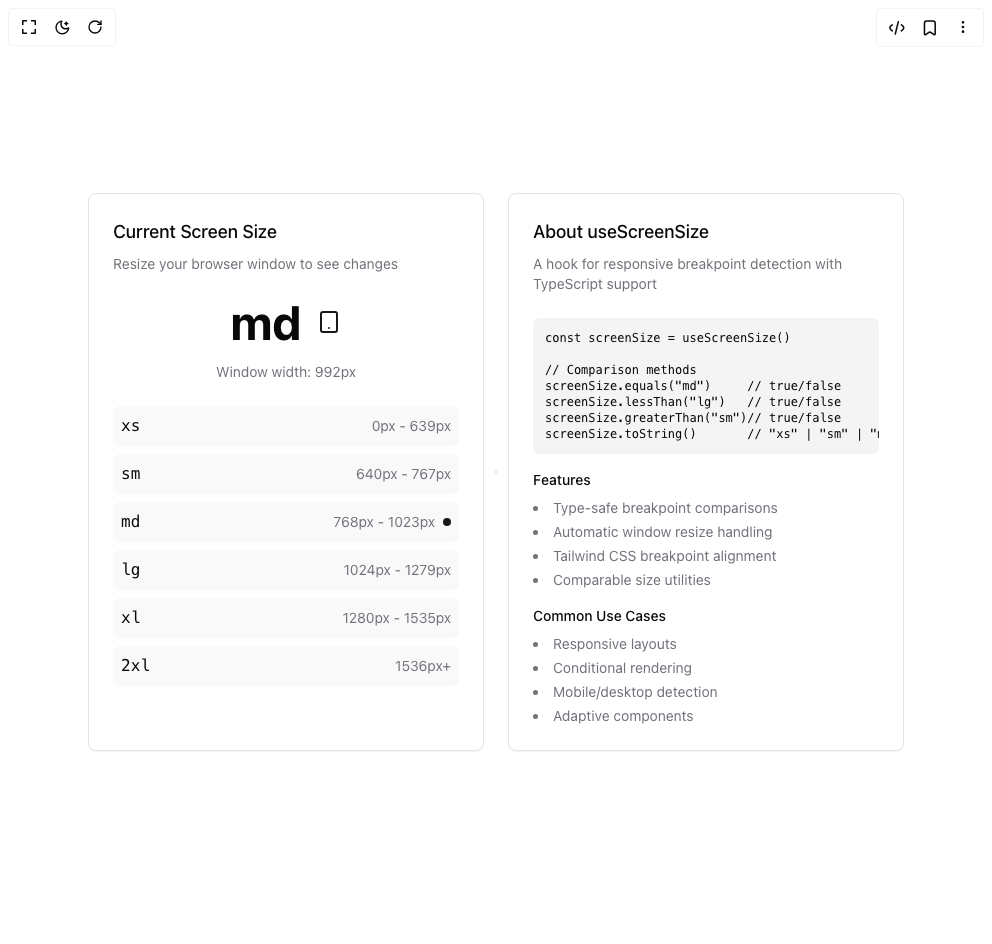

# Build Use Screen Size in BuilderStudio

> Build this component in our Agentic IDE: [BuilderStudio](https://builderstudio.dev).
>
> Join the BuilderStudio community on [Discord](https://discord.gg/QdWeSGCqfe) and [Reddit](https://reddit.com/r/builderstudio).



## Component

- Author group: `danielpetho`
- Component: `use-screen-size`
- Variant: `default`
- Rendered HTML snapshot: [`rendered.html`](rendered.html)

## BuilderStudio prompt

You are implementing a React component based on a component reference.

## Component identity

- Author: danielpetho
- Component slug: use-screen-size
- Demo slug: default
- Title: use-screen-size
- Description: 

## Goal

Recreate this component in a React + TypeScript + Tailwind CSS project. Preserve the visual layout, spacing, colors, border radius, shadows, interaction behavior, animation behavior, responsive behavior, and dark mode behavior shown in the rendered demo.

## Implementation requirements

- Use React and TypeScript.
- Use Tailwind CSS classes whenever possible.
- Keep the component self-contained unless the source files require helper components.
- If the source uses CSS variables, custom CSS, animations, or keyframes, include them.
- If the source uses external packages, list and use the required packages.
- Preserve accessibility attributes, button semantics, links, keyboard behavior, and ARIA attributes when visible in the source.
- Do not replace the component with a simplified placeholder.
- Return complete production-ready code.

## Dependencies

No reference metadata available.

## Rendered DOM snapshot

This is the rendered demo HTML extracted from the live preview. Use it to verify structure, class names, visible content, and layout.

```html
<div id="root"><div class="relative flex items-center justify-center h-screen w-full m-auto p-16 bg-background text-foreground"><div class="absolute lab-bg inset-0 size-full"><div class="absolute inset-0 bg-[radial-gradient(#00000021_1px,transparent_1px)] dark:bg-[radial-gradient(#ffffff22_1px,transparent_1px)]"></div></div><div class="flex w-full justify-center relative"><div class="grid grid-cols-1 md:grid-cols-2 gap-6 max-w-4xl mx-auto p-6"><div class="rounded-lg border bg-card text-card-foreground shadow-sm p-6"><div class="space-y-6"><div class="space-y-2"><h3 class="text-lg font-medium">Current Screen Size</h3><p class="text-sm text-muted-foreground">Resize your browser window to see changes</p></div><div class="flex flex-col items-center space-y-4"><div class="text-5xl font-bold flex items-center gap-4">md<svg xmlns="http://www.w3.org/2000/svg" width="24" height="24" viewBox="0 0 24 24" fill="none" stroke="currentColor" stroke-width="2" stroke-linecap="round" stroke-linejoin="round" class="lucide lucide-tablet h-6 w-6 text-primary" aria-hidden="true"><rect width="16" height="20" x="4" y="2" rx="2" ry="2"></rect><line x1="12" x2="12.01" y1="18" y2="18"></line></svg></div><div class="text-sm text-muted-foreground">Window width: 992px</div></div><div class="space-y-2"><div class="flex items-center justify-between p-2 rounded-lg bg-muted/50"><span class="font-mono">xs</span><div class="flex items-center gap-2"><span class="text-sm text-muted-foreground">0px - 639px</span></div></div><div class="flex items-center justify-between p-2 rounded-lg bg-muted/50"><span class="font-mono">sm</span><div class="flex items-center gap-2"><span class="text-sm text-muted-foreground">640px - 767px</span></div></div><div class="flex items-center justify-between p-2 rounded-lg bg-muted/50"><span class="font-mono">md</span><div class="flex items-center gap-2"><span class="text-sm text-muted-foreground">768px - 1023px</span><div class="w-2 h-2 rounded-full bg-primary"></div></div></div><div class="flex items-center justify-between p-2 rounded-lg bg-muted/50"><span class="font-mono">lg</span><div class="flex items-center gap-2"><span class="text-sm text-muted-foreground">1024px - 1279px</span></div></div><div class="flex items-center justify-between p-2 rounded-lg bg-muted/50"><span class="font-mono">xl</span><div class="flex items-center gap-2"><span class="text-sm text-muted-foreground">1280px - 1535px</span></div></div><div class="flex items-center justify-between p-2 rounded-lg bg-muted/50"><span class="font-mono">2xl</span><div class="flex items-center gap-2"><span class="text-sm text-muted-foreground">1536px+</span></div></div></div></div></div><div class="rounded-lg border bg-card text-card-foreground shadow-sm p-6"><div class="space-y-6"><div><h3 class="text-lg font-medium mb-2">About useScreenSize</h3><p class="text-sm text-muted-foreground">A hook for responsive breakpoint detection with TypeScript support</p></div><div class="space-y-4"><pre class="bg-muted p-3 rounded-md text-xs overflow-x-auto">const screenSize = useScreenSize()

// Comparison methods
screenSize.equals("md")     // true/false
screenSize.lessThan("lg")   // true/false
screenSize.greaterThan("sm")// true/false
screenSize.toString()       // "xs" | "sm" | "md" | "lg" | "xl" | "2xl"</pre><div class="space-y-4"><div><h4 class="text-sm font-medium mb-2">Features</h4><ul class="list-disc list-inside space-y-1 text-sm text-muted-foreground"><li>Type-safe breakpoint comparisons</li><li>Automatic window resize handling</li><li>Tailwind CSS breakpoint alignment</li><li>Comparable size utilities</li></ul></div><div><h4 class="text-sm font-medium mb-2">Common Use Cases</h4><ul class="list-disc list-inside space-y-1 text-sm text-muted-foreground"><li>Responsive layouts</li><li>Conditional rendering</li><li>Mobile/desktop detection</li><li>Adaptive components</li></ul></div></div></div></div></div></div></div></div></div>
```

## Reference source files

No reference source files were available.
