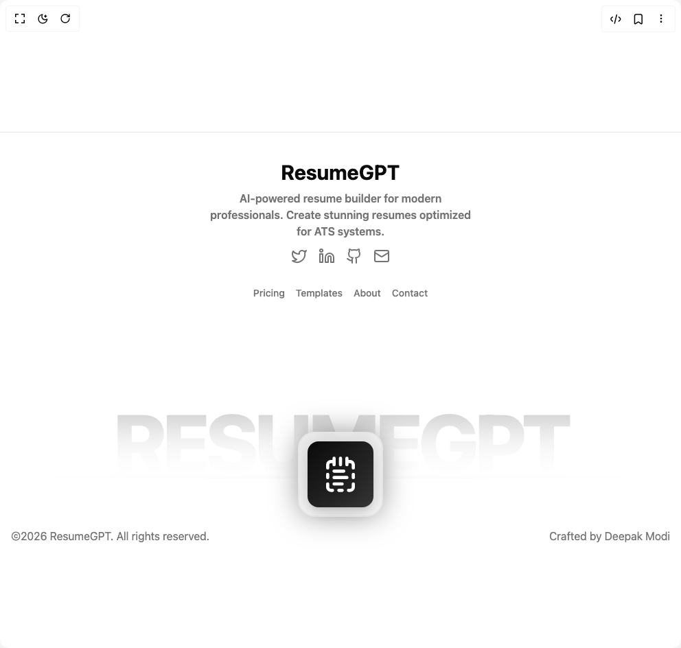

# Build Modem Animated Footer in BuilderStudio

> Build this component in our Agentic IDE: [BuilderStudio](https://builderstudio.dev).
>
> Join the BuilderStudio community on [Discord](https://discord.gg/QdWeSGCqfe) and [Reddit](https://reddit.com/r/builderstudio).



## Component

- Author group: `deepakmodidev`
- Component: `modem-animated-footer`
- Variant: `default`
- Rendered HTML snapshot: [`rendered.html`](rendered.html)

## BuilderStudio prompt

You are implementing a React component based on a component reference.

## Component identity

- Author: deepakmodidev
- Component slug: modem-animated-footer
- Demo slug: default
- Title: modem-animated-footer
- Description: 

## Goal

Recreate this component in a React + TypeScript + Tailwind CSS project. Preserve the visual layout, spacing, colors, border radius, shadows, interaction behavior, animation behavior, responsive behavior, and dark mode behavior shown in the rendered demo.

## Implementation requirements

- Use React and TypeScript.
- Use Tailwind CSS classes whenever possible.
- Keep the component self-contained unless the source files require helper components.
- If the source uses CSS variables, custom CSS, animations, or keyframes, include them.
- If the source uses external packages, list and use the required packages.
- Preserve accessibility attributes, button semantics, links, keyboard behavior, and ARIA attributes when visible in the source.
- Do not replace the component with a simplified placeholder.
- Return complete production-ready code.

## Dependencies

No reference metadata available.

## Rendered DOM snapshot

This is the rendered demo HTML extracted from the live preview. Use it to verify structure, class names, visible content, and layout.

```html
<div id="root"><div class="w-screen min-h-screen flex justify-center items-center"><div class="w-screen min-h-screen flex justify-center items-center"><section class="relative w-full mt-0 overflow-hidden"><footer class="border-t bg-background mt-20 relative"><div class="max-w-7xl flex flex-col justify-between mx-auto min-h-[30rem] sm:min-h-[35rem] md:min-h-[40rem] relative p-4 py-10"><div class="flex flex-col mb-12 sm:mb-20 md:mb-0 w-full"><div class="w-full flex flex-col items-center"><div class="space-y-2 flex flex-col items-center flex-1"><div class="flex items-center gap-2"><span class="text-foreground text-3xl font-bold">ResumeGPT</span></div><p class="text-muted-foreground font-semibold text-center w-full max-w-sm sm:w-96 px-4 sm:px-0">AI-powered resume builder for modern professionals. Create stunning resumes optimized for ATS systems.</p></div><div class="flex mb-8 mt-3 gap-4"><a href="https://twitter.com" class="text-muted-foreground hover:text-foreground transition-colors" target="_blank" rel="noopener noreferrer"><div class="w-6 h-6 hover:scale-110 duration-300"><svg xmlns="http://www.w3.org/2000/svg" width="24" height="24" viewBox="0 0 24 24" fill="none" stroke="currentColor" stroke-width="2" stroke-linecap="round" stroke-linejoin="round" class="lucide lucide-twitter w-6 h-6" aria-hidden="true"><path d="M22 4s-.7 2.1-2 3.4c1.6 10-9.4 17.3-18 11.6 2.2.1 4.4-.6 6-2C3 15.5.5 9.6 3 5c2.2 2.6 5.6 4.1 9 4-.9-4.2 4-6.6 7-3.8 1.1 0 3-1.2 3-1.2z"></path></svg></div><span class="sr-only">Twitter</span></a><a href="https://linkedin.com" class="text-muted-foreground hover:text-foreground transition-colors" target="_blank" rel="noopener noreferrer"><div class="w-6 h-6 hover:scale-110 duration-300"><svg xmlns="http://www.w3.org/2000/svg" width="24" height="24" viewBox="0 0 24 24" fill="none" stroke="currentColor" stroke-width="2" stroke-linecap="round" stroke-linejoin="round" class="lucide lucide-linkedin w-6 h-6" aria-hidden="true"><path d="M16 8a6 6 0 0 1 6 6v7h-4v-7a2 2 0 0 0-2-2 2 2 0 0 0-2 2v7h-4v-7a6 6 0 0 1 6-6z"></path><rect width="4" height="12" x="2" y="9"></rect><circle cx="4" cy="4" r="2"></circle></svg></div><span class="sr-only">LinkedIn</span></a><a href="https://github.com" class="text-muted-foreground hover:text-foreground transition-colors" target="_blank" rel="noopener noreferrer"><div class="w-6 h-6 hover:scale-110 duration-300"><svg xmlns="http://www.w3.org/2000/svg" width="24" height="24" viewBox="0 0 24 24" fill="none" stroke="currentColor" stroke-width="2" stroke-linecap="round" stroke-linejoin="round" class="lucide lucide-github w-6 h-6" aria-hidden="true"><path d="M15 22v-4a4.8 4.8 0 0 0-1-3.5c3 0 6-2 6-5.5.08-1.25-.27-2.48-1-3.5.28-1.15.28-2.35 0-3.5 0 0-1 0-3 1.5-2.64-.5-5.36-.5-8 0C6 2 5 2 5 2c-.3 1.15-.3 2.35 0 3.5A5.403 5.403 0 0 0 4 9c0 3.5 3 5.5 6 5.5-.39.49-.68 1.05-.85 1.65-.17.6-.22 1.23-.15 1.85v4"></path><path d="M9 18c-4.51 2-5-2-7-2"></path></svg></div><span class="sr-only">GitHub</span></a><a href="mailto:contact@resumegpt.com" class="text-muted-foreground hover:text-foreground transition-colors" target="_blank" rel="noopener noreferrer"><div class="w-6 h-6 hover:scale-110 duration-300"><svg xmlns="http://www.w3.org/2000/svg" width="24" height="24" viewBox="0 0 24 24" fill="none" stroke="currentColor" stroke-width="2" stroke-linecap="round" stroke-linejoin="round" class="lucide lucide-mail w-6 h-6" aria-hidden="true"><rect width="20" height="16" x="2" y="4" rx="2"></rect><path d="m22 7-8.97 5.7a1.94 1.94 0 0 1-2.06 0L2 7"></path></svg></div><span class="sr-only">Email</span></a></div><div class="flex flex-wrap justify-center gap-4 text-sm font-medium text-muted-foreground max-w-full px-4"><a href="/" class="hover:text-foreground duration-300 hover:font-semibold">Pricing</a><a href="/" class="hover:text-foreground duration-300 hover:font-semibold">Templates</a><a href="/" class="hover:text-foreground duration-300 hover:font-semibold">About</a><a href="/" class="hover:text-foreground duration-300 hover:font-semibold">Contact</a></div></div></div><div class="mt-20 md:mt-24 flex flex-col gap-2 md:gap-1 items-center justify-center md:flex-row md:items-center md:justify-between px-4 md:px-0"><p class="text-base text-muted-foreground text-center md:text-left">©2026 ResumeGPT. All rights reserved.</p><nav class="flex gap-4"><a href="https://deepakmodi.tech" target="_blank" class="text-base text-muted-foreground hover:text-foreground transition-colors duration-300 hover:font-medium">Crafted by Deepak Modi</a></nav></div></div><div class="bg-gradient-to-b from-foreground/20 via-foreground/10 to-transparent bg-clip-text text-transparent leading-none absolute left-1/2 -translate-x-1/2 bottom-40 md:bottom-32 font-extrabold tracking-tighter pointer-events-none select-none text-center px-4" style="font-size: clamp(3rem, 12vw, 10rem); max-width: 95vw;">RESUMEGPT</div><div class="absolute hover:border-foreground duration-400 drop-shadow-[0_0px_20px_rgba(0,0,0,0.5)] dark:drop-shadow-[0_0px_20px_rgba(255,255,255,0.3)] bottom-24 md:bottom-20 backdrop-blur-sm rounded-3xl bg-background/60 left-1/2 border-2 border-border flex items-center justify-center p-3 -translate-x-1/2 z-10"><div class="w-12 sm:w-16 md:w-24 h-12 sm:h-16 md:h-24 bg-gradient-to-br from-foreground to-foreground/80 rounded-2xl flex items-center justify-center shadow-lg"><svg xmlns="http://www.w3.org/2000/svg" width="24" height="24" viewBox="0 0 24 24" fill="none" stroke="currentColor" stroke-width="2" stroke-linecap="round" stroke-linejoin="round" class="lucide lucide-notepad-text-dashed w-8 sm:w-10 md:w-14 h-8 sm:h-10 md:h-14 text-background drop-shadow-lg" aria-hidden="true"><path d="M8 2v4"></path><path d="M12 2v4"></path><path d="M16 2v4"></path><path d="M16 4h2a2 2 0 0 1 2 2v2"></path><path d="M20 12v2"></path><path d="M20 18v2a2 2 0 0 1-2 2h-1"></path><path d="M13 22h-2"></path><path d="M7 22H6a2 2 0 0 1-2-2v-2"></path><path d="M4 14v-2"></path><path d="M4 8V6a2 2 0 0 1 2-2h2"></path><path d="M8 10h6"></path><path d="M8 14h8"></path><path d="M8 18h5"></path></svg></div></div><div class="absolute bottom-32 sm:bottom-34 backdrop-blur-sm h-1 bg-gradient-to-r from-transparent via-border to-transparent w-full left-1/2 -translate-x-1/2"></div><div class="bg-gradient-to-t from-background via-background/80 blur-[1em] to-background/40 absolute bottom-28 w-full h-24"></div></footer></section></div></div></div>
```

## Reference source files

No reference source files were available.
