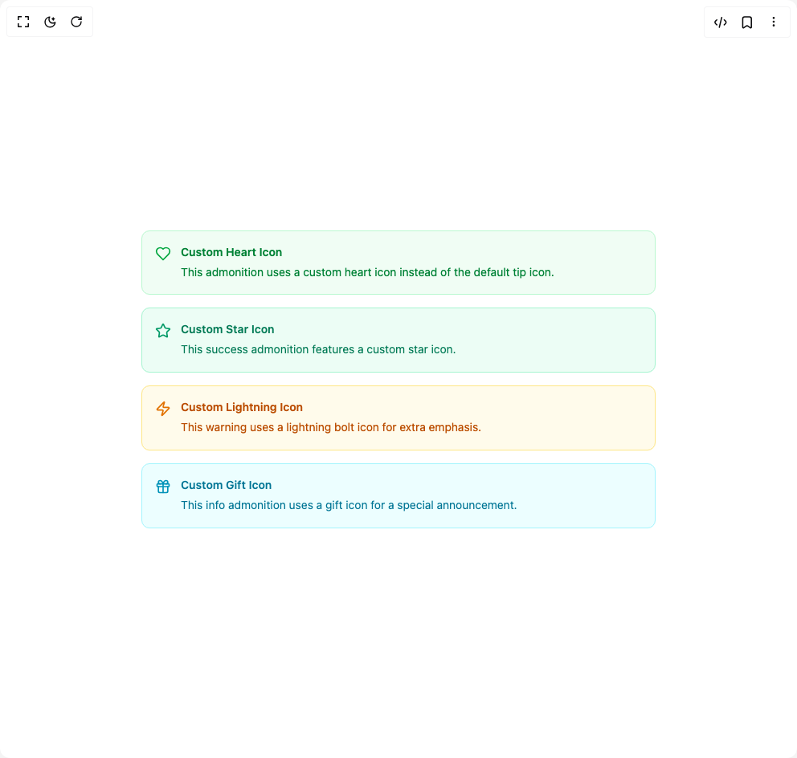

# Build Admonition in BuilderStudio

> Build this component in our Agentic IDE: [BuilderStudio](https://builderstudio.dev).
>
> Join the BuilderStudio community on [Discord](https://discord.gg/QdWeSGCqfe) and [Reddit](https://reddit.com/r/builderstudio).



## Component

- Author group: `deltacomponents`
- Component: `admonition`
- Variant: `custom-icons-admonition`
- Rendered HTML snapshot: [`rendered.html`](rendered.html)

## BuilderStudio prompt

You are implementing a React component based on a component reference.

## Component identity

- Author: deltacomponents
- Component slug: admonition
- Demo slug: custom-icons-admonition
- Title: admonition
- Description: 

## Goal

Recreate this component in a React + TypeScript + Tailwind CSS project. Preserve the visual layout, spacing, colors, border radius, shadows, interaction behavior, animation behavior, responsive behavior, and dark mode behavior shown in the rendered demo.

## Implementation requirements

- Use React and TypeScript.
- Use Tailwind CSS classes whenever possible.
- Keep the component self-contained unless the source files require helper components.
- If the source uses CSS variables, custom CSS, animations, or keyframes, include them.
- If the source uses external packages, list and use the required packages.
- Preserve accessibility attributes, button semantics, links, keyboard behavior, and ARIA attributes when visible in the source.
- Do not replace the component with a simplified placeholder.
- Return complete production-ready code.

## Dependencies

No reference metadata available.

## Rendered DOM snapshot

This is the rendered demo HTML extracted from the live preview. Use it to verify structure, class names, visible content, and layout.

```html
<div id="root"><div class="w-screen min-h-screen flex justify-center items-center"><div class="w-screen min-h-screen flex justify-center items-center"><div class="w-full max-w-2xl mx-auto space-y-4 p-4"><div class="bg-green-50 dark:bg-green-950/30
        border-green-200 dark:border-green-800
        border
        rounded-lg
        p-4"><div class="flex gap-3"><div class="text-green-600 dark:text-green-400 flex-shrink-0 mt-0.5"><svg xmlns="http://www.w3.org/2000/svg" width="24" height="24" viewBox="0 0 24 24" fill="none" stroke="currentColor" stroke-width="2" stroke-linecap="round" stroke-linejoin="round" class="lucide lucide-heart w-5 h-5" aria-hidden="true"><path d="M19 14c1.49-1.46 3-3.21 3-5.5A5.5 5.5 0 0 0 16.5 3c-1.76 0-3 .5-4.5 2-1.5-1.5-2.74-2-4.5-2A5.5 5.5 0 0 0 2 8.5c0 2.3 1.5 4.05 3 5.5l7 7Z"></path></svg></div><div class="flex-1 min-w-0"><div class="text-green-700 dark:text-green-300 font-semibold text-sm mb-1">Custom Heart Icon</div><div class="text-green-700 dark:text-green-300 text-sm leading-relaxed">This admonition uses a custom heart icon instead of the default tip icon.</div></div></div></div><div class="bg-emerald-50 dark:bg-emerald-950/30
        border-emerald-200 dark:border-emerald-800
        border
        rounded-lg
        p-4"><div class="flex gap-3"><div class="text-emerald-600 dark:text-emerald-400 flex-shrink-0 mt-0.5"><svg xmlns="http://www.w3.org/2000/svg" width="24" height="24" viewBox="0 0 24 24" fill="none" stroke="currentColor" stroke-width="2" stroke-linecap="round" stroke-linejoin="round" class="lucide lucide-star w-5 h-5" aria-hidden="true"><path d="M11.525 2.295a.53.53 0 0 1 .95 0l2.31 4.679a2.123 2.123 0 0 0 1.595 1.16l5.166.756a.53.53 0 0 1 .294.904l-3.736 3.638a2.123 2.123 0 0 0-.611 1.878l.882 5.14a.53.53 0 0 1-.771.56l-4.618-2.428a2.122 2.122 0 0 0-1.973 0L6.396 21.01a.53.53 0 0 1-.77-.56l.881-5.139a2.122 2.122 0 0 0-.611-1.879L2.16 9.795a.53.53 0 0 1 .294-.906l5.165-.755a2.122 2.122 0 0 0 1.597-1.16z"></path></svg></div><div class="flex-1 min-w-0"><div class="text-emerald-700 dark:text-emerald-300 font-semibold text-sm mb-1">Custom Star Icon</div><div class="text-emerald-700 dark:text-emerald-300 text-sm leading-relaxed">This success admonition features a custom star icon.</div></div></div></div><div class="bg-amber-50 dark:bg-amber-950/30
        border-amber-200 dark:border-amber-700
        border
        rounded-lg
        p-4"><div class="flex gap-3"><div class="text-amber-600 dark:text-amber-400 flex-shrink-0 mt-0.5"><svg xmlns="http://www.w3.org/2000/svg" width="24" height="24" viewBox="0 0 24 24" fill="none" stroke="currentColor" stroke-width="2" stroke-linecap="round" stroke-linejoin="round" class="lucide lucide-zap w-5 h-5" aria-hidden="true"><path d="M4 14a1 1 0 0 1-.78-1.63l9.9-10.2a.5.5 0 0 1 .86.46l-1.92 6.02A1 1 0 0 0 13 10h7a1 1 0 0 1 .78 1.63l-9.9 10.2a.5.5 0 0 1-.86-.46l1.92-6.02A1 1 0 0 0 11 14z"></path></svg></div><div class="flex-1 min-w-0"><div class="text-amber-700 dark:text-amber-300 font-semibold text-sm mb-1">Custom Lightning Icon</div><div class="text-amber-700 dark:text-amber-300 text-sm leading-relaxed">This warning uses a lightning bolt icon for extra emphasis.</div></div></div></div><div class="bg-cyan-50 dark:bg-cyan-950/30
        border-cyan-200 dark:border-cyan-800
        border
        rounded-lg
        p-4"><div class="flex gap-3"><div class="text-cyan-600 dark:text-cyan-400 flex-shrink-0 mt-0.5"><svg xmlns="http://www.w3.org/2000/svg" width="24" height="24" viewBox="0 0 24 24" fill="none" stroke="currentColor" stroke-width="2" stroke-linecap="round" stroke-linejoin="round" class="lucide lucide-gift w-5 h-5" aria-hidden="true"><rect x="3" y="8" width="18" height="4" rx="1"></rect><path d="M12 8v13"></path><path d="M19 12v7a2 2 0 0 1-2 2H7a2 2 0 0 1-2-2v-7"></path><path d="M7.5 8a2.5 2.5 0 0 1 0-5A4.8 8 0 0 1 12 8a4.8 8 0 0 1 4.5-5 2.5 2.5 0 0 1 0 5"></path></svg></div><div class="flex-1 min-w-0"><div class="text-cyan-700 dark:text-cyan-300 font-semibold text-sm mb-1">Custom Gift Icon</div><div class="text-cyan-700 dark:text-cyan-300 text-sm leading-relaxed">This info admonition uses a gift icon for a special announcement.</div></div></div></div></div></div></div></div>
```

## Reference source files

No reference source files were available.
