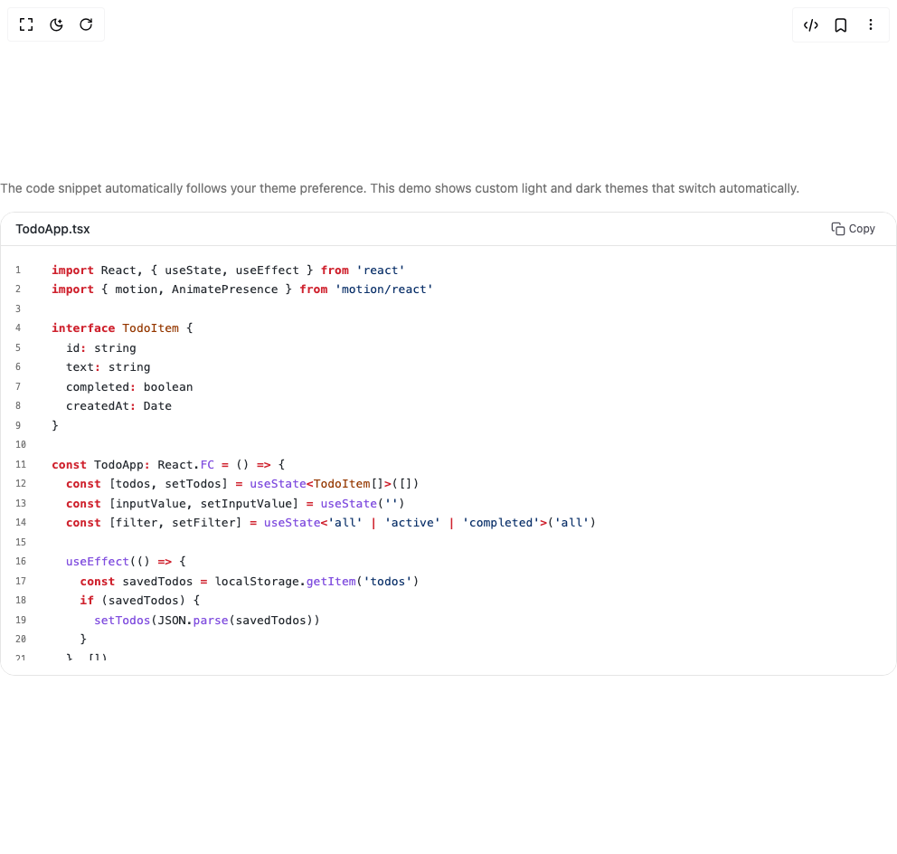

# Build Code Snippets 3 in BuilderStudio

> Build this component in our Agentic IDE: [BuilderStudio](https://builderstudio.dev).
>
> Join the BuilderStudio community on [Discord](https://discord.gg/QdWeSGCqfe) and [Reddit](https://reddit.com/r/builderstudio).



## Component

- Author group: `deltacomponents`
- Component: `code-snippets-3`
- Variant: `adaptive-dark-n-light-mode`
- Rendered HTML snapshot: [`rendered.html`](rendered.html)

## BuilderStudio prompt

You are implementing a React component based on a component reference.

## Component identity

- Author: deltacomponents
- Component slug: code-snippets-3
- Demo slug: adaptive-dark-n-light-mode
- Title: code-snippets-3
- Description: 

## Goal

Recreate this component in a React + TypeScript + Tailwind CSS project. Preserve the visual layout, spacing, colors, border radius, shadows, interaction behavior, animation behavior, responsive behavior, and dark mode behavior shown in the rendered demo.

## Implementation requirements

- Use React and TypeScript.
- Use Tailwind CSS classes whenever possible.
- Keep the component self-contained unless the source files require helper components.
- If the source uses CSS variables, custom CSS, animations, or keyframes, include them.
- If the source uses external packages, list and use the required packages.
- Preserve accessibility attributes, button semantics, links, keyboard behavior, and ARIA attributes when visible in the source.
- Do not replace the component with a simplified placeholder.
- Return complete production-ready code.

## Dependencies

No reference metadata available.

## Rendered DOM snapshot

This is the rendered demo HTML extracted from the live preview. Use it to verify structure, class names, visible content, and layout.

```html
<div id="root"><div class="w-screen min-h-screen flex justify-center items-center"><div class="w-screen min-h-screen flex justify-center items-center"><div class="w-full py-4"><div class="mb-4 text-sm text-muted-foreground">The code snippet automatically follows your theme preference. This demo shows custom light and dark themes that switch automatically.</div><div class="rounded-2xl overflow-hidden pointer-events-auto border border-border"><div class="flex items-center justify-between border-b" style="background-color: rgb(255, 255, 255); border-bottom-color: rgb(229, 229, 229);"><h3 class="text-sm font-medium pl-4 py-2" style="color: rgb(36, 41, 47);">TodoApp.tsx</h3><button type="button" aria-label="Copy to clipboard" title="Copy" class="inline-flex items-center gap-1 rounded-md border px-2.5 py-1.5 text-xs transition-colors focus:outline-none focus-visible:ring-2 focus-visible:ring-offset-2 border-transparent/0 hover:border-transparent/0 mr-3 text-zinc-600 hover:bg-zinc-200 hover:text-zinc-800"><span class="sr-only">Copy</span><svg viewBox="0 0 24 24" class="h-4 w-4" fill="none" stroke="currentColor" stroke-width="2" stroke-linecap="round" stroke-linejoin="round" aria-hidden="true"><rect x="9" y="9" width="13" height="13" rx="2" ry="2"></rect><path d="M5 15H4a2 2 0 0 1-2-2V4a2 2 0 0 1 2-2h9a2 2 0 0 1 2 2v1"></path></svg><span>Copy</span></button></div><div class="relative max-h-[calc(530px-44px)] py-4" style="background-color: rgb(255, 255, 255);"><pre class="prism-code language-typescript text-[13px] overflow-x-auto overflow-y-auto max-h-[calc(530px-88px)] font-mono font-medium" style="color: rgb(36, 41, 47); background-color: rgb(255, 255, 255);"><div class="flex items-center py-px px-4" style="color: rgb(36, 41, 47);"><span class="mr-4 select-none text-right text-[10px] items-center flex" style="color: rgb(117, 117, 117); min-width: 1.5rem;">1</span><span class=""><span class="token keyword" style="color: rgb(207, 34, 46); font-weight: 600;">import</span><span class="token plain"> React</span><span class="token punctuation" style="color: rgb(36, 41, 47);">,</span><span class="token plain"> </span><span class="token punctuation" style="color: rgb(36, 41, 47);">{</span><span class="token plain"> useState</span><span class="token punctuation" style="color: rgb(36, 41, 47);">,</span><span class="token plain"> useEffect </span><span class="token punctuation" style="color: rgb(36, 41, 47);">}</span><span class="token plain"> </span><span class="token keyword" style="color: rgb(207, 34, 46); font-weight: 600;">from</span><span class="token plain"> </span><span class="token string" style="color: rgb(10, 48, 105);">'react'</span><span class="token plain"></span></span></div><div class="flex items-center py-px px-4" style="color: rgb(36, 41, 47);"><span class="mr-4 select-none text-right text-[10px] items-center flex" style="color: rgb(117, 117, 117); min-width: 1.5rem;">2</span><span class=""><span class="token plain"></span><span class="token keyword" style="color: rgb(207, 34, 46); font-weight: 600;">import</span><span class="token plain"> </span><span class="token punctuation" style="color: rgb(36, 41, 47);">{</span><span class="token plain"> motion</span><span class="token punctuation" style="color: rgb(36, 41, 47);">,</span><span class="token plain"> AnimatePresence </span><span class="token punctuation" style="color: rgb(36, 41, 47);">}</span><span class="token plain"> </span><span class="token keyword" style="color: rgb(207, 34, 46); font-weight: 600;">from</span><span class="token plain"> </span><span class="token string" style="color: rgb(10, 48, 105);">'motion/react'</span><span class="token plain"></span></span></div><div class="flex items-center py-px px-4" style="color: rgb(36, 41, 47);"><span class="mr-4 select-none text-right text-[10px] items-center flex" style="color: rgb(117, 117, 117); min-width: 1.5rem;">3</span><span class=""><span class="token plain" style="display: inline-block;">
</span></span></div><div class="flex items-center py-px px-4" style="color: rgb(36, 41, 47);"><span class="mr-4 select-none text-right text-[10px] items-center flex" style="color: rgb(117, 117, 117); min-width: 1.5rem;">4</span><span class=""><span class="token plain"></span><span class="token keyword" style="color: rgb(207, 34, 46); font-weight: 600;">interface</span><span class="token plain"> </span><span class="token class-name" style="color: rgb(149, 56, 0); font-weight: 500;">TodoItem</span><span class="token plain"> </span><span class="token punctuation" style="color: rgb(36, 41, 47);">{</span><span class="token plain"></span></span></div><div class="flex items-center py-px px-4" style="color: rgb(36, 41, 47);"><span class="mr-4 select-none text-right text-[10px] items-center flex" style="color: rgb(117, 117, 117); min-width: 1.5rem;">5</span><span class=""><span class="token plain">  id</span><span class="token operator" style="color: rgb(207, 34, 46); font-weight: 600;">:</span><span class="token plain"> </span><span class="token builtin">string</span><span class="token plain"></span></span></div><div class="flex items-center py-px px-4" style="color: rgb(36, 41, 47);"><span class="mr-4 select-none text-right text-[10px] items-center flex" style="color: rgb(117, 117, 117); min-width: 1.5rem;">6</span><span class=""><span class="token plain">  text</span><span class="token operator" style="color: rgb(207, 34, 46); font-weight: 600;">:</span><span class="token plain"> </span><span class="token builtin">string</span><span class="token plain"></span></span></div><div class="flex items-center py-px px-4" style="color: rgb(36, 41, 47);"><span class="mr-4 select-none text-right text-[10px] items-center flex" style="color: rgb(117, 117, 117); min-width: 1.5rem;">7</span><span class=""><span class="token plain">  completed</span><span class="token operator" style="color: rgb(207, 34, 46); font-weight: 600;">:</span><span class="token plain"> </span><span class="token builtin">boolean</span><span class="token plain"></span></span></div><div class="flex items-center py-px px-4" style="color: rgb(36, 41, 47);"><span class="mr-4 select-none text-right text-[10px] items-center flex" style="color: rgb(117, 117, 117); min-width: 1.5rem;">8</span><span class=""><span class="token plain">  createdAt</span><span class="token operator" style="color: rgb(207, 34, 46); font-weight: 600;">:</span><span class="token plain"> Date</span></span></div><div class="flex items-center py-px px-4" style="color: rgb(36, 41, 47);"><span class="mr-4 select-none text-right text-[10px] items-center flex" style="color: rgb(117, 117, 117); min-width: 1.5rem;">9</span><span class=""><span class="token plain"></span><span class="token punctuation" style="color: rgb(36, 41, 47);">}</span><span class="token plain"></span></span></div><div class="flex items-center py-px px-4" style="color: rgb(36, 41, 47);"><span class="mr-4 select-none text-right text-[10px] items-center flex" style="color: rgb(117, 117, 117); min-width: 1.5rem;">10</span><span class=""><span class="token plain" style="display: inline-block;">
</span></span></div><div class="flex items-center py-px px-4" style="color: rgb(36, 41, 47);"><span class="mr-4 select-none text-right text-[10px] items-center flex" style="color: rgb(117, 117, 117); min-width: 1.5rem;">11</span><span class=""><span class="token plain"></span><span class="token keyword" style="color: rgb(207, 34, 46); font-weight: 600;">const</span><span class="token plain"> TodoApp</span><span class="token operator" style="color: rgb(207, 34, 46); font-weight: 600;">:</span><span class="token plain"> React</span><span class="token punctuation" style="color: rgb(36, 41, 47);">.</span><span class="token function-variable function" style="color: rgb(130, 80, 223);">FC</span><span class="token plain"> </span><span class="token operator" style="color: rgb(207, 34, 46); font-weight: 600;">=</span><span class="token plain"> </span><span class="token punctuation" style="color: rgb(36, 41, 47);">(</span><span class="token punctuation" style="color: rgb(36, 41, 47);">)</span><span class="token plain"> </span><span class="token operator" style="color: rgb(207, 34, 46); font-weight: 600;">=&gt;</span><span class="token plain"> </span><span class="token punctuation" style="color: rgb(36, 41, 47);">{</span><span class="token plain"></span></span></div><div class="flex items-center py-px px-4" style="color: rgb(36, 41, 47);"><span class="mr-4 select-none text-right text-[10px] items-center flex" style="color: rgb(117, 117, 117); min-width: 1.5rem;">12</span><span class=""><span class="token plain">  </span><span class="token keyword" style="color: rgb(207, 34, 46); font-weight: 600;">const</span><span class="token plain"> </span><span class="token punctuation" style="color: rgb(36, 41, 47);">[</span><span class="token plain">todos</span><span class="token punctuation" style="color: rgb(36, 41, 47);">,</span><span class="token plain"> setTodos</span><span class="token punctuation" style="color: rgb(36, 41, 47);">]</span><span class="token plain"> </span><span class="token operator" style="color: rgb(207, 34, 46); font-weight: 600;">=</span><span class="token plain"> </span><span class="token generic-function function" style="color: rgb(130, 80, 223);">useState</span><span class="token generic-function generic class-name operator" style="color: rgb(207, 34, 46); font-weight: 600;">&lt;</span><span class="token generic-function generic class-name" style="color: rgb(149, 56, 0); font-weight: 500;">TodoItem</span><span class="token generic-function generic class-name punctuation" style="color: rgb(36, 41, 47); font-weight: 500;">[</span><span class="token generic-function generic class-name punctuation" style="color: rgb(36, 41, 47); font-weight: 500;">]</span><span class="token generic-function generic class-name operator" style="color: rgb(207, 34, 46); font-weight: 600;">&gt;</span><span class="token punctuation" style="color: rgb(36, 41, 47);">(</span><span class="token punctuation" style="color: rgb(36, 41, 47);">[</span><span class="token punctuation" style="color: rgb(36, 41, 47);">]</span><span class="token punctuation" style="color: rgb(36, 41, 47);">)</span><span class="token plain"></span></span></div><div class="flex items-center py-px px-4" style="color: rgb(36, 41, 47);"><span class="mr-4 select-none text-right text-[10px] items-center flex" style="color: rgb(117, 117, 117); min-width: 1.5rem;">13</span><span class=""><span class="token plain">  </span><span class="token keyword" style="color: rgb(207, 34, 46); font-weight: 600;">const</span><span class="token plain"> </span><span class="token punctuation" style="color: rgb(36, 41, 47);">[</span><span class="token plain">inputValue</span><span class="token punctuation" style="color: rgb(36, 41, 47);">,</span><span class="token plain"> setInputValue</span><span class="token punctuation" style="color: rgb(36, 41, 47);">]</span><span class="token plain"> </span><span class="token operator" style="color: rgb(207, 34, 46); font-weight: 600;">=</span><span class="token plain"> </span><span class="token function" style="color: rgb(130, 80, 223);">useState</span><span class="token punctuation" style="color: rgb(36, 41, 47);">(</span><span class="token string" style="color: rgb(10, 48, 105);">''</span><span class="token punctuation" style="color: rgb(36, 41, 47);">)</span><span class="token plain"></span></span></div><div class="flex items-center py-px px-4" style="color: rgb(36, 41, 47);"><span class="mr-4 select-none text-right text-[10px] items-center flex" style="color: rgb(117, 117, 117); min-width: 1.5rem;">14</span><span class=""><span class="token plain">  </span><span class="token keyword" style="color: rgb(207, 34, 46); font-weight: 600;">const</span><span class="token plain"> </span><span class="token punctuation" style="color: rgb(36, 41, 47);">[</span><span class="token plain">filter</span><span class="token punctuation" style="color: rgb(36, 41, 47);">,</span><span class="token plain"> setFilter</span><span class="token punctuation" style="color: rgb(36, 41, 47);">]</span><span class="token plain"> </span><span class="token operator" style="color: rgb(207, 34, 46); font-weight: 600;">=</span><span class="token plain"> </span><span class="token generic-function function" style="color: rgb(130, 80, 223);">useState</span><span class="token generic-function generic class-name operator" style="color: rgb(207, 34, 46); font-weight: 600;">&lt;</span><span class="token generic-function generic class-name string" style="color: rgb(10, 48, 105); font-weight: 500;">'all'</span><span class="token generic-function generic class-name" style="color: rgb(149, 56, 0); font-weight: 500;"> </span><span class="token generic-function generic class-name operator" style="color: rgb(207, 34, 46); font-weight: 600;">|</span><span class="token generic-function generic class-name" style="color: rgb(149, 56, 0); font-weight: 500;"> </span><span class="token generic-function generic class-name string" style="color: rgb(10, 48, 105); font-weight: 500;">'active'</span><span class="token generic-function generic class-name" style="color: rgb(149, 56, 0); font-weight: 500;"> </span><span class="token generic-function generic class-name operator" style="color: rgb(207, 34, 46); font-weight: 600;">|</span><span class="token generic-function generic class-name" style="color: rgb(149, 56, 0); font-weight: 500;"> </span><span class="token generic-function generic class-name string" style="color: rgb(10, 48, 105); font-weight: 500;">'completed'</span><span class="token generic-function generic class-name operator" style="color: rgb(207, 34, 46); font-weight: 600;">&gt;</span><span class="token punctuation" style="color: rgb(36, 41, 47);">(</span><span class="token string" style="color: rgb(10, 48, 105);">'all'</span><span class="token punctuation" style="color: rgb(36, 41, 47);">)</span><span class="token plain"></span></span></div><div class="flex items-center py-px px-4" style="color: rgb(36, 41, 47);"><span class="mr-4 select-none text-right text-[10px] items-center flex" style="color: rgb(117, 117, 117); min-width: 1.5rem;">15</span><span class=""><span class="token plain" style="display: inline-block;">
</span></span></div><div class="flex items-center py-px px-4" style="color: rgb(36, 41, 47);"><span class="mr-4 select-none text-right text-[10px] items-center flex" style="color: rgb(117, 117, 117); min-width: 1.5rem;">16</span><span class=""><span class="token plain">  </span><span class="token function" style="color: rgb(130, 80, 223);">useEffect</span><span class="token punctuation" style="color: rgb(36, 41, 47);">(</span><span class="token punctuation" style="color: rgb(36, 41, 47);">(</span><span class="token punctuation" style="color: rgb(36, 41, 47);">)</span><span class="token plain"> </span><span class="token operator" style="color: rgb(207, 34, 46); font-weight: 600;">=&gt;</span><span class="token plain"> </span><span class="token punctuation" style="color: rgb(36, 41, 47);">{</span><span class="token plain"></span></span></div><div class="flex items-center py-px px-4" style="color: rgb(36, 41, 47);"><span class="mr-4 select-none text-right text-[10px] items-center flex" style="color: rgb(117, 117, 117); min-width: 1.5rem;">17</span><span class=""><span class="token plain">    </span><span class="token keyword" style="color: rgb(207, 34, 46); font-weight: 600;">const</span><span class="token plain"> savedTodos </span><span class="token operator" style="color: rgb(207, 34, 46); font-weight: 600;">=</span><span class="token plain"> localStorage</span><span class="token punctuation" style="color: rgb(36, 41, 47);">.</span><span class="token function" style="color: rgb(130, 80, 223);">getItem</span><span class="token punctuation" style="color: rgb(36, 41, 47);">(</span><span class="token string" style="color: rgb(10, 48, 105);">'todos'</span><span class="token punctuation" style="color: rgb(36, 41, 47);">)</span><span class="token plain"></span></span></div><div class="flex items-center py-px px-4" style="color: rgb(36, 41, 47);"><span class="mr-4 select-none text-right text-[10px] items-center flex" style="color: rgb(117, 117, 117); min-width: 1.5rem;">18</span><span class=""><span class="token plain">    </span><span class="token keyword" style="color: rgb(207, 34, 46); font-weight: 600;">if</span><span class="token plain"> </span><span class="token punctuation" style="color: rgb(36, 41, 47);">(</span><span class="token plain">savedTodos</span><span class="token punctuation" style="color: rgb(36, 41, 47);">)</span><span class="token plain"> </span><span class="token punctuation" style="color: rgb(36, 41, 47);">{</span><span class="token plain"></span></span></div><div class="flex items-center py-px px-4" style="color: rgb(36, 41, 47);"><span class="mr-4 select-none text-right text-[10px] items-center flex" style="color: rgb(117, 117, 117); min-width: 1.5rem;">19</span><span class=""><span class="token plain">      </span><span class="token function" style="color: rgb(130, 80, 223);">setTodos</span><span class="token punctuation" style="color: rgb(36, 41, 47);">(</span><span class="token constant">JSON</span><span class="token punctuation" style="color: rgb(36, 41, 47);">.</span><span class="token function" style="color: rgb(130, 80, 223);">parse</span><span class="token punctuation" style="color: rgb(36, 41, 47);">(</span><span class="token plain">savedTodos</span><span class="token punctuation" style="color: rgb(36, 41, 47);">)</span><span class="token punctuation" style="color: rgb(36, 41, 47);">)</span><span class="token plain"></span></span></div><div class="flex items-center py-px px-4" style="color: rgb(36, 41, 47);"><span class="mr-4 select-none text-right text-[10px] items-center flex" style="color: rgb(117, 117, 117); min-width: 1.5rem;">20</span><span class=""><span class="token plain">    </span><span class="token punctuation" style="color: rgb(36, 41, 47);">}</span><span class="token plain"></span></span></div><div class="flex items-center py-px px-4" style="color: rgb(36, 41, 47);"><span class="mr-4 select-none text-right text-[10px] items-center flex" style="color: rgb(117, 117, 117); min-width: 1.5rem;">21</span><span class=""><span class="token plain">  </span><span class="token punctuation" style="color: rgb(36, 41, 47);">}</span><span class="token punctuation" style="color: rgb(36, 41, 47);">,</span><span class="token plain"> </span><span class="token punctuation" style="color: rgb(36, 41, 47);">[</span><span class="token punctuation" style="color: rgb(36, 41, 47);">]</span><span class="token punctuation" style="color: rgb(36, 41, 47);">)</span><span class="token plain"></span></span></div><div class="flex items-center py-px px-4" style="color: rgb(36, 41, 47);"><span class="mr-4 select-none text-right text-[10px] items-center flex" style="color: rgb(117, 117, 117); min-width: 1.5rem;">22</span><span class=""><span class="token plain" style="display: inline-block;">
</span></span></div><div class="flex items-center py-px px-4" style="color: rgb(36, 41, 47);"><span class="mr-4 select-none text-right text-[10px] items-center flex" style="color: rgb(117, 117, 117); min-width: 1.5rem;">23</span><span class=""><span class="token plain">  </span><span class="token function" style="color: rgb(130, 80, 223);">useEffect</span><span class="token punctuation" style="color: rgb(36, 41, 47);">(</span><span class="token punctuation" style="color: rgb(36, 41, 47);">(</span><span class="token punctuation" style="color: rgb(36, 41, 47);">)</span><span class="token plain"> </span><span class="token operator" style="color: rgb(207, 34, 46); font-weight: 600;">=&gt;</span><span class="token plain"> </span><span class="token punctuation" style="color: rgb(36, 41, 47);">{</span><span class="token plain"></span></span></div><div class="flex items-center py-px px-4" style="color: rgb(36, 41, 47);"><span class="mr-4 select-none text-right text-[10px] items-center flex" style="color: rgb(117, 117, 117); min-width: 1.5rem;">24</span><span class=""><span class="token plain">    localStorage</span><span class="token punctuation" style="color: rgb(36, 41, 47);">.</span><span class="token function" style="color: rgb(130, 80, 223);">setItem</span><span class="token punctuation" style="color: rgb(36, 41, 47);">(</span><span class="token string" style="color: rgb(10, 48, 105);">'todos'</span><span class="token punctuation" style="color: rgb(36, 41, 47);">,</span><span class="token plain"> </span><span class="token constant">JSON</span><span class="token punctuation" style="color: rgb(36, 41, 47);">.</span><span class="token function" style="color: rgb(130, 80, 223);">stringify</span><span class="token punctuation" style="color: rgb(36, 41, 47);">(</span><span class="token plain">todos</span><span class="token punctuation" style="color: rgb(36, 41, 47);">)</span><span class="token punctuation" style="color: rgb(36, 41, 47);">)</span><span class="token plain"></span></span></div><div class="flex items-center py-px px-4" style="color: rgb(36, 41, 47);"><span class="mr-4 select-none text-right text-[10px] items-center flex" style="color: rgb(117, 117, 117); min-width: 1.5rem;">25</span><span class=""><span class="token plain">  </span><span class="token punctuation" style="color: rgb(36, 41, 47);">}</span><span class="token punctuation" style="color: rgb(36, 41, 47);">,</span><span class="token plain"> </span><span class="token punctuation" style="color: rgb(36, 41, 47);">[</span><span class="token plain">todos</span><span class="token punctuation" style="color: rgb(36, 41, 47);">]</span><span class="token punctuation" style="color: rgb(36, 41, 47);">)</span><span class="token plain"></span></span></div><div class="flex items-center py-px px-4" style="color: rgb(36, 41, 47);"><span class="mr-4 select-none text-right text-[10px] items-center flex" style="color: rgb(117, 117, 117); min-width: 1.5rem;">26</span><span class=""><span class="token plain" style="display: inline-block;">
</span></span></div><div class="flex items-center py-px px-4" style="color: rgb(36, 41, 47);"><span class="mr-4 select-none text-right text-[10px] items-center flex" style="color: rgb(117, 117, 117); min-width: 1.5rem;">27</span><span class=""><span class="token plain">  </span><span class="token keyword" style="color: rgb(207, 34, 46); font-weight: 600;">const</span><span class="token plain"> </span><span class="token function-variable function" style="color: rgb(130, 80, 223);">addTodo</span><span class="token plain"> </span><span class="token operator" style="color: rgb(207, 34, 46); font-weight: 600;">=</span><span class="token plain"> </span><span class="token punctuation" style="color: rgb(36, 41, 47);">(</span><span class="token plain">e</span><span class="token operator" style="color: rgb(207, 34, 46); font-weight: 600;">:</span><span class="token plain"> React</span><span class="token punctuation" style="color: rgb(36, 41, 47);">.</span><span class="token plain">FormEvent</span><span class="token punctuation" style="color: rgb(36, 41, 47);">)</span><span class="token plain"> </span><span class="token operator" style="color: rgb(207, 34, 46); font-weight: 600;">=&gt;</span><span class="token plain"> </span><span class="token punctuation" style="color: rgb(36, 41, 47);">{</span><span class="token plain"></span></span></div><div class="flex items-center py-px px-4" style="color: rgb(36, 41, 47);"><span class="mr-4 select-none text-right text-[10px] items-center flex" style="color: rgb(117, 117, 117); min-width: 1.5rem;">28</span><span class=""><span class="token plain">    e</span><span class="token punctuation" style="color: rgb(36, 41, 47);">.</span><span class="token function" style="color: rgb(130, 80, 223);">preventDefault</span><span class="token punctuation" style="color: rgb(36, 41, 47);">(</span><span class="token punctuation" style="color: rgb(36, 41, 47);">)</span><span class="token plain"></span></span></div><div class="flex items-center py-px px-4" style="color: rgb(36, 41, 47);"><span class="mr-4 select-none text-right text-[10px] items-center flex" style="color: rgb(117, 117, 117); min-width: 1.5rem;">29</span><span class=""><span class="token plain">    </span><span class="token keyword" style="color: rgb(207, 34, 46); font-weight: 600;">if</span><span class="token plain"> </span><span class="token punctuation" style="color: rgb(36, 41, 47);">(</span><span class="token plain">inputValue</span><span class="token punctuation" style="color: rgb(36, 41, 47);">.</span><span class="token function" style="color: rgb(130, 80, 223);">trim</span><span class="token punctuation" style="color: rgb(36, 41, 47);">(</span><span class="token punctuation" style="color: rgb(36, 41, 47);">)</span><span class="token punctuation" style="color: rgb(36, 41, 47);">)</span><span class="token plain"> </span><span class="token punctuation" style="color: rgb(36, 41, 47);">{</span><span class="token plain"></span></span></div><div class="flex items-center py-px px-4" style="color: rgb(36, 41, 47);"><span class="mr-4 select-none text-right text-[10px] items-center flex" style="color: rgb(117, 117, 117); min-width: 1.5rem;">30</span><span class=""><span class="token plain">      </span><span class="token keyword" style="color: rgb(207, 34, 46); font-weight: 600;">const</span><span class="token plain"> newTodo</span><span class="token operator" style="color: rgb(207, 34, 46); font-weight: 600;">:</span><span class="token plain"> TodoItem </span><span class="token operator" style="color: rgb(207, 34, 46); font-weight: 600;">=</span><span class="token plain"> </span><span class="token punctuation" style="color: rgb(36, 41, 47);">{</span><span class="token plain"></span></span></div><div class="flex items-center py-px px-4" style="color: rgb(36, 41, 47);"><span class="mr-4 select-none text-right text-[10px] items-center flex" style="color: rgb(117, 117, 117); min-width: 1.5rem;">31</span><span class=""><span class="token plain">        id</span><span class="token operator" style="color: rgb(207, 34, 46); font-weight: 600;">:</span><span class="token plain"> crypto</span><span class="token punctuation" style="color: rgb(36, 41, 47);">.</span><span class="token function" style="color: rgb(130, 80, 223);">randomUUID</span><span class="token punctuation" style="color: rgb(36, 41, 47);">(</span><span class="token punctuation" style="color: rgb(36, 41, 47);">)</span><span class="token punctuation" style="color: rgb(36, 41, 47);">,</span><span class="token plain"></span></span></div><div class="flex items-center py-px px-4" style="color: rgb(36, 41, 47);"><span class="mr-4 select-none text-right text-[10px] items-center flex" style="color: rgb(117, 117, 117); min-width: 1.5rem;">32</span><span class=""><span class="token plain">        text</span><span class="token operator" style="color: rgb(207, 34, 46); font-weight: 600;">:</span><span class="token plain"> inputValue</span><span class="token punctuation" style="color: rgb(36, 41, 47);">.</span><span class="token function" style="color: rgb(130, 80, 223);">trim</span><span class="token punctuation" style="color: rgb(36, 41, 47);">(</span><span class="token punctuation" style="color: rgb(36, 41, 47);">)</span><span class="token punctuation" style="color: rgb(36, 41, 47);">,</span><span class="token plain"></span></span></div><div class="flex items-center py-px px-4" style="color: rgb(36, 41, 47);"><span class="mr-4 select-none text-right text-[10px] items-center flex" style="color: rgb(117, 117, 117); min-width: 1.5rem;">33</span><span class=""><span class="token plain">        completed</span><span class="token operator" style="color: rgb(207, 34, 46); font-weight: 600;">:</span><span class="token plain"> </span><span class="token boolean">false</span><span class="token punctuation" style="color: rgb(36, 41, 47);">,</span><span class="token plain"></span></span></div><div class="flex items-center py-px px-4" style="color: rgb(36, 41, 47);"><span class="mr-4 select-none text-right text-[10px] items-center flex" style="color: rgb(117, 117, 117); min-width: 1.5rem;">34</span><span class=""><span class="token plain">        createdAt</span><span class="token operator" style="color: rgb(207, 34, 46); font-weight: 600;">:</span><span class="token plain"> </span><span class="token keyword" style="color: rgb(207, 34, 46); font-weight: 600;">new</span><span class="token plain"> </span><span class="token class-name" style="color: rgb(149, 56, 0); font-weight: 500;">Date</span><span class="token punctuation" style="color: rgb(36, 41, 47);">(</span><span class="token punctuation" style="color: rgb(36, 41, 47);">)</span><span class="token plain"></span></span></div><div class="flex items-center py-px px-4" style="color: rgb(36, 41, 47);"><span class="mr-4 select-none text-right text-[10px] items-center flex" style="color: rgb(117, 117, 117); min-width: 1.5rem;">35</span><span class=""><span class="token plain">      </span><span class="token punctuation" style="color: rgb(36, 41, 47);">}</span><span class="token plain"></span></span></div><div class="flex items-center py-px px-4" style="color: rgb(36, 41, 47);"><span class="mr-4 select-none text-right text-[10px] items-center flex" style="color: rgb(117, 117, 117); min-width: 1.5rem;">36</span><span class=""><span class="token plain">      </span><span class="token function" style="color: rgb(130, 80, 223);">setTodos</span><span class="token punctuation" style="color: rgb(36, 41, 47);">(</span><span class="token plain">prev </span><span class="token operator" style="color: rgb(207, 34, 46); font-weight: 600;">=&gt;</span><span class="token plain"> </span><span class="token punctuation" style="color: rgb(36, 41, 47);">[</span><span class="token operator" style="color: rgb(207, 34, 46); font-weight: 600;">...</span><span class="token plain">prev</span><span class="token punctuation" style="color: rgb(36, 41, 47);">,</span><span class="token plain"> newTodo</span><span class="token punctuation" style="color: rgb(36, 41, 47);">]</span><span class="token punctuation" style="color: rgb(36, 41, 47);">)</span><span class="token plain"></span></span></div><div class="flex items-center py-px px-4" style="color: rgb(36, 41, 47);"><span class="mr-4 select-none text-right text-[10px] items-center flex" style="color: rgb(117, 117, 117); min-width: 1.5rem;">37</span><span class=""><span class="token plain">      </span><span class="token function" style="color: rgb(130, 80, 223);">setInputValue</span><span class="token punctuation" style="color: rgb(36, 41, 47);">(</span><span class="token string" style="color: rgb(10, 48, 105);">''</span><span class="token punctuation" style="color: rgb(36, 41, 47);">)</span><span class="token plain"></span></span></div><div class="flex items-center py-px px-4" style="color: rgb(36, 41, 47);"><span class="mr-4 select-none text-right text-[10px] items-center flex" style="color: rgb(117, 117, 117); min-width: 1.5rem;">38</span><span class=""><span class="token plain">    </span><span class="token punctuation" style="color: rgb(36, 41, 47);">}</span><span class="token plain"></span></span></div><div class="flex items-center py-px px-4" style="color: rgb(36, 41, 47);"><span class="mr-4 select-none text-right text-[10px] items-center flex" style="color: rgb(117, 117, 117); min-width: 1.5rem;">39</span><span class=""><span class="token plain">  </span><span class="token punctuation" style="color: rgb(36, 41, 47);">}</span><span class="token plain"></span></span></div><div class="flex items-center py-px px-4" style="color: rgb(36, 41, 47);"><span class="mr-4 select-none text-right text-[10px] items-center flex" style="color: rgb(117, 117, 117); min-width: 1.5rem;">40</span><span class=""><span class="token plain" style="display: inline-block;">
</span></span></div><div class="flex items-center py-px px-4" style="color: rgb(36, 41, 47);"><span class="mr-4 select-none text-right text-[10px] items-center flex" style="color: rgb(117, 117, 117); min-width: 1.5rem;">41</span><span class=""><span class="token plain">  </span><span class="token keyword" style="color: rgb(207, 34, 46); font-weight: 600;">const</span><span class="token plain"> </span><span class="token function-variable function" style="color: rgb(130, 80, 223);">toggleTodo</span><span class="token plain"> </span><span class="token operator" style="color: rgb(207, 34, 46); font-weight: 600;">=</span><span class="token plain"> </span><span class="token punctuation" style="color: rgb(36, 41, 47);">(</span><span class="token plain">id</span><span class="token operator" style="color: rgb(207, 34, 46); font-weight: 600;">:</span><span class="token plain"> </span><span class="token builtin">string</span><span class="token punctuation" style="color: rgb(36, 41, 47);">)</span><span class="token plain"> </span><span class="token operator" style="color: rgb(207, 34, 46); font-weight: 600;">=&gt;</span><span class="token plain"> </span><span class="token punctuation" style="color: rgb(36, 41, 47);">{</span><span class="token plain"></span></span></div><div class="flex items-center py-px px-4" style="color: rgb(36, 41, 47);"><span class="mr-4 select-none text-right text-[10px] items-center flex" style="color: rgb(117, 117, 117); min-width: 1.5rem;">42</span><span class=""><span class="token plain">    </span><span class="token function" style="color: rgb(130, 80, 223);">setTodos</span><span class="token punctuation" style="color: rgb(36, 41, 47);">(</span><span class="token plain">prev </span><span class="token operator" style="color: rgb(207, 34, 46); font-weight: 600;">=&gt;</span><span class="token plain"> </span></span></div><div class="flex items-center py-px px-4" style="color: rgb(36, 41, 47);"><span class="mr-4 select-none text-right text-[10px] items-center flex" style="color: rgb(117, 117, 117); min-width: 1.5rem;">43</span><span class=""><span class="token plain">      prev</span><span class="token punctuation" style="color: rgb(36, 41, 47);">.</span><span class="token function" style="color: rgb(130, 80, 223);">map</span><span class="token punctuation" style="color: rgb(36, 41, 47);">(</span><span class="token plain">todo </span><span class="token operator" style="color: rgb(207, 34, 46); font-weight: 600;">=&gt;</span><span class="token plain"> </span></span></div><div class="flex items-center py-px px-4" style="color: rgb(36, 41, 47);"><span class="mr-4 select-none text-right text-[10px] items-center flex" style="color: rgb(117, 117, 117); min-width: 1.5rem;">44</span><span class=""><span class="token plain">        todo</span><span class="token punctuation" style="color: rgb(36, 41, 47);">.</span><span class="token plain">id </span><span class="token operator" style="color: rgb(207, 34, 46); font-weight: 600;">===</span><span class="token plain"> id </span><span class="token operator" style="color: rgb(207, 34, 46); font-weight: 600;">?</span><span class="token plain"> </span><span class="token punctuation" style="color: rgb(36, 41, 47);">{</span><span class="token plain"> </span><span class="token operator" style="color: rgb(207, 34, 46); font-weight: 600;">...</span><span class="token plain">todo</span><span class="token punctuation" style="color: rgb(36, 41, 47);">,</span><span class="token plain"> completed</span><span class="token operator" style="color: rgb(207, 34, 46); font-weight: 600;">:</span><span class="token plain"> </span><span class="token operator" style="color: rgb(207, 34, 46); font-weight: 600;">!</span><span class="token plain">todo</span><span class="token punctuation" style="color: rgb(36, 41, 47);">.</span><span class="token plain">completed </span><span class="token punctuation" style="color: rgb(36, 41, 47);">}</span><span class="token plain"> </span><span class="token operator" style="color: rgb(207, 34, 46); font-weight: 600;">:</span><span class="token plain"> todo</span></span></div><div class="flex items-center py-px px-4" style="color: rgb(36, 41, 47);"><span class="mr-4 select-none text-right text-[10px] items-center flex" style="color: rgb(117, 117, 117); min-width: 1.5rem;">45</span><span class=""><span class="token plain">      </span><span class="token punctuation" style="color: rgb(36, 41, 47);">)</span><span class="token plain"></span></span></div><div class="flex items-center py-px px-4" style="color: rgb(36, 41, 47);"><span class="mr-4 select-none text-right text-[10px] items-center flex" style="color: rgb(117, 117, 117); min-width: 1.5rem;">46</span><span class=""><span class="token plain">    </span><span class="token punctuation" style="color: rgb(36, 41, 47);">)</span><span class="token plain"></span></span></div><div class="flex items-center py-px px-4" style="color: rgb(36, 41, 47);"><span class="mr-4 select-none text-right text-[10px] items-center flex" style="color: rgb(117, 117, 117); min-width: 1.5rem;">47</span><span class=""><span class="token plain">  </span><span class="token punctuation" style="color: rgb(36, 41, 47);">}</span><span class="token plain"></span></span></div><div class="flex items-center py-px px-4" style="color: rgb(36, 41, 47);"><span class="mr-4 select-none text-right text-[10px] items-center flex" style="color: rgb(117, 117, 117); min-width: 1.5rem;">48</span><span class=""><span class="token plain" style="display: inline-block;">
</span></span></div><div class="flex items-center py-px px-4" style="color: rgb(36, 41, 47);"><span class="mr-4 select-none text-right text-[10px] items-center flex" style="color: rgb(117, 117, 117); min-width: 1.5rem;">49</span><span class=""><span class="token plain">  </span><span class="token keyword" style="color: rgb(207, 34, 46); font-weight: 600;">const</span><span class="token plain"> </span><span class="token function-variable function" style="color: rgb(130, 80, 223);">deleteTodo</span><span class="token plain"> </span><span class="token operator" style="color: rgb(207, 34, 46); font-weight: 600;">=</span><span class="token plain"> </span><span class="token punctuation" style="color: rgb(36, 41, 47);">(</span><span class="token plain">id</span><span class="token operator" style="color: rgb(207, 34, 46); font-weight: 600;">:</span><span class="token plain"> </span><span class="token builtin">string</span><span class="token punctuation" style="color: rgb(36, 41, 47);">)</span><span class="token plain"> </span><span class="token operator" style="color: rgb(207, 34, 46); font-weight: 600;">=&gt;</span><span class="token plain"> </span><span class="token punctuation" style="color: rgb(36, 41, 47);">{</span><span class="token plain"></span></span></div><div class="flex items-center py-px px-4" style="color: rgb(36, 41, 47);"><span class="mr-4 select-none text-right text-[10px] items-center flex" style="color: rgb(117, 117, 117); min-width: 1.5rem;">50</span><span class=""><span class="token plain">    </span><span class="token function" style="color: rgb(130, 80, 223);">setTodos</span><span class="token punctuation" style="color: rgb(36, 41, 47);">(</span><span class="token plain">prev </span><span class="token operator" style="color: rgb(207, 34, 46); font-weight: 600;">=&gt;</span><span class="token plain"> prev</span><span class="token punctuation" style="color: rgb(36, 41, 47);">.</span><span class="token function" style="color: rgb(130, 80, 223);">filter</span><span class="token punctuation" style="color: rgb(36, 41, 47);">(</span><span class="token plain">todo </span><span class="token operator" style="color: rgb(207, 34, 46); font-weight: 600;">=&gt;</span><span class="token plain"> todo</span><span class="token punctuation" style="color: rgb(36, 41, 47);">.</span><span class="token plain">id </span><span class="token operator" style="color: rgb(207, 34, 46); font-weight: 600;">!==</span><span class="token plain"> id</span><span class="token punctuation" style="color: rgb(36, 41, 47);">)</span><span class="token punctuation" style="color: rgb(36, 41, 47);">)</span><span class="token plain"></span></span></div><div class="flex items-center py-px px-4" style="color: rgb(36, 41, 47);"><span class="mr-4 select-none text-right text-[10px] items-center flex" style="color: rgb(117, 117, 117); min-width: 1.5rem;">51</span><span class=""><span class="token plain">  </span><span class="token punctuation" style="color: rgb(36, 41, 47);">}</span><span class="token plain"></span></span></div><div class="flex items-center py-px px-4" style="color: rgb(36, 41, 47);"><span class="mr-4 select-none text-right text-[10px] items-center flex" style="color: rgb(117, 117, 117); min-width: 1.5rem;">52</span><span class=""><span class="token plain" style="display: inline-block;">
</span></span></div><div class="flex items-center py-px px-4" style="color: rgb(36, 41, 47);"><span class="mr-4 select-none text-right text-[10px] items-center flex" style="color: rgb(117, 117, 117); min-width: 1.5rem;">53</span><span class=""><span class="token plain">  </span><span class="token keyword" style="color: rgb(207, 34, 46); font-weight: 600;">const</span><span class="token plain"> filteredTodos </span><span class="token operator" style="color: rgb(207, 34, 46); font-weight: 600;">=</span><span class="token plain"> todos</span><span class="token punctuation" style="color: rgb(36, 41, 47);">.</span><span class="token function" style="color: rgb(130, 80, 223);">filter</span><span class="token punctuation" style="color: rgb(36, 41, 47);">(</span><span class="token plain">todo </span><span class="token operator" style="color: rgb(207, 34, 46); font-weight: 600;">=&gt;</span><span class="token plain"> </span><span class="token punctuation" style="color: rgb(36, 41, 47);">{</span><span class="token plain"></span></span></div><div class="flex items-center py-px px-4" style="color: rgb(36, 41, 47);"><span class="mr-4 select-none text-right text-[10px] items-center flex" style="color: rgb(117, 117, 117); min-width: 1.5rem;">54</span><span class=""><span class="token plain">    </span><span class="token keyword" style="color: rgb(207, 34, 46); font-weight: 600;">if</span><span class="token plain"> </span><span class="token punctuation" style="color: rgb(36, 41, 47);">(</span><span class="token plain">filter </span><span class="token operator" style="color: rgb(207, 34, 46); font-weight: 600;">===</span><span class="token plain"> </span><span class="token string" style="color: rgb(10, 48, 105);">'active'</span><span class="token punctuation" style="color: rgb(36, 41, 47);">)</span><span class="token plain"> </span><span class="token keyword" style="color: rgb(207, 34, 46); font-weight: 600;">return</span><span class="token plain"> </span><span class="token operator" style="color: rgb(207, 34, 46); font-weight: 600;">!</span><span class="token plain">todo</span><span class="token punctuation" style="color: rgb(36, 41, 47);">.</span><span class="token plain">completed</span></span></div><div class="flex items-center py-px px-4" style="color: rgb(36, 41, 47);"><span class="mr-4 select-none text-right text-[10px] items-center flex" style="color: rgb(117, 117, 117); min-width: 1.5rem;">55</span><span class=""><span class="token plain">    </span><span class="token keyword" style="color: rgb(207, 34, 46); font-weight: 600;">if</span><span class="token plain"> </span><span class="token punctuation" style="color: rgb(36, 41, 47);">(</span><span class="token plain">filter </span><span class="token operator" style="color: rgb(207, 34, 46); font-weight: 600;">===</span><span class="token plain"> </span><span class="token string" style="color: rgb(10, 48, 105);">'completed'</span><span class="token punctuation" style="color: rgb(36, 41, 47);">)</span><span class="token plain"> </span><span class="token keyword" style="color: rgb(207, 34, 46); font-weight: 600;">return</span><span class="token plain"> todo</span><span class="token punctuation" style="color: rgb(36, 41, 47);">.</span><span class="token plain">completed</span></span></div><div class="flex items-center py-px px-4" style="color: rgb(36, 41, 47);"><span class="mr-4 select-none text-right text-[10px] items-center flex" style="color: rgb(117, 117, 117); min-width: 1.5rem;">56</span><span class=""><span class="token plain">    </span><span class="token keyword" style="color: rgb(207, 34, 46); font-weight: 600;">return</span><span class="token plain"> </span><span class="token boolean">true</span><span class="token plain"></span></span></div><div class="flex items-center py-px px-4" style="color: rgb(36, 41, 47);"><span class="mr-4 select-none text-right text-[10px] items-center flex" style="color: rgb(117, 117, 117); min-width: 1.5rem;">57</span><span class=""><span class="token plain">  </span><span class="token punctuation" style="color: rgb(36, 41, 47);">}</span><span class="token punctuation" style="color: rgb(36, 41, 47);">)</span><span class="token plain"></span></span></div><div class="flex items-center py-px px-4" style="color: rgb(36, 41, 47);"><span class="mr-4 select-none text-right text-[10px] items-center flex" style="color: rgb(117, 117, 117); min-width: 1.5rem;">58</span><span class=""><span class="token plain" style="display: inline-block;">
</span></span></div><div class="flex items-center py-px px-4" style="color: rgb(36, 41, 47);"><span class="mr-4 select-none text-right text-[10px] items-center flex" style="color: rgb(117, 117, 117); min-width: 1.5rem;">59</span><span class=""><span class="token plain">  </span><span class="token keyword" style="color: rgb(207, 34, 46); font-weight: 600;">return</span><span class="token plain"> </span><span class="token punctuation" style="color: rgb(36, 41, 47);">(</span><span class="token plain"></span></span></div><div class="flex items-center py-px px-4" style="color: rgb(36, 41, 47);"><span class="mr-4 select-none text-right text-[10px] items-center flex" style="color: rgb(117, 117, 117); min-width: 1.5rem;">60</span><span class=""><span class="token plain">    </span><span class="token operator" style="color: rgb(207, 34, 46); font-weight: 600;">&lt;</span><span class="token plain">div className</span><span class="token operator" style="color: rgb(207, 34, 46); font-weight: 600;">=</span><span class="token string" style="color: rgb(10, 48, 105);">"max-w-md mx-auto p-6 bg-white rounded-lg shadow-lg"</span><span class="token operator" style="color: rgb(207, 34, 46); font-weight: 600;">&gt;</span><span class="token plain"></span></span></div><div class="flex items-center py-px px-4" style="color: rgb(36, 41, 47);"><span class="mr-4 select-none text-right text-[10px] items-center flex" style="color: rgb(117, 117, 117); min-width: 1.5rem;">61</span><span class=""><span class="token plain">      </span><span class="token operator" style="color: rgb(207, 34, 46); font-weight: 600;">&lt;</span><span class="token plain">h1 className</span><span class="token operator" style="color: rgb(207, 34, 46); font-weight: 600;">=</span><span class="token string" style="color: rgb(10, 48, 105);">"text-2xl font-bold text-gray-800 mb-6"</span><span class="token operator" style="color: rgb(207, 34, 46); font-weight: 600;">&gt;</span><span class="token plain"></span></span></div><div class="flex items-center py-px px-4" style="color: rgb(36, 41, 47);"><span class="mr-4 select-none text-right text-[10px] items-center flex" style="color: rgb(117, 117, 117); min-width: 1.5rem;">62</span><span class=""><span class="token plain">        Todo App</span></span></div><div class="flex items-center py-px px-4" style="color: rgb(36, 41, 47);"><span class="mr-4 select-none text-right text-[10px] items-center flex" style="color: rgb(117, 117, 117); min-width: 1.5rem;">63</span><span class=""><span class="token plain">      </span><span class="token operator" style="color: rgb(207, 34, 46); font-weight: 600;">&lt;</span><span class="token operator" style="color: rgb(207, 34, 46); font-weight: 600;">/</span><span class="token plain">h1</span><span class="token operator" style="color: rgb(207, 34, 46); font-weight: 600;">&gt;</span><span class="token plain"></span></span></div><div class="flex items-center py-px px-4" style="color: rgb(36, 41, 47);"><span class="mr-4 select-none text-right text-[10px] items-center flex" style="color: rgb(117, 117, 117); min-width: 1.5rem;">64</span><span class=""><span class="token plain">      </span></span></div><div class="flex items-center py-px px-4" style="color: rgb(36, 41, 47);"><span class="mr-4 select-none text-right text-[10px] items-center flex" style="color: rgb(117, 117, 117); min-width: 1.5rem;">65</span><span class=""><span class="token plain">      </span><span class="token operator" style="color: rgb(207, 34, 46); font-weight: 600;">&lt;</span><span class="token plain">form onSubmit</span><span class="token operator" style="color: rgb(207, 34, 46); font-weight: 600;">=</span><span class="token punctuation" style="color: rgb(36, 41, 47);">{</span><span class="token plain">addTodo</span><span class="token punctuation" style="color: rgb(36, 41, 47);">}</span><span class="token plain"> className</span><span class="token operator" style="color: rgb(207, 34, 46); font-weight: 600;">=</span><span class="token string" style="color: rgb(10, 48, 105);">"mb-6"</span><span class="token operator" style="color: rgb(207, 34, 46); font-weight: 600;">&gt;</span><span class="token plain"></span></span></div><div class="flex items-center py-px px-4" style="color: rgb(36, 41, 47);"><span class="mr-4 select-none text-right text-[10px] items-center flex" style="color: rgb(117, 117, 117); min-width: 1.5rem;">66</span><span class=""><span class="token plain">        </span><span class="token operator" style="color: rgb(207, 34, 46); font-weight: 600;">&lt;</span><span class="token plain">div className</span><span class="token operator" style="color: rgb(207, 34, 46); font-weight: 600;">=</span><span class="token string" style="color: rgb(10, 48, 105);">"flex gap-2"</span><span class="token operator" style="color: rgb(207, 34, 46); font-weight: 600;">&gt;</span><span class="token plain"></span></span></div><div class="flex items-center py-px px-4" style="color: rgb(36, 41, 47);"><span class="mr-4 select-none text-right text-[10px] items-center flex" style="color: rgb(117, 117, 117); min-width: 1.5rem;">67</span><span class=""><span class="token plain">          </span><span class="token operator" style="color: rgb(207, 34, 46); font-weight: 600;">&lt;</span><span class="token plain">input</span></span></div><div class="flex items-center py-px px-4" style="color: rgb(36, 41, 47);"><span class="mr-4 select-none text-right text-[10px] items-center flex" style="color: rgb(117, 117, 117); min-width: 1.5rem;">68</span><span class=""><span class="token plain">            type</span><span class="token operator" style="color: rgb(207, 34, 46); font-weight: 600;">=</span><span class="token string" style="color: rgb(10, 48, 105);">"text"</span><span class="token plain"></span></span></div><div class="flex items-center py-px px-4" style="color: rgb(36, 41, 47);"><span class="mr-4 select-none text-right text-[10px] items-center flex" style="color: rgb(117, 117, 117); min-width: 1.5rem;">69</span><span class=""><span class="token plain">            value</span><span class="token operator" style="color: rgb(207, 34, 46); font-weight: 600;">=</span><span class="token punctuation" style="color: rgb(36, 41, 47);">{</span><span class="token plain">inputValue</span><span class="token punctuation" style="color: rgb(36, 41, 47);">}</span><span class="token plain"></span></span></div><div class="flex items-center py-px px-4" style="color: rgb(36, 41, 47);"><span class="mr-4 select-none text-right text-[10px] items-center flex" style="color: rgb(117, 117, 117); min-width: 1.5rem;">70</span><span class=""><span class="token plain">            onChange</span><span class="token operator" style="color: rgb(207, 34, 46); font-weight: 600;">=</span><span class="token punctuation" style="color: rgb(36, 41, 47);">{</span><span class="token punctuation" style="color: rgb(36, 41, 47);">(</span><span class="token plain">e</span><span class="token punctuation" style="color: rgb(36, 41, 47);">)</span><span class="token plain"> </span><span class="token operator" style="color: rgb(207, 34, 46); font-weight: 600;">=&gt;</span><span class="token plain"> </span><span class="token function" style="color: rgb(130, 80, 223);">setInputValue</span><span class="token punctuation" style="color: rgb(36, 41, 47);">(</span><span class="token plain">e</span><span class="token punctuation" style="color: rgb(36, 41, 47);">.</span><span class="token plain">target</span><span class="token punctuation" style="color: rgb(36, 41, 47);">.</span><span class="token plain">value</span><span class="token punctuation" style="color: rgb(36, 41, 47);">)</span><span class="token punctuation" style="color: rgb(36, 41, 47);">}</span><span class="token plain"></span></span></div><div class="flex items-center py-px px-4" style="color: rgb(36, 41, 47);"><span class="mr-4 select-none text-right text-[10px] items-center flex" style="color: rgb(117, 117, 117); min-width: 1.5rem;">71</span><span class=""><span class="token plain">            placeholder</span><span class="token operator" style="color: rgb(207, 34, 46); font-weight: 600;">=</span><span class="token string" style="color: rgb(10, 48, 105);">"Add a new todo..."</span><span class="token plain"></span></span></div><div class="flex items-center py-px px-4" style="color: rgb(36, 41, 47);"><span class="mr-4 select-none text-right text-[10px] items-center flex" style="color: rgb(117, 117, 117); min-width: 1.5rem;">72</span><span class=""><span class="token plain">            className</span><span class="token operator" style="color: rgb(207, 34, 46); font-weight: 600;">=</span><span class="token string" style="color: rgb(10, 48, 105);">"flex-1 px-3 py-2 border rounded-md focus:outline-none focus:ring-2 focus:ring-blue-500"</span><span class="token plain"></span></span></div><div class="flex items-center py-px px-4" style="color: rgb(36, 41, 47);"><span class="mr-4 select-none text-right text-[10px] items-center flex" style="color: rgb(117, 117, 117); min-width: 1.5rem;">73</span><span class=""><span class="token plain">          </span><span class="token operator" style="color: rgb(207, 34, 46); font-weight: 600;">/</span><span class="token operator" style="color: rgb(207, 34, 46); font-weight: 600;">&gt;</span><span class="token plain"></span></span></div><div class="flex items-center py-px px-4" style="color: rgb(36, 41, 47);"><span class="mr-4 select-none text-right text-[10px] items-center flex" style="color: rgb(117, 117, 117); min-width: 1.5rem;">74</span><span class=""><span class="token plain">          </span><span class="token operator" style="color: rgb(207, 34, 46); font-weight: 600;">&lt;</span><span class="token plain">button</span></span></div><div class="flex items-center py-px px-4" style="color: rgb(36, 41, 47);"><span class="mr-4 select-none text-right text-[10px] items-center flex" style="color: rgb(117, 117, 117); min-width: 1.5rem;">75</span><span class=""><span class="token plain">            type</span><span class="token operator" style="color: rgb(207, 34, 46); font-weight: 600;">=</span><span class="token string" style="color: rgb(10, 48, 105);">"submit"</span><span class="token plain"></span></span></div><div class="flex items-center py-px px-4" style="color: rgb(36, 41, 47);"><span class="mr-4 select-none text-right text-[10px] items-center flex" style="color: rgb(117, 117, 117); min-width: 1.5rem;">76</span><span class=""><span class="token plain">            className</span><span class="token operator" style="color: rgb(207, 34, 46); font-weight: 600;">=</span><span class="token string" style="color: rgb(10, 48, 105);">"px-4 py-2 bg-blue-500 text-white rounded-md hover:bg-blue-600 transition-colors"</span><span class="token plain"></span></span></div><div class="flex items-center py-px px-4" style="color: rgb(36, 41, 47);"><span class="mr-4 select-none text-right text-[10px] items-center flex" style="color: rgb(117, 117, 117); min-width: 1.5rem;">77</span><span class=""><span class="token plain">          </span><span class="token operator" style="color: rgb(207, 34, 46); font-weight: 600;">&gt;</span><span class="token plain"></span></span></div><div class="flex items-center py-px px-4" style="color: rgb(36, 41, 47);"><span class="mr-4 select-none text-right text-[10px] items-center flex" style="color: rgb(117, 117, 117); min-width: 1.5rem;">78</span><span class=""><span class="token plain">            Add</span></span></div><div class="flex items-center py-px px-4" style="color: rgb(36, 41, 47);"><span class="mr-4 select-none text-right text-[10px] items-center flex" style="color: rgb(117, 117, 117); min-width: 1.5rem;">79</span><span class=""><span class="token plain">          </span><span class="token operator" style="color: rgb(207, 34, 46); font-weight: 600;">&lt;</span><span class="token operator" style="color: rgb(207, 34, 46); font-weight: 600;">/</span><span class="token plain">button</span><span class="token operator" style="color: rgb(207, 34, 46); font-weight: 600;">&gt;</span><span class="token plain"></span></span></div><div class="flex items-center py-px px-4" style="color: rgb(36, 41, 47);"><span class="mr-4 select-none text-right text-[10px] items-center flex" style="color: rgb(117, 117, 117); min-width: 1.5rem;">80</span><span class=""><span class="token plain">        </span><span class="token operator" style="color: rgb(207, 34, 46); font-weight: 600;">&lt;</span><span class="token operator" style="color: rgb(207, 34, 46); font-weight: 600;">/</span><span class="token plain">div</span><span class="token operator" style="color: rgb(207, 34, 46); font-weight: 600;">&gt;</span><span class="token plain"></span></span></div><div class="flex items-center py-px px-4" style="color: rgb(36, 41, 47);"><span class="mr-4 select-none text-right text-[10px] items-center flex" style="color: rgb(117, 117, 117); min-width: 1.5rem;">81</span><span class=""><span class="token plain">      </span><span class="token operator" style="color: rgb(207, 34, 46); font-weight: 600;">&lt;</span><span class="token operator" style="color: rgb(207, 34, 46); font-weight: 600;">/</span><span class="token plain">form</span><span class="token operator" style="color: rgb(207, 34, 46); font-weight: 600;">&gt;</span><span class="token plain"></span></span></div><div class="flex items-center py-px px-4" style="color: rgb(36, 41, 47);"><span class="mr-4 select-none text-right text-[10px] items-center flex" style="color: rgb(117, 117, 117); min-width: 1.5rem;">82</span><span class=""><span class="token plain" style="display: inline-block;">
</span></span></div><div class="flex items-center py-px px-4" style="color: rgb(36, 41, 47);"><span class="mr-4 select-none text-right text-[10px] items-center flex" style="color: rgb(117, 117, 117); min-width: 1.5rem;">83</span><span class=""><span class="token plain">      </span><span class="token operator" style="color: rgb(207, 34, 46); font-weight: 600;">&lt;</span><span class="token plain">div className</span><span class="token operator" style="color: rgb(207, 34, 46); font-weight: 600;">=</span><span class="token string" style="color: rgb(10, 48, 105);">"flex gap-2 mb-4"</span><span class="token operator" style="color: rgb(207, 34, 46); font-weight: 600;">&gt;</span><span class="token plain"></span></span></div><div class="flex items-center py-px px-4" style="color: rgb(36, 41, 47);"><span class="mr-4 select-none text-right text-[10px] items-center flex" style="color: rgb(117, 117, 117); min-width: 1.5rem;">84</span><span class=""><span class="token plain">        </span><span class="token punctuation" style="color: rgb(36, 41, 47);">{</span><span class="token punctuation" style="color: rgb(36, 41, 47);">(</span><span class="token p

[TRUNCATED: original length 98323 characters]
```

## Reference source files

No reference source files were available.
