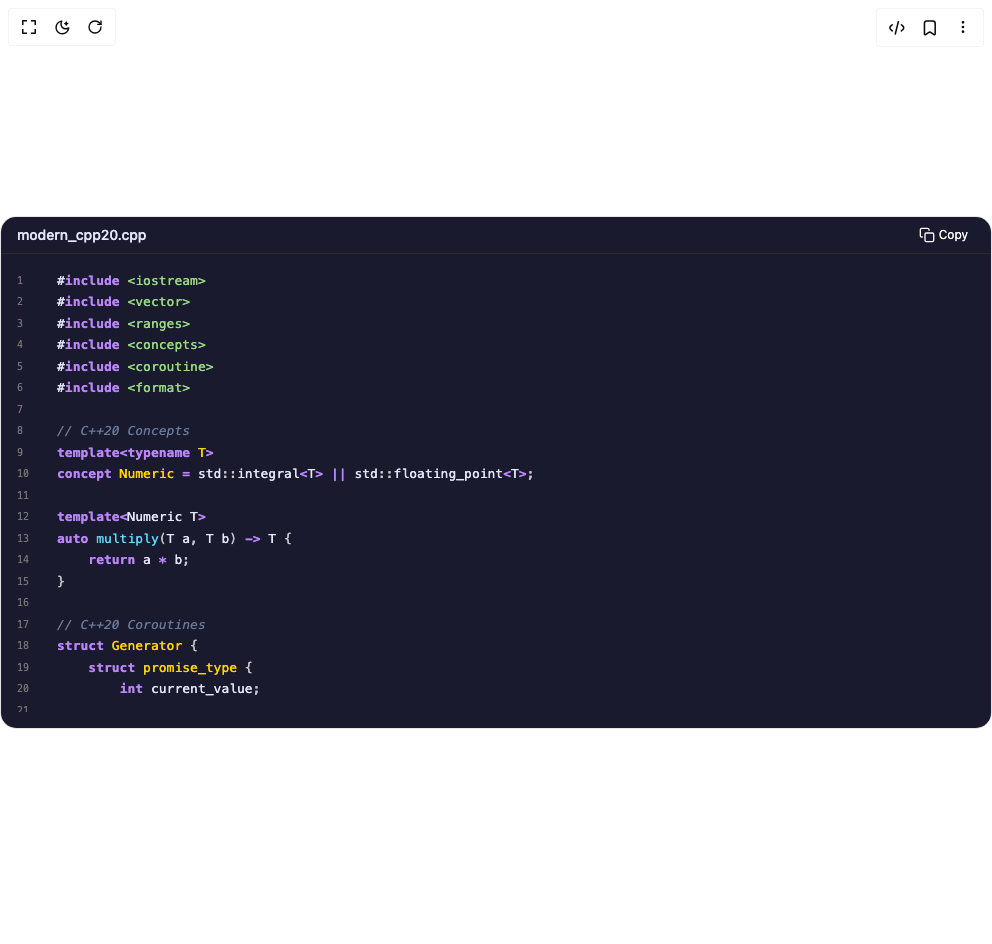

# Build Code Snippets 3 in BuilderStudio

> Build this component in our Agentic IDE: [BuilderStudio](https://builderstudio.dev).
>
> Join the BuilderStudio community on [Discord](https://discord.gg/QdWeSGCqfe) and [Reddit](https://reddit.com/r/builderstudio).



## Component

- Author group: `deltacomponents`
- Component: `code-snippets-3`
- Variant: `c-20-custom-theme`
- Rendered HTML snapshot: [`rendered.html`](rendered.html)

## BuilderStudio prompt

You are implementing a React component based on a component reference.

## Component identity

- Author: deltacomponents
- Component slug: code-snippets-3
- Demo slug: c-20-custom-theme
- Title: code-snippets-3
- Description: 

## Goal

Recreate this component in a React + TypeScript + Tailwind CSS project. Preserve the visual layout, spacing, colors, border radius, shadows, interaction behavior, animation behavior, responsive behavior, and dark mode behavior shown in the rendered demo.

## Implementation requirements

- Use React and TypeScript.
- Use Tailwind CSS classes whenever possible.
- Keep the component self-contained unless the source files require helper components.
- If the source uses CSS variables, custom CSS, animations, or keyframes, include them.
- If the source uses external packages, list and use the required packages.
- Preserve accessibility attributes, button semantics, links, keyboard behavior, and ARIA attributes when visible in the source.
- Do not replace the component with a simplified placeholder.
- Return complete production-ready code.

## Dependencies

No reference metadata available.

## Rendered DOM snapshot

This is the rendered demo HTML extracted from the live preview. Use it to verify structure, class names, visible content, and layout.

```html
<div id="root"><div class="w-screen min-h-screen flex justify-center items-center"><div class="w-screen min-h-screen flex justify-center items-center"><div class="w-full py-4"><div class="rounded-2xl overflow-hidden pointer-events-auto border border-border"><div class="flex items-center justify-between border-b" style="background-color: rgb(26, 26, 46); border-bottom-color: rgb(42, 42, 42);"><h3 class="text-sm font-medium pl-4 py-2" style="color: rgb(230, 230, 250);">modern_cpp20.cpp</h3><button type="button" aria-label="Copy to clipboard" title="Copy" class="inline-flex items-center gap-1 rounded-md border px-2.5 py-1.5 text-xs transition-colors focus:outline-none focus-visible:ring-2 focus-visible:ring-offset-2 border-transparent/0 hover:border-transparent/0 mr-3 text-zinc-50 hover:bg-zinc-700 hover:text-zinc-50"><span class="sr-only">Copy</span><svg viewBox="0 0 24 24" class="h-4 w-4" fill="none" stroke="currentColor" stroke-width="2" stroke-linecap="round" stroke-linejoin="round" aria-hidden="true"><rect x="9" y="9" width="13" height="13" rx="2" ry="2"></rect><path d="M5 15H4a2 2 0 0 1-2-2V4a2 2 0 0 1 2-2h9a2 2 0 0 1 2 2v1"></path></svg><span>Copy</span></button></div><div class="relative max-h-[calc(530px-44px)] py-4" style="background-color: rgb(26, 26, 46);"><pre class="prism-code language-cpp text-[13px] overflow-x-auto overflow-y-auto max-h-[calc(530px-88px)] font-mono font-medium" style="color: rgb(230, 230, 250); background-color: rgb(26, 26, 46);"><div class="flex items-center py-px px-4" style="color: rgb(230, 230, 250);"><span class="mr-4 select-none text-right text-[10px] items-center flex" style="color: rgb(117, 117, 117); min-width: 1.5rem;">1</span><span class=""><span class="token macro property directive-hash">#</span><span class="token macro property directive keyword" style="color: rgb(187, 134, 252); font-weight: bold;">include</span><span class="token macro property"> </span><span class="token macro property string" style="color: rgb(152, 217, 130);">&lt;iostream&gt;</span><span class="token plain"></span></span></div><div class="flex items-center py-px px-4" style="color: rgb(230, 230, 250);"><span class="mr-4 select-none text-right text-[10px] items-center flex" style="color: rgb(117, 117, 117); min-width: 1.5rem;">2</span><span class=""><span class="token plain"></span><span class="token macro property directive-hash">#</span><span class="token macro property directive keyword" style="color: rgb(187, 134, 252); font-weight: bold;">include</span><span class="token macro property"> </span><span class="token macro property string" style="color: rgb(152, 217, 130);">&lt;vector&gt;</span><span class="token plain"></span></span></div><div class="flex items-center py-px px-4" style="color: rgb(230, 230, 250);"><span class="mr-4 select-none text-right text-[10px] items-center flex" style="color: rgb(117, 117, 117); min-width: 1.5rem;">3</span><span class=""><span class="token plain"></span><span class="token macro property directive-hash">#</span><span class="token macro property directive keyword" style="color: rgb(187, 134, 252); font-weight: bold;">include</span><span class="token macro property"> </span><span class="token macro property string" style="color: rgb(152, 217, 130);">&lt;ranges&gt;</span><span class="token plain"></span></span></div><div class="flex items-center py-px px-4" style="color: rgb(230, 230, 250);"><span class="mr-4 select-none text-right text-[10px] items-center flex" style="color: rgb(117, 117, 117); min-width: 1.5rem;">4</span><span class=""><span class="token plain"></span><span class="token macro property directive-hash">#</span><span class="token macro property directive keyword" style="color: rgb(187, 134, 252); font-weight: bold;">include</span><span class="token macro property"> </span><span class="token macro property string" style="color: rgb(152, 217, 130);">&lt;concepts&gt;</span><span class="token plain"></span></span></div><div class="flex items-center py-px px-4" style="color: rgb(230, 230, 250);"><span class="mr-4 select-none text-right text-[10px] items-center flex" style="color: rgb(117, 117, 117); min-width: 1.5rem;">5</span><span class=""><span class="token plain"></span><span class="token macro property directive-hash">#</span><span class="token macro property directive keyword" style="color: rgb(187, 134, 252); font-weight: bold;">include</span><span class="token macro property"> </span><span class="token macro property string" style="color: rgb(152, 217, 130);">&lt;coroutine&gt;</span><span class="token plain"></span></span></div><div class="flex items-center py-px px-4" style="color: rgb(230, 230, 250);"><span class="mr-4 select-none text-right text-[10px] items-center flex" style="color: rgb(117, 117, 117); min-width: 1.5rem;">6</span><span class=""><span class="token plain"></span><span class="token macro property directive-hash">#</span><span class="token macro property directive keyword" style="color: rgb(187, 134, 252); font-weight: bold;">include</span><span class="token macro property"> </span><span class="token macro property string" style="color: rgb(152, 217, 130);">&lt;format&gt;</span><span class="token plain"></span></span></div><div class="flex items-center py-px px-4" style="color: rgb(230, 230, 250);"><span class="mr-4 select-none text-right text-[10px] items-center flex" style="color: rgb(117, 117, 117); min-width: 1.5rem;">7</span><span class=""><span class="token plain" style="display: inline-block;">
</span></span></div><div class="flex items-center py-px px-4" style="color: rgb(230, 230, 250);"><span class="mr-4 select-none text-right text-[10px] items-center flex" style="color: rgb(117, 117, 117); min-width: 1.5rem;">8</span><span class=""><span class="token plain"></span><span class="token comment" style="color: rgb(106, 123, 154); font-style: italic;">// C++20 Concepts</span><span class="token plain"></span></span></div><div class="flex items-center py-px px-4" style="color: rgb(230, 230, 250);"><span class="mr-4 select-none text-right text-[10px] items-center flex" style="color: rgb(117, 117, 117); min-width: 1.5rem;">9</span><span class=""><span class="token plain"></span><span class="token keyword" style="color: rgb(187, 134, 252); font-weight: bold;">template</span><span class="token operator" style="color: rgb(187, 134, 252); font-weight: bold;">&lt;</span><span class="token keyword" style="color: rgb(187, 134, 252); font-weight: bold;">typename</span><span class="token plain"> </span><span class="token class-name" style="color: rgb(255, 215, 0); font-weight: 500;">T</span><span class="token operator" style="color: rgb(187, 134, 252); font-weight: bold;">&gt;</span><span class="token plain"></span></span></div><div class="flex items-center py-px px-4" style="color: rgb(230, 230, 250);"><span class="mr-4 select-none text-right text-[10px] items-center flex" style="color: rgb(117, 117, 117); min-width: 1.5rem;">10</span><span class=""><span class="token plain"></span><span class="token keyword" style="color: rgb(187, 134, 252); font-weight: bold;">concept</span><span class="token plain"> </span><span class="token class-name" style="color: rgb(255, 215, 0); font-weight: 500;">Numeric</span><span class="token plain"> </span><span class="token operator" style="color: rgb(187, 134, 252); font-weight: bold;">=</span><span class="token plain"> std</span><span class="token double-colon punctuation" style="color: rgb(197, 200, 198);">::</span><span class="token plain">integral</span><span class="token operator" style="color: rgb(187, 134, 252); font-weight: bold;">&lt;</span><span class="token plain">T</span><span class="token operator" style="color: rgb(187, 134, 252); font-weight: bold;">&gt;</span><span class="token plain"> </span><span class="token operator" style="color: rgb(187, 134, 252); font-weight: bold;">||</span><span class="token plain"> std</span><span class="token double-colon punctuation" style="color: rgb(197, 200, 198);">::</span><span class="token plain">floating_point</span><span class="token operator" style="color: rgb(187, 134, 252); font-weight: bold;">&lt;</span><span class="token plain">T</span><span class="token operator" style="color: rgb(187, 134, 252); font-weight: bold;">&gt;</span><span class="token punctuation" style="color: rgb(197, 200, 198);">;</span><span class="token plain"></span></span></div><div class="flex items-center py-px px-4" style="color: rgb(230, 230, 250);"><span class="mr-4 select-none text-right text-[10px] items-center flex" style="color: rgb(117, 117, 117); min-width: 1.5rem;">11</span><span class=""><span class="token plain" style="display: inline-block;">
</span></span></div><div class="flex items-center py-px px-4" style="color: rgb(230, 230, 250);"><span class="mr-4 select-none text-right text-[10px] items-center flex" style="color: rgb(117, 117, 117); min-width: 1.5rem;">12</span><span class=""><span class="token plain"></span><span class="token keyword" style="color: rgb(187, 134, 252); font-weight: bold;">template</span><span class="token operator" style="color: rgb(187, 134, 252); font-weight: bold;">&lt;</span><span class="token plain">Numeric T</span><span class="token operator" style="color: rgb(187, 134, 252); font-weight: bold;">&gt;</span><span class="token plain"></span></span></div><div class="flex items-center py-px px-4" style="color: rgb(230, 230, 250);"><span class="mr-4 select-none text-right text-[10px] items-center flex" style="color: rgb(117, 117, 117); min-width: 1.5rem;">13</span><span class=""><span class="token plain"></span><span class="token keyword" style="color: rgb(187, 134, 252); font-weight: bold;">auto</span><span class="token plain"> </span><span class="token function" style="color: rgb(97, 218, 251);">multiply</span><span class="token punctuation" style="color: rgb(197, 200, 198);">(</span><span class="token plain">T a</span><span class="token punctuation" style="color: rgb(197, 200, 198);">,</span><span class="token plain"> T b</span><span class="token punctuation" style="color: rgb(197, 200, 198);">)</span><span class="token plain"> </span><span class="token operator" style="color: rgb(187, 134, 252); font-weight: bold;">-&gt;</span><span class="token plain"> T </span><span class="token punctuation" style="color: rgb(197, 200, 198);">{</span><span class="token plain"></span></span></div><div class="flex items-center py-px px-4" style="color: rgb(230, 230, 250);"><span class="mr-4 select-none text-right text-[10px] items-center flex" style="color: rgb(117, 117, 117); min-width: 1.5rem;">14</span><span class=""><span class="token plain">    </span><span class="token keyword" style="color: rgb(187, 134, 252); font-weight: bold;">return</span><span class="token plain"> a </span><span class="token operator" style="color: rgb(187, 134, 252); font-weight: bold;">*</span><span class="token plain"> b</span><span class="token punctuation" style="color: rgb(197, 200, 198);">;</span><span class="token plain"></span></span></div><div class="flex items-center py-px px-4" style="color: rgb(230, 230, 250);"><span class="mr-4 select-none text-right text-[10px] items-center flex" style="color: rgb(117, 117, 117); min-width: 1.5rem;">15</span><span class=""><span class="token plain"></span><span class="token punctuation" style="color: rgb(197, 200, 198);">}</span><span class="token plain"></span></span></div><div class="flex items-center py-px px-4" style="color: rgb(230, 230, 250);"><span class="mr-4 select-none text-right text-[10px] items-center flex" style="color: rgb(117, 117, 117); min-width: 1.5rem;">16</span><span class=""><span class="token plain" style="display: inline-block;">
</span></span></div><div class="flex items-center py-px px-4" style="color: rgb(230, 230, 250);"><span class="mr-4 select-none text-right text-[10px] items-center flex" style="color: rgb(117, 117, 117); min-width: 1.5rem;">17</span><span class=""><span class="token plain"></span><span class="token comment" style="color: rgb(106, 123, 154); font-style: italic;">// C++20 Coroutines</span><span class="token plain"></span></span></div><div class="flex items-center py-px px-4" style="color: rgb(230, 230, 250);"><span class="mr-4 select-none text-right text-[10px] items-center flex" style="color: rgb(117, 117, 117); min-width: 1.5rem;">18</span><span class=""><span class="token plain"></span><span class="token keyword" style="color: rgb(187, 134, 252); font-weight: bold;">struct</span><span class="token plain"> </span><span class="token class-name" style="color: rgb(255, 215, 0); font-weight: 500;">Generator</span><span class="token plain"> </span><span class="token punctuation" style="color: rgb(197, 200, 198);">{</span><span class="token plain"></span></span></div><div class="flex items-center py-px px-4" style="color: rgb(230, 230, 250);"><span class="mr-4 select-none text-right text-[10px] items-center flex" style="color: rgb(117, 117, 117); min-width: 1.5rem;">19</span><span class=""><span class="token plain">    </span><span class="token keyword" style="color: rgb(187, 134, 252); font-weight: bold;">struct</span><span class="token plain"> </span><span class="token class-name" style="color: rgb(255, 215, 0); font-weight: 500;">promise_type</span><span class="token plain"> </span><span class="token punctuation" style="color: rgb(197, 200, 198);">{</span><span class="token plain"></span></span></div><div class="flex items-center py-px px-4" style="color: rgb(230, 230, 250);"><span class="mr-4 select-none text-right text-[10px] items-center flex" style="color: rgb(117, 117, 117); min-width: 1.5rem;">20</span><span class=""><span class="token plain">        </span><span class="token keyword" style="color: rgb(187, 134, 252); font-weight: bold;">int</span><span class="token plain"> current_value</span><span class="token punctuation" style="color: rgb(197, 200, 198);">;</span><span class="token plain"></span></span></div><div class="flex items-center py-px px-4" style="color: rgb(230, 230, 250);"><span class="mr-4 select-none text-right text-[10px] items-center flex" style="color: rgb(117, 117, 117); min-width: 1.5rem;">21</span><span class=""><span class="token plain">        </span></span></div><div class="flex items-center py-px px-4" style="color: rgb(230, 230, 250);"><span class="mr-4 select-none text-right text-[10px] items-center flex" style="color: rgb(117, 117, 117); min-width: 1.5rem;">22</span><span class=""><span class="token plain">        Generator </span><span class="token function" style="color: rgb(97, 218, 251);">get_return_object</span><span class="token punctuation" style="color: rgb(197, 200, 198);">(</span><span class="token punctuation" style="color: rgb(197, 200, 198);">)</span><span class="token plain"> </span><span class="token punctuation" style="color: rgb(197, 200, 198);">{</span><span class="token plain"></span></span></div><div class="flex items-center py-px px-4" style="color: rgb(230, 230, 250);"><span class="mr-4 select-none text-right text-[10px] items-center flex" style="color: rgb(117, 117, 117); min-width: 1.5rem;">23</span><span class=""><span class="token plain">            </span><span class="token keyword" style="color: rgb(187, 134, 252); font-weight: bold;">return</span><span class="token plain"> Generator</span><span class="token punctuation" style="color: rgb(197, 200, 198);">{</span><span class="token plain">handle_type</span><span class="token double-colon punctuation" style="color: rgb(197, 200, 198);">::</span><span class="token function" style="color: rgb(97, 218, 251);">from_promise</span><span class="token punctuation" style="color: rgb(197, 200, 198);">(</span><span class="token operator" style="color: rgb(187, 134, 252); font-weight: bold;">*</span><span class="token keyword" style="color: rgb(187, 134, 252); font-weight: bold;">this</span><span class="token punctuation" style="color: rgb(197, 200, 198);">)</span><span class="token punctuation" style="color: rgb(197, 200, 198);">}</span><span class="token punctuation" style="color: rgb(197, 200, 198);">;</span><span class="token plain"></span></span></div><div class="flex items-center py-px px-4" style="color: rgb(230, 230, 250);"><span class="mr-4 select-none text-right text-[10px] items-center flex" style="color: rgb(117, 117, 117); min-width: 1.5rem;">24</span><span class=""><span class="token plain">        </span><span class="token punctuation" style="color: rgb(197, 200, 198);">}</span><span class="token plain"></span></span></div><div class="flex items-center py-px px-4" style="color: rgb(230, 230, 250);"><span class="mr-4 select-none text-right text-[10px] items-center flex" style="color: rgb(117, 117, 117); min-width: 1.5rem;">25</span><span class=""><span class="token plain">        </span></span></div><div class="flex items-center py-px px-4" style="color: rgb(230, 230, 250);"><span class="mr-4 select-none text-right text-[10px] items-center flex" style="color: rgb(117, 117, 117); min-width: 1.5rem;">26</span><span class=""><span class="token plain">        std</span><span class="token double-colon punctuation" style="color: rgb(197, 200, 198);">::</span><span class="token plain">suspend_always </span><span class="token function" style="color: rgb(97, 218, 251);">initial_suspend</span><span class="token punctuation" style="color: rgb(197, 200, 198);">(</span><span class="token punctuation" style="color: rgb(197, 200, 198);">)</span><span class="token plain"> </span><span class="token punctuation" style="color: rgb(197, 200, 198);">{</span><span class="token plain"> </span><span class="token keyword" style="color: rgb(187, 134, 252); font-weight: bold;">return</span><span class="token plain"> </span><span class="token punctuation" style="color: rgb(197, 200, 198);">{</span><span class="token punctuation" style="color: rgb(197, 200, 198);">}</span><span class="token punctuation" style="color: rgb(197, 200, 198);">;</span><span class="token plain"> </span><span class="token punctuation" style="color: rgb(197, 200, 198);">}</span><span class="token plain"></span></span></div><div class="flex items-center py-px px-4" style="color: rgb(230, 230, 250);"><span class="mr-4 select-none text-right text-[10px] items-center flex" style="color: rgb(117, 117, 117); min-width: 1.5rem;">27</span><span class=""><span class="token plain">        std</span><span class="token double-colon punctuation" style="color: rgb(197, 200, 198);">::</span><span class="token plain">suspend_always </span><span class="token function" style="color: rgb(97, 218, 251);">final_suspend</span><span class="token punctuation" style="color: rgb(197, 200, 198);">(</span><span class="token punctuation" style="color: rgb(197, 200, 198);">)</span><span class="token plain"> </span><span class="token keyword" style="color: rgb(187, 134, 252); font-weight: bold;">noexcept</span><span class="token plain"> </span><span class="token punctuation" style="color: rgb(197, 200, 198);">{</span><span class="token plain"> </span><span class="token keyword" style="color: rgb(187, 134, 252); font-weight: bold;">return</span><span class="token plain"> </span><span class="token punctuation" style="color: rgb(197, 200, 198);">{</span><span class="token punctuation" style="color: rgb(197, 200, 198);">}</span><span class="token punctuation" style="color: rgb(197, 200, 198);">;</span><span class="token plain"> </span><span class="token punctuation" style="color: rgb(197, 200, 198);">}</span><span class="token plain"></span></span></div><div class="flex items-center py-px px-4" style="color: rgb(230, 230, 250);"><span class="mr-4 select-none text-right text-[10px] items-center flex" style="color: rgb(117, 117, 117); min-width: 1.5rem;">28</span><span class=""><span class="token plain">        </span><span class="token keyword" style="color: rgb(187, 134, 252); font-weight: bold;">void</span><span class="token plain"> </span><span class="token function" style="color: rgb(97, 218, 251);">unhandled_exception</span><span class="token punctuation" style="color: rgb(197, 200, 198);">(</span><span class="token punctuation" style="color: rgb(197, 200, 198);">)</span><span class="token plain"> </span><span class="token punctuation" style="color: rgb(197, 200, 198);">{</span><span class="token punctuation" style="color: rgb(197, 200, 198);">}</span><span class="token plain"></span></span></div><div class="flex items-center py-px px-4" style="color: rgb(230, 230, 250);"><span class="mr-4 select-none text-right text-[10px] items-center flex" style="color: rgb(117, 117, 117); min-width: 1.5rem;">29</span><span class=""><span class="token plain">        </span></span></div><div class="flex items-center py-px px-4" style="color: rgb(230, 230, 250);"><span class="mr-4 select-none text-right text-[10px] items-center flex" style="color: rgb(117, 117, 117); min-width: 1.5rem;">30</span><span class=""><span class="token plain">        std</span><span class="token double-colon punctuation" style="color: rgb(197, 200, 198);">::</span><span class="token plain">suspend_always </span><span class="token function" style="color: rgb(97, 218, 251);">yield_value</span><span class="token punctuation" style="color: rgb(197, 200, 198);">(</span><span class="token keyword" style="color: rgb(187, 134, 252); font-weight: bold;">int</span><span class="token plain"> value</span><span class="token punctuation" style="color: rgb(197, 200, 198);">)</span><span class="token plain"> </span><span class="token punctuation" style="color: rgb(197, 200, 198);">{</span><span class="token plain"></span></span></div><div class="flex items-center py-px px-4" style="color: rgb(230, 230, 250);"><span class="mr-4 select-none text-right text-[10px] items-center flex" style="color: rgb(117, 117, 117); min-width: 1.5rem;">31</span><span class=""><span class="token plain">            current_value </span><span class="token operator" style="color: rgb(187, 134, 252); font-weight: bold;">=</span><span class="token plain"> value</span><span class="token punctuation" style="color: rgb(197, 200, 198);">;</span><span class="token plain"></span></span></div><div class="flex items-center py-px px-4" style="color: rgb(230, 230, 250);"><span class="mr-4 select-none text-right text-[10px] items-center flex" style="color: rgb(117, 117, 117); min-width: 1.5rem;">32</span><span class=""><span class="token plain">            </span><span class="token keyword" style="color: rgb(187, 134, 252); font-weight: bold;">return</span><span class="token plain"> </span><span class="token punctuation" style="color: rgb(197, 200, 198);">{</span><span class="token punctuation" style="color: rgb(197, 200, 198);">}</span><span class="token punctuation" style="color: rgb(197, 200, 198);">;</span><span class="token plain"></span></span></div><div class="flex items-center py-px px-4" style="color: rgb(230, 230, 250);"><span class="mr-4 select-none text-right text-[10px] items-center flex" style="color: rgb(117, 117, 117); min-width: 1.5rem;">33</span><span class=""><span class="token plain">        </span><span class="token punctuation" style="color: rgb(197, 200, 198);">}</span><span class="token plain"></span></span></div><div class="flex items-center py-px px-4" style="color: rgb(230, 230, 250);"><span class="mr-4 select-none text-right text-[10px] items-center flex" style="color: rgb(117, 117, 117); min-width: 1.5rem;">34</span><span class=""><span class="token plain">    </span><span class="token punctuation" style="color: rgb(197, 200, 198);">}</span><span class="token punctuation" style="color: rgb(197, 200, 198);">;</span><span class="token plain"></span></span></div><div class="flex items-center py-px px-4" style="color: rgb(230, 230, 250);"><span class="mr-4 select-none text-right text-[10px] items-center flex" style="color: rgb(117, 117, 117); min-width: 1.5rem;">35</span><span class=""><span class="token plain">    </span></span></div><div class="flex items-center py-px px-4" style="color: rgb(230, 230, 250);"><span class="mr-4 select-none text-right text-[10px] items-center flex" style="color: rgb(117, 117, 117); min-width: 1.5rem;">36</span><span class=""><span class="token plain">    </span><span class="token keyword" style="color: rgb(187, 134, 252); font-weight: bold;">using</span><span class="token plain"> handle_type </span><span class="token operator" style="color: rgb(187, 134, 252); font-weight: bold;">=</span><span class="token plain"> std</span><span class="token double-colon punctuation" style="color: rgb(197, 200, 198);">::</span><span class="token plain">coroutine_handle</span><span class="token operator" style="color: rgb(187, 134, 252); font-weight: bold;">&lt;</span><span class="token plain">promise_type</span><span class="token operator" style="color: rgb(187, 134, 252); font-weight: bold;">&gt;</span><span class="token punctuation" style="color: rgb(197, 200, 198);">;</span><span class="token plain"></span></span></div><div class="flex items-center py-px px-4" style="color: rgb(230, 230, 250);"><span class="mr-4 select-none text-right text-[10px] items-center flex" style="color: rgb(117, 117, 117); min-width: 1.5rem;">37</span><span class=""><span class="token plain">    handle_type coro</span><span class="token punctuation" style="color: rgb(197, 200, 198);">;</span><span class="token plain"></span></span></div><div class="flex items-center py-px px-4" style="color: rgb(230, 230, 250);"><span class="mr-4 select-none text-right text-[10px] items-center flex" style="color: rgb(117, 117, 117); min-width: 1.5rem;">38</span><span class=""><span class="token plain">    </span></span></div><div class="flex items-center py-px px-4" style="color: rgb(230, 230, 250);"><span class="mr-4 select-none text-right text-[10px] items-center flex" style="color: rgb(117, 117, 117); min-width: 1.5rem;">39</span><span class=""><span class="token plain">    </span><span class="token function" style="color: rgb(97, 218, 251);">Generator</span><span class="token punctuation" style="color: rgb(197, 200, 198);">(</span><span class="token plain">handle_type h</span><span class="token punctuation" style="color: rgb(197, 200, 198);">)</span><span class="token plain"> </span><span class="token operator" style="color: rgb(187, 134, 252); font-weight: bold;">:</span><span class="token plain"> </span><span class="token function" style="color: rgb(97, 218, 251);">coro</span><span class="token punctuation" style="color: rgb(197, 200, 198);">(</span><span class="token plain">h</span><span class="token punctuation" style="color: rgb(197, 200, 198);">)</span><span class="token plain"> </span><span class="token punctuation" style="color: rgb(197, 200, 198);">{</span><span class="token punctuation" style="color: rgb(197, 200, 198);">}</span><span class="token plain"></span></span></div><div class="flex items-center py-px px-4" style="color: rgb(230, 230, 250);"><span class="mr-4 select-none text-right text-[10px] items-center flex" style="color: rgb(117, 117, 117); min-width: 1.5rem;">40</span><span class=""><span class="token plain">    </span><span class="token operator" style="color: rgb(187, 134, 252); font-weight: bold;">~</span><span class="token function" style="color: rgb(97, 218, 251);">Generator</span><span class="token punctuation" style="color: rgb(197, 200, 198);">(</span><span class="token punctuation" style="color: rgb(197, 200, 198);">)</span><span class="token plain"> </span><span class="token punctuation" style="color: rgb(197, 200, 198);">{</span><span class="token plain"> </span><span class="token keyword" style="color: rgb(187, 134, 252); font-weight: bold;">if</span><span class="token plain"> </span><span class="token punctuation" style="color: rgb(197, 200, 198);">(</span><span class="token plain">coro</span><span class="token punctuation" style="color: rgb(197, 200, 198);">)</span><span class="token plain"> coro</span><span class="token punctuation" style="color: rgb(197, 200, 198);">.</span><span class="token function" style="color: rgb(97, 218, 251);">destroy</span><span class="token punctuation" style="color: rgb(197, 200, 198);">(</span><span class="token punctuation" style="color: rgb(197, 200, 198);">)</span><span class="token punctuation" style="color: rgb(197, 200, 198);">;</span><span class="token plain"> </span><span class="token punctuation" style="color: rgb(197, 200, 198);">}</span><span class="token plain"></span></span></div><div class="flex items-center py-px px-4" style="color: rgb(230, 230, 250);"><span class="mr-4 select-none text-right text-[10px] items-center flex" style="color: rgb(117, 117, 117); min-width: 1.5rem;">41</span><span class=""><span class="token plain"></span><span class="token punctuation" style="color: rgb(197, 200, 198);">}</span><span class="token punctuation" style="color: rgb(197, 200, 198);">;</span><span class="token plain"></span></span></div><div class="flex items-center py-px px-4" style="color: rgb(230, 230, 250);"><span class="mr-4 select-none text-right text-[10px] items-center flex" style="color: rgb(117, 117, 117); min-width: 1.5rem;">42</span><span class=""><span class="token plain" style="display: inline-block;">
</span></span></div><div class="flex items-center py-px px-4" style="color: rgb(230, 230, 250);"><span class="mr-4 select-none text-right text-[10px] items-center flex" style="color: rgb(117, 117, 117); min-width: 1.5rem;">43</span><span class=""><span class="token plain">Generator </span><span class="token function" style="color: rgb(97, 218, 251);">fibonacci</span><span class="token punctuation" style="color: rgb(197, 200, 198);">(</span><span class="token punctuation" style="color: rgb(197, 200, 198);">)</span><span class="token plain"> </span><span class="token punctuation" style="color: rgb(197, 200, 198);">{</span><span class="token plain"></span></span></div><div class="flex items-center py-px px-4" style="color: rgb(230, 230, 250);"><span class="mr-4 select-none text-right text-[10px] items-center flex" style="color: rgb(117, 117, 117); min-width: 1.5rem;">44</span><span class=""><span class="token plain">    </span><span class="token keyword" style="color: rgb(187, 134, 252); font-weight: bold;">int</span><span class="token plain"> a </span><span class="token operator" style="color: rgb(187, 134, 252); font-weight: bold;">=</span><span class="token plain"> </span><span class="token number" style="color: rgb(243, 156, 18);">0</span><span class="token punctuation" style="color: rgb(197, 200, 198);">,</span><span class="token plain"> b </span><span class="token operator" style="color: rgb(187, 134, 252); font-weight: bold;">=</span><span class="token plain"> </span><span class="token number" style="color: rgb(243, 156, 18);">1</span><span class="token punctuation" style="color: rgb(197, 200, 198);">;</span><span class="token plain"></span></span></div><div class="flex items-center py-px px-4" style="color: rgb(230, 230, 250);"><span class="mr-4 select-none text-right text-[10px] items-center flex" style="color: rgb(117, 117, 117); min-width: 1.5rem;">45</span><span class=""><span class="token plain">    </span><span class="token keyword" style="color: rgb(187, 134, 252); font-weight: bold;">while</span><span class="token plain"> </span><span class="token punctuation" style="color: rgb(197, 200, 198);">(</span><span class="token boolean">true</span><span class="token punctuation" style="color: rgb(197, 200, 198);">)</span><span class="token plain"> </span><span class="token punctuation" style="color: rgb(197, 200, 198);">{</span><span class="token plain"></span></span></div><div class="flex items-center py-px px-4" style="color: rgb(230, 230, 250);"><span class="mr-4 select-none text-right text-[10px] items-center flex" style="color: rgb(117, 117, 117); min-width: 1.5rem;">46</span><span class=""><span class="token plain">        </span><span class="token keyword" style="color: rgb(187, 134, 252); font-weight: bold;">co_yield</span><span class="token plain"> a</span><span class="token punctuation" style="color: rgb(197, 200, 198);">;</span><span class="token plain"></span></span></div><div class="flex items-center py-px px-4" style="color: rgb(230, 230, 250);"><span class="mr-4 select-none text-right text-[10px] items-center flex" style="color: rgb(117, 117, 117); min-width: 1.5rem;">47</span><span class=""><span class="token plain">        </span><span class="token keyword" style="color: rgb(187, 134, 252); font-weight: bold;">auto</span><span class="token plain"> next </span><span class="token operator" style="color: rgb(187, 134, 252); font-weight: bold;">=</span><span class="token plain"> a </span><span class="token operator" style="color: rgb(187, 134, 252); font-weight: bold;">+</span><span class="token plain"> b</span><span class="token punctuation" style="color: rgb(197, 200, 198);">;</span><span class="token plain"></span></span></div><div class="flex items-center py-px px-4" style="color: rgb(230, 230, 250);"><span class="mr-4 select-none text-right text-[10px] items-center flex" style="color: rgb(117, 117, 117); min-width: 1.5rem;">48</span><span class=""><span class="token plain">        a </span><span class="token operator" style="color: rgb(187, 134, 252); font-weight: bold;">=</span><span class="token plain"> b</span><span class="token punctuation" style="color: rgb(197, 200, 198);">;</span><span class="token plain"></span></span></div><div class="flex items-center py-px px-4" style="color: rgb(230, 230, 250);"><span class="mr-4 select-none text-right text-[10px] items-center flex" style="color: rgb(117, 117, 117); min-width: 1.5rem;">49</span><span class=""><span class="token plain">        b </span><span class="token operator" style="color: rgb(187, 134, 252); font-weight: bold;">=</span><span class="token plain"> next</span><span class="token punctuation" style="color: rgb(197, 200, 198);">;</span><span class="token plain"></span></span></div><div class="flex items-center py-px px-4" style="color: rgb(230, 230, 250);"><span class="mr-4 select-none text-right text-[10px] items-center flex" style="color: rgb(117, 117, 117); min-width: 1.5rem;">50</span><span class=""><span class="token plain">    </span><span class="token punctuation" style="color: rgb(197, 200, 198);">}</span><span class="token plain"></span></span></div><div class="flex items-center py-px px-4" style="color: rgb(230, 230, 250);"><span class="mr-4 select-none text-right text-[10px] items-center flex" style="color: rgb(117, 117, 117); min-width: 1.5rem;">51</span><span class=""><span class="token plain"></span><span class="token punctuation" style="color: rgb(197, 200, 198);">}</span><span class="token plain"></span></span></div><div class="flex items-center py-px px-4" style="color: rgb(230, 230, 250);"><span class="mr-4 select-none text-right text-[10px] items-center flex" style="color: rgb(117, 117, 117); min-width: 1.5rem;">52</span><span class=""><span class="token plain" style="display: inline-block;">
</span></span></div><div class="flex items-center py-px px-4" style="color: rgb(230, 230, 250);"><span class="mr-4 select-none text-right text-[10px] items-center flex" style="color: rgb(117, 117, 117); min-width: 1.5rem;">53</span><span class=""><span class="token plain"></span><span class="token keyword" style="color: rgb(187, 134, 252); font-weight: bold;">int</span><span class="token plain"> </span><span class="token function" style="color: rgb(97, 218, 251);">main</span><span class="token punctuation" style="color: rgb(197, 200, 198);">(</span><span class="token punctuation" style="color: rgb(197, 200, 198);">)</span><span class="token plain"> </span><span class="token punctuation" style="color: rgb(197, 200, 198);">{</span><span class="token plain"></span></span></div><div class="flex items-center py-px px-4" style="color: rgb(230, 230, 250);"><span class="mr-4 select-none text-right text-[10px] items-center flex" style="color: rgb(117, 117, 117); min-width: 1.5rem;">54</span><span class=""><span class="token plain">    </span><span class="token comment" style="color: rgb(106, 123, 154); font-style: italic;">// C++20 Ranges and Views</span><span class="token plain"></span></span></div><div class="flex items-center py-px px-4" style="color: rgb(230, 230, 250);"><span class="mr-4 select-none text-right text-[10px] items-center flex" style="color: rgb(117, 117, 117); min-width: 1.5rem;">55</span><span class=""><span class="token plain">    std</span><span class="token double-colon punctuation" style="color: rgb(197, 200, 198);">::</span><span class="token plain">vector</span><span class="token operator" style="color: rgb(187, 134, 252); font-weight: bold;">&lt;</span><span class="token keyword" style="color: rgb(187, 134, 252); font-weight: bold;">int</span><span class="token operator" style="color: rgb(187, 134, 252); font-weight: bold;">&gt;</span><span class="token plain"> numbers</span><span class="token punctuation" style="color: rgb(197, 200, 198);">{</span><span class="token number" style="color: rgb(243, 156, 18);">1</span><span class="token punctuation" style="color: rgb(197, 200, 198);">,</span><span class="token plain"> </span><span class="token number" style="color: rgb(243, 156, 18);">2</span><span class="token punctuation" style="color: rgb(197, 200, 198);">,</span><span class="token plain"> </span><span class="token number" style="color: rgb(243, 156, 18);">3</span><span class="token punctuation" style="color: rgb(197, 200, 198);">,</span><span class="token plain"> </span><span class="token number" style="color: rgb(243, 156, 18);">4</span><span class="token punctuation" style="color: rgb(197, 200, 198);">,</span><span class="token plain"> </span><span class="token number" style="color: rgb(243, 156, 18);">5</span><span class="token punctuation" style="color: rgb(197, 200, 198);">,</span><span class="token plain"> </span><span class="token number" style="color: rgb(243, 156, 18);">6</span><span class="token punctuation" style="color: rgb(197, 200, 198);">,</span><span class="token plain"> </span><span class="token number" style="color: rgb(243, 156, 18);">7</span><span class="token punctuation" style="color: rgb(197, 200, 198);">,</span><span class="token plain"> </span><span class="token number" style="color: rgb(243, 156, 18);">8</span><span class="token punctuation" style="color: rgb(197, 200, 198);">,</span><span class="token plain"> </span><span class="token number" style="color: rgb(243, 156, 18);">9</span><span class="token punctuation" style="color: rgb(197, 200, 198);">,</span><span class="token plain"> </span><span class="token number" style="color: rgb(243, 156, 18);">10</span><span class="token punctuation" style="color: rgb(197, 200, 198);">}</span><span class="token punctuation" style="color: rgb(197, 200, 198);">;</span><span class="token plain"></span></span></div><div class="flex items-center py-px px-4" style="color: rgb(230, 230, 250);"><span class="mr-4 select-none text-right text-[10px] items-center flex" style="color: rgb(117, 117, 117); min-width: 1.5rem;">56</span><span class=""><span class="token plain">    </span></span></div><div class="flex items-center py-px px-4" style="color: rgb(230, 230, 250);"><span class="mr-4 select-none text-right text-[10px] items-center flex" style="color: rgb(117, 117, 117); min-width: 1.5rem;">57</span><span class=""><span class="token plain">    </span><span class="token keyword" style="color: rgb(187, 134, 252); font-weight: bold;">auto</span><span class="token plain"> even_squares </span><span class="token operator" style="color: rgb(187, 134, 252); font-weight: bold;">=</span><span class="token plain"> numbers </span></span></div><div class="flex items-center py-px px-4" style="color: rgb(230, 230, 250);"><span class="mr-4 select-none text-right text-[10px] items-center flex" style="color: rgb(117, 117, 117); min-width: 1.5rem;">58</span><span class=""><span class="token plain">        </span><span class="token operator" style="color: rgb(187, 134, 252); font-weight: bold;">|</span><span class="token plain"> std</span><span class="token double-colon punctuation" style="color: rgb(197, 200, 198);">::</span><span class="token plain">views</span><span class="token double-colon punctuation" style="color: rgb(197, 200, 198);">::</span><span class="token function" style="color: rgb(97, 218, 251);">filter</span><span class="token punctuation" style="color: rgb(197, 200, 198);">(</span><span class="token punctuation" style="color: rgb(197, 200, 198);">[</span><span class="token punctuation" style="color: rgb(197, 200, 198);">]</span><span class="token punctuation" style="color: rgb(197, 200, 198);">(</span><span class="token keyword" style="color: rgb(187, 134, 252); font-weight: bold;">int</span><span class="token plain"> n</span><span class="token punctuation" style="color: rgb(197, 200, 198);">)</span><span class="token plain"> </span><span class="token punctuation" style="color: rgb(197, 200, 198);">{</span><span class="token plain"> </span><span class="token keyword" style="color: rgb(187, 134, 252); font-weight: bold;">return</span><span class="token plain"> n </span><span class="token operator" style="color: rgb(187, 134, 252); font-weight: bold;">%</span><span class="token plain"> </span><span class="token number" style="color: rgb(243, 156, 18);">2</span><span class="token plain"> </span><span class="token operator" style="color: rgb(187, 134, 252); font-weight: bold;">==</span><span class="token plain"> </span><span class="token number" style="color: rgb(243, 156, 18);">0</span><span class="token punctuation" style="color: rgb(197, 200, 198);">;</span><span class="token plain"> </span><span class="token punctuation" style="color: rgb(197, 200, 198);">}</span><span class="token punctuation" style="color: rgb(197, 200, 198);">)</span><span class="token plain"></span></span></div><div class="flex items-center py-px px-4" style="color: rgb(230, 230, 250);"><span class="mr-4 select-none text-right text-[10px] items-center flex" style="color: rgb(117, 117, 117); min-width: 1.5rem;">59</span><span class=""><span class="token plain">        </span><span class="token operator" style="color: rgb(187, 134, 252); font-weight: bold;">|</span><span class="token plain"> std</span><span class="token double-colon punctuation" style="color: rgb(197, 200, 198);">::</span><span class="token plain">views</span><span class="token double-colon punctuation" style="color: rgb(197, 200, 198);">::</span><span class="token function" style="color: rgb(97, 218, 251);">transform</span><span class="token punctuation" style="color: rgb(197, 200, 198);">(</span><span class="token punctuation" style="color: rgb(197, 200, 198);">[</span><span class="token punctuation" style="color: rgb(197, 200, 198);">]</span><span class="token punctuation" style="color: rgb(197, 200, 198);">(</span><span class="token keyword" style="color: rgb(187, 134, 252); font-weight: bold;">int</span><span class="token plain"> n</span><span class="token punctuation" style="color: rgb(197, 200, 198);">)</span><span class="token plain"> </span><span class="token punctuation" style="color: rgb(197, 200, 198);">{</span><span class="token plain"> </span><span class="token keyword" style="color: rgb(187, 134, 252); font-weight: bold;">return</span><span class="token plain"> n </span><span class="token operator" style="color: rgb(187, 134, 252); font-weight: bold;">*</span><span class="token plain"> n</span><span class="token punctuation" style="color: rgb(197, 200, 198);">;</span><span class="token plain"> </span><span class="token punctuation" style="color: rgb(197, 200, 198);">}</span><span class="token punctuation" style="color: rgb(197, 200, 198);">)</span><span class="token punctuation" style="color: rgb(197, 200, 198);">;</span><span class="token plain"></span></span></div><div class="flex items-center py-px px-4" style="color: rgb(230, 230, 250);"><span class="mr-4 select-none text-right text-[10px] items-center flex" style="color: rgb(117, 117, 117); min-width: 1.5rem;">60</span><span class=""><span class="token plain">    </span></span></div><div class="flex items-center py-px px-4" style="color: rgb(230, 230, 250);"><span class="mr-4 select-none text-right text-[10px] items-center flex" style="color: rgb(117, 117, 117); min-width: 1.5rem;">61</span><span class=""><span class="token plain">    </span><span class="token comment" style="color: rgb(106, 123, 154); font-style: italic;">// C++20 Format library</span><span class="token plain"></span></span></div><div class="flex items-center py-px px-4" style="color: rgb(230, 230, 250);"><span class="mr-4 select-none text-right text-[10px] items-center flex" style="color: rgb(117, 117, 117); min-width: 1.5rem;">62</span><span class=""><span class="token plain">    std</span><span class="token double-colon punctuation" style="color: rgb(197, 200, 198);">::</span><span class="token plain">cout </span><span class="token operator" style="color: rgb(187, 134, 252); font-weight: bold;">&lt;&lt;</span><span class="token plain"> std</span><span class="token double-colon punctuation" style="color: rgb(197, 200, 198);">::</span><span class="token function" style="color: rgb(97, 218, 251);">format</span><span class="token punctuation" style="color: rgb(197, 200, 198);">(</span><span class="token string" style="color: rgb(152, 217, 130);">"Even squares: "</span><span class="token punctuation" style="color: rgb(197, 200, 198);">)</span><span class="token punctuation" style="color: rgb(197, 200, 198);">;</span><span class="token plain"></span></span></div><div class="flex items-center py-px px-4" style="color: rgb(230, 230, 250);"><span class="mr-4 select-none text-right text-[10px] items-center flex" style="color: rgb(117, 117, 117); min-width: 1.5rem;">63</span><span class=""><span class="token plain">    </span><span class="token keyword" style="color: rgb(187, 134, 252); font-weight: bold;">for</span><span class="token plain"> </span><span class="token punctuation" style="color: rgb(197, 200, 198);">(</span><span class="token keyword" style="color: rgb(187, 134, 252); font-weight: bold;">auto</span><span class="token plain"> value </span><span class="token operator" style="color: rgb(187, 134, 252); font-weight: bold;">:</span><span class="token plain"> even_squares</span><span class="token punctuation" style="color: rgb(197, 200, 198);">)</span><span class="token plain"> </span><span class="token punctuation" style="color: rgb(197, 200, 198);">{</span><span class="token plain"></span></span></div><div class="flex items-center py-px px-4" style="color: rgb(230, 230, 250);"><span class="mr-4 select-none text-right text-[10px] items-center flex" style="color: rgb(117, 117, 117); min-width: 1.5rem;">64</span><span class=""><span class="token plain">        std</span><span class="token double-colon punctuation" style="color: rgb(197, 200, 198);">::</span><span class="token plain">cout </span><span class="token operator" style="color: rgb(187, 134, 252); font-weight: bold;">&lt;&lt;</span><span class="token plain"> std</span><span class="token double-colon punctuation" style="color: rgb(197, 200, 198);">::</span><span class="token function" style="color: rgb(97, 218, 251);">format</span><span class="token punctuation" style="color: rgb(197, 200, 198);">(</span><span class="token string" style="color: rgb(152, 217, 130);">"{} "</span><span class="token punctuation" style="color: rgb(197, 200, 198);">,</span><span class="token plain"> value</span><span class="token punctuation" style="color: rgb(197, 200, 198);">)</span><span class="token punctuation" style="color: rgb(197, 200, 198);">;</span><span class="token plain"></span></span></div><div class="flex items-center py-px px-4" style="color: rgb(230, 230, 250);"><span class="mr-4 select-none text-right text-[10px] items-center flex" style="color: rgb(117, 117, 117); min-width: 1.5rem;">65</span><span class=""><span class="token plain">    </span><span class="token punctuation" style="color: rgb(197, 200, 198);">}</span><span class="token plain"></span></span></div><div class="flex items-center py-px px-4" style="color: rgb(230, 230, 250);"><span class="mr-4 select-none text-right text-[10px] items-center flex" style="color: rgb(117, 117, 117); min-width: 1.5rem;">66</span><span class=""><span class="token plain">    std</span><span class="token double-colon punctuation" style="color: rgb(197, 200, 198);">::</span><span class="token plain">cout </span><span class="token operator" style="color: rgb(187, 134, 252); font-weight: bold;">&lt;&lt;</span><span class="token plain"> std</span><span class="token double-colon punctuation" style="color: rgb(197, 200, 198);">::</span><span class="token plain">endl</span><span class="token punctuation" style="color: rgb(197, 200, 198);">;</span><span class="token plain"></span></span></div><div class="flex items-center py-px px-4" style="color: rgb(230, 230, 250);"><span class="mr-4 select-none text-right text-[10px] items-center flex" style="color: rgb(117, 117, 117); min-width: 1.5rem;">67</span><span class=""><span class="token plain">    </span></span></div><div class="flex items-center py-px px-4" style="color: rgb(230, 230, 250);"><span class="mr-4 select-none text-right text-[10px] items-center flex" style="color: rgb(117, 117, 117); min-width: 1.5rem;">68</span><span class=""><span class="token plain">    </span><span class="token comment" style="color: rgb(106, 123, 154); font-style: italic;">// Using concepts</span><span class="token plain"></span></span></div><div class="flex items-center py-px px-4" style="color: rgb(230, 230, 250);"><span class="mr-4 select-none text-right text-[10px] items-center flex" style="color: rgb(117, 117, 117); min-width: 1.5rem;">69</span><span class=""><span class="token plain">    </span><span class="token keyword" style="color: rgb(187, 134, 252); font-weight: bold;">auto</span><span class="token plain"> result </span><span class="token operator" style="color: rgb(187, 134, 252); font-weight: bold;">=</span><span class="token plain"> </span><span class="token function" style="color: rgb(97, 218, 251);">multiply</span><span class="token punctuation" style="color: rgb(197, 200, 198);">(</span><span class="token number" style="color: rgb(243, 156, 18);">3.14</span><span class="token punctuation" style="color: rgb(197, 200, 198);">,</span><span class="token plain"> </span><span class="token number" style="color: rgb(243, 156, 18);">2.71</span><span class="token punctuation" style="color: rgb(197, 200, 198);">)</span><span class="token punctuation" style="color: rgb(197, 200, 198);">;</span><span class="token plain"></span></span></div><div class="flex items-center py-px px-4" style="color: rgb(230, 230, 250);"><span class="mr-4 select-none text-right text-[10px] items-center flex" style="color: rgb(117, 117, 117); min-width: 1.5rem;">70</span><span class=""><span class="token plain">    std</span><span class="token double-colon punctuation" style="color: rgb(197, 200, 198);">::</span><span class="token plain">cout </span><span class="token operator" style="color: rgb(187, 134, 252); font-weight: bold;">&lt;&lt;</span><span class="token plain"> std</span><span class="token double-colon punctuation" style="color: rgb(197, 200, 198);">::</span><span class="token function" style="color: rgb(97, 218, 251);">format</span><span class="token punctuation" style="color: rgb(197, 200, 198);">(</span><span class="token string" style="color: rgb(152, 217, 130);">"Result: {:.2f}\n"</span><span class="token punctuation" style="color: rgb(197, 200, 198);">,</span><span class="token plain"> result</span><span class="token punctuation" style="color: rgb(197, 200, 198);">)</span><span class="token punctuation" style="color: rgb(197, 200, 198);">;</span><span class="token plain"></span></span></div><div class="flex items-center py-px px-4" style="color: rgb(230, 230, 250);"><span class="mr-4 select-none text-right text-[10px] items-center flex" style="color: rgb(117, 117, 117); min-width: 1.5rem;">71</span><span class=""><span class="token plain">    </span></span></div><div class="flex items-center py-px px-4" style="color: rgb(230, 230, 250);"><span class="mr-4 select-none text-right text-[10px] items-center flex" style="color: rgb(117, 117, 117); min-width: 1.5rem;">72</span><span class=""><span class="token plain">    </span><span class="token keyword" style="color: rgb(187, 134, 252); font-weight: bold;">return</span><span class="token plain"> </span><span class="token number" style="color: rgb(243, 156, 18);">0</span><span class="token punctuation" style="color: rgb(197, 200, 198);">;</span><span class="token plain"></span></span></div><div class="flex items-center py-px px-4" style="color: rgb(230, 230, 250);"><span class="mr-4 select-none text-right text-[10px] items-center flex" style="color: rgb(117, 117, 117); min-width: 1.5rem;">73</span><span class=""><span class="token plain"></span><span class="token punctuation" style="color: rgb(197, 200, 198);">}</span></span></div></pre></div></div></div></div></div></div>
```

## Reference source files

No reference source files were available.
