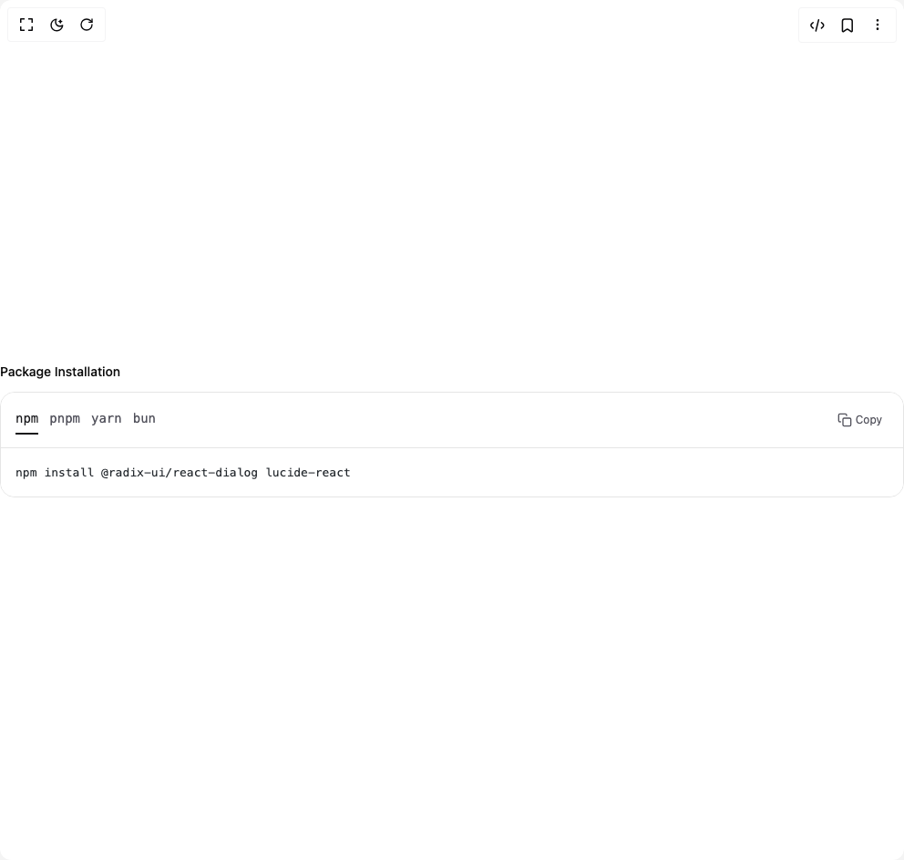

# Build Code Snippets 3 in BuilderStudio

> Build this component in our Agentic IDE: [BuilderStudio](https://builderstudio.dev).
>
> Join the BuilderStudio community on [Discord](https://discord.gg/QdWeSGCqfe) and [Reddit](https://reddit.com/r/builderstudio).



## Component

- Author group: `deltacomponents`
- Component: `code-snippets-3`
- Variant: `tabbed-code-snippets`
- Rendered HTML snapshot: [`rendered.html`](rendered.html)

## BuilderStudio prompt

You are implementing a React component based on a component reference.

## Component identity

- Author: deltacomponents
- Component slug: code-snippets-3
- Demo slug: tabbed-code-snippets
- Title: code-snippets-3
- Description: 

## Goal

Recreate this component in a React + TypeScript + Tailwind CSS project. Preserve the visual layout, spacing, colors, border radius, shadows, interaction behavior, animation behavior, responsive behavior, and dark mode behavior shown in the rendered demo.

## Implementation requirements

- Use React and TypeScript.
- Use Tailwind CSS classes whenever possible.
- Keep the component self-contained unless the source files require helper components.
- If the source uses CSS variables, custom CSS, animations, or keyframes, include them.
- If the source uses external packages, list and use the required packages.
- Preserve accessibility attributes, button semantics, links, keyboard behavior, and ARIA attributes when visible in the source.
- Do not replace the component with a simplified placeholder.
- Return complete production-ready code.

## Dependencies

No reference metadata available.

## Rendered DOM snapshot

This is the rendered demo HTML extracted from the live preview. Use it to verify structure, class names, visible content, and layout.

```html
<div id="root"><div class="w-screen min-h-screen flex justify-center items-center"><div class="w-screen min-h-screen flex justify-center items-center"><div class="w-full py-4"><div class="space-y-6"><div><h3 class="text-sm font-medium mb-3">Package Installation</h3><div class="rounded-2xl overflow-hidden pointer-events-auto border border-border"><div class="flex items-center justify-between border-b" style="background-color: rgb(255, 255, 255); border-bottom-color: rgb(229, 229, 229);"><div class="flex items-center px-3 py-4"><div class="h-7 translate-y-[2px] gap-3 bg-transparent p-0 pl-1 flex"><button class="rounded-none border-b-2 border-transparent bg-transparent p-0 pb-1.5 font-mono text-sm transition-colors border-b-zinc-900 text-zinc-900">npm</button><button class="rounded-none border-b-2 border-transparent bg-transparent p-0 pb-1.5 font-mono text-sm transition-colors text-zinc-600 hover:text-zinc-800">pnpm</button><button class="rounded-none border-b-2 border-transparent bg-transparent p-0 pb-1.5 font-mono text-sm transition-colors text-zinc-600 hover:text-zinc-800">yarn</button><button class="rounded-none border-b-2 border-transparent bg-transparent p-0 pb-1.5 font-mono text-sm transition-colors text-zinc-600 hover:text-zinc-800">bun</button></div></div><button type="button" aria-label="Copy to clipboard" title="Copy" class="inline-flex items-center gap-1 rounded-md border px-2.5 py-1.5 text-xs transition-colors focus:outline-none focus-visible:ring-2 focus-visible:ring-offset-2 border-transparent/0 hover:border-transparent/0 mr-3 text-zinc-600 hover:bg-zinc-200 hover:text-zinc-800"><span class="sr-only">Copy</span><svg viewBox="0 0 24 24" class="h-4 w-4" fill="none" stroke="currentColor" stroke-width="2" stroke-linecap="round" stroke-linejoin="round" aria-hidden="true"><rect x="9" y="9" width="13" height="13" rx="2" ry="2"></rect><path d="M5 15H4a2 2 0 0 1-2-2V4a2 2 0 0 1 2-2h9a2 2 0 0 1 2 2v1"></path></svg><span>Copy</span></button></div><div class="relative max-h-[calc(530px-44px)] py-4" style="background-color: rgb(255, 255, 255);"><pre class="prism-code language-bash text-[13px] overflow-x-auto overflow-y-auto max-h-[calc(530px-88px)] font-mono font-medium" style="color: rgb(36, 41, 46); background-color: rgb(255, 255, 255);"><div class="flex items-center py-px px-4" style="color: rgb(36, 41, 46);"><span class="ml-0"><span class="token plain">npm install @radix-ui/react-dialog lucide-react</span></span></div></pre></div></div></div></div></div></div></div></div>
```

## Reference source files

No reference source files were available.
