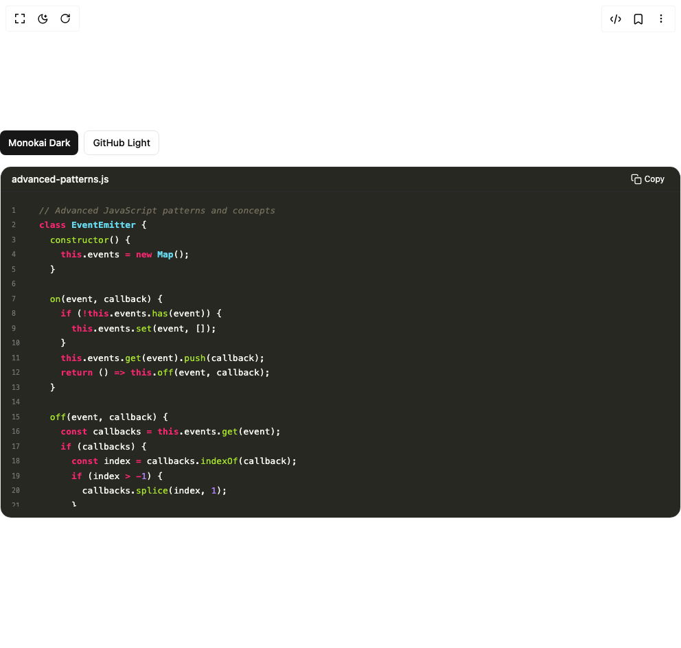

# Build Code Snippets 3 in BuilderStudio

> Build this component in our Agentic IDE: [BuilderStudio](https://builderstudio.dev).
>
> Join the BuilderStudio community on [Discord](https://discord.gg/QdWeSGCqfe) and [Reddit](https://reddit.com/r/builderstudio).



## Component

- Author group: `deltacomponents`
- Component: `code-snippets-3`
- Variant: `theme-customization`
- Rendered HTML snapshot: [`rendered.html`](rendered.html)

## BuilderStudio prompt

You are implementing a React component based on a component reference.

## Component identity

- Author: deltacomponents
- Component slug: code-snippets-3
- Demo slug: theme-customization
- Title: code-snippets-3
- Description: 

## Goal

Recreate this component in a React + TypeScript + Tailwind CSS project. Preserve the visual layout, spacing, colors, border radius, shadows, interaction behavior, animation behavior, responsive behavior, and dark mode behavior shown in the rendered demo.

## Implementation requirements

- Use React and TypeScript.
- Use Tailwind CSS classes whenever possible.
- Keep the component self-contained unless the source files require helper components.
- If the source uses CSS variables, custom CSS, animations, or keyframes, include them.
- If the source uses external packages, list and use the required packages.
- Preserve accessibility attributes, button semantics, links, keyboard behavior, and ARIA attributes when visible in the source.
- Do not replace the component with a simplified placeholder.
- Return complete production-ready code.

## Dependencies

No reference metadata available.

## Rendered DOM snapshot

This is the rendered demo HTML extracted from the live preview. Use it to verify structure, class names, visible content, and layout.

```html
<div id="root"><div class="w-screen min-h-screen flex justify-center items-center"><div class="w-screen min-h-screen flex justify-center items-center"><div class="w-full space-y-4"><div class="flex gap-2"><button class="inline-flex items-center justify-center whitespace-nowrap text-sm font-medium ring-offset-background transition-colors focus-visible:outline-none focus-visible:ring-2 focus-visible:ring-ring focus-visible:ring-offset-2 disabled:pointer-events-none disabled:opacity-50 bg-primary text-primary-foreground hover:bg-primary/90 h-9 rounded-md px-3">Monokai Dark</button><button class="inline-flex items-center justify-center whitespace-nowrap text-sm font-medium ring-offset-background transition-colors focus-visible:outline-none focus-visible:ring-2 focus-visible:ring-ring focus-visible:ring-offset-2 disabled:pointer-events-none disabled:opacity-50 border border-input bg-background hover:bg-accent hover:text-accent-foreground h-9 rounded-md px-3">GitHub Light</button></div><div class="rounded-2xl overflow-hidden pointer-events-auto border border-border"><div class="flex items-center justify-between border-b" style="background-color: rgb(39, 40, 34); border-bottom-color: rgb(42, 42, 42);"><h3 class="text-sm font-medium pl-4 py-2" style="color: rgb(248, 248, 242);">advanced-patterns.js</h3><button type="button" aria-label="Copy to clipboard" title="Copy" class="inline-flex items-center gap-1 rounded-md border px-2.5 py-1.5 text-xs transition-colors focus:outline-none focus-visible:ring-2 focus-visible:ring-offset-2 border-transparent/0 hover:border-transparent/0 mr-3 text-zinc-50 hover:bg-zinc-700 hover:text-zinc-50"><span class="sr-only">Copy</span><svg viewBox="0 0 24 24" class="h-4 w-4" fill="none" stroke="currentColor" stroke-width="2" stroke-linecap="round" stroke-linejoin="round" aria-hidden="true"><rect x="9" y="9" width="13" height="13" rx="2" ry="2"></rect><path d="M5 15H4a2 2 0 0 1-2-2V4a2 2 0 0 1 2-2h9a2 2 0 0 1 2 2v1"></path></svg><span>Copy</span></button></div><div class="relative max-h-[calc(530px-44px)] py-4" style="background-color: rgb(39, 40, 34);"><pre class="prism-code language-javascript text-[13px] overflow-x-auto overflow-y-auto max-h-[calc(530px-88px)] font-mono font-medium" style="color: rgb(248, 248, 242); background-color: rgb(39, 40, 34);"><div class="flex items-center py-px px-4" style="color: rgb(248, 248, 242);"><span class="mr-4 select-none text-right text-[10px] items-center flex" style="color: rgb(117, 117, 117); min-width: 1.5rem;">1</span><span class=""><span class="token comment" style="color: rgb(117, 113, 94); font-style: italic;">// Advanced JavaScript patterns and concepts</span><span class="token plain"></span></span></div><div class="flex items-center py-px px-4" style="color: rgb(248, 248, 242);"><span class="mr-4 select-none text-right text-[10px] items-center flex" style="color: rgb(117, 117, 117); min-width: 1.5rem;">2</span><span class=""><span class="token plain"></span><span class="token keyword" style="color: rgb(249, 38, 114); font-weight: bold;">class</span><span class="token plain"> </span><span class="token class-name" style="color: rgb(102, 217, 239); font-weight: bold;">EventEmitter</span><span class="token plain"> </span><span class="token punctuation" style="color: rgb(248, 248, 242);">{</span><span class="token plain"></span></span></div><div class="flex items-center py-px px-4" style="color: rgb(248, 248, 242);"><span class="mr-4 select-none text-right text-[10px] items-center flex" style="color: rgb(117, 117, 117); min-width: 1.5rem;">3</span><span class=""><span class="token plain">  </span><span class="token function" style="color: rgb(166, 226, 46);">constructor</span><span class="token punctuation" style="color: rgb(248, 248, 242);">(</span><span class="token punctuation" style="color: rgb(248, 248, 242);">)</span><span class="token plain"> </span><span class="token punctuation" style="color: rgb(248, 248, 242);">{</span><span class="token plain"></span></span></div><div class="flex items-center py-px px-4" style="color: rgb(248, 248, 242);"><span class="mr-4 select-none text-right text-[10px] items-center flex" style="color: rgb(117, 117, 117); min-width: 1.5rem;">4</span><span class=""><span class="token plain">    </span><span class="token keyword" style="color: rgb(249, 38, 114); font-weight: bold;">this</span><span class="token punctuation" style="color: rgb(248, 248, 242);">.</span><span class="token property-access">events</span><span class="token plain"> </span><span class="token operator" style="color: rgb(249, 38, 114); font-weight: bold;">=</span><span class="token plain"> </span><span class="token keyword" style="color: rgb(249, 38, 114); font-weight: bold;">new</span><span class="token plain"> </span><span class="token class-name" style="color: rgb(102, 217, 239); font-weight: bold;">Map</span><span class="token punctuation" style="color: rgb(248, 248, 242);">(</span><span class="token punctuation" style="color: rgb(248, 248, 242);">)</span><span class="token punctuation" style="color: rgb(248, 248, 242);">;</span><span class="token plain"></span></span></div><div class="flex items-center py-px px-4" style="color: rgb(248, 248, 242);"><span class="mr-4 select-none text-right text-[10px] items-center flex" style="color: rgb(117, 117, 117); min-width: 1.5rem;">5</span><span class=""><span class="token plain">  </span><span class="token punctuation" style="color: rgb(248, 248, 242);">}</span><span class="token plain"></span></span></div><div class="flex items-center py-px px-4" style="color: rgb(248, 248, 242);"><span class="mr-4 select-none text-right text-[10px] items-center flex" style="color: rgb(117, 117, 117); min-width: 1.5rem;">6</span><span class=""><span class="token plain" style="display: inline-block;">
</span></span></div><div class="flex items-center py-px px-4" style="color: rgb(248, 248, 242);"><span class="mr-4 select-none text-right text-[10px] items-center flex" style="color: rgb(117, 117, 117); min-width: 1.5rem;">7</span><span class=""><span class="token plain">  </span><span class="token function" style="color: rgb(166, 226, 46);">on</span><span class="token punctuation" style="color: rgb(248, 248, 242);">(</span><span class="token parameter">event</span><span class="token parameter punctuation" style="color: rgb(248, 248, 242);">,</span><span class="token parameter"> callback</span><span class="token punctuation" style="color: rgb(248, 248, 242);">)</span><span class="token plain"> </span><span class="token punctuation" style="color: rgb(248, 248, 242);">{</span><span class="token plain"></span></span></div><div class="flex items-center py-px px-4" style="color: rgb(248, 248, 242);"><span class="mr-4 select-none text-right text-[10px] items-center flex" style="color: rgb(117, 117, 117); min-width: 1.5rem;">8</span><span class=""><span class="token plain">    </span><span class="token keyword control-flow" style="color: rgb(249, 38, 114); font-weight: bold;">if</span><span class="token plain"> </span><span class="token punctuation" style="color: rgb(248, 248, 242);">(</span><span class="token operator" style="color: rgb(249, 38, 114); font-weight: bold;">!</span><span class="token keyword" style="color: rgb(249, 38, 114); font-weight: bold;">this</span><span class="token punctuation" style="color: rgb(248, 248, 242);">.</span><span class="token property-access">events</span><span class="token punctuation" style="color: rgb(248, 248, 242);">.</span><span class="token method function property-access" style="color: rgb(166, 226, 46);">has</span><span class="token punctuation" style="color: rgb(248, 248, 242);">(</span><span class="token plain">event</span><span class="token punctuation" style="color: rgb(248, 248, 242);">)</span><span class="token punctuation" style="color: rgb(248, 248, 242);">)</span><span class="token plain"> </span><span class="token punctuation" style="color: rgb(248, 248, 242);">{</span><span class="token plain"></span></span></div><div class="flex items-center py-px px-4" style="color: rgb(248, 248, 242);"><span class="mr-4 select-none text-right text-[10px] items-center flex" style="color: rgb(117, 117, 117); min-width: 1.5rem;">9</span><span class=""><span class="token plain">      </span><span class="token keyword" style="color: rgb(249, 38, 114); font-weight: bold;">this</span><span class="token punctuation" style="color: rgb(248, 248, 242);">.</span><span class="token property-access">events</span><span class="token punctuation" style="color: rgb(248, 248, 242);">.</span><span class="token method function property-access" style="color: rgb(166, 226, 46);">set</span><span class="token punctuation" style="color: rgb(248, 248, 242);">(</span><span class="token plain">event</span><span class="token punctuation" style="color: rgb(248, 248, 242);">,</span><span class="token plain"> </span><span class="token punctuation" style="color: rgb(248, 248, 242);">[</span><span class="token punctuation" style="color: rgb(248, 248, 242);">]</span><span class="token punctuation" style="color: rgb(248, 248, 242);">)</span><span class="token punctuation" style="color: rgb(248, 248, 242);">;</span><span class="token plain"></span></span></div><div class="flex items-center py-px px-4" style="color: rgb(248, 248, 242);"><span class="mr-4 select-none text-right text-[10px] items-center flex" style="color: rgb(117, 117, 117); min-width: 1.5rem;">10</span><span class=""><span class="token plain">    </span><span class="token punctuation" style="color: rgb(248, 248, 242);">}</span><span class="token plain"></span></span></div><div class="flex items-center py-px px-4" style="color: rgb(248, 248, 242);"><span class="mr-4 select-none text-right text-[10px] items-center flex" style="color: rgb(117, 117, 117); min-width: 1.5rem;">11</span><span class=""><span class="token plain">    </span><span class="token keyword" style="color: rgb(249, 38, 114); font-weight: bold;">this</span><span class="token punctuation" style="color: rgb(248, 248, 242);">.</span><span class="token property-access">events</span><span class="token punctuation" style="color: rgb(248, 248, 242);">.</span><span class="token method function property-access" style="color: rgb(166, 226, 46);">get</span><span class="token punctuation" style="color: rgb(248, 248, 242);">(</span><span class="token plain">event</span><span class="token punctuation" style="color: rgb(248, 248, 242);">)</span><span class="token punctuation" style="color: rgb(248, 248, 242);">.</span><span class="token method function property-access" style="color: rgb(166, 226, 46);">push</span><span class="token punctuation" style="color: rgb(248, 248, 242);">(</span><span class="token plain">callback</span><span class="token punctuation" style="color: rgb(248, 248, 242);">)</span><span class="token punctuation" style="color: rgb(248, 248, 242);">;</span><span class="token plain"></span></span></div><div class="flex items-center py-px px-4" style="color: rgb(248, 248, 242);"><span class="mr-4 select-none text-right text-[10px] items-center flex" style="color: rgb(117, 117, 117); min-width: 1.5rem;">12</span><span class=""><span class="token plain">    </span><span class="token keyword control-flow" style="color: rgb(249, 38, 114); font-weight: bold;">return</span><span class="token plain"> </span><span class="token punctuation" style="color: rgb(248, 248, 242);">(</span><span class="token punctuation" style="color: rgb(248, 248, 242);">)</span><span class="token plain"> </span><span class="token arrow operator" style="color: rgb(249, 38, 114); font-weight: bold;">=&gt;</span><span class="token plain"> </span><span class="token keyword" style="color: rgb(249, 38, 114); font-weight: bold;">this</span><span class="token punctuation" style="color: rgb(248, 248, 242);">.</span><span class="token method function property-access" style="color: rgb(166, 226, 46);">off</span><span class="token punctuation" style="color: rgb(248, 248, 242);">(</span><span class="token plain">event</span><span class="token punctuation" style="color: rgb(248, 248, 242);">,</span><span class="token plain"> callback</span><span class="token punctuation" style="color: rgb(248, 248, 242);">)</span><span class="token punctuation" style="color: rgb(248, 248, 242);">;</span><span class="token plain"></span></span></div><div class="flex items-center py-px px-4" style="color: rgb(248, 248, 242);"><span class="mr-4 select-none text-right text-[10px] items-center flex" style="color: rgb(117, 117, 117); min-width: 1.5rem;">13</span><span class=""><span class="token plain">  </span><span class="token punctuation" style="color: rgb(248, 248, 242);">}</span><span class="token plain"></span></span></div><div class="flex items-center py-px px-4" style="color: rgb(248, 248, 242);"><span class="mr-4 select-none text-right text-[10px] items-center flex" style="color: rgb(117, 117, 117); min-width: 1.5rem;">14</span><span class=""><span class="token plain" style="display: inline-block;">
</span></span></div><div class="flex items-center py-px px-4" style="color: rgb(248, 248, 242);"><span class="mr-4 select-none text-right text-[10px] items-center flex" style="color: rgb(117, 117, 117); min-width: 1.5rem;">15</span><span class=""><span class="token plain">  </span><span class="token function" style="color: rgb(166, 226, 46);">off</span><span class="token punctuation" style="color: rgb(248, 248, 242);">(</span><span class="token parameter">event</span><span class="token parameter punctuation" style="color: rgb(248, 248, 242);">,</span><span class="token parameter"> callback</span><span class="token punctuation" style="color: rgb(248, 248, 242);">)</span><span class="token plain"> </span><span class="token punctuation" style="color: rgb(248, 248, 242);">{</span><span class="token plain"></span></span></div><div class="flex items-center py-px px-4" style="color: rgb(248, 248, 242);"><span class="mr-4 select-none text-right text-[10px] items-center flex" style="color: rgb(117, 117, 117); min-width: 1.5rem;">16</span><span class=""><span class="token plain">    </span><span class="token keyword" style="color: rgb(249, 38, 114); font-weight: bold;">const</span><span class="token plain"> callbacks </span><span class="token operator" style="color: rgb(249, 38, 114); font-weight: bold;">=</span><span class="token plain"> </span><span class="token keyword" style="color: rgb(249, 38, 114); font-weight: bold;">this</span><span class="token punctuation" style="color: rgb(248, 248, 242);">.</span><span class="token property-access">events</span><span class="token punctuation" style="color: rgb(248, 248, 242);">.</span><span class="token method function property-access" style="color: rgb(166, 226, 46);">get</span><span class="token punctuation" style="color: rgb(248, 248, 242);">(</span><span class="token plain">event</span><span class="token punctuation" style="color: rgb(248, 248, 242);">)</span><span class="token punctuation" style="color: rgb(248, 248, 242);">;</span><span class="token plain"></span></span></div><div class="flex items-center py-px px-4" style="color: rgb(248, 248, 242);"><span class="mr-4 select-none text-right text-[10px] items-center flex" style="color: rgb(117, 117, 117); min-width: 1.5rem;">17</span><span class=""><span class="token plain">    </span><span class="token keyword control-flow" style="color: rgb(249, 38, 114); font-weight: bold;">if</span><span class="token plain"> </span><span class="token punctuation" style="color: rgb(248, 248, 242);">(</span><span class="token plain">callbacks</span><span class="token punctuation" style="color: rgb(248, 248, 242);">)</span><span class="token plain"> </span><span class="token punctuation" style="color: rgb(248, 248, 242);">{</span><span class="token plain"></span></span></div><div class="flex items-center py-px px-4" style="color: rgb(248, 248, 242);"><span class="mr-4 select-none text-right text-[10px] items-center flex" style="color: rgb(117, 117, 117); min-width: 1.5rem;">18</span><span class=""><span class="token plain">      </span><span class="token keyword" style="color: rgb(249, 38, 114); font-weight: bold;">const</span><span class="token plain"> index </span><span class="token operator" style="color: rgb(249, 38, 114); font-weight: bold;">=</span><span class="token plain"> callbacks</span><span class="token punctuation" style="color: rgb(248, 248, 242);">.</span><span class="token method function property-access" style="color: rgb(166, 226, 46);">indexOf</span><span class="token punctuation" style="color: rgb(248, 248, 242);">(</span><span class="token plain">callback</span><span class="token punctuation" style="color: rgb(248, 248, 242);">)</span><span class="token punctuation" style="color: rgb(248, 248, 242);">;</span><span class="token plain"></span></span></div><div class="flex items-center py-px px-4" style="color: rgb(248, 248, 242);"><span class="mr-4 select-none text-right text-[10px] items-center flex" style="color: rgb(117, 117, 117); min-width: 1.5rem;">19</span><span class=""><span class="token plain">      </span><span class="token keyword control-flow" style="color: rgb(249, 38, 114); font-weight: bold;">if</span><span class="token plain"> </span><span class="token punctuation" style="color: rgb(248, 248, 242);">(</span><span class="token plain">index </span><span class="token operator" style="color: rgb(249, 38, 114); font-weight: bold;">&gt;</span><span class="token plain"> </span><span class="token operator" style="color: rgb(249, 38, 114); font-weight: bold;">-</span><span class="token number" style="color: rgb(174, 129, 255);">1</span><span class="token punctuation" style="color: rgb(248, 248, 242);">)</span><span class="token plain"> </span><span class="token punctuation" style="color: rgb(248, 248, 242);">{</span><span class="token plain"></span></span></div><div class="flex items-center py-px px-4" style="color: rgb(248, 248, 242);"><span class="mr-4 select-none text-right text-[10px] items-center flex" style="color: rgb(117, 117, 117); min-width: 1.5rem;">20</span><span class=""><span class="token plain">        callbacks</span><span class="token punctuation" style="color: rgb(248, 248, 242);">.</span><span class="token method function property-access" style="color: rgb(166, 226, 46);">splice</span><span class="token punctuation" style="color: rgb(248, 248, 242);">(</span><span class="token plain">index</span><span class="token punctuation" style="color: rgb(248, 248, 242);">,</span><span class="token plain"> </span><span class="token number" style="color: rgb(174, 129, 255);">1</span><span class="token punctuation" style="color: rgb(248, 248, 242);">)</span><span class="token punctuation" style="color: rgb(248, 248, 242);">;</span><span class="token plain"></span></span></div><div class="flex items-center py-px px-4" style="color: rgb(248, 248, 242);"><span class="mr-4 select-none text-right text-[10px] items-center flex" style="color: rgb(117, 117, 117); min-width: 1.5rem;">21</span><span class=""><span class="token plain">      </span><span class="token punctuation" style="color: rgb(248, 248, 242);">}</span><span class="token plain"></span></span></div><div class="flex items-center py-px px-4" style="color: rgb(248, 248, 242);"><span class="mr-4 select-none text-right text-[10px] items-center flex" style="color: rgb(117, 117, 117); min-width: 1.5rem;">22</span><span class=""><span class="token plain">    </span><span class="token punctuation" style="color: rgb(248, 248, 242);">}</span><span class="token plain"></span></span></div><div class="flex items-center py-px px-4" style="color: rgb(248, 248, 242);"><span class="mr-4 select-none text-right text-[10px] items-center flex" style="color: rgb(117, 117, 117); min-width: 1.5rem;">23</span><span class=""><span class="token plain">  </span><span class="token punctuation" style="color: rgb(248, 248, 242);">}</span><span class="token plain"></span></span></div><div class="flex items-center py-px px-4" style="color: rgb(248, 248, 242);"><span class="mr-4 select-none text-right text-[10px] items-center flex" style="color: rgb(117, 117, 117); min-width: 1.5rem;">24</span><span class=""><span class="token plain" style="display: inline-block;">
</span></span></div><div class="flex items-center py-px px-4" style="color: rgb(248, 248, 242);"><span class="mr-4 select-none text-right text-[10px] items-center flex" style="color: rgb(117, 117, 117); min-width: 1.5rem;">25</span><span class=""><span class="token plain">  </span><span class="token function" style="color: rgb(166, 226, 46);">emit</span><span class="token punctuation" style="color: rgb(248, 248, 242);">(</span><span class="token parameter">event</span><span class="token parameter punctuation" style="color: rgb(248, 248, 242);">,</span><span class="token parameter"> </span><span class="token parameter spread operator" style="color: rgb(249, 38, 114); font-weight: bold;">...</span><span class="token parameter">args</span><span class="token punctuation" style="color: rgb(248, 248, 242);">)</span><span class="token plain"> </span><span class="token punctuation" style="color: rgb(248, 248, 242);">{</span><span class="token plain"></span></span></div><div class="flex items-center py-px px-4" style="color: rgb(248, 248, 242);"><span class="mr-4 select-none text-right text-[10px] items-center flex" style="color: rgb(117, 117, 117); min-width: 1.5rem;">26</span><span class=""><span class="token plain">    </span><span class="token keyword" style="color: rgb(249, 38, 114); font-weight: bold;">const</span><span class="token plain"> callbacks </span><span class="token operator" style="color: rgb(249, 38, 114); font-weight: bold;">=</span><span class="token plain"> </span><span class="token keyword" style="color: rgb(249, 38, 114); font-weight: bold;">this</span><span class="token punctuation" style="color: rgb(248, 248, 242);">.</span><span class="token property-access">events</span><span class="token punctuation" style="color: rgb(248, 248, 242);">.</span><span class="token method function property-access" style="color: rgb(166, 226, 46);">get</span><span class="token punctuation" style="color: rgb(248, 248, 242);">(</span><span class="token plain">event</span><span class="token punctuation" style="color: rgb(248, 248, 242);">)</span><span class="token punctuation" style="color: rgb(248, 248, 242);">;</span><span class="token plain"></span></span></div><div class="flex items-center py-px px-4" style="color: rgb(248, 248, 242);"><span class="mr-4 select-none text-right text-[10px] items-center flex" style="color: rgb(117, 117, 117); min-width: 1.5rem;">27</span><span class=""><span class="token plain">    </span><span class="token keyword control-flow" style="color: rgb(249, 38, 114); font-weight: bold;">if</span><span class="token plain"> </span><span class="token punctuation" style="color: rgb(248, 248, 242);">(</span><span class="token plain">callbacks</span><span class="token punctuation" style="color: rgb(248, 248, 242);">)</span><span class="token plain"> </span><span class="token punctuation" style="color: rgb(248, 248, 242);">{</span><span class="token plain"></span></span></div><div class="flex items-center py-px px-4" style="color: rgb(248, 248, 242);"><span class="mr-4 select-none text-right text-[10px] items-center flex" style="color: rgb(117, 117, 117); min-width: 1.5rem;">28</span><span class=""><span class="token plain">      callbacks</span><span class="token punctuation" style="color: rgb(248, 248, 242);">.</span><span class="token method function property-access" style="color: rgb(166, 226, 46);">forEach</span><span class="token punctuation" style="color: rgb(248, 248, 242);">(</span><span class="token parameter">callback</span><span class="token plain"> </span><span class="token arrow operator" style="color: rgb(249, 38, 114); font-weight: bold;">=&gt;</span><span class="token plain"> </span><span class="token punctuation" style="color: rgb(248, 248, 242);">{</span><span class="token plain"></span></span></div><div class="flex items-center py-px px-4" style="color: rgb(248, 248, 242);"><span class="mr-4 select-none text-right text-[10px] items-center flex" style="color: rgb(117, 117, 117); min-width: 1.5rem;">29</span><span class=""><span class="token plain">        </span><span class="token keyword control-flow" style="color: rgb(249, 38, 114); font-weight: bold;">try</span><span class="token plain"> </span><span class="token punctuation" style="color: rgb(248, 248, 242);">{</span><span class="token plain"></span></span></div><div class="flex items-center py-px px-4" style="color: rgb(248, 248, 242);"><span class="mr-4 select-none text-right text-[10px] items-center flex" style="color: rgb(117, 117, 117); min-width: 1.5rem;">30</span><span class=""><span class="token plain">          </span><span class="token function" style="color: rgb(166, 226, 46);">callback</span><span class="token punctuation" style="color: rgb(248, 248, 242);">(</span><span class="token spread operator" style="color: rgb(249, 38, 114); font-weight: bold;">...</span><span class="token plain">args</span><span class="token punctuation" style="color: rgb(248, 248, 242);">)</span><span class="token punctuation" style="color: rgb(248, 248, 242);">;</span><span class="token plain"></span></span></div><div class="flex items-center py-px px-4" style="color: rgb(248, 248, 242);"><span class="mr-4 select-none text-right text-[10px] items-center flex" style="color: rgb(117, 117, 117); min-width: 1.5rem;">31</span><span class=""><span class="token plain">        </span><span class="token punctuation" style="color: rgb(248, 248, 242);">}</span><span class="token plain"> </span><span class="token keyword control-flow" style="color: rgb(249, 38, 114); font-weight: bold;">catch</span><span class="token plain"> </span><span class="token punctuation" style="color: rgb(248, 248, 242);">(</span><span class="token plain">error</span><span class="token punctuation" style="color: rgb(248, 248, 242);">)</span><span class="token plain"> </span><span class="token punctuation" style="color: rgb(248, 248, 242);">{</span><span class="token plain"></span></span></div><div class="flex items-center py-px px-4" style="color: rgb(248, 248, 242);"><span class="mr-4 select-none text-right text-[10px] items-center flex" style="color: rgb(117, 117, 117); min-width: 1.5rem;">32</span><span class=""><span class="token plain">          </span><span class="token console class-name" style="color: rgb(102, 217, 239); font-weight: bold;">console</span><span class="token punctuation" style="color: rgb(248, 248, 242);">.</span><span class="token method function property-access" style="color: rgb(166, 226, 46);">error</span><span class="token punctuation" style="color: rgb(248, 248, 242);">(</span><span class="token template-string template-punctuation string" style="color: rgb(230, 219, 116);">`</span><span class="token template-string string" style="color: rgb(230, 219, 116);">Error in event handler for </span><span class="token template-string interpolation interpolation-punctuation punctuation" style="color: rgb(248, 248, 242);">${</span><span class="token template-string interpolation">event</span><span class="token template-string interpolation interpolation-punctuation punctuation" style="color: rgb(248, 248, 242);">}</span><span class="token template-string string" style="color: rgb(230, 219, 116);">:</span><span class="token template-string template-punctuation string" style="color: rgb(230, 219, 116);">`</span><span class="token punctuation" style="color: rgb(248, 248, 242);">,</span><span class="token plain"> error</span><span class="token punctuation" style="color: rgb(248, 248, 242);">)</span><span class="token punctuation" style="color: rgb(248, 248, 242);">;</span><span class="token plain"></span></span></div><div class="flex items-center py-px px-4" style="color: rgb(248, 248, 242);"><span class="mr-4 select-none text-right text-[10px] items-center flex" style="color: rgb(117, 117, 117); min-width: 1.5rem;">33</span><span class=""><span class="token plain">        </span><span class="token punctuation" style="color: rgb(248, 248, 242);">}</span><span class="token plain"></span></span></div><div class="flex items-center py-px px-4" style="color: rgb(248, 248, 242);"><span class="mr-4 select-none text-right text-[10px] items-center flex" style="color: rgb(117, 117, 117); min-width: 1.5rem;">34</span><span class=""><span class="token plain">      </span><span class="token punctuation" style="color: rgb(248, 248, 242);">}</span><span class="token punctuation" style="color: rgb(248, 248, 242);">)</span><span class="token punctuation" style="color: rgb(248, 248, 242);">;</span><span class="token plain"></span></span></div><div class="flex items-center py-px px-4" style="color: rgb(248, 248, 242);"><span class="mr-4 select-none text-right text-[10px] items-center flex" style="color: rgb(117, 117, 117); min-width: 1.5rem;">35</span><span class=""><span class="token plain">    </span><span class="token punctuation" style="color: rgb(248, 248, 242);">}</span><span class="token plain"></span></span></div><div class="flex items-center py-px px-4" style="color: rgb(248, 248, 242);"><span class="mr-4 select-none text-right text-[10px] items-center flex" style="color: rgb(117, 117, 117); min-width: 1.5rem;">36</span><span class=""><span class="token plain">  </span><span class="token punctuation" style="color: rgb(248, 248, 242);">}</span><span class="token plain"></span></span></div><div class="flex items-center py-px px-4" style="color: rgb(248, 248, 242);"><span class="mr-4 select-none text-right text-[10px] items-center flex" style="color: rgb(117, 117, 117); min-width: 1.5rem;">37</span><span class=""><span class="token plain"></span><span class="token punctuation" style="color: rgb(248, 248, 242);">}</span><span class="token plain"></span></span></div><div class="flex items-center py-px px-4" style="color: rgb(248, 248, 242);"><span class="mr-4 select-none text-right text-[10px] items-center flex" style="color: rgb(117, 117, 117); min-width: 1.5rem;">38</span><span class=""><span class="token plain" style="display: inline-block;">
</span></span></div><div class="flex items-center py-px px-4" style="color: rgb(248, 248, 242);"><span class="mr-4 select-none text-right text-[10px] items-center flex" style="color: rgb(117, 117, 117); min-width: 1.5rem;">39</span><span class=""><span class="token plain"></span><span class="token comment" style="color: rgb(117, 113, 94); font-style: italic;">// Usage with modern async/await patterns</span><span class="token plain"></span></span></div><div class="flex items-center py-px px-4" style="color: rgb(248, 248, 242);"><span class="mr-4 select-none text-right text-[10px] items-center flex" style="color: rgb(117, 117, 117); min-width: 1.5rem;">40</span><span class=""><span class="token plain"></span><span class="token keyword" style="color: rgb(249, 38, 114); font-weight: bold;">const</span><span class="token plain"> api </span><span class="token operator" style="color: rgb(249, 38, 114); font-weight: bold;">=</span><span class="token plain"> </span><span class="token punctuation" style="color: rgb(248, 248, 242);">{</span><span class="token plain"></span></span></div><div class="flex items-center py-px px-4" style="color: rgb(248, 248, 242);"><span class="mr-4 select-none text-right text-[10px] items-center flex" style="color: rgb(117, 117, 117); min-width: 1.5rem;">41</span><span class=""><span class="token plain">  </span><span class="token keyword" style="color: rgb(249, 38, 114); font-weight: bold;">async</span><span class="token plain"> </span><span class="token function" style="color: rgb(166, 226, 46);">fetchUser</span><span class="token punctuation" style="color: rgb(248, 248, 242);">(</span><span class="token parameter">id</span><span class="token punctuation" style="color: rgb(248, 248, 242);">)</span><span class="token plain"> </span><span class="token punctuation" style="color: rgb(248, 248, 242);">{</span><span class="token plain"></span></span></div><div class="flex items-center py-px px-4" style="color: rgb(248, 248, 242);"><span class="mr-4 select-none text-right text-[10px] items-center flex" style="color: rgb(117, 117, 117); min-width: 1.5rem;">42</span><span class=""><span class="token plain">    </span><span class="token keyword" style="color: rgb(249, 38, 114); font-weight: bold;">const</span><span class="token plain"> response </span><span class="token operator" style="color: rgb(249, 38, 114); font-weight: bold;">=</span><span class="token plain"> </span><span class="token keyword control-flow" style="color: rgb(249, 38, 114); font-weight: bold;">await</span><span class="token plain"> </span><span class="token function" style="color: rgb(166, 226, 46);">fetch</span><span class="token punctuation" style="color: rgb(248, 248, 242);">(</span><span class="token template-string template-punctuation string" style="color: rgb(230, 219, 116);">`</span><span class="token template-string string" style="color: rgb(230, 219, 116);">/api/users/</span><span class="token template-string interpolation interpolation-punctuation punctuation" style="color: rgb(248, 248, 242);">${</span><span class="token template-string interpolation">id</span><span class="token template-string interpolation interpolation-punctuation punctuation" style="color: rgb(248, 248, 242);">}</span><span class="token template-string template-punctuation string" style="color: rgb(230, 219, 116);">`</span><span class="token punctuation" style="color: rgb(248, 248, 242);">)</span><span class="token punctuation" style="color: rgb(248, 248, 242);">;</span><span class="token plain"></span></span></div><div class="flex items-center py-px px-4" style="color: rgb(248, 248, 242);"><span class="mr-4 select-none text-right text-[10px] items-center flex" style="color: rgb(117, 117, 117); min-width: 1.5rem;">43</span><span class=""><span class="token plain">    </span><span class="token keyword control-flow" style="color: rgb(249, 38, 114); font-weight: bold;">if</span><span class="token plain"> </span><span class="token punctuation" style="color: rgb(248, 248, 242);">(</span><span class="token operator" style="color: rgb(249, 38, 114); font-weight: bold;">!</span><span class="token plain">response</span><span class="token punctuation" style="color: rgb(248, 248, 242);">.</span><span class="token property-access">ok</span><span class="token punctuation" style="color: rgb(248, 248, 242);">)</span><span class="token plain"> </span><span class="token punctuation" style="color: rgb(248, 248, 242);">{</span><span class="token plain"></span></span></div><div class="flex items-center py-px px-4" style="color: rgb(248, 248, 242);"><span class="mr-4 select-none text-right text-[10px] items-center flex" style="color: rgb(117, 117, 117); min-width: 1.5rem;">44</span><span class=""><span class="token plain">      </span><span class="token keyword control-flow" style="color: rgb(249, 38, 114); font-weight: bold;">throw</span><span class="token plain"> </span><span class="token keyword" style="color: rgb(249, 38, 114); font-weight: bold;">new</span><span class="token plain"> </span><span class="token class-name" style="color: rgb(102, 217, 239); font-weight: bold;">Error</span><span class="token punctuation" style="color: rgb(248, 248, 242);">(</span><span class="token template-string template-punctuation string" style="color: rgb(230, 219, 116);">`</span><span class="token template-string string" style="color: rgb(230, 219, 116);">Failed to fetch user: </span><span class="token template-string interpolation interpolation-punctuation punctuation" style="color: rgb(248, 248, 242);">${</span><span class="token template-string interpolation">response</span><span class="token template-string interpolation punctuation" style="color: rgb(248, 248, 242);">.</span><span class="token template-string interpolation property-access">statusText</span><span class="token template-string interpolation interpolation-punctuation punctuation" style="color: rgb(248, 248, 242);">}</span><span class="token template-string template-punctuation string" style="color: rgb(230, 219, 116);">`</span><span class="token punctuation" style="color: rgb(248, 248, 242);">)</span><span class="token punctuation" style="color: rgb(248, 248, 242);">;</span><span class="token plain"></span></span></div><div class="flex items-center py-px px-4" style="color: rgb(248, 248, 242);"><span class="mr-4 select-none text-right text-[10px] items-center flex" style="color: rgb(117, 117, 117); min-width: 1.5rem;">45</span><span class=""><span class="token plain">    </span><span class="token punctuation" style="color: rgb(248, 248, 242);">}</span><span class="token plain"></span></span></div><div class="flex items-center py-px px-4" style="color: rgb(248, 248, 242);"><span class="mr-4 select-none text-right text-[10px] items-center flex" style="color: rgb(117, 117, 117); min-width: 1.5rem;">46</span><span class=""><span class="token plain">    </span><span class="token keyword control-flow" style="color: rgb(249, 38, 114); font-weight: bold;">return</span><span class="token plain"> response</span><span class="token punctuation" style="color: rgb(248, 248, 242);">.</span><span class="token method function property-access" style="color: rgb(166, 226, 46);">json</span><span class="token punctuation" style="color: rgb(248, 248, 242);">(</span><span class="token punctuation" style="color: rgb(248, 248, 242);">)</span><span class="token punctuation" style="color: rgb(248, 248, 242);">;</span><span class="token plain"></span></span></div><div class="flex items-center py-px px-4" style="color: rgb(248, 248, 242);"><span class="mr-4 select-none text-right text-[10px] items-center flex" style="color: rgb(117, 117, 117); min-width: 1.5rem;">47</span><span class=""><span class="token plain">  </span><span class="token punctuation" style="color: rgb(248, 248, 242);">}</span><span class="token punctuation" style="color: rgb(248, 248, 242);">,</span><span class="token plain"></span></span></div><div class="flex items-center py-px px-4" style="color: rgb(248, 248, 242);"><span class="mr-4 select-none text-right text-[10px] items-center flex" style="color: rgb(117, 117, 117); min-width: 1.5rem;">48</span><span class=""><span class="token plain" style="display: inline-block;">
</span></span></div><div class="flex items-center py-px px-4" style="color: rgb(248, 248, 242);"><span class="mr-4 select-none text-right text-[10px] items-center flex" style="color: rgb(117, 117, 117); min-width: 1.5rem;">49</span><span class=""><span class="token plain">  </span><span class="token keyword" style="color: rgb(249, 38, 114); font-weight: bold;">async</span><span class="token plain"> </span><span class="token function" style="color: rgb(166, 226, 46);">updateUser</span><span class="token punctuation" style="color: rgb(248, 248, 242);">(</span><span class="token parameter">id</span><span class="token parameter punctuation" style="color: rgb(248, 248, 242);">,</span><span class="token parameter"> data</span><span class="token punctuation" style="color: rgb(248, 248, 242);">)</span><span class="token plain"> </span><span class="token punctuation" style="color: rgb(248, 248, 242);">{</span><span class="token plain"></span></span></div><div class="flex items-center py-px px-4" style="color: rgb(248, 248, 242);"><span class="mr-4 select-none text-right text-[10px] items-center flex" style="color: rgb(117, 117, 117); min-width: 1.5rem;">50</span><span class=""><span class="token plain">    </span><span class="token keyword" style="color: rgb(249, 38, 114); font-weight: bold;">const</span><span class="token plain"> response </span><span class="token operator" style="color: rgb(249, 38, 114); font-weight: bold;">=</span><span class="token plain"> </span><span class="token keyword control-flow" style="color: rgb(249, 38, 114); font-weight: bold;">await</span><span class="token plain"> </span><span class="token function" style="color: rgb(166, 226, 46);">fetch</span><span class="token punctuation" style="color: rgb(248, 248, 242);">(</span><span class="token template-string template-punctuation string" style="color: rgb(230, 219, 116);">`</span><span class="token template-string string" style="color: rgb(230, 219, 116);">/api/users/</span><span class="token template-string interpolation interpolation-punctuation punctuation" style="color: rgb(248, 248, 242);">${</span><span class="token template-string interpolation">id</span><span class="token template-string interpolation interpolation-punctuation punctuation" style="color: rgb(248, 248, 242);">}</span><span class="token template-string template-punctuation string" style="color: rgb(230, 219, 116);">`</span><span class="token punctuation" style="color: rgb(248, 248, 242);">,</span><span class="token plain"> </span><span class="token punctuation" style="color: rgb(248, 248, 242);">{</span><span class="token plain"></span></span></div><div class="flex items-center py-px px-4" style="color: rgb(248, 248, 242);"><span class="mr-4 select-none text-right text-[10px] items-center flex" style="color: rgb(117, 117, 117); min-width: 1.5rem;">51</span><span class=""><span class="token plain">      </span><span class="token literal-property property">method</span><span class="token operator" style="color: rgb(249, 38, 114); font-weight: bold;">:</span><span class="token plain"> </span><span class="token string" style="color: rgb(230, 219, 116);">'PATCH'</span><span class="token punctuation" style="color: rgb(248, 248, 242);">,</span><span class="token plain"></span></span></div><div class="flex items-center py-px px-4" style="color: rgb(248, 248, 242);"><span class="mr-4 select-none text-right text-[10px] items-center flex" style="color: rgb(117, 117, 117); min-width: 1.5rem;">52</span><span class=""><span class="token plain">      </span><span class="token literal-property property">headers</span><span class="token operator" style="color: rgb(249, 38, 114); font-weight: bold;">:</span><span class="token plain"> </span><span class="token punctuation" style="color: rgb(248, 248, 242);">{</span><span class="token plain"></span></span></div><div class="flex items-center py-px px-4" style="color: rgb(248, 248, 242);"><span class="mr-4 select-none text-right text-[10px] items-center flex" style="color: rgb(117, 117, 117); min-width: 1.5rem;">53</span><span class=""><span class="token plain">        </span><span class="token string-property property">'Content-Type'</span><span class="token operator" style="color: rgb(249, 38, 114); font-weight: bold;">:</span><span class="token plain"> </span><span class="token string" style="color: rgb(230, 219, 116);">'application/json'</span><span class="token punctuation" style="color: rgb(248, 248, 242);">,</span><span class="token plain"></span></span></div><div class="flex items-center py-px px-4" style="color: rgb(248, 248, 242);"><span class="mr-4 select-none text-right text-[10px] items-center flex" style="color: rgb(117, 117, 117); min-width: 1.5rem;">54</span><span class=""><span class="token plain">      </span><span class="token punctuation" style="color: rgb(248, 248, 242);">}</span><span class="token punctuation" style="color: rgb(248, 248, 242);">,</span><span class="token plain"></span></span></div><div class="flex items-center py-px px-4" style="color: rgb(248, 248, 242);"><span class="mr-4 select-none text-right text-[10px] items-center flex" style="color: rgb(117, 117, 117); min-width: 1.5rem;">55</span><span class=""><span class="token plain">      </span><span class="token literal-property property">body</span><span class="token operator" style="color: rgb(249, 38, 114); font-weight: bold;">:</span><span class="token plain"> </span><span class="token known-class-name class-name" style="color: rgb(102, 217, 239); font-weight: bold;">JSON</span><span class="token punctuation" style="color: rgb(248, 248, 242);">.</span><span class="token method function property-access" style="color: rgb(166, 226, 46);">stringify</span><span class="token punctuation" style="color: rgb(248, 248, 242);">(</span><span class="token plain">data</span><span class="token punctuation" style="color: rgb(248, 248, 242);">)</span><span class="token punctuation" style="color: rgb(248, 248, 242);">,</span><span class="token plain"></span></span></div><div class="flex items-center py-px px-4" style="color: rgb(248, 248, 242);"><span class="mr-4 select-none text-right text-[10px] items-center flex" style="color: rgb(117, 117, 117); min-width: 1.5rem;">56</span><span class=""><span class="token plain">    </span><span class="token punctuation" style="color: rgb(248, 248, 242);">}</span><span class="token punctuation" style="color: rgb(248, 248, 242);">)</span><span class="token punctuation" style="color: rgb(248, 248, 242);">;</span><span class="token plain"></span></span></div><div class="flex items-center py-px px-4" style="color: rgb(248, 248, 242);"><span class="mr-4 select-none text-right text-[10px] items-center flex" style="color: rgb(117, 117, 117); min-width: 1.5rem;">57</span><span class=""><span class="token plain">    </span><span class="token keyword control-flow" style="color: rgb(249, 38, 114); font-weight: bold;">return</span><span class="token plain"> response</span><span class="token punctuation" style="color: rgb(248, 248, 242);">.</span><span class="token method function property-access" style="color: rgb(166, 226, 46);">json</span><span class="token punctuation" style="color: rgb(248, 248, 242);">(</span><span class="token punctuation" style="color: rgb(248, 248, 242);">)</span><span class="token punctuation" style="color: rgb(248, 248, 242);">;</span><span class="token plain"></span></span></div><div class="flex items-center py-px px-4" style="color: rgb(248, 248, 242);"><span class="mr-4 select-none text-right text-[10px] items-center flex" style="color: rgb(117, 117, 117); min-width: 1.5rem;">58</span><span class=""><span class="token plain">  </span><span class="token punctuation" style="color: rgb(248, 248, 242);">}</span><span class="token plain"></span></span></div><div class="flex items-center py-px px-4" style="color: rgb(248, 248, 242);"><span class="mr-4 select-none text-right text-[10px] items-center flex" style="color: rgb(117, 117, 117); min-width: 1.5rem;">59</span><span class=""><span class="token plain"></span><span class="token punctuation" style="color: rgb(248, 248, 242);">}</span><span class="token punctuation" style="color: rgb(248, 248, 242);">;</span><span class="token plain"></span></span></div><div class="flex items-center py-px px-4" style="color: rgb(248, 248, 242);"><span class="mr-4 select-none text-right text-[10px] items-center flex" style="color: rgb(117, 117, 117); min-width: 1.5rem;">60</span><span class=""><span class="token plain" style="display: inline-block;">
</span></span></div><div class="flex items-center py-px px-4" style="color: rgb(248, 248, 242);"><span class="mr-4 select-none text-right text-[10px] items-center flex" style="color: rgb(117, 117, 117); min-width: 1.5rem;">61</span><span class=""><span class="token plain"></span><span class="token comment" style="color: rgb(117, 113, 94); font-style: italic;">// Functional programming with higher-order functions</span><span class="token plain"></span></span></div><div class="flex items-center py-px px-4" style="color: rgb(248, 248, 242);"><span class="mr-4 select-none text-right text-[10px] items-center flex" style="color: rgb(117, 117, 117); min-width: 1.5rem;">62</span><span class=""><span class="token plain"></span><span class="token keyword" style="color: rgb(249, 38, 114); font-weight: bold;">const</span><span class="token plain"> </span><span class="token function-variable function" style="color: rgb(166, 226, 46);">compose</span><span class="token plain"> </span><span class="token operator" style="color: rgb(249, 38, 114); font-weight: bold;">=</span><span class="token plain"> </span><span class="token punctuation" style="color: rgb(248, 248, 242);">(</span><span class="token parameter spread operator" style="color: rgb(249, 38, 114); font-weight: bold;">...</span><span class="token parameter">fns</span><span class="token punctuation" style="color: rgb(248, 248, 242);">)</span><span class="token plain"> </span><span class="token arrow operator" style="color: rgb(249, 38, 114); font-weight: bold;">=&gt;</span><span class="token plain"> </span><span class="token punctuation" style="color: rgb(248, 248, 242);">(</span><span class="token parameter">value</span><span class="token punctuation" style="color: rgb(248, 248, 242);">)</span><span class="token plain"> </span><span class="token arrow operator" style="color: rgb(249, 38, 114); font-weight: bold;">=&gt;</span><span class="token plain"> fns</span><span class="token punctuation" style="color: rgb(248, 248, 242);">.</span><span class="token method function property-access" style="color: rgb(166, 226, 46);">reduceRight</span><span class="token punctuation" style="color: rgb(248, 248, 242);">(</span><span class="token punctuation" style="color: rgb(248, 248, 242);">(</span><span class="token parameter">acc</span><span class="token parameter punctuation" style="color: rgb(248, 248, 242);">,</span><span class="token parameter"> fn</span><span class="token punctuation" style="color: rgb(248, 248, 242);">)</span><span class="token plain"> </span><span class="token arrow operator" style="color: rgb(249, 38, 114); font-weight: bold;">=&gt;</span><span class="token plain"> </span><span class="token function" style="color: rgb(166, 226, 46);">fn</span><span class="token punctuation" style="color: rgb(248, 248, 242);">(</span><span class="token plain">acc</span><span class="token punctuation" style="color: rgb(248, 248, 242);">)</span><span class="token punctuation" style="color: rgb(248, 248, 242);">,</span><span class="token plain"> value</span><span class="token punctuation" style="color: rgb(248, 248, 242);">)</span><span class="token punctuation" style="color: rgb(248, 248, 242);">;</span><span class="token plain"></span></span></div><div class="flex items-center py-px px-4" style="color: rgb(248, 248, 242);"><span class="mr-4 select-none text-right text-[10px] items-center flex" style="color: rgb(117, 117, 117); min-width: 1.5rem;">63</span><span class=""><span class="token plain"></span><span class="token keyword" style="color: rgb(249, 38, 114); font-weight: bold;">const</span><span class="token plain"> </span><span class="token function-variable function" style="color: rgb(166, 226, 46);">pipe</span><span class="token plain"> </span><span class="token operator" style="color: rgb(249, 38, 114); font-weight: bold;">=</span><span class="token plain"> </span><span class="token punctuation" style="color: rgb(248, 248, 242);">(</span><span class="token parameter spread operator" style="color: rgb(249, 38, 114); font-weight: bold;">...</span><span class="token parameter">fns</span><span class="token punctuation" style="color: rgb(248, 248, 242);">)</span><span class="token plain"> </span><span class="token arrow operator" style="color: rgb(249, 38, 114); font-weight: bold;">=&gt;</span><span class="token plain"> </span><span class="token punctuation" style="color: rgb(248, 248, 242);">(</span><span class="token parameter">value</span><span class="token punctuation" style="color: rgb(248, 248, 242);">)</span><span class="token plain"> </span><span class="token arrow operator" style="color: rgb(249, 38, 114); font-weight: bold;">=&gt;</span><span class="token plain"> fns</span><span class="token punctuation" style="color: rgb(248, 248, 242);">.</span><span class="token method function property-access" style="color: rgb(166, 226, 46);">reduce</span><span class="token punctuation" style="color: rgb(248, 248, 242);">(</span><span class="token punctuation" style="color: rgb(248, 248, 242);">(</span><span class="token parameter">acc</span><span class="token parameter punctuation" style="color: rgb(248, 248, 242);">,</span><span class="token parameter"> fn</span><span class="token punctuation" style="color: rgb(248, 248, 242);">)</span><span class="token plain"> </span><span class="token arrow operator" style="color: rgb(249, 38, 114); font-weight: bold;">=&gt;</span><span class="token plain"> </span><span class="token function" style="color: rgb(166, 226, 46);">fn</span><span class="token punctuation" style="color: rgb(248, 248, 242);">(</span><span class="token plain">acc</span><span class="token punctuation" style="color: rgb(248, 248, 242);">)</span><span class="token punctuation" style="color: rgb(248, 248, 242);">,</span><span class="token plain"> value</span><span class="token punctuation" style="color: rgb(248, 248, 242);">)</span><span class="token punctuation" style="color: rgb(248, 248, 242);">;</span><span class="token plain"></span></span></div><div class="flex items-center py-px px-4" style="color: rgb(248, 248, 242);"><span class="mr-4 select-none text-right text-[10px] items-center flex" style="color: rgb(117, 117, 117); min-width: 1.5rem;">64</span><span class=""><span class="token plain" style="display: inline-block;">
</span></span></div><div class="flex items-center py-px px-4" style="color: rgb(248, 248, 242);"><span class="mr-4 select-none text-right text-[10px] items-center flex" style="color: rgb(117, 117, 117); min-width: 1.5rem;">65</span><span class=""><span class="token plain"></span><span class="token keyword" style="color: rgb(249, 38, 114); font-weight: bold;">const</span><span class="token plain"> </span><span class="token function-variable function" style="color: rgb(166, 226, 46);">addTax</span><span class="token plain"> </span><span class="token operator" style="color: rgb(249, 38, 114); font-weight: bold;">=</span><span class="token plain"> </span><span class="token punctuation" style="color: rgb(248, 248, 242);">(</span><span class="token parameter">rate</span><span class="token punctuation" style="color: rgb(248, 248, 242);">)</span><span class="token plain"> </span><span class="token arrow operator" style="color: rgb(249, 38, 114); font-weight: bold;">=&gt;</span><span class="token plain"> </span><span class="token punctuation" style="color: rgb(248, 248, 242);">(</span><span class="token parameter">price</span><span class="token punctuation" style="color: rgb(248, 248, 242);">)</span><span class="token plain"> </span><span class="token arrow operator" style="color: rgb(249, 38, 114); font-weight: bold;">=&gt;</span><span class="token plain"> price </span><span class="token operator" style="color: rgb(249, 38, 114); font-weight: bold;">*</span><span class="token plain"> </span><span class="token punctuation" style="color: rgb(248, 248, 242);">(</span><span class="token number" style="color: rgb(174, 129, 255);">1</span><span class="token plain"> </span><span class="token operator" style="color: rgb(249, 38, 114); font-weight: bold;">+</span><span class="token plain"> rate</span><span class="token punctuation" style="color: rgb(248, 248, 242);">)</span><span class="token punctuation" style="color: rgb(248, 248, 242);">;</span><span class="token plain"></span></span></div><div class="flex items-center py-px px-4" style="color: rgb(248, 248, 242);"><span class="mr-4 select-none text-right text-[10px] items-center flex" style="color: rgb(117, 117, 117); min-width: 1.5rem;">66</span><span class=""><span class="token plain"></span><span class="token keyword" style="color: rgb(249, 38, 114); font-weight: bold;">const</span><span class="token plain"> </span><span class="token function-variable function" style="color: rgb(166, 226, 46);">applyDiscount</span><span class="token plain"> </span><span class="token operator" style="color: rgb(249, 38, 114); font-weight: bold;">=</span><span class="token plain"> </span><span class="token punctuation" style="color: rgb(248, 248, 242);">(</span><span class="token parameter">discount</span><span class="token punctuation" style="color: rgb(248, 248, 242);">)</span><span class="token plain"> </span><span class="token arrow operator" style="color: rgb(249, 38, 114); font-weight: bold;">=&gt;</span><span class="token plain"> </span><span class="token punctuation" style="color: rgb(248, 248, 242);">(</span><span class="token parameter">price</span><span class="token punctuation" style="color: rgb(248, 248, 242);">)</span><span class="token plain"> </span><span class="token arrow operator" style="color: rgb(249, 38, 114); font-weight: bold;">=&gt;</span><span class="token plain"> price </span><span class="token operator" style="color: rgb(249, 38, 114); font-weight: bold;">*</span><span class="token plain"> </span><span class="token punctuation" style="color: rgb(248, 248, 242);">(</span><span class="token number" style="color: rgb(174, 129, 255);">1</span><span class="token plain"> </span><span class="token operator" style="color: rgb(249, 38, 114); font-weight: bold;">-</span><span class="token plain"> discount</span><span class="token punctuation" style="color: rgb(248, 248, 242);">)</span><span class="token punctuation" style="color: rgb(248, 248, 242);">;</span><span class="token plain"></span></span></div><div class="flex items-center py-px px-4" style="color: rgb(248, 248, 242);"><span class="mr-4 select-none text-right text-[10px] items-center flex" style="color: rgb(117, 117, 117); min-width: 1.5rem;">67</span><span class=""><span class="token plain"></span><span class="token keyword" style="color: rgb(249, 38, 114); font-weight: bold;">const</span><span class="token plain"> </span><span class="token function-variable function" style="color: rgb(166, 226, 46);">formatCurrency</span><span class="token plain"> </span><span class="token operator" style="color: rgb(249, 38, 114); font-weight: bold;">=</span><span class="token plain"> </span><span class="token punctuation" style="color: rgb(248, 248, 242);">(</span><span class="token parameter">price</span><span class="token punctuation" style="color: rgb(248, 248, 242);">)</span><span class="token plain"> </span><span class="token arrow operator" style="color: rgb(249, 38, 114); font-weight: bold;">=&gt;</span><span class="token plain"> </span><span class="token template-string template-punctuation string" style="color: rgb(230, 219, 116);">`</span><span class="token template-string string" style="color: rgb(230, 219, 116);">$</span><span class="token template-string interpolation interpolation-punctuation punctuation" style="color: rgb(248, 248, 242);">${</span><span class="token template-string interpolation">price</span><span class="token template-string interpolation punctuation" style="color: rgb(248, 248, 242);">.</span><span class="token template-string interpolation method function property-access" style="color: rgb(166, 226, 46);">toFixed</span><span class="token template-string interpolation punctuation" style="color: rgb(248, 248, 242);">(</span><span class="token template-string interpolation number" style="color: rgb(174, 129, 255);">2</span><span class="token template-string interpolation punctuation" style="color: rgb(248, 248, 242);">)</span><span class="token template-string interpolation interpolation-punctuation punctuation" style="color: rgb(248, 248, 242);">}</span><span class="token template-string template-punctuation string" style="color: rgb(230, 219, 116);">`</span><span class="token punctuation" style="color: rgb(248, 248, 242);">;</span><span class="token plain"></span></span></div><div class="flex items-center py-px px-4" style="color: rgb(248, 248, 242);"><span class="mr-4 select-none text-right text-[10px] items-center flex" style="color: rgb(117, 117, 117); min-width: 1.5rem;">68</span><span class=""><span class="token plain" style="display: inline-block;">
</span></span></div><div class="flex items-center py-px px-4" style="color: rgb(248, 248, 242);"><span class="mr-4 

[TRUNCATED: original length 64302 characters]
```

## Reference source files

No reference source files were available.
