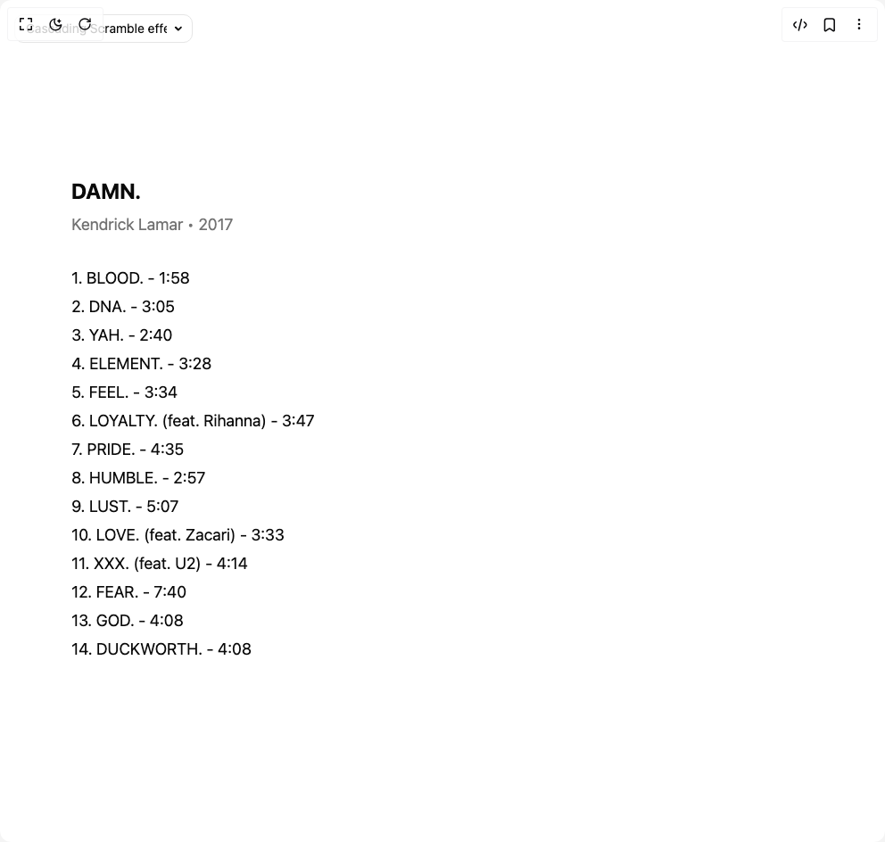

# Build Scramble Text in BuilderStudio

> Build this component in our Agentic IDE: [BuilderStudio](https://builderstudio.dev).
>
> Join the BuilderStudio community on [Discord](https://discord.gg/QdWeSGCqfe) and [Reddit](https://reddit.com/r/builderstudio).



## Component

- Author group: `deltacomponents`
- Component: `scramble-text`
- Variant: `intersection-observer-component`
- Rendered HTML snapshot: [`rendered.html`](rendered.html)

## BuilderStudio prompt

You are implementing a React component based on a component reference.

## Component identity

- Author: deltacomponents
- Component slug: scramble-text
- Demo slug: intersection-observer-component
- Title: scramble-text
- Description: 

## Goal

Recreate this component in a React + TypeScript + Tailwind CSS project. Preserve the visual layout, spacing, colors, border radius, shadows, interaction behavior, animation behavior, responsive behavior, and dark mode behavior shown in the rendered demo.

## Implementation requirements

- Use React and TypeScript.
- Use Tailwind CSS classes whenever possible.
- Keep the component self-contained unless the source files require helper components.
- If the source uses CSS variables, custom CSS, animations, or keyframes, include them.
- If the source uses external packages, list and use the required packages.
- Preserve accessibility attributes, button semantics, links, keyboard behavior, and ARIA attributes when visible in the source.
- Do not replace the component with a simplified placeholder.
- Return complete production-ready code.

## Dependencies

No reference metadata available.

## Rendered DOM snapshot

This is the rendered demo HTML extracted from the live preview. Use it to verify structure, class names, visible content, and layout.

```html
<div id="root"><div class="w-screen min-h-screen flex justify-center items-center"><div class="fixed top-4 left-4 z-10"><select class="appearance-none h-8 max-w-[200px] text-sm leading-tight rounded-lg pl-3 pr-7 py-0 border bg-background focus:outline-none focus:ring-0"><option value="Cascading Scramble effect.tsx_ScrambleTextAlbumsDemo">Cascading Scramble effect.tsx</option><option value="Intersection Observer Component.tsx_ScrambleTextIntersectionDemo">Intersection Observer Component.tsx</option><option value="default.tsx_ScrambleTextDemo">default.tsx</option></select><div class="absolute top-1/2 transform -translate-y-1/2 right-2 pointer-events-none"><svg class="w-4 h-4 fill-current" viewBox="0 0 20 20"><path d="M5.516 7.548c.436-.446 1.043-.48 1.576 0L10 10.405l2.908-2.857c.533-.48 1.14-.446 1.576 0 .436.445.408 1.197 0 1.615l-3.734 3.705c-.533.534-1.39.534-1.923 0l-3.734-3.705c-.408-.418-.436-1.17 0-1.615z"></path></svg></div></div><div class="w-screen min-h-screen flex justify-center items-center"><div class="w-full h-full flex flex-col text-sm md:text-lg lg:text-lg xl:text-xl justify-start items-start bg-background text-foreground font-normal overflow-hidden py-16 px-8 sm:px-16 md:px-20 lg:px-24 text-left"><div class="mb-8"><h2 class="text-2xl font-bold mb-2">DAMN.</h2><p class="text-muted-foreground">Kendrick Lamar • 2017</p></div><span class="sr-only">1. BLOOD. - 1:58</span><span class="inline-block whitespace-pre-wrap mb-1" aria-hidden="true"><span>1. BLOOD. - 1:58</span></span><span class="sr-only">2. DNA. - 3:05</span><span class="inline-block whitespace-pre-wrap mb-1" aria-hidden="true"><span>2. DNA. - 3:05</span></span><span class="sr-only">3. YAH. - 2:40</span><span class="inline-block whitespace-pre-wrap mb-1" aria-hidden="true"><span>3. YAH. - 2:40</span></span><span class="sr-only">4. ELEMENT. - 3:28</span><span class="inline-block whitespace-pre-wrap mb-1" aria-hidden="true"><span>4. ELEMENT. - 3:28</span></span><span class="sr-only">5. FEEL. - 3:34</span><span class="inline-block whitespace-pre-wrap mb-1" aria-hidden="true"><span>5. FEEL. - 3:34</span></span><span class="sr-only">6. LOYALTY. (feat. Rihanna) - 3:47</span><span class="inline-block whitespace-pre-wrap mb-1" aria-hidden="true"><span>6. LOYALTY. (feat. Rihanna) - 3:47</span></span><span class="sr-only">7. PRIDE. - 4:35</span><span class="inline-block whitespace-pre-wrap mb-1" aria-hidden="true"><span>7. PRIDE. - 4:35</span></span><span class="sr-only">8. HUMBLE. - 2:57</span><span class="inline-block whitespace-pre-wrap mb-1" aria-hidden="true"><span>8. HUMBLE. - 2:57</span></span><span class="sr-only">9. LUST. - 5:07</span><span class="inline-block whitespace-pre-wrap mb-1" aria-hidden="true"><span>9. LUST. - 5:07</span></span><span class="sr-only">10. LOVE. (feat. Zacari) - 3:33</span><span class="inline-block whitespace-pre-wrap mb-1" aria-hidden="true"><span>10. LOVE. (feat. Zacari) - 3:33</span></span><span class="sr-only">11. XXX. (feat. U2) - 4:14</span><span class="inline-block whitespace-pre-wrap mb-1" aria-hidden="true"><span>11. XXX. (feat. U2) - 4:14</span></span><span class="sr-only">12. FEAR. - 7:40</span><span class="inline-block whitespace-pre-wrap mb-1" aria-hidden="true"><span>12. FEAR. - 7:40</span></span><span class="sr-only">13. GOD. - 4:08</span><span class="inline-block whitespace-pre-wrap mb-1" aria-hidden="true"><span>13. GOD. - 4:08</span></span><span class="sr-only">14. DUCKWORTH. - 4:08</span><span class="inline-block whitespace-pre-wrap mb-1" aria-hidden="true"><span>14. DUCKWORTH. - 4:08</span></span></div></div></div></div>
```

## Reference source files

No reference source files were available.
