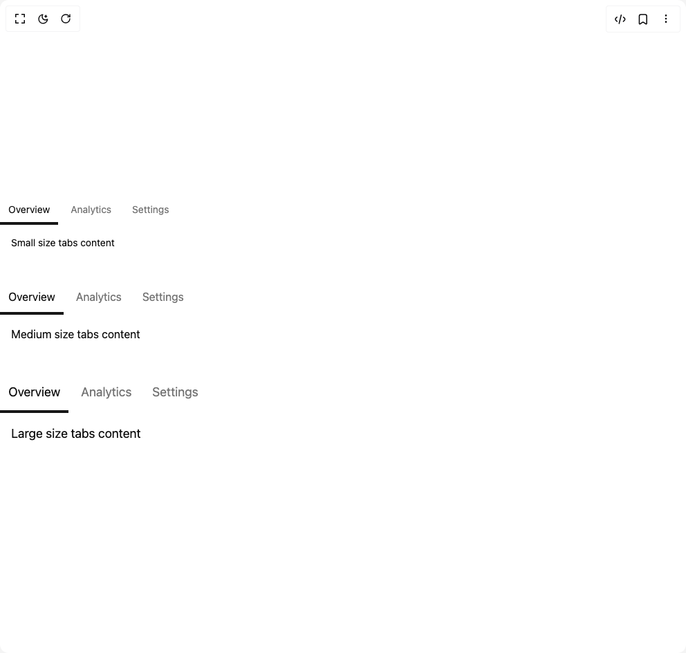

# Build Tabs 6 in BuilderStudio

> Build this component in our Agentic IDE: [BuilderStudio](https://builderstudio.dev).
>
> Join the BuilderStudio community on [Discord](https://discord.gg/QdWeSGCqfe) and [Reddit](https://reddit.com/r/builderstudio).



## Component

- Author group: `deltacomponents`
- Component: `tabs-6`
- Variant: `tabs-size-variants`
- Rendered HTML snapshot: [`rendered.html`](rendered.html)

## BuilderStudio prompt

You are implementing a React component based on a component reference.

## Component identity

- Author: deltacomponents
- Component slug: tabs-6
- Demo slug: tabs-size-variants
- Title: tabs-6
- Description: 

## Goal

Recreate this component in a React + TypeScript + Tailwind CSS project. Preserve the visual layout, spacing, colors, border radius, shadows, interaction behavior, animation behavior, responsive behavior, and dark mode behavior shown in the rendered demo.

## Implementation requirements

- Use React and TypeScript.
- Use Tailwind CSS classes whenever possible.
- Keep the component self-contained unless the source files require helper components.
- If the source uses CSS variables, custom CSS, animations, or keyframes, include them.
- If the source uses external packages, list and use the required packages.
- Preserve accessibility attributes, button semantics, links, keyboard behavior, and ARIA attributes when visible in the source.
- Do not replace the component with a simplified placeholder.
- Return complete production-ready code.

## Dependencies

No reference metadata available.

## Rendered DOM snapshot

This is the rendered demo HTML extracted from the live preview. Use it to verify structure, class names, visible content, and layout.

```html
<div id="root"><div class="w-screen min-h-screen flex justify-center items-center"><div class="w-screen min-h-screen flex justify-center items-center"><div class="space-y-8 w-full"><div class="tabs-container w-full"><div class="relative" role="tablist" aria-label="Tabs"><div class="relative"><style>
          .x-scrollbar-hide { scrollbar-width: none; -ms-overflow-style: none; }
          .x-scrollbar-hide::-webkit-scrollbar { display: none; }
        </style><div class="overflow-x-auto overflow-y-hidden whitespace-nowrap x-scrollbar-hide" role="group" aria-label="Horizontal scroll area"><div class="relative"><div class="absolute transition-all duration-300 ease-out flex items-center z-0 h-[32px] text-sm bg-muted dark:bg-muted rounded-[6px]" aria-hidden="true" style="opacity: 0; transition: 300ms ease-out;"></div><div class="relative flex items-center space-x-[6px]"><div class="px-3 py-2 sm:mb-1.5 mb-2 cursor-pointer transition-colors duration-300 h-[32px] text-sm text-foreground dark:text-foreground" role="tab" aria-selected="true" aria-controls="tabpanel-overview" id="tab-overview" tabindex="0"><div class="whitespace-nowrap flex items-center justify-center h-full"><div>Overview</div></div></div><div class="px-3 py-2 sm:mb-1.5 mb-2 cursor-pointer transition-colors duration-300 h-[32px] text-sm text-muted-foreground dark:text-muted-foreground" role="tab" aria-selected="false" aria-controls="tabpanel-analytics" id="tab-analytics" tabindex="-1"><div class="whitespace-nowrap flex items-center justify-center h-full"><div>Analytics</div></div></div><div class="px-3 py-2 sm:mb-1.5 mb-2 cursor-pointer transition-colors duration-300 h-[32px] text-sm text-muted-foreground dark:text-muted-foreground" role="tab" aria-selected="false" aria-controls="tabpanel-settings" id="tab-settings" tabindex="-1"><div class="whitespace-nowrap flex items-center justify-center h-full"><div>Settings</div></div></div></div><div class="absolute transition-all duration-300 ease-out z-10 h-[4px] bg-primary dark:bg-primary bottom-[-1px]" aria-hidden="true" style="left: 0px; width: 84px; bottom: 0px;"></div></div></div></div></div><div role="tabpanel" id="tabpanel-overview" aria-labelledby="tab-overview"><div class="p-4 text-sm">Small size tabs content</div></div></div><div class="tabs-container w-full"><div class="relative" role="tablist" aria-label="Tabs"><div class="relative"><style>
          .x-scrollbar-hide { scrollbar-width: none; -ms-overflow-style: none; }
          .x-scrollbar-hide::-webkit-scrollbar { display: none; }
        </style><div class="overflow-x-auto overflow-y-hidden whitespace-nowrap x-scrollbar-hide" role="group" aria-label="Horizontal scroll area"><div class="relative"><div class="absolute transition-all duration-300 ease-out flex items-center z-0 h-[40px] text-base bg-muted dark:bg-muted rounded-[6px]" aria-hidden="true" style="opacity: 0; transition: 300ms ease-out;"></div><div class="relative flex items-center space-x-[6px]"><div class="px-3 py-2 sm:mb-1.5 mb-2 cursor-pointer transition-colors duration-300 h-[40px] text-base text-foreground dark:text-foreground" role="tab" aria-selected="true" aria-controls="tabpanel-overview" id="tab-overview" tabindex="0"><div class="whitespace-nowrap flex items-center justify-center h-full"><div>Overview</div></div></div><div class="px-3 py-2 sm:mb-1.5 mb-2 cursor-pointer transition-colors duration-300 h-[40px] text-base text-muted-foreground dark:text-muted-foreground" role="tab" aria-selected="false" aria-controls="tabpanel-analytics" id="tab-analytics" tabindex="-1"><div class="whitespace-nowrap flex items-center justify-center h-full"><div>Analytics</div></div></div><div class="px-3 py-2 sm:mb-1.5 mb-2 cursor-pointer transition-colors duration-300 h-[40px] text-base text-muted-foreground dark:text-muted-foreground" role="tab" aria-selected="false" aria-controls="tabpanel-settings" id="tab-settings" tabindex="-1"><div class="whitespace-nowrap flex items-center justify-center h-full"><div>Settings</div></div></div></div><div class="absolute transition-all duration-300 ease-out z-10 h-[4px] bg-primary dark:bg-primary bottom-[-1px]" aria-hidden="true" style="left: 0px; width: 92px; bottom: 0px;"></div></div></div></div></div><div role="tabpanel" id="tabpanel-overview" aria-labelledby="tab-overview"><div class="p-4">Medium size tabs content</div></div></div><div class="tabs-container w-full"><div class="relative" role="tablist" aria-label="Tabs"><div class="relative"><style>
          .x-scrollbar-hide { scrollbar-width: none; -ms-overflow-style: none; }
          .x-scrollbar-hide::-webkit-scrollbar { display: none; }
        </style><div class="overflow-x-auto overflow-y-hidden whitespace-nowrap x-scrollbar-hide" role="group" aria-label="Horizontal scroll area"><div class="relative"><div class="absolute transition-all duration-300 ease-out flex items-center z-0 h-[48px] text-lg bg-muted dark:bg-muted rounded-[6px]" aria-hidden="true" style="opacity: 0; transition: 300ms ease-out;"></div><div class="relative flex items-center space-x-[6px]"><div class="px-3 py-2 sm:mb-1.5 mb-2 cursor-pointer transition-colors duration-300 h-[48px] text-lg text-foreground dark:text-foreground" role="tab" aria-selected="true" aria-controls="tabpanel-overview" id="tab-overview" tabindex="0"><div class="whitespace-nowrap flex items-center justify-center h-full"><div>Overview</div></div></div><div class="px-3 py-2 sm:mb-1.5 mb-2 cursor-pointer transition-colors duration-300 h-[48px] text-lg text-muted-foreground dark:text-muted-foreground" role="tab" aria-selected="false" aria-controls="tabpanel-analytics" id="tab-analytics" tabindex="-1"><div class="whitespace-nowrap flex items-center justify-center h-full"><div>Analytics</div></div></div><div class="px-3 py-2 sm:mb-1.5 mb-2 cursor-pointer transition-colors duration-300 h-[48px] text-lg text-muted-foreground dark:text-muted-foreground" role="tab" aria-selected="false" aria-controls="tabpanel-settings" id="tab-settings" tabindex="-1"><div class="whitespace-nowrap flex items-center justify-center h-full"><div>Settings</div></div></div></div><div class="absolute transition-all duration-300 ease-out z-10 h-[4px] bg-primary dark:bg-primary bottom-[-1px]" aria-hidden="true" style="left: 0px; width: 99px; bottom: 0px;"></div></div></div></div></div><div role="tabpanel" id="tabpanel-overview" aria-labelledby="tab-overview"><div class="p-4 text-lg">Large size tabs content</div></div></div></div></div></div></div>
```

## Reference source files

No reference source files were available.
