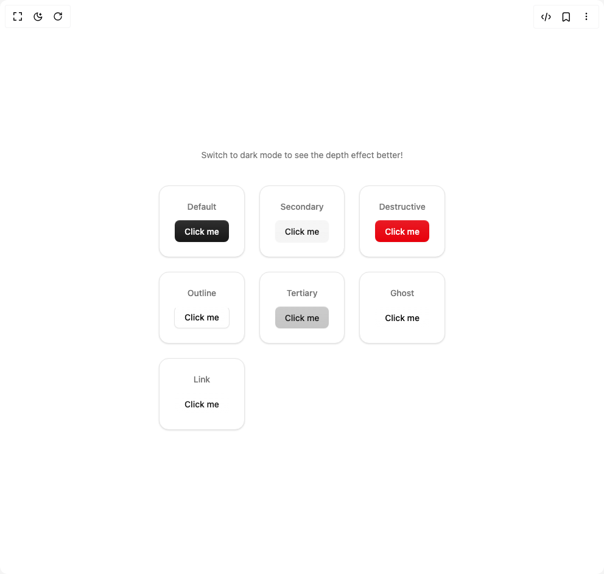

# Build Depth Button in BuilderStudio

> Build this component in our Agentic IDE: [BuilderStudio](https://builderstudio.dev).
>
> Join the BuilderStudio community on [Discord](https://discord.gg/QdWeSGCqfe) and [Reddit](https://reddit.com/r/builderstudio).



## Component

- Author group: `devetaigabbai`
- Component: `depth-button`
- Variant: `default`
- Rendered HTML snapshot: [`rendered.html`](rendered.html)

## BuilderStudio prompt

You are implementing a React component based on a component reference.

## Component identity

- Author: devetaigabbai
- Component slug: depth-button
- Demo slug: default
- Title: depth-button
- Description: 

## Goal

Recreate this component in a React + TypeScript + Tailwind CSS project. Preserve the visual layout, spacing, colors, border radius, shadows, interaction behavior, animation behavior, responsive behavior, and dark mode behavior shown in the rendered demo.

## Implementation requirements

- Use React and TypeScript.
- Use Tailwind CSS classes whenever possible.
- Keep the component self-contained unless the source files require helper components.
- If the source uses CSS variables, custom CSS, animations, or keyframes, include them.
- If the source uses external packages, list and use the required packages.
- Preserve accessibility attributes, button semantics, links, keyboard behavior, and ARIA attributes when visible in the source.
- Do not replace the component with a simplified placeholder.
- Return complete production-ready code.

## Dependencies

No reference metadata available.

## Rendered DOM snapshot

This is the rendered demo HTML extracted from the live preview. Use it to verify structure, class names, visible content, and layout.

```html
<div id="root"><div class="w-screen min-h-screen flex justify-center items-center"><div class="w-screen min-h-screen flex justify-center items-center"><div class="flex flex-col items-center justify-center p-8 gap-10"><p class="mt-2 text-sm text-muted-foreground animate-pulse dark:hidden">Switch to dark mode to see the depth effect better!</p><div class="grid gap-6 sm:grid-cols-2 md:grid-cols-3 lg:grid-cols-4 xl:grid-cols-5"><div class="flex flex-col items-center justify-center gap-3 border border-border rounded-2xl p-6 bg-background shadow-sm hover:shadow-md transition-shadow"><span class="text-sm font-medium text-muted-foreground capitalize">default</span><button data-slot="button" class="inline-flex items-center justify-center gap-2 whitespace-nowrap rounded-md text-sm font-medium transition-all disabled:pointer-events-none disabled:opacity-50 [&amp;_svg]:pointer-events-none [&amp;_svg:not([class*='size-'])]:size-4 shrink-0 [&amp;_svg]:shrink-0 outline-none focus-visible:border-ring focus-visible:ring-ring/50 focus-visible:ring-[3px] aria-invalid:ring-destructive/20 dark:aria-invalid:ring-destructive/40 aria-invalid:border-destructive bg-primary text-primary-foreground shadow-xs hover:bg-primary/90 shine-large h-9 px-4 py-2 has-[&gt;svg]:px-3">Click me</button></div><div class="flex flex-col items-center justify-center gap-3 border border-border rounded-2xl p-6 bg-background shadow-sm hover:shadow-md transition-shadow"><span class="text-sm font-medium text-muted-foreground capitalize">secondary</span><button data-slot="button" class="inline-flex items-center justify-center gap-2 whitespace-nowrap rounded-md text-sm font-medium transition-all disabled:pointer-events-none disabled:opacity-50 [&amp;_svg]:pointer-events-none [&amp;_svg:not([class*='size-'])]:size-4 shrink-0 [&amp;_svg]:shrink-0 outline-none focus-visible:border-ring focus-visible:ring-ring/50 focus-visible:ring-[3px] aria-invalid:ring-destructive/20 dark:aria-invalid:ring-destructive/40 aria-invalid:border-destructive bg-secondary text-secondary-foreground shadow-xs hover:bg-secondary/80 shine-large h-9 px-4 py-2 has-[&gt;svg]:px-3">Click me</button></div><div class="flex flex-col items-center justify-center gap-3 border border-border rounded-2xl p-6 bg-background shadow-sm hover:shadow-md transition-shadow"><span class="text-sm font-medium text-muted-foreground capitalize">destructive</span><button data-slot="button" class="inline-flex items-center justify-center gap-2 whitespace-nowrap rounded-md text-sm font-medium transition-all disabled:pointer-events-none disabled:opacity-50 [&amp;_svg]:pointer-events-none [&amp;_svg:not([class*='size-'])]:size-4 shrink-0 [&amp;_svg]:shrink-0 outline-none focus-visible:border-ring focus-visible:ring-[3px] aria-invalid:ring-destructive/20 dark:aria-invalid:ring-destructive/40 aria-invalid:border-destructive bg-destructive text-white shadow-xs hover:bg-destructive/90 focus-visible:ring-destructive/20 dark:focus-visible:ring-destructive/40 dark:bg-destructive/60 shine-large h-9 px-4 py-2 has-[&gt;svg]:px-3">Click me</button></div><div class="flex flex-col items-center justify-center gap-3 border border-border rounded-2xl p-6 bg-background shadow-sm hover:shadow-md transition-shadow"><span class="text-sm font-medium text-muted-foreground capitalize">outline</span><button data-slot="button" class="inline-flex items-center justify-center gap-2 whitespace-nowrap rounded-md text-sm font-medium transition-all disabled:pointer-events-none disabled:opacity-50 [&amp;_svg]:pointer-events-none [&amp;_svg:not([class*='size-'])]:size-4 shrink-0 [&amp;_svg]:shrink-0 outline-none focus-visible:border-ring focus-visible:ring-ring/50 focus-visible:ring-[3px] aria-invalid:ring-destructive/20 dark:aria-invalid:ring-destructive/40 aria-invalid:border-destructive border bg-background shadow-xs hover:bg-accent hover:text-accent-foreground dark:bg-input/30 dark:border-input dark:hover:bg-input/50 shine-large h-9 px-4 py-2 has-[&gt;svg]:px-3">Click me</button></div><div class="flex flex-col items-center justify-center gap-3 border border-border rounded-2xl p-6 bg-background shadow-sm hover:shadow-md transition-shadow"><span class="text-sm font-medium text-muted-foreground capitalize">tertiary</span><button data-slot="button" class="inline-flex items-center justify-center gap-2 whitespace-nowrap rounded-md text-sm font-medium transition-all disabled:pointer-events-none disabled:opacity-50 [&amp;_svg]:pointer-events-none [&amp;_svg:not([class*='size-'])]:size-4 shrink-0 [&amp;_svg]:shrink-0 outline-none focus-visible:border-ring focus-visible:ring-ring/50 focus-visible:ring-[3px] aria-invalid:ring-destructive/20 dark:aria-invalid:ring-destructive/40 aria-invalid:border-destructive bg-primary/25 dark:bg-primary/30 text-primary shadow-xs hover:bg-primary/20 dark:hover:bg-primary/25 shine-large h-9 px-4 py-2 has-[&gt;svg]:px-3">Click me</button></div><div class="flex flex-col items-center justify-center gap-3 border border-border rounded-2xl p-6 bg-background shadow-sm hover:shadow-md transition-shadow"><span class="text-sm font-medium text-muted-foreground capitalize">ghost</span><button data-slot="button" class="inline-flex items-center justify-center gap-2 whitespace-nowrap rounded-md text-sm font-medium transition-all disabled:pointer-events-none disabled:opacity-50 [&amp;_svg]:pointer-events-none [&amp;_svg:not([class*='size-'])]:size-4 shrink-0 [&amp;_svg]:shrink-0 outline-none focus-visible:border-ring focus-visible:ring-ring/50 focus-visible:ring-[3px] aria-invalid:ring-destructive/20 dark:aria-invalid:ring-destructive/40 aria-invalid:border-destructive hover:bg-accent hover:text-accent-foreground dark:hover:bg-accent/50 shine-large h-9 px-4 py-2 has-[&gt;svg]:px-3">Click me</button></div><div class="flex flex-col items-center justify-center gap-3 border border-border rounded-2xl p-6 bg-background shadow-sm hover:shadow-md transition-shadow"><span class="text-sm font-medium text-muted-foreground capitalize">link</span><button data-slot="button" class="inline-flex items-center justify-center gap-2 whitespace-nowrap rounded-md text-sm font-medium transition-all disabled:pointer-events-none disabled:opacity-50 [&amp;_svg]:pointer-events-none [&amp;_svg:not([class*='size-'])]:size-4 shrink-0 [&amp;_svg]:shrink-0 outline-none focus-visible:border-ring focus-visible:ring-ring/50 focus-visible:ring-[3px] aria-invalid:ring-destructive/20 dark:aria-invalid:ring-destructive/40 aria-invalid:border-destructive text-primary underline-offset-4 hover:underline shine-large h-9 px-4 py-2 has-[&gt;svg]:px-3">Click me</button></div></div></div></div></div></div>
```

## Reference source files

No reference source files were available.
