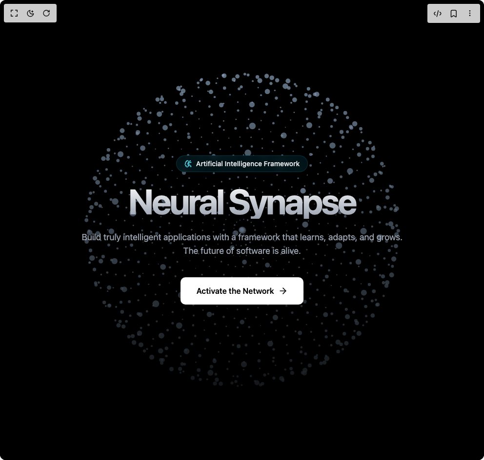

# Build Neurons Hero in BuilderStudio

> Build this component in our Agentic IDE: [BuilderStudio](https://builderstudio.dev).
>
> Join the BuilderStudio community on [Discord](https://discord.gg/QdWeSGCqfe) and [Reddit](https://reddit.com/r/builderstudio).



## Component

- Author group: `dhiluxui`
- Component: `neurons-hero`
- Variant: `default`
- Rendered HTML snapshot: [`rendered.html`](rendered.html)

## BuilderStudio prompt

You are implementing a React component based on a component reference.

## Component identity

- Author: dhiluxui
- Component slug: neurons-hero
- Demo slug: default
- Title: neurons-hero
- Description: 

## Goal

Recreate this component in a React + TypeScript + Tailwind CSS project. Preserve the visual layout, spacing, colors, border radius, shadows, interaction behavior, animation behavior, responsive behavior, and dark mode behavior shown in the rendered demo.

## Implementation requirements

- Use React and TypeScript.
- Use Tailwind CSS classes whenever possible.
- Keep the component self-contained unless the source files require helper components.
- If the source uses CSS variables, custom CSS, animations, or keyframes, include them.
- If the source uses external packages, list and use the required packages.
- Preserve accessibility attributes, button semantics, links, keyboard behavior, and ARIA attributes when visible in the source.
- Do not replace the component with a simplified placeholder.
- Return complete production-ready code.

## Dependencies

No reference metadata available.

## Rendered DOM snapshot

This is the rendered demo HTML extracted from the live preview. Use it to verify structure, class names, visible content, and layout.

```html
<div id="root"><div class="w-screen min-h-screen flex justify-center items-center"><div class="w-screen min-h-screen flex justify-center items-center"><main class="App bg-black"><div class="relative h-screen w-full flex flex-col items-center justify-center overflow-hidden"><canvas class="absolute inset-0 z-0 w-full h-full bg-black" width="992" height="944"></canvas><div class="absolute inset-0 bg-gradient-to-t from-black via-black/50 to-transparent z-10"></div><div class="relative z-20 text-center p-6"><div class="inline-flex items-center gap-2 px-4 py-1.5 rounded-full bg-cyan-500/10 border border-cyan-500/20 mb-6 backdrop-blur-sm" style="opacity: 1; transform: none;"><svg xmlns="http://www.w3.org/2000/svg" width="24" height="24" viewBox="0 0 24 24" fill="none" stroke="currentColor" stroke-width="2" stroke-linecap="round" stroke-linejoin="round" class="lucide lucide-brain-circuit h-4 w-4 text-cyan-300" aria-hidden="true"><path d="M12 5a3 3 0 1 0-5.997.125 4 4 0 0 0-2.526 5.77 4 4 0 0 0 .556 6.588A4 4 0 1 0 12 18Z"></path><path d="M9 13a4.5 4.5 0 0 0 3-4"></path><path d="M6.003 5.125A3 3 0 0 0 6.401 6.5"></path><path d="M3.477 10.896a4 4 0 0 1 .585-.396"></path><path d="M6 18a4 4 0 0 1-1.967-.516"></path><path d="M12 13h4"></path><path d="M12 18h6a2 2 0 0 1 2 2v1"></path><path d="M12 8h8"></path><path d="M16 8V5a2 2 0 0 1 2-2"></path><circle cx="16" cy="13" r=".5"></circle><circle cx="18" cy="3" r=".5"></circle><circle cx="20" cy="21" r=".5"></circle><circle cx="20" cy="8" r=".5"></circle></svg><span class="text-sm font-medium text-gray-200">Artificial Intelligence Framework</span></div><h1 class="text-5xl md:text-7xl font-bold tracking-tighter mb-6 bg-clip-text text-transparent bg-gradient-to-b from-white to-gray-400" style="opacity: 1; transform: none;">Neural Synapse</h1><p class="max-w-2xl mx-auto text-lg text-gray-400 mb-10" style="opacity: 1; transform: none;">Build truly intelligent applications with a framework that learns, adapts, and grows. The future of software is alive.</p><div style="opacity: 1; transform: none;"><button class="px-8 py-4 bg-white text-black font-semibold rounded-lg shadow-lg hover:bg-gray-200 transition-colors duration-300 flex items-center gap-2 mx-auto">Activate the Network<svg xmlns="http://www.w3.org/2000/svg" width="24" height="24" viewBox="0 0 24 24" fill="none" stroke="currentColor" stroke-width="2" stroke-linecap="round" stroke-linejoin="round" class="lucide lucide-arrow-right h-5 w-5" aria-hidden="true"><path d="M5 12h14"></path><path d="m12 5 7 7-7 7"></path></svg></button></div></div></div></main></div></div></div>
```

## Reference source files

No reference source files were available.
