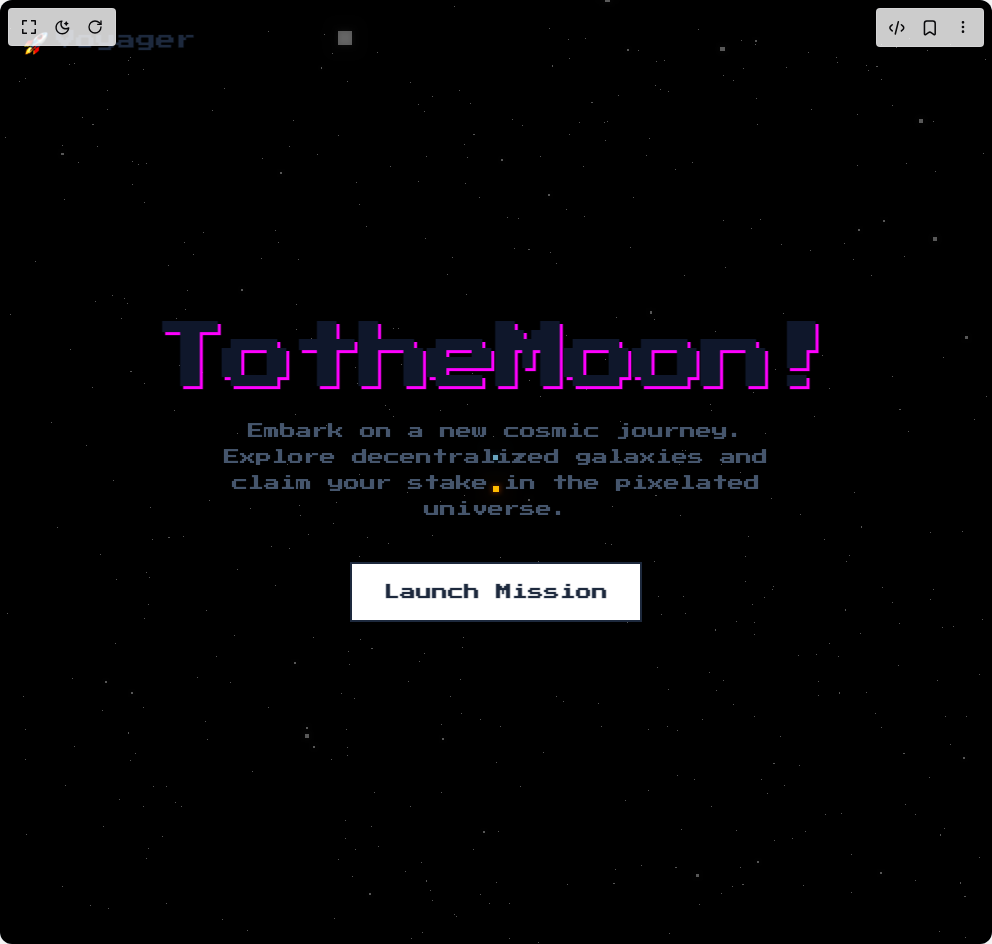

# Build Pixel Rocket Voyager in BuilderStudio

> Build this component in our Agentic IDE: [BuilderStudio](https://builderstudio.dev).
>
> Join the BuilderStudio community on [Discord](https://discord.gg/QdWeSGCqfe) and [Reddit](https://reddit.com/r/builderstudio).



## Component

- Author group: `dhiluxui`
- Component: `pixel-rocket-voyager`
- Variant: `default`
- Rendered HTML snapshot: [`rendered.html`](rendered.html)

## BuilderStudio prompt

You are implementing a React component based on a component reference.

## Component identity

- Author: dhiluxui
- Component slug: pixel-rocket-voyager
- Demo slug: default
- Title: pixel-rocket-voyager
- Description: 

## Goal

Recreate this component in a React + TypeScript + Tailwind CSS project. Preserve the visual layout, spacing, colors, border radius, shadows, interaction behavior, animation behavior, responsive behavior, and dark mode behavior shown in the rendered demo.

## Implementation requirements

- Use React and TypeScript.
- Use Tailwind CSS classes whenever possible.
- Keep the component self-contained unless the source files require helper components.
- If the source uses CSS variables, custom CSS, animations, or keyframes, include them.
- If the source uses external packages, list and use the required packages.
- Preserve accessibility attributes, button semantics, links, keyboard behavior, and ARIA attributes when visible in the source.
- Do not replace the component with a simplified placeholder.
- Return complete production-ready code.

## Dependencies

No reference metadata available.

## Rendered DOM snapshot

This is the rendered demo HTML extracted from the live preview. Use it to verify structure, class names, visible content, and layout.

```html
<div id="root"><div class="w-screen min-h-screen flex justify-center items-center"><div class="w-screen min-h-screen flex justify-center items-center"><div class="relative flex h-screen w-full flex-col items-center justify-center overflow-hidden bg-sky-100 dark:bg-[#1a0033]" style="font-family: &quot;Press Start 2P&quot;, system-ui;"><div class="absolute inset-0 z-0"><canvas data-engine="three.js r179" width="992" height="944" style="display: block; width: 992px; height: 944px;"></canvas></div><nav class="absolute top-0 left-0 right-0 z-20 p-6" style="opacity: 1;"><div class="max-w-7xl mx-auto flex justify-between items-center"><div class="flex items-center gap-2"><span class="text-2xl font-bold text-cyan-500 dark:text-cyan-300">🚀</span><span class="text-xl font-bold text-slate-800 dark:text-white">Voyager</span></div></div></nav><div class="relative z-10 text-center px-4"><h1 class="text-5xl font-bold tracking-tighter text-slate-900 dark:text-white md:text-7xl" style="text-shadow: rgb(255, 0, 255) 3px 3px 0px;"><span style="display: inline-block; opacity: 1; transform: none;">T</span><span style="display: inline-block; opacity: 1; transform: none;">o</span><span style="display: inline-block; opacity: 1; transform: none;"> </span><span style="display: inline-block; opacity: 1; transform: none;">t</span><span style="display: inline-block; opacity: 1; transform: none;">h</span><span style="display: inline-block; opacity: 1; transform: none;">e</span><span style="display: inline-block; opacity: 1; transform: none;"> </span><span style="display: inline-block; opacity: 1; transform: none;">M</span><span style="display: inline-block; opacity: 1; transform: none;">o</span><span style="display: inline-block; opacity: 1; transform: none;">o</span><span style="display: inline-block; opacity: 1; transform: none;">n</span><span style="display: inline-block; opacity: 1; transform: none;">!</span></h1><p class="mx-auto mt-6 max-w-xl text-base leading-relaxed text-slate-600 dark:text-slate-300" style="opacity: 1; transform: none;">Embark on a new cosmic journey. Explore decentralized galaxies and claim your stake in the pixelated universe.</p><div class="mt-10" style="opacity: 1;"><button class="rounded-none border-2 border-slate-800 bg-white px-8 py-4 font-semibold text-slate-800 transition-all hover:bg-slate-200 dark:border-white dark:bg-black dark:text-white dark:hover:bg-white dark:hover:text-black">Launch Mission</button></div></div></div></div></div></div>
```

## Reference source files

No reference source files were available.
