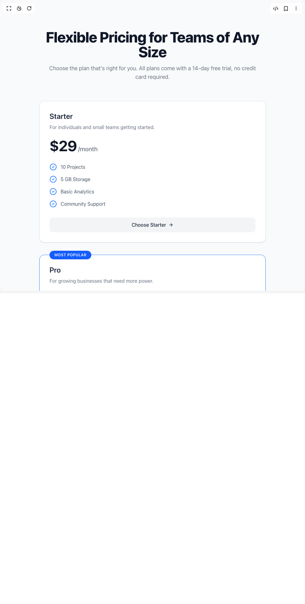

# Build Pricing For Teams in BuilderStudio

> Build this component in our Agentic IDE: [BuilderStudio](https://builderstudio.dev).
>
> Join the BuilderStudio community on [Discord](https://discord.gg/QdWeSGCqfe) and [Reddit](https://reddit.com/r/builderstudio).



## Component

- Author group: `dhiluxui`
- Component: `pricing-for-teams`
- Variant: `default`
- Rendered HTML snapshot: [`rendered.html`](rendered.html)

## BuilderStudio prompt

You are implementing a React component based on a component reference.

## Component identity

- Author: dhiluxui
- Component slug: pricing-for-teams
- Demo slug: default
- Title: pricing-for-teams
- Description: 

## Goal

Recreate this component in a React + TypeScript + Tailwind CSS project. Preserve the visual layout, spacing, colors, border radius, shadows, interaction behavior, animation behavior, responsive behavior, and dark mode behavior shown in the rendered demo.

## Implementation requirements

- Use React and TypeScript.
- Use Tailwind CSS classes whenever possible.
- Keep the component self-contained unless the source files require helper components.
- If the source uses CSS variables, custom CSS, animations, or keyframes, include them.
- If the source uses external packages, list and use the required packages.
- Preserve accessibility attributes, button semantics, links, keyboard behavior, and ARIA attributes when visible in the source.
- Do not replace the component with a simplified placeholder.
- Return complete production-ready code.

## Dependencies

No reference metadata available.

## Rendered DOM snapshot

This is the rendered demo HTML extracted from the live preview. Use it to verify structure, class names, visible content, and layout.

```html
<div id="root"><div class="w-screen min-h-screen flex justify-center items-center"><div class="w-screen min-h-screen flex justify-center items-center"><div class="min-h-screen w-full bg-gray-50 font-sans text-gray-900 antialiased dark:bg-gray-900"><div class="container mx-auto px-4 py-16 sm:py-24"><header class="mb-16 text-center"><h1 class="text-4xl font-extrabold tracking-tight text-gray-900 sm:text-5xl dark:text-white">Flexible Pricing for Teams of Any Size</h1><p class="mx-auto mt-4 max-w-2xl text-lg text-gray-500 dark:text-gray-400">Choose the plan that's right for you. All plans come with a 14-day free trial, no credit card required.</p></header><div class="mx-auto grid max-w-7xl grid-cols-1 gap-10 lg:grid-cols-3"><div class="
    relative flex flex-col h-full p-8 bg-white rounded-2xl shadow-sm border
    border-gray-200
    dark:bg-gray-800 dark:border-gray-700
    
  "><div class="flex-grow"><h3 class="text-2xl font-semibold text-gray-800 dark:text-white">Starter</h3><p class="mt-2 text-gray-500 dark:text-gray-400">For individuals and small teams getting started.</p><div class="mt-6"><span class="text-5xl font-bold tracking-tight text-gray-900 dark:text-white">$29</span><span class="ml-1 text-xl font-medium text-gray-500 dark:text-gray-400">/month</span></div><ul class="mt-8 space-y-4"><li class="flex items-start"><svg xmlns="http://www.w3.org/2000/svg" width="24" height="24" viewBox="0 0 24 24" fill="none" stroke="currentColor" stroke-width="2" stroke-linecap="round" stroke-linejoin="round" class="lucide lucide-circle-check h-6 w-6 flex-shrink-0 text-blue-500" aria-hidden="true"><circle cx="12" cy="12" r="10"></circle><path d="m9 12 2 2 4-4"></path></svg><span class="ml-3 text-base text-gray-600 dark:text-gray-300">10 Projects</span></li><li class="flex items-start"><svg xmlns="http://www.w3.org/2000/svg" width="24" height="24" viewBox="0 0 24 24" fill="none" stroke="currentColor" stroke-width="2" stroke-linecap="round" stroke-linejoin="round" class="lucide lucide-circle-check h-6 w-6 flex-shrink-0 text-blue-500" aria-hidden="true"><circle cx="12" cy="12" r="10"></circle><path d="m9 12 2 2 4-4"></path></svg><span class="ml-3 text-base text-gray-600 dark:text-gray-300">5 GB Storage</span></li><li class="flex items-start"><svg xmlns="http://www.w3.org/2000/svg" width="24" height="24" viewBox="0 0 24 24" fill="none" stroke="currentColor" stroke-width="2" stroke-linecap="round" stroke-linejoin="round" class="lucide lucide-circle-check h-6 w-6 flex-shrink-0 text-blue-500" aria-hidden="true"><circle cx="12" cy="12" r="10"></circle><path d="m9 12 2 2 4-4"></path></svg><span class="ml-3 text-base text-gray-600 dark:text-gray-300">Basic Analytics</span></li><li class="flex items-start"><svg xmlns="http://www.w3.org/2000/svg" width="24" height="24" viewBox="0 0 24 24" fill="none" stroke="currentColor" stroke-width="2" stroke-linecap="round" stroke-linejoin="round" class="lucide lucide-circle-check h-6 w-6 flex-shrink-0 text-blue-500" aria-hidden="true"><circle cx="12" cy="12" r="10"></circle><path d="m9 12 2 2 4-4"></path></svg><span class="ml-3 text-base text-gray-600 dark:text-gray-300">Community Support</span></li></ul></div><div class="mt-8"><a href="#starter" class="
    inline-flex items-center justify-center w-full px-5 py-3 font-medium rounded-lg text-center
    transition-colors duration-200
    bg-gray-100 text-gray-800 hover:bg-gray-200 dark:bg-gray-700 dark:text-gray-200 dark:hover:bg-gray-600
  ">Choose Starter<svg xmlns="http://www.w3.org/2000/svg" width="24" height="24" viewBox="0 0 24 24" fill="none" stroke="currentColor" stroke-width="2" stroke-linecap="round" stroke-linejoin="round" class="lucide lucide-arrow-right ml-2 h-4 w-4" aria-hidden="true"><path d="M5 12h14"></path><path d="m12 5 7 7-7 7"></path></svg></a></div></div><div class="
    relative flex flex-col h-full p-8 bg-white rounded-2xl shadow-sm border
    border-blue-500
    dark:bg-gray-800 dark:border-gray-700
    dark:border-blue-500
  "><div class="absolute top-0 -translate-y-1/2 rounded-full bg-blue-600 px-4 py-1.5 text-xs font-semibold uppercase tracking-wider text-white">Most Popular</div><div class="flex-grow"><h3 class="text-2xl font-semibold text-gray-800 dark:text-white">Pro</h3><p class="mt-2 text-gray-500 dark:text-gray-400">For growing businesses that need more power.</p><div class="mt-6"><span class="text-5xl font-bold tracking-tight text-gray-900 dark:text-white">$99</span><span class="ml-1 text-xl font-medium text-gray-500 dark:text-gray-400">/month</span></div><ul class="mt-8 space-y-4"><li class="flex items-start"><svg xmlns="http://www.w3.org/2000/svg" width="24" height="24" viewBox="0 0 24 24" fill="none" stroke="currentColor" stroke-width="2" stroke-linecap="round" stroke-linejoin="round" class="lucide lucide-circle-check h-6 w-6 flex-shrink-0 text-blue-500" aria-hidden="true"><circle cx="12" cy="12" r="10"></circle><path d="m9 12 2 2 4-4"></path></svg><span class="ml-3 text-base text-gray-600 dark:text-gray-300">Unlimited Projects</span></li><li class="flex items-start"><svg xmlns="http://www.w3.org/2000/svg" width="24" height="24" viewBox="0 0 24 24" fill="none" stroke="currentColor" stroke-width="2" stroke-linecap="round" stroke-linejoin="round" class="lucide lucide-circle-check h-6 w-6 flex-shrink-0 text-blue-500" aria-hidden="true"><circle cx="12" cy="12" r="10"></circle><path d="m9 12 2 2 4-4"></path></svg><span class="ml-3 text-base text-gray-600 dark:text-gray-300">100 GB Storage</span></li><li class="flex items-start"><svg xmlns="http://www.w3.org/2000/svg" width="24" height="24" viewBox="0 0 24 24" fill="none" stroke="currentColor" stroke-width="2" stroke-linecap="round" stroke-linejoin="round" class="lucide lucide-circle-check h-6 w-6 flex-shrink-0 text-blue-500" aria-hidden="true"><circle cx="12" cy="12" r="10"></circle><path d="m9 12 2 2 4-4"></path></svg><span class="ml-3 text-base text-gray-600 dark:text-gray-300">Advanced Analytics</span></li><li class="flex items-start"><svg xmlns="http://www.w3.org/2000/svg" width="24" height="24" viewBox="0 0 24 24" fill="none" stroke="currentColor" stroke-width="2" stroke-linecap="round" stroke-linejoin="round" class="lucide lucide-circle-check h-6 w-6 flex-shrink-0 text-blue-500" aria-hidden="true"><circle cx="12" cy="12" r="10"></circle><path d="m9 12 2 2 4-4"></path></svg><span class="ml-3 text-base text-gray-600 dark:text-gray-300">Priority Email Support</span></li><li class="flex items-start"><svg xmlns="http://www.w3.org/2000/svg" width="24" height="24" viewBox="0 0 24 24" fill="none" stroke="currentColor" stroke-width="2" stroke-linecap="round" stroke-linejoin="round" class="lucide lucide-circle-check h-6 w-6 flex-shrink-0 text-blue-500" aria-hidden="true"><circle cx="12" cy="12" r="10"></circle><path d="m9 12 2 2 4-4"></path></svg><span class="ml-3 text-base text-gray-600 dark:text-gray-300">API Access</span></li></ul></div><div class="mt-8"><a href="#pro" class="
    inline-flex items-center justify-center w-full px-5 py-3 font-medium rounded-lg text-center
    transition-colors duration-200
    bg-blue-600 text-white hover:bg-blue-700
  ">Choose Pro<svg xmlns="http://www.w3.org/2000/svg" width="24" height="24" viewBox="0 0 24 24" fill="none" stroke="currentColor" stroke-width="2" stroke-linecap="round" stroke-linejoin="round" class="lucide lucide-arrow-right ml-2 h-4 w-4" aria-hidden="true"><path d="M5 12h14"></path><path d="m12 5 7 7-7 7"></path></svg></a></div></div><div class="
    relative flex flex-col h-full p-8 bg-white rounded-2xl shadow-sm border
    border-gray-200
    dark:bg-gray-800 dark:border-gray-700
    
  "><div class="flex-grow"><h3 class="text-2xl font-semibold text-gray-800 dark:text-white">Enterprise</h3><p class="mt-2 text-gray-500 dark:text-gray-400">For large organizations with custom needs.</p><div class="mt-6"><span class="text-5xl font-bold tracking-tight text-gray-900 dark:text-white">$Custom</span><span class="ml-1 text-xl font-medium text-gray-500 dark:text-gray-400"></span></div><ul class="mt-8 space-y-4"><li class="flex items-start"><svg xmlns="http://www.w3.org/2000/svg" width="24" height="24" viewBox="0 0 24 24" fill="none" stroke="currentColor" stroke-width="2" stroke-linecap="round" stroke-linejoin="round" class="lucide lucide-circle-check h-6 w-6 flex-shrink-0 text-blue-500" aria-hidden="true"><circle cx="12" cy="12" r="10"></circle><path d="m9 12 2 2 4-4"></path></svg><span class="ml-3 text-base text-gray-600 dark:text-gray-300">Everything in Pro</span></li><li class="flex items-start"><svg xmlns="http://www.w3.org/2000/svg" width="24" height="24" viewBox="0 0 24 24" fill="none" stroke="currentColor" stroke-width="2" stroke-linecap="round" stroke-linejoin="round" class="lucide lucide-circle-check h-6 w-6 flex-shrink-0 text-blue-500" aria-hidden="true"><circle cx="12" cy="12" r="10"></circle><path d="m9 12 2 2 4-4"></path></svg><span class="ml-3 text-base text-gray-600 dark:text-gray-300">Dedicated Account Manager</span></li><li class="flex items-start"><svg xmlns="http://www.w3.org/2000/svg" width="24" height="24" viewBox="0 0 24 24" fill="none" stroke="currentColor" stroke-width="2" stroke-linecap="round" stroke-linejoin="round" class="lucide lucide-circle-check h-6 w-6 flex-shrink-0 text-blue-500" aria-hidden="true"><circle cx="12" cy="12" r="10"></circle><path d="m9 12 2 2 4-4"></path></svg><span class="ml-3 text-base text-gray-600 dark:text-gray-300">Custom Integrations</span></li><li class="flex items-start"><svg xmlns="http://www.w3.org/2000/svg" width="24" height="24" viewBox="0 0 24 24" fill="none" stroke="currentColor" stroke-width="2" stroke-linecap="round" stroke-linejoin="round" class="lucide lucide-circle-check h-6 w-6 flex-shrink-0 text-blue-500" aria-hidden="true"><circle cx="12" cy="12" r="10"></circle><path d="m9 12 2 2 4-4"></path></svg><span class="ml-3 text-base text-gray-600 dark:text-gray-300">24/7 Phone Support</span></li><li class="flex items-start"><svg xmlns="http://www.w3.org/2000/svg" width="24" height="24" viewBox="0 0 24 24" fill="none" stroke="currentColor" stroke-width="2" stroke-linecap="round" stroke-linejoin="round" class="lucide lucide-circle-check h-6 w-6 flex-shrink-0 text-blue-500" aria-hidden="true"><circle cx="12" cy="12" r="10"></circle><path d="m9 12 2 2 4-4"></path></svg><span class="ml-3 text-base text-gray-600 dark:text-gray-300">SLA Guarantee</span></li></ul></div><div class="mt-8"><a href="#enterprise" class="
    inline-flex items-center justify-center w-full px-5 py-3 font-medium rounded-lg text-center
    transition-colors duration-200
    bg-gray-100 text-gray-800 hover:bg-gray-200 dark:bg-gray-700 dark:text-gray-200 dark:hover:bg-gray-600
  ">Contact Sales<svg xmlns="http://www.w3.org/2000/svg" width="24" height="24" viewBox="0 0 24 24" fill="none" stroke="currentColor" stroke-width="2" stroke-linecap="round" stroke-linejoin="round" class="lucide lucide-arrow-right ml-2 h-4 w-4" aria-hidden="true"><path d="M5 12h14"></path><path d="m12 5 7 7-7 7"></path></svg></a></div></div></div></div></div></div></div></div>
```

## Reference source files

No reference source files were available.
