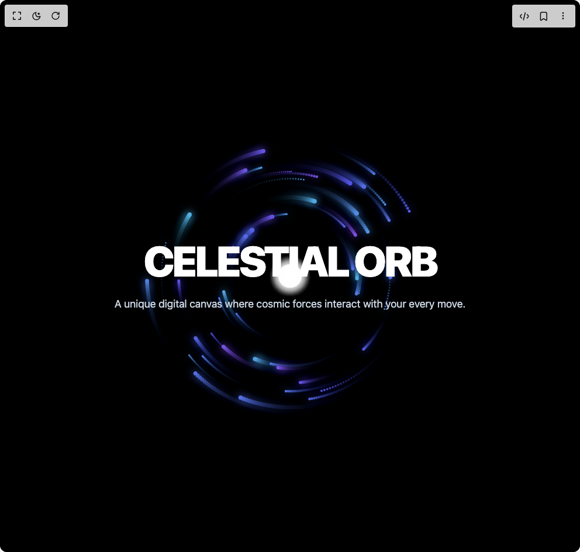

# Build Quantum Grid Hero in BuilderStudio

> Build this component in our Agentic IDE: [BuilderStudio](https://builderstudio.dev).
>
> Join the BuilderStudio community on [Discord](https://discord.gg/QdWeSGCqfe) and [Reddit](https://reddit.com/r/builderstudio).



## Component

- Author group: `dhiluxui`
- Component: `quantum-grid-hero`
- Variant: `default`
- Rendered HTML snapshot: [`rendered.html`](rendered.html)

## BuilderStudio prompt

You are implementing a React component based on a component reference.

## Component identity

- Author: dhiluxui
- Component slug: quantum-grid-hero
- Demo slug: default
- Title: quantum-grid-hero
- Description: 

## Goal

Recreate this component in a React + TypeScript + Tailwind CSS project. Preserve the visual layout, spacing, colors, border radius, shadows, interaction behavior, animation behavior, responsive behavior, and dark mode behavior shown in the rendered demo.

## Implementation requirements

- Use React and TypeScript.
- Use Tailwind CSS classes whenever possible.
- Keep the component self-contained unless the source files require helper components.
- If the source uses CSS variables, custom CSS, animations, or keyframes, include them.
- If the source uses external packages, list and use the required packages.
- Preserve accessibility attributes, button semantics, links, keyboard behavior, and ARIA attributes when visible in the source.
- Do not replace the component with a simplified placeholder.
- Return complete production-ready code.

## Dependencies

No reference metadata available.

## Rendered DOM snapshot

This is the rendered demo HTML extracted from the live preview. Use it to verify structure, class names, visible content, and layout.

```html
<div id="root"><div class="w-screen min-h-screen flex justify-center items-center"><div class="w-screen min-h-screen flex justify-center items-center"><div class="App"><div class="relative min-h-screen w-full flex items-center justify-center text-center bg-black text-slate-200 overflow-hidden"><canvas class="absolute top-0 left-0 w-full h-full z-0" width="992" height="944"></canvas><main class="relative z-10 w-full px-4"><h1 class="text-5xl sm:text-7xl lg:text-8xl font-black tracking-tighter text-white uppercase">Celestial Orb</h1><p class="mt-6 mx-auto max-w-2xl text-lg text-slate-300">A unique digital canvas where cosmic forces interact with your every move.</p></main></div></div></div></div></div>
```

## Reference source files

No reference source files were available.
