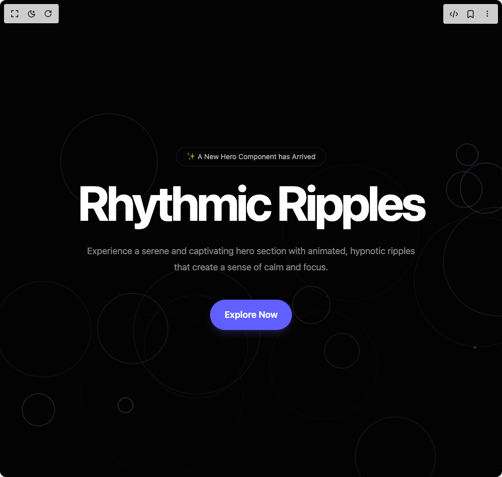

# Build Rhythmic Ripples Background in BuilderStudio

> Build this component in our Agentic IDE: [BuilderStudio](https://builderstudio.dev).
>
> Join the BuilderStudio community on [Discord](https://discord.gg/QdWeSGCqfe) and [Reddit](https://reddit.com/r/builderstudio).



## Component

- Author group: `dhiluxui`
- Component: `rhythmic-ripples-background`
- Variant: `default`
- Rendered HTML snapshot: [`rendered.html`](rendered.html)

## BuilderStudio prompt

You are implementing a React component based on a component reference.

## Component identity

- Author: dhiluxui
- Component slug: rhythmic-ripples-background
- Demo slug: default
- Title: rhythmic-ripples-background
- Description: 

## Goal

Recreate this component in a React + TypeScript + Tailwind CSS project. Preserve the visual layout, spacing, colors, border radius, shadows, interaction behavior, animation behavior, responsive behavior, and dark mode behavior shown in the rendered demo.

## Implementation requirements

- Use React and TypeScript.
- Use Tailwind CSS classes whenever possible.
- Keep the component self-contained unless the source files require helper components.
- If the source uses CSS variables, custom CSS, animations, or keyframes, include them.
- If the source uses external packages, list and use the required packages.
- Preserve accessibility attributes, button semantics, links, keyboard behavior, and ARIA attributes when visible in the source.
- Do not replace the component with a simplified placeholder.
- Return complete production-ready code.

## Dependencies

No reference metadata available.

## Rendered DOM snapshot

This is the rendered demo HTML extracted from the live preview. Use it to verify structure, class names, visible content, and layout.

```html
<div id="root"><div class="w-screen min-h-screen flex justify-center items-center"><div class="w-screen min-h-screen flex justify-center items-center"><div class="relative h-screen w-full" style="background-color: rgb(3, 3, 3);"><canvas class="absolute inset-0 z-0 h-full w-full" width="992" height="944"></canvas><div class="relative z-10 flex h-full items-center justify-center"><div class="text-center max-w-4xl mx-auto px-4"><div class="mb-6 inline-flex items-center justify-center rounded-full border border-white/10 bg-black/10 px-5 py-2 text-sm text-white/70 backdrop-blur-sm" style="opacity: 1; transform: none;">✨ A New Hero Component has Arrived</div><h1 class="text-5xl font-bold tracking-tighter text-white sm:text-7xl md:text-8xl bg-clip-text text-transparent bg-gradient-to-b from-white to-white/60" style="opacity: 1; transform: none;">Rhythmic Ripples</h1><p class="mx-auto mt-8 max-w-2xl text-lg leading-8 text-white/50" style="opacity: 1; transform: none;">Experience a serene and captivating hero section with animated, hypnotic ripples that create a sense of calm and focus.</p><div class="mt-12 flex items-center justify-center gap-x-6" style="opacity: 1; transform: none;"><button class="rounded-full bg-indigo-500 px-7 py-4 text-lg font-semibold text-white shadow-lg shadow-indigo-500/20 transition-transform hover:scale-105">Explore Now</button></div></div></div></div></div></div></div>
```

## Reference source files

No reference source files were available.
