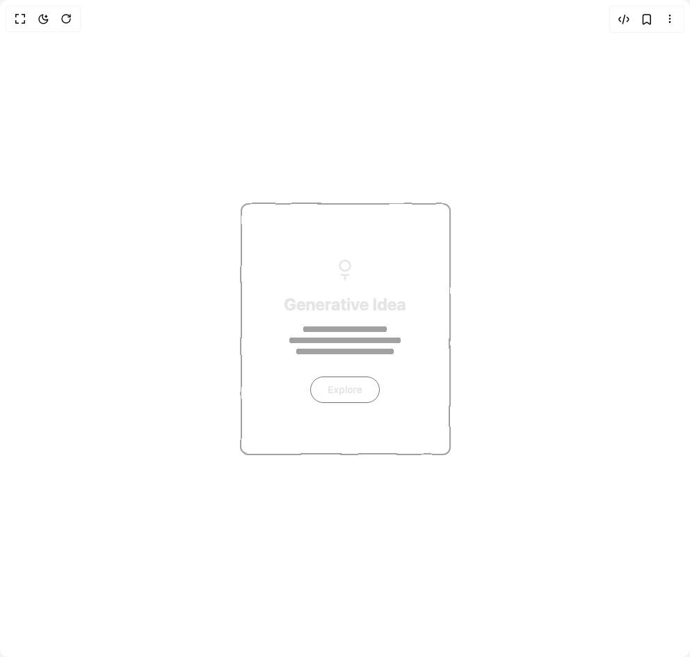

# Build Sketchbook Reveal Card in BuilderStudio

> Build this component in our Agentic IDE: [BuilderStudio](https://builderstudio.dev).
>
> Join the BuilderStudio community on [Discord](https://discord.gg/QdWeSGCqfe) and [Reddit](https://reddit.com/r/builderstudio).



## Component

- Author group: `dhiluxui`
- Component: `sketchbook-reveal-card`
- Variant: `default`
- Rendered HTML snapshot: [`rendered.html`](rendered.html)

## BuilderStudio prompt

You are implementing a React component based on a component reference.

## Component identity

- Author: dhiluxui
- Component slug: sketchbook-reveal-card
- Demo slug: default
- Title: sketchbook-reveal-card
- Description: 

## Goal

Recreate this component in a React + TypeScript + Tailwind CSS project. Preserve the visual layout, spacing, colors, border radius, shadows, interaction behavior, animation behavior, responsive behavior, and dark mode behavior shown in the rendered demo.

## Implementation requirements

- Use React and TypeScript.
- Use Tailwind CSS classes whenever possible.
- Keep the component self-contained unless the source files require helper components.
- If the source uses CSS variables, custom CSS, animations, or keyframes, include them.
- If the source uses external packages, list and use the required packages.
- Preserve accessibility attributes, button semantics, links, keyboard behavior, and ARIA attributes when visible in the source.
- Do not replace the component with a simplified placeholder.
- Return complete production-ready code.

## Dependencies

No reference metadata available.

## Rendered DOM snapshot

This is the rendered demo HTML extracted from the live preview. Use it to verify structure, class names, visible content, and layout.

```html
<div id="root"><div class="w-screen min-h-screen flex justify-center items-center"><div class="w-screen min-h-screen flex justify-center items-center"><div class="relative w-full max-w-sm"><svg class="absolute h-0 w-0"><defs><filter id="wobble"><feTurbulence baseFrequency="0.02" numOctaves="1" seed="0.3358285766792547" result="turbulence"></feTurbulence><feDisplacementMap in="SourceGraphic" in2="turbulence" scale="2"></feDisplacementMap></filter></defs></svg><svg viewBox="0 0 320 400" class="absolute inset-0 h-full w-full"><path d="M20,20 h280 a10,10 0 0 1 10,10 v340 a10,10 0 0 1 -10,10 h-280 a10,10 0 0 1 -10,-10 v-340 a10,10 0 0 1 10,-10 z" fill="none" class="stroke-neutral-400" stroke-width="2" stroke-dasharray="0" stroke-dashoffset="0" style="filter: url(&quot;#wobble&quot;);"></path></svg><div class="relative z-10 flex h-[400px] flex-col items-center justify-center p-8 text-center"><div style="opacity: 1; transform: none;"><svg width="40" height="40" viewBox="0 0 24 24" fill="none" class="stroke-neutral-200"><path d="M9 18h6M12 22V18M12 14.5A4.5 4.5 0 1 0 12 5.5a4.5 4.5 0 0 0 0 9z" stroke-width="1.5" stroke-linecap="round" stroke-linejoin="round" stroke-dasharray="0" stroke-dashoffset="0"></path></svg></div><h2 class="mt-4 text-2xl font-bold text-neutral-200" style="opacity: 1;">Generative Idea</h2><div class="mt-4 w-full space-y-2"><div class="mx-auto h-2 rounded-full bg-neutral-700" style="width: 120px;"><div class="h-full rounded-full bg-neutral-400" style="width: 100%;"></div></div><div class="mx-auto h-2 rounded-full bg-neutral-700" style="width: 160px;"><div class="h-full rounded-full bg-neutral-400" style="width: 100%;"></div></div><div class="mx-auto h-2 rounded-full bg-neutral-700" style="width: 140px;"><div class="h-full rounded-full bg-neutral-400" style="width: 100%;"></div></div></div><button class="mt-8 rounded-full border border-neutral-500 px-6 py-2 text-sm font-medium text-neutral-200" style="opacity: 1; transform: none;">Explore</button></div></div></div></div></div>
```

## Reference source files

No reference source files were available.
