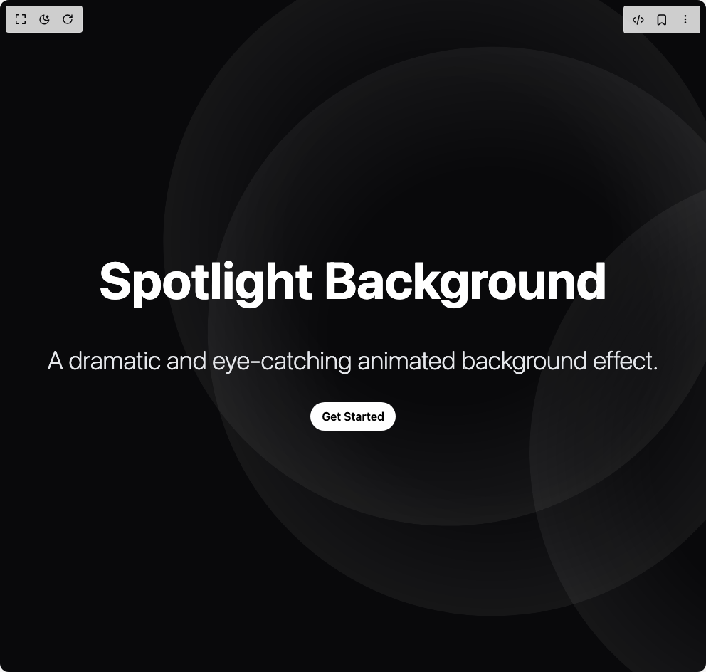

# Build Spotlight Background in BuilderStudio

> Build this component in our Agentic IDE: [BuilderStudio](https://builderstudio.dev).
>
> Join the BuilderStudio community on [Discord](https://discord.gg/QdWeSGCqfe) and [Reddit](https://reddit.com/r/builderstudio).



## Component

- Author group: `dhiluxui`
- Component: `spotlight-background`
- Variant: `default`
- Rendered HTML snapshot: [`rendered.html`](rendered.html)

## BuilderStudio prompt

You are implementing a React component based on a component reference.

## Component identity

- Author: dhiluxui
- Component slug: spotlight-background
- Demo slug: default
- Title: spotlight-background
- Description: 

## Goal

Recreate this component in a React + TypeScript + Tailwind CSS project. Preserve the visual layout, spacing, colors, border radius, shadows, interaction behavior, animation behavior, responsive behavior, and dark mode behavior shown in the rendered demo.

## Implementation requirements

- Use React and TypeScript.
- Use Tailwind CSS classes whenever possible.
- Keep the component self-contained unless the source files require helper components.
- If the source uses CSS variables, custom CSS, animations, or keyframes, include them.
- If the source uses external packages, list and use the required packages.
- Preserve accessibility attributes, button semantics, links, keyboard behavior, and ARIA attributes when visible in the source.
- Do not replace the component with a simplified placeholder.
- Return complete production-ready code.

## Dependencies

No reference metadata available.

## Rendered DOM snapshot

This is the rendered demo HTML extracted from the live preview. Use it to verify structure, class names, visible content, and layout.

```html
<div id="root"><div class="w-screen min-h-screen flex justify-center items-center"><div class="w-screen min-h-screen flex justify-center items-center"><div class="spotlight-container"><div class="spotlight-overlay"><div class="spotlight spotlight-left" style="transform: translateX(-33.0311%) translateY(-66.9689%) rotate(12.7267deg);"></div><div class="spotlight spotlight-mid" style="transform: translateX(5.23517%) translateY(7.85275%) rotate(-14.7648deg);"></div><div class="spotlight spotlight-right" style="transform: rotate(10deg);"></div></div><div class="spotlight-content"><div class="spotlight-inner" style="opacity: 1; transform: none;"><h1 class="spotlight-title">Spotlight Background</h1><p class="spotlight-description">A dramatic and eye-catching animated background effect.</p><button class="spotlight-button">Get Started</button></div></div></div></div></div></div>
```

## Reference source files

No reference source files were available.
