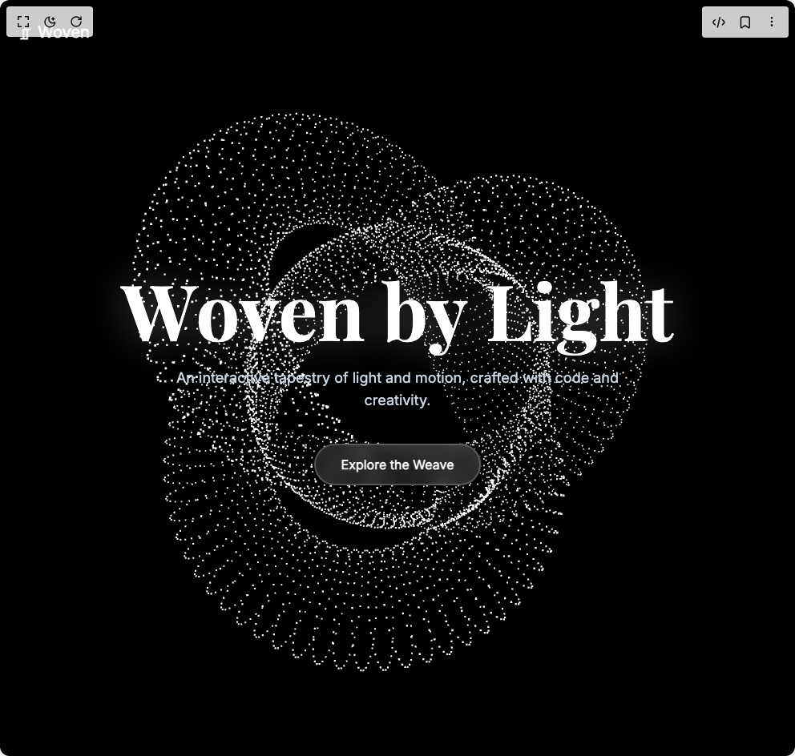

# Build Woven Light Hero in BuilderStudio

> Build this component in our Agentic IDE: [BuilderStudio](https://builderstudio.dev).
>
> Join the BuilderStudio community on [Discord](https://discord.gg/QdWeSGCqfe) and [Reddit](https://reddit.com/r/builderstudio).



## Component

- Author group: `dhiluxui`
- Component: `woven-light-hero`
- Variant: `default`
- Rendered HTML snapshot: [`rendered.html`](rendered.html)

## BuilderStudio prompt

You are implementing a React component based on a component reference.

## Component identity

- Author: dhiluxui
- Component slug: woven-light-hero
- Demo slug: default
- Title: woven-light-hero
- Description: 

## Goal

Recreate this component in a React + TypeScript + Tailwind CSS project. Preserve the visual layout, spacing, colors, border radius, shadows, interaction behavior, animation behavior, responsive behavior, and dark mode behavior shown in the rendered demo.

## Implementation requirements

- Use React and TypeScript.
- Use Tailwind CSS classes whenever possible.
- Keep the component self-contained unless the source files require helper components.
- If the source uses CSS variables, custom CSS, animations, or keyframes, include them.
- If the source uses external packages, list and use the required packages.
- Preserve accessibility attributes, button semantics, links, keyboard behavior, and ARIA attributes when visible in the source.
- Do not replace the component with a simplified placeholder.
- Return complete production-ready code.

## Dependencies

No reference metadata available.

## Rendered DOM snapshot

This is the rendered demo HTML extracted from the live preview. Use it to verify structure, class names, visible content, and layout.

```html
<div id="root"><div class="w-screen min-h-screen flex justify-center items-center"><div class="w-screen min-h-screen flex justify-center items-center"><div class="relative flex h-screen w-full flex-col items-center justify-center overflow-hidden bg-black dark:bg-white"><div class="absolute inset-0 z-0"><canvas data-engine="three.js r179" width="992" height="944" style="display: block; width: 992px; height: 944px;"></canvas></div><nav class="absolute top-0 left-0 right-0 z-20 p-6" style="opacity: 1;"><div class="max-w-7xl mx-auto flex justify-between items-center"><div class="flex items-center gap-2"><span class="text-2xl font-bold text-white dark:text-slate-800">⎎</span><span class="text-xl font-bold text-white dark:text-slate-800" style="font-family: Inter, sans-serif;">Woven</span></div></div></nav><div class="relative z-10 text-center px-4"><h1 class="text-6xl md:text-8xl text-white dark:text-slate-900" style="font-family: &quot;Playfair Display&quot;, serif; text-shadow: rgba(255, 255, 255, 0.3) 0px 0px 50px;"><span class="inline-block"><span style="display: inline-block; opacity: 1; transform: none;">W</span><span style="display: inline-block; opacity: 1; transform: none;">o</span><span style="display: inline-block; opacity: 1; transform: none;">v</span><span style="display: inline-block; opacity: 1; transform: none;">e</span><span style="display: inline-block; opacity: 1; transform: none;">n</span><span>&nbsp;</span></span><span class="inline-block"><span style="display: inline-block; opacity: 1; transform: none;">b</span><span style="display: inline-block; opacity: 1; transform: none;">y</span><span>&nbsp;</span></span><span class="inline-block"><span style="display: inline-block; opacity: 1; transform: none;">L</span><span style="display: inline-block; opacity: 1; transform: none;">i</span><span style="display: inline-block; opacity: 1; transform: none;">g</span><span style="display: inline-block; opacity: 1; transform: none;">h</span><span style="display: inline-block; opacity: 1; transform: none;">t</span></span></h1><p class="mx-auto mt-6 max-w-xl text-lg text-slate-300 dark:text-slate-600" style="font-family: Inter, sans-serif; opacity: 1; transform: none;">An interactive tapestry of light and motion, crafted with code and creativity.</p><div class="mt-10" style="opacity: 1;"><button class="rounded-full border-2 border-white/20 bg-white/10 px-8 py-3 font-semibold text-white backdrop-blur-sm transition-all hover:bg-white/20 dark:border-slate-800/20 dark:bg-slate-800/5 dark:text-slate-800 dark:hover:bg-slate-800/10" style="font-family: Inter, sans-serif;">Explore the Weave</button></div></div></div></div></div></div>
```

## Reference source files

No reference source files were available.
