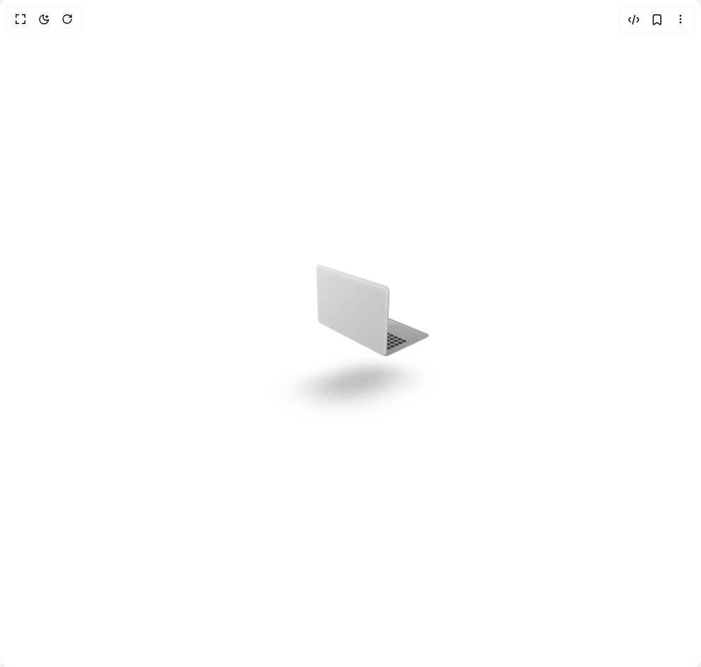

# Build Animated 3d Mac Book Air in BuilderStudio

> Build this component in our Agentic IDE: [BuilderStudio](https://builderstudio.dev).
>
> Join the BuilderStudio community on [Discord](https://discord.gg/QdWeSGCqfe) and [Reddit](https://reddit.com/r/builderstudio).



## Component

- Author group: `easemize`
- Component: `animated-3d-mac-book-air`
- Variant: `default`
- Rendered HTML snapshot: [`rendered.html`](rendered.html)

## BuilderStudio prompt

You are implementing a React component based on a component reference.

## Component identity

- Author: easemize
- Component slug: animated-3d-mac-book-air
- Demo slug: default
- Title: animated-3d-mac-book-air
- Description: 

## Goal

Recreate this component in a React + TypeScript + Tailwind CSS project. Preserve the visual layout, spacing, colors, border radius, shadows, interaction behavior, animation behavior, responsive behavior, and dark mode behavior shown in the rendered demo.

## Implementation requirements

- Use React and TypeScript.
- Use Tailwind CSS classes whenever possible.
- Keep the component self-contained unless the source files require helper components.
- If the source uses CSS variables, custom CSS, animations, or keyframes, include them.
- If the source uses external packages, list and use the required packages.
- Preserve accessibility attributes, button semantics, links, keyboard behavior, and ARIA attributes when visible in the source.
- Do not replace the component with a simplified placeholder.
- Return complete production-ready code.

## Dependencies

No reference metadata available.

## Rendered DOM snapshot

This is the rendered demo HTML extracted from the live preview. Use it to verify structure, class names, visible content, and layout.

```html
<div id="root"><div class="flex items-center justify-center w-screen h-screen"><div class="macbook-container w-[150px] h-[96px] absolute left-1/2 top-1/2 mt-[-85px] ml-[-78px]"><div class="macbook-inner custom-animate-rotate z-20 absolute w-[150px] h-[96px] left-0 top-0"><div class="macbook-screen custom-animate-lid-screen w-[150px] h-[96px] absolute left-0 bottom-0 rounded-[7px] bg-[#ddd] 
                        bg-[linear-gradient(45deg,rgba(0,0,0,0.34)_0%,rgba(0,0,0,0)_100%)] bg-left-bottom bg-[length:300px_300px] 
                        shadow-[inset_0_3px_7px_rgba(255,255,255,0.5)]"><div class="macbook-screen-face-one w-[150px] h-[96px] absolute left-0 bottom-0 rounded-[7px] bg-[#d3d3d3]
                          bg-[linear-gradient(45deg,rgba(0,0,0,0.24)_0%,rgba(0,0,0,0)_100%)]"><div class="w-[3px] h-[3px] rounded-full bg-black absolute left-1/2 top-[4px] ml-[-1.5px]"></div><div class="w-[130px] h-[74px] m-[10px] bg-black bg-[length:100%_100%] rounded-[1px] relative shadow-[inset_0_0_2px_rgba(0,0,0,1)]"><div class="custom-animate-screen-shade absolute left-0 top-0 w-[130px] h-[74px] 
                              bg-[linear-gradient(-135deg,rgba(255,255,255,0)_0%,rgba(255,255,255,0.1)_47%,rgba(255,255,255,0)_48%)] 
                              bg-[length:300px_200px] bg-[position:0px_0px]"></div></div><span class="absolute top-[85px] left-[57px] text-[6px] text-[#666]">MacBook Air</span></div></div><div class="macbook-body custom-animate-lid-macbody w-[150px] h-[96px] absolute left-0 bottom-0 rounded-[7px] bg-[#cbcbcb]
                        bg-[linear-gradient(45deg,rgba(0,0,0,0.24)_0%,rgba(0,0,0,0)_100%)]"><div class="macbook-body-face-one custom-animate-lid-keyboard-area w-[150px] h-[96px] absolute left-0 bottom-0 rounded-[7px] bg-[#dfdfdf] 
                          bg-[linear-gradient(30deg,rgba(0,0,0,0.24)_0%,rgba(0,0,0,0)_100%)]"><div class="w-[40px] h-[31px] absolute left-1/2 top-1/2 rounded-[4px] mt-[-44px] ml-[-18px] bg-[#cdcdcd] 
                            bg-[linear-gradient(30deg,rgba(0,0,0,0.24)_0%,rgba(0,0,0,0)_100%)] 
                            shadow-[inset_0_0_3px_#888]"></div><div class="macbook-keyboard w-[130px] h-[45px] absolute left-[7px] top-[41px] rounded-[4px] bg-[#cdcdcd] 
                            bg-[linear-gradient(30deg,rgba(0,0,0,0.24)_0%,rgba(0,0,0,0)_100%)] 
                            shadow-[inset_0_0_3px_#777] pl-[2px] overflow-hidden"><div class="w-[6px] h-[6px] bg-[#444] float-left m-[1px] rounded-[2px] shadow-[0_-2px_0_#222] macbook-key custom-animate-keys"></div><div class="w-[6px] h-[6px] bg-[#444] float-left m-[1px] rounded-[2px] shadow-[0_-2px_0_#222] macbook-key custom-animate-keys"></div><div class="w-[6px] h-[6px] bg-[#444] float-left m-[1px] rounded-[2px] shadow-[0_-2px_0_#222] macbook-key custom-animate-keys"></div><div class="w-[6px] h-[6px] bg-[#444] float-left m-[1px] rounded-[2px] shadow-[0_-2px_0_#222] macbook-key custom-animate-keys"></div><div class="w-[6px] h-[6px] bg-[#444] float-left m-[1px] rounded-[2px] shadow-[0_-2px_0_#222] macbook-key custom-animate-keys"></div><div class="w-[6px] h-[6px] bg-[#444] float-left m-[1px] rounded-[2px] shadow-[0_-2px_0_#222] macbook-key custom-animate-keys"></div><div class="w-[6px] h-[6px] bg-[#444] float-left m-[1px] rounded-[2px] shadow-[0_-2px_0_#222] macbook-key custom-animate-keys"></div><div class="w-[6px] h-[6px] bg-[#444] float-left m-[1px] rounded-[2px] shadow-[0_-2px_0_#222] macbook-key custom-animate-keys"></div><div class="w-[6px] h-[6px] bg-[#444] float-left m-[1px] rounded-[2px] shadow-[0_-2px_0_#222] macbook-key custom-animate-keys"></div><div class="w-[6px] h-[6px] bg-[#444] float-left m-[1px] rounded-[2px] shadow-[0_-2px_0_#222] macbook-key custom-animate-keys"></div><div class="w-[6px] h-[6px] bg-[#444] float-left m-[1px] rounded-[2px] shadow-[0_-2px_0_#222] macbook-key custom-animate-keys"></div><div class="w-[6px] h-[6px] bg-[#444] float-left m-[1px] rounded-[2px] shadow-[0_-2px_0_#222] macbook-key custom-animate-keys"></div><div class="w-[6px] h-[6px] bg-[#444] float-left m-[1px] rounded-[2px] shadow-[0_-2px_0_#222] macbook-key custom-animate-keys"></div><div class="w-[6px] h-[6px] bg-[#444] float-left m-[1px] rounded-[2px] shadow-[0_-2px_0_#222] macbook-key custom-animate-keys"></div><div class="w-[6px] h-[6px] bg-[#444] float-left m-[1px] rounded-[2px] shadow-[0_-2px_0_#222] macbook-key custom-animate-keys"></div><div class="w-[6px] h-[6px] bg-[#444] float-left m-[1px] rounded-[2px] shadow-[0_-2px_0_#222] macbook-key custom-animate-keys"></div><div class="w-[6px] h-[6px] bg-[#444] float-left m-[1px] rounded-[2px] shadow-[0_-2px_0_#222] macbook-key custom-animate-keys"></div><div class="w-[6px] h-[6px] bg-[#444] float-left m-[1px] rounded-[2px] shadow-[0_-2px_0_#222] macbook-key custom-animate-keys"></div><div class="w-[6px] h-[6px] bg-[#444] float-left m-[1px] rounded-[2px] shadow-[0_-2px_0_#222] macbook-key custom-animate-keys"></div><div class="w-[6px] h-[6px] bg-[#444] float-left m-[1px] rounded-[2px] shadow-[0_-2px_0_#222] macbook-key custom-animate-keys"></div><div class="w-[6px] h-[6px] bg-[#444] float-left m-[1px] rounded-[2px] shadow-[0_-2px_0_#222] macbook-key custom-animate-keys"></div><div class="w-[6px] h-[6px] bg-[#444] float-left m-[1px] rounded-[2px] shadow-[0_-2px_0_#222] macbook-key custom-animate-keys"></div><div class="w-[6px] h-[6px] bg-[#444] float-left m-[1px] rounded-[2px] shadow-[0_-2px_0_#222] macbook-key custom-animate-keys"></div><div class="w-[6px] h-[6px] bg-[#444] float-left m-[1px] rounded-[2px] shadow-[0_-2px_0_#222] macbook-key custom-animate-keys"></div><div class="w-[6px] h-[6px] bg-[#444] float-left m-[1px] rounded-[2px] shadow-[0_-2px_0_#222] macbook-key custom-animate-keys"></div><div class="w-[6px] h-[6px] bg-[#444] float-left m-[1px] rounded-[2px] shadow-[0_-2px_0_#222] macbook-key custom-animate-keys"></div><div class="w-[6px] h-[6px] bg-[#444] float-left m-[1px] rounded-[2px] shadow-[0_-2px_0_#222] macbook-key custom-animate-keys"></div><div class="w-[6px] h-[6px] bg-[#444] float-left m-[1px] rounded-[2px] shadow-[0_-2px_0_#222] macbook-key custom-animate-keys"></div><div class="w-[6px] h-[6px] bg-[#444] float-left m-[1px] rounded-[2px] shadow-[0_-2px_0_#222] macbook-key custom-animate-keys"></div><div class="w-[6px] h-[6px] bg-[#444] float-left m-[1px] rounded-[2px] shadow-[0_-2px_0_#222] macbook-key custom-animate-keys"></div><div class="w-[6px] h-[6px] bg-[#444] float-left m-[1px] rounded-[2px] shadow-[0_-2px_0_#222] macbook-key custom-animate-keys"></div><div class="w-[6px] h-[6px] bg-[#444] float-left m-[1px] rounded-[2px] shadow-[0_-2px_0_#222] macbook-key custom-animate-keys"></div><div class="w-[6px] h-[6px] bg-[#444] float-left m-[1px] rounded-[2px] shadow-[0_-2px_0_#222] macbook-key custom-animate-keys"></div><div class="w-[6px] h-[6px] bg-[#444] float-left m-[1px] rounded-[2px] shadow-[0_-2px_0_#222] macbook-key custom-animate-keys"></div><div class="w-[6px] h-[6px] bg-[#444] float-left m-[1px] rounded-[2px] shadow-[0_-2px_0_#222] macbook-key custom-animate-keys"></div><div class="w-[6px] h-[6px] bg-[#444] float-left m-[1px] rounded-[2px] shadow-[0_-2px_0_#222] macbook-key custom-animate-keys"></div><div class="w-[6px] h-[6px] bg-[#444] float-left m-[1px] rounded-[2px] shadow-[0_-2px_0_#222] macbook-key custom-animate-keys"></div><div class="w-[6px] h-[6px] bg-[#444] float-left m-[1px] rounded-[2px] shadow-[0_-2px_0_#222] macbook-key custom-animate-keys"></div><div class="w-[6px] h-[6px] bg-[#444] float-left m-[1px] rounded-[2px] shadow-[0_-2px_0_#222] macbook-key custom-animate-keys"></div><div class="w-[6px] h-[6px] bg-[#444] float-left m-[1px] rounded-[2px] shadow-[0_-2px_0_#222] macbook-key custom-animate-keys"></div><div class="w-[6px] h-[6px] bg-[#444] float-left m-[1px] rounded-[2px] shadow-[0_-2px_0_#222] macbook-key custom-animate-keys"></div><div class="w-[6px] h-[6px] bg-[#444] float-left m-[1px] rounded-[2px] shadow-[0_-2px_0_#222] macbook-key custom-animate-keys"></div><div class="w-[6px] h-[6px] bg-[#444] float-left m-[1px] rounded-[2px] shadow-[0_-2px_0_#222] macbook-key custom-animate-keys"></div><div class="w-[6px] h-[6px] bg-[#444] float-left m-[1px] rounded-[2px] shadow-[0_-2px_0_#222] macbook-key custom-animate-keys"></div><div class="w-[6px] h-[6px] bg-[#444] float-left m-[1px] rounded-[2px] shadow-[0_-2px_0_#222] macbook-key custom-animate-keys"></div><div class="w-[6px] h-[6px] bg-[#444] float-left m-[1px] rounded-[2px] shadow-[0_-2px_0_#222] macbook-key custom-animate-keys"></div><div class="w-[6px] h-[6px] bg-[#444] float-left m-[1px] rounded-[2px] shadow-[0_-2px_0_#222] macbook-key custom-animate-keys"></div><div class="w-[6px] h-[6px] bg-[#444] float-left m-[1px] rounded-[2px] shadow-[0_-2px_0_#222] macbook-key custom-animate-keys"></div><div class="w-[6px] h-[6px] bg-[#444] float-left m-[1px] rounded-[2px] shadow-[0_-2px_0_#222] macbook-key custom-animate-keys"></div><div class="w-[6px] h-[6px] bg-[#444] float-left m-[1px] rounded-[2px] shadow-[0_-2px_0_#222] macbook-key custom-animate-keys"></div><div class="w-[6px] h-[6px] bg-[#444] float-left m-[1px] rounded-[2px] shadow-[0_-2px_0_#222] macbook-key custom-animate-keys"></div><div class="w-[6px] h-[6px] bg-[#444] float-left m-[1px] rounded-[2px] shadow-[0_-2px_0_#222] macbook-key custom-animate-keys"></div><div class="w-[6px] h-[6px] bg-[#444] float-left m-[1px] rounded-[2px] shadow-[0_-2px_0_#222] macbook-key custom-animate-keys"></div><div class="w-[6px] h-[6px] bg-[#444] float-left m-[1px] rounded-[2px] shadow-[0_-2px_0_#222] macbook-key custom-animate-keys"></div><div class="w-[6px] h-[6px] bg-[#444] float-left m-[1px] rounded-[2px] shadow-[0_-2px_0_#222] macbook-key custom-animate-keys"></div><div class="w-[6px] h-[6px] bg-[#444] float-left m-[1px] rounded-[2px] shadow-[0_-2px_0_#222] macbook-key custom-animate-keys"></div><div class="w-[6px] h-[6px] bg-[#444] float-left m-[1px] rounded-[2px] shadow-[0_-2px_0_#222] macbook-key custom-animate-keys"></div><div class="w-[6px] h-[6px] bg-[#444] float-left m-[1px] rounded-[2px] shadow-[0_-2px_0_#222] macbook-key custom-animate-keys"></div><div class="w-[6px] h-[6px] bg-[#444] float-left m-[1px] rounded-[2px] shadow-[0_-2px_0_#222] macbook-key custom-animate-keys w-[45px]"></div><div class="w-[6px] h-[6px] bg-[#444] float-left m-[1px] rounded-[2px] shadow-[0_-2px_0_#222] macbook-key custom-animate-keys h-[3px]"></div><div class="w-[6px] h-[6px] bg-[#444] float-left m-[1px] rounded-[2px] shadow-[0_-2px_0_#222] macbook-key custom-animate-keys h-[3px]"></div><div class="w-[6px] h-[6px] bg-[#444] float-left m-[1px] rounded-[2px] shadow-[0_-2px_0_#222] macbook-key custom-animate-keys h-[3px]"></div><div class="w-[6px] h-[6px] bg-[#444] float-left m-[1px] rounded-[2px] shadow-[0_-2px_0_#222] macbook-key custom-animate-keys h-[3px]"></div><div class="w-[6px] h-[6px] bg-[#444] float-left m-[1px] rounded-[2px] shadow-[0_-2px_0_#222] macbook-key custom-animate-keys h-[3px]"></div><div class="w-[6px] h-[6px] bg-[#444] float-left m-[1px] rounded-[2px] shadow-[0_-2px_0_#222] macbook-key custom-animate-keys h-[3px]"></div><div class="w-[6px] h-[6px] bg-[#444] float-left m-[1px] rounded-[2px] shadow-[0_-2px_0_#222] macbook-key custom-animate-keys h-[3px]"></div><div class="w-[6px] h-[6px] bg-[#444] float-left m-[1px] rounded-[2px] shadow-[0_-2px_0_#222] macbook-key custom-animate-keys h-[3px]"></div><div class="w-[6px] h-[6px] bg-[#444] float-left m-[1px] rounded-[2px] shadow-[0_-2px_0_#222] macbook-key custom-animate-keys h-[3px]"></div><div class="w-[6px] h-[6px] bg-[#444] float-left m-[1px] rounded-[2px] shadow-[0_-2px_0_#222] macbook-key custom-animate-keys h-[3px]"></div><div class="w-[6px] h-[6px] bg-[#444] float-left m-[1px] rounded-[2px] shadow-[0_-2px_0_#222] macbook-key custom-animate-keys h-[3px]"></div><div class="w-[6px] h-[6px] bg-[#444] float-left m-[1px] rounded-[2px] shadow-[0_-2px_0_#222] macbook-key custom-animate-keys h-[3px]"></div><div class="w-[6px] h-[6px] bg-[#444] float-left m-[1px] rounded-[2px] shadow-[0_-2px_0_#222] macbook-key custom-animate-keys h-[3px]"></div><div class="w-[6px] h-[6px] bg-[#444] float-left m-[1px] rounded-[2px] shadow-[0_-2px_0_#222] macbook-key custom-animate-keys h-[3px]"></div><div class="w-[6px] h-[6px] bg-[#444] float-left m-[1px] rounded-[2px] shadow-[0_-2px_0_#222] macbook-key custom-animate-keys h-[3px]"></div><div class="w-[6px] h-[6px] bg-[#444] float-left m-[1px] rounded-[2px] shadow-[0_-2px_0_#222] macbook-key custom-animate-keys h-[3px]"></div></div></div><div class="w-[5px] h-[5px] bg-[#333] rounded-full absolute left-[20px] top-[20px]"></div><div class="w-[5px] h-[5px] bg-[#333] rounded-full absolute right-[20px] top-[20px]"></div><div class="w-[5px] h-[5px] bg-[#333] rounded-full absolute right-[20px] bottom-[20px]"></div><div class="w-[5px] h-[5px] bg-[#333] rounded-full absolute left-[20px] bottom-[20px]"></div></div></div><div class="macbook-shadow custom-animate-macbook-shadow absolute w-[60px] h-[0px] left-[40px] top-[160px] 
                      shadow-[0_0_60px_40px_rgba(0,0,0,0.3)]"></div></div></div></div>
```

## Reference source files

No reference source files were available.
