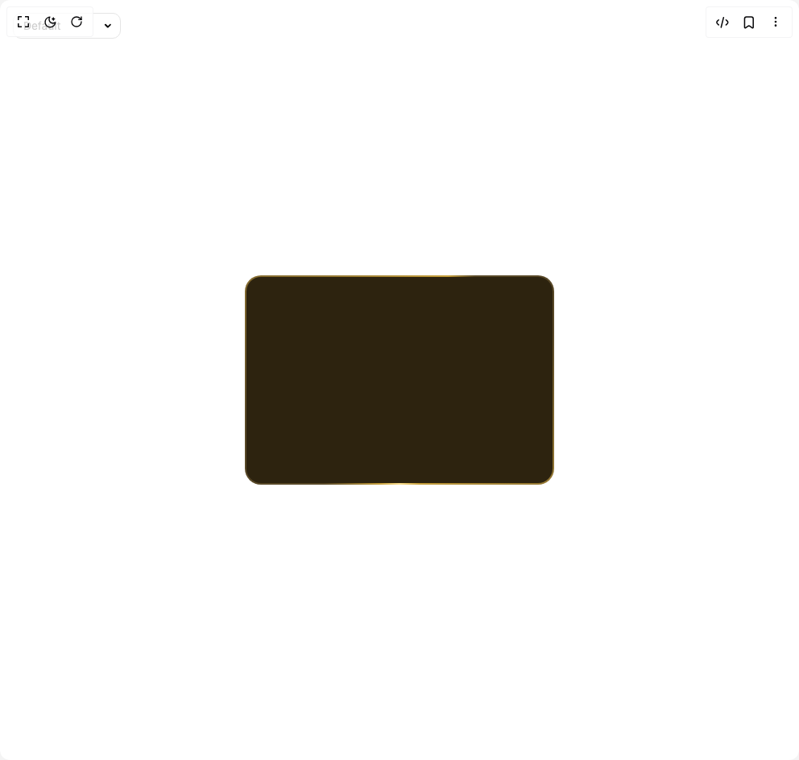

# Build Animated Gradient Border in BuilderStudio

> Build this component in our Agentic IDE: [BuilderStudio](https://builderstudio.dev).
>
> Join the BuilderStudio community on [Discord](https://discord.gg/QdWeSGCqfe) and [Reddit](https://reddit.com/r/builderstudio).



## Component

- Author group: `easemize`
- Component: `animated-gradient-border`
- Variant: `default`
- Rendered HTML snapshot: [`rendered.html`](rendered.html)

## BuilderStudio prompt

You are implementing a React component based on a component reference.

## Component identity

- Author: easemize
- Component slug: animated-gradient-border
- Demo slug: default
- Title: animated-gradient-border
- Description: 

## Goal

Recreate this component in a React + TypeScript + Tailwind CSS project. Preserve the visual layout, spacing, colors, border radius, shadows, interaction behavior, animation behavior, responsive behavior, and dark mode behavior shown in the rendered demo.

## Implementation requirements

- Use React and TypeScript.
- Use Tailwind CSS classes whenever possible.
- Keep the component self-contained unless the source files require helper components.
- If the source uses CSS variables, custom CSS, animations, or keyframes, include them.
- If the source uses external packages, list and use the required packages.
- Preserve accessibility attributes, button semantics, links, keyboard behavior, and ARIA attributes when visible in the source.
- Do not replace the component with a simplified placeholder.
- Return complete production-ready code.

## Dependencies

No reference metadata available.

## Rendered DOM snapshot

This is the rendered demo HTML extracted from the live preview. Use it to verify structure, class names, visible content, and layout.

```html
<div id="root"><div class="fixed top-4 left-4 z-10"><select class="appearance-none h-8 max-w-[200px] text-sm leading-tight rounded-lg pl-3 pr-7 py-0 border bg-background focus:outline-none focus:ring-0"><option value="named_Default_Default">Default</option><option value="named_FastAnimation_FastAnimation">FastAnimation</option><option value="named_StopOnHover_StopOnHover">StopOnHover</option></select><div class="absolute top-1/2 transform -translate-y-1/2 right-2 pointer-events-none"><svg class="w-4 h-4 fill-current" viewBox="0 0 20 20"><path d="M5.516 7.548c.436-.446 1.043-.48 1.576 0L10 10.405l2.908-2.857c.533-.48 1.14-.446 1.576 0 .436.445.408 1.197 0 1.615l-3.734 3.705c-.533.534-1.39.534-1.923 0l-3.734-3.705c-.408-.418-.436-1.17 0-1.615z"></path></svg></div></div><div class="w-screen min-h-screen flex justify-center items-center"><div class="gradient-border-component gradient-border-auto w-96 h-65" style="--gradient-primary: #584827; --gradient-secondary: #c7a03c; --gradient-accent: #f9de90; --bg-color: #2d230f; --border-width: 2px; --border-radius: 20px; --animation-duration: 5s; border: 2px solid transparent; border-radius: 20px; background-image: linear-gradient(#2d230f, #2d230f),
      conic-gradient(
        from var(--gradient-angle, 0deg),
        #584827 0%,
        #c7a03c 37%,
        #f9de90 30%,
        #c7a03c 33%,
        #584827 40%,
        #584827 50%,
        #c7a03c 77%,
        #f9de90 80%,
        #c7a03c 83%,
        #584827 90%
      ); background-clip: padding-box, border-box; background-origin: padding-box, border-box;"></div></div></div>
```

## Reference source files

No reference source files were available.
