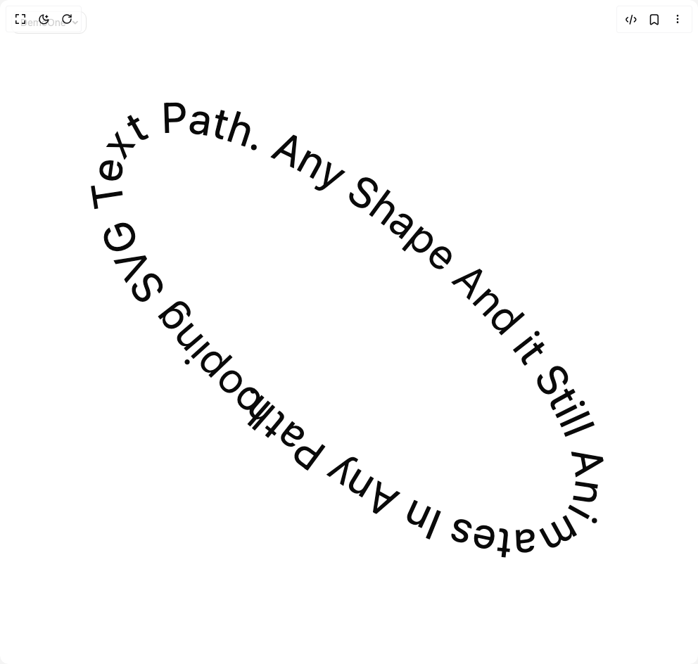

# Build Animated Svg Text Path in BuilderStudio

> Build this component in our Agentic IDE: [BuilderStudio](https://builderstudio.dev).
>
> Join the BuilderStudio community on [Discord](https://discord.gg/QdWeSGCqfe) and [Reddit](https://reddit.com/r/builderstudio).



## Component

- Author group: `easemize`
- Component: `animated-svg-text-path`
- Variant: `default`
- Rendered HTML snapshot: [`rendered.html`](rendered.html)

## BuilderStudio prompt

You are implementing a React component based on a component reference.

## Component identity

- Author: easemize
- Component slug: animated-svg-text-path
- Demo slug: default
- Title: animated-svg-text-path
- Description: 

## Goal

Recreate this component in a React + TypeScript + Tailwind CSS project. Preserve the visual layout, spacing, colors, border radius, shadows, interaction behavior, animation behavior, responsive behavior, and dark mode behavior shown in the rendered demo.

## Implementation requirements

- Use React and TypeScript.
- Use Tailwind CSS classes whenever possible.
- Keep the component self-contained unless the source files require helper components.
- If the source uses CSS variables, custom CSS, animations, or keyframes, include them.
- If the source uses external packages, list and use the required packages.
- Preserve accessibility attributes, button semantics, links, keyboard behavior, and ARIA attributes when visible in the source.
- Do not replace the component with a simplified placeholder.
- Return complete production-ready code.

## Dependencies

No reference metadata available.

## Rendered DOM snapshot

This is the rendered demo HTML extracted from the live preview. Use it to verify structure, class names, visible content, and layout.

```html
<div id="root"><div class="fixed top-4 left-4 z-10"><select class="appearance-none h-8 max-w-[200px] text-sm leading-tight rounded-lg pl-3 pr-7 py-0 border bg-background focus:outline-none focus:ring-0"><option value="named_DemoOne_DemoOne">DemoOne</option><option value="named_DemoTwo_DemoTwo">DemoTwo</option></select><div class="absolute top-1/2 transform -translate-y-1/2 right-2 pointer-events-none"><svg class="w-4 h-4 fill-current" viewBox="0 0 20 20"><path d="M5.516 7.548c.436-.446 1.043-.48 1.576 0L10 10.405l2.908-2.857c.533-.48 1.14-.446 1.576 0 .436.445.408 1.197 0 1.615l-3.734 3.705c-.533.534-1.39.534-1.923 0l-3.734-3.705c-.408-.418-.436-1.17 0-1.615z"></path></svg></div></div><div class="w-screen min-h-screen flex justify-center items-center"><div class="flex flex-col items-center justify-center min-h-screen overflow-hidden text-foreground font-sans "><div class="w-[min(95vw,95vh)]"><svg viewBox="0 0 240 240" xmlns="http://www.w3.org/2000/svg" class="w-full h-full" style="transform: rotate(40deg); background-color: transparent;"><path d="M227 120C227 142.091 178.871 160 119.5 160C60.1294 160 12 142.091 12 120C12 97.9086 60.1294 80 119.5 80C178.871 80 227 97.9086 227 120Z" fill="none" stroke="none" id="path-745038"></path><text>
        <textPath href="#path-745038" startOffset="25.5167%" style="fill: currentcolor; letter-spacing: 0.2px; font-size: 16px;">looping SVG Text Path. Any Shape And it Still Animates In Any Path.</textPath>
        <textPath href="#path-745038" startOffset="-74.4833%" style="fill: currentcolor; letter-spacing: 0.2px; font-size: 16px;">looping SVG Text Path. Any Shape And it Still Animates In Any Path.</textPath>
      </text></svg></div></div></div></div>
```

## Reference source files

No reference source files were available.
