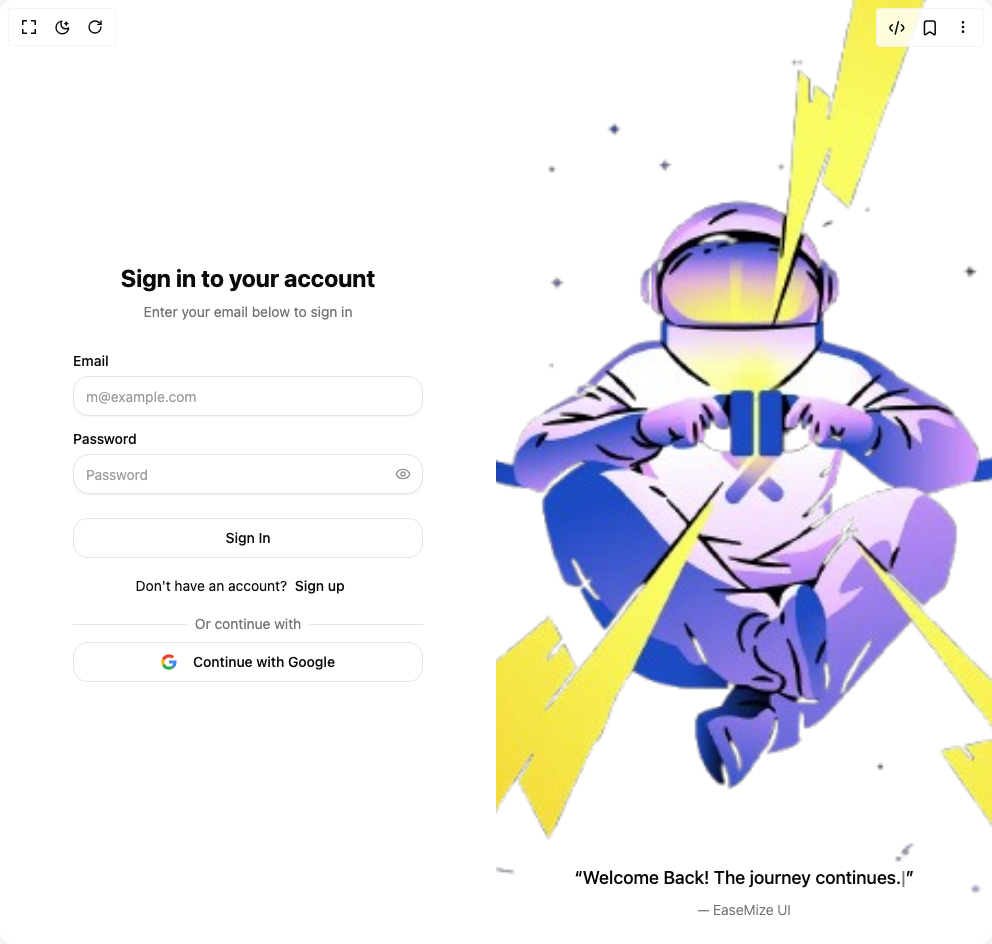

# Build Auth Fuse in BuilderStudio

> Build this component in our Agentic IDE: [BuilderStudio](https://builderstudio.dev).
>
> Join the BuilderStudio community on [Discord](https://discord.gg/QdWeSGCqfe) and [Reddit](https://reddit.com/r/builderstudio).



## Component

- Author group: `easemize`
- Component: `auth-fuse`
- Variant: `default`
- Rendered HTML snapshot: [`rendered.html`](rendered.html)

## BuilderStudio prompt

You are implementing a React component based on a component reference.

## Component identity

- Author: easemize
- Component slug: auth-fuse
- Demo slug: default
- Title: auth-fuse
- Description: 

## Goal

Recreate this component in a React + TypeScript + Tailwind CSS project. Preserve the visual layout, spacing, colors, border radius, shadows, interaction behavior, animation behavior, responsive behavior, and dark mode behavior shown in the rendered demo.

## Implementation requirements

- Use React and TypeScript.
- Use Tailwind CSS classes whenever possible.
- Keep the component self-contained unless the source files require helper components.
- If the source uses CSS variables, custom CSS, animations, or keyframes, include them.
- If the source uses external packages, list and use the required packages.
- Preserve accessibility attributes, button semantics, links, keyboard behavior, and ARIA attributes when visible in the source.
- Do not replace the component with a simplified placeholder.
- Return complete production-ready code.

## Dependencies

No reference metadata available.

## Rendered DOM snapshot

This is the rendered demo HTML extracted from the live preview. Use it to verify structure, class names, visible content, and layout.

```html
<div id="root"><div class="w-screen min-h-screen flex justify-center items-center"><div class="w-screen min-h-screen flex justify-center items-center"><div class="w-full min-h-screen md:grid md:grid-cols-2"><style>
        input[type="password"]::-ms-reveal,
        input[type="password"]::-ms-clear {
          display: none;
        }
      </style><div class="flex h-screen items-center justify-center p-6 md:h-auto md:p-0 md:py-12"><div class="mx-auto grid w-[350px] gap-2"><form autocomplete="on" class="flex flex-col gap-8"><div class="flex flex-col items-center gap-2 text-center"><h1 class="text-2xl font-bold">Sign in to your account</h1><p class="text-balance text-sm text-muted-foreground">Enter your email below to sign in</p></div><div class="grid gap-4"><div class="grid gap-2"><label class="text-sm font-medium leading-none peer-disabled:cursor-not-allowed peer-disabled:opacity-70" for="email">Email</label><input class="flex h-10 w-full rounded-lg border border-input dark:border-input/50 bg-background px-3 py-3 text-sm text-foreground shadow-sm shadow-black/5 transition-shadow placeholder:text-muted-foreground/70 focus-visible:bg-accent focus-visible:outline-none disabled:cursor-not-allowed disabled:opacity-50" id="email" placeholder="m@example.com" required="" autocomplete="email" type="email" name="email"></div><div class="grid w-full items-center gap-2"><label class="text-sm font-medium leading-none peer-disabled:cursor-not-allowed peer-disabled:opacity-70" for="«r0»">Password</label><div class="relative"><input class="flex h-10 w-full rounded-lg border border-input dark:border-input/50 bg-background px-3 py-3 text-sm text-foreground shadow-sm shadow-black/5 transition-shadow placeholder:text-muted-foreground/70 focus-visible:bg-accent focus-visible:outline-none disabled:cursor-not-allowed disabled:opacity-50 pe-10" id="«r0»" required="" autocomplete="current-password" placeholder="Password" type="password" name="password"><button type="button" class="absolute inset-y-0 end-0 flex h-full w-10 items-center justify-center text-muted-foreground/80 transition-colors hover:text-foreground focus-visible:text-foreground focus-visible:outline-none disabled:pointer-events-none disabled:opacity-50" aria-label="Show password"><svg xmlns="http://www.w3.org/2000/svg" width="24" height="24" viewBox="0 0 24 24" fill="none" stroke="currentColor" stroke-width="2" stroke-linecap="round" stroke-linejoin="round" class="lucide lucide-eye size-4" aria-hidden="true"><path d="M2.062 12.348a1 1 0 0 1 0-.696 10.75 10.75 0 0 1 19.876 0 1 1 0 0 1 0 .696 10.75 10.75 0 0 1-19.876 0"></path><circle cx="12" cy="12" r="3"></circle></svg></button></div></div><button class="inline-flex items-center justify-center gap-2 whitespace-nowrap rounded-md text-sm font-medium ring-offset-background transition-colors focus-visible:outline-none focus-visible:ring-2 focus-visible:ring-ring focus-visible:ring-offset-2 disabled:pointer-events-none disabled:opacity-50 [&amp;_svg]:pointer-events-none [&amp;_svg]:size-4 [&amp;_svg]:shrink-0 border border-input dark:border-input/50 bg-background hover:bg-accent hover:text-accent-foreground h-10 px-4 py-2 mt-2" type="submit">Sign In</button></div></form><div class="text-center text-sm">Don't have an account? <button class="inline-flex items-center justify-center gap-2 whitespace-nowrap rounded-md text-sm font-medium ring-offset-background transition-colors focus-visible:outline-none focus-visible:ring-2 focus-visible:ring-ring focus-visible:ring-offset-2 disabled:pointer-events-none disabled:opacity-50 [&amp;_svg]:pointer-events-none [&amp;_svg]:size-4 [&amp;_svg]:shrink-0 underline-offset-4 hover:underline h-10 px-4 py-2 pl-1 text-foreground">Sign up</button></div><div class="relative text-center text-sm after:absolute after:inset-0 after:top-1/2 after:z-0 after:flex after:items-center after:border-t after:border-border"><span class="relative z-10 bg-background px-2 text-muted-foreground">Or continue with</span></div><button class="inline-flex items-center justify-center gap-2 whitespace-nowrap rounded-md text-sm font-medium ring-offset-background transition-colors focus-visible:outline-none focus-visible:ring-2 focus-visible:ring-ring focus-visible:ring-offset-2 disabled:pointer-events-none disabled:opacity-50 [&amp;_svg]:pointer-events-none [&amp;_svg]:size-4 [&amp;_svg]:shrink-0 border border-input dark:border-input/50 bg-background hover:bg-accent hover:text-accent-foreground h-10 px-4 py-2" type="button">Continue with Google</button></div></div><div class="hidden md:block relative bg-cover bg-center transition-all duration-500 ease-in-out" style="background-image: url(&quot;https://i.ibb.co/XrkdGrrv/original-ccdd6d6195fff2386a31b684b7abdd2e-removebg-preview.png&quot;);"><div class="absolute inset-x-0 bottom-0 h-[100px] bg-gradient-to-t from-background to-transparent"></div><div class="relative z-10 flex h-full flex-col items-center justify-end p-2 pb-6"><blockquote class="space-y-2 text-center text-foreground"><p class="text-lg font-medium">“<span>Welcome Back! The journey continues.<span class="animate-pulse">|</span></span>”</p><cite class="block text-sm font-light text-muted-foreground not-italic">— EaseMize UI</cite></blockquote></div></div></div></div></div></div>
```

## Reference source files

No reference source files were available.
