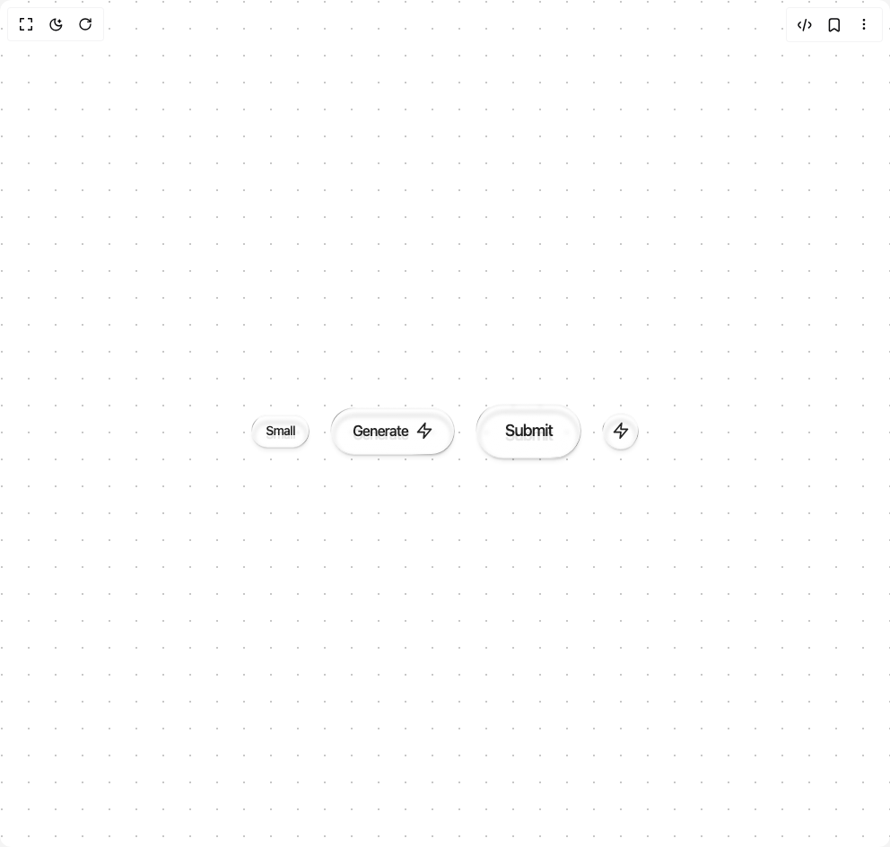

# Build Glass Button in BuilderStudio

> Build this component in our Agentic IDE: [BuilderStudio](https://builderstudio.dev).
>
> Join the BuilderStudio community on [Discord](https://discord.gg/QdWeSGCqfe) and [Reddit](https://reddit.com/r/builderstudio).



## Component

- Author group: `easemize`
- Component: `glass-button`
- Variant: `default`
- Rendered HTML snapshot: [`rendered.html`](rendered.html)

## BuilderStudio prompt

You are implementing a React component based on a component reference.

## Component identity

- Author: easemize
- Component slug: glass-button
- Demo slug: default
- Title: glass-button
- Description: 

## Goal

Recreate this component in a React + TypeScript + Tailwind CSS project. Preserve the visual layout, spacing, colors, border radius, shadows, interaction behavior, animation behavior, responsive behavior, and dark mode behavior shown in the rendered demo.

## Implementation requirements

- Use React and TypeScript.
- Use Tailwind CSS classes whenever possible.
- Keep the component self-contained unless the source files require helper components.
- If the source uses CSS variables, custom CSS, animations, or keyframes, include them.
- If the source uses external packages, list and use the required packages.
- Preserve accessibility attributes, button semantics, links, keyboard behavior, and ARIA attributes when visible in the source.
- Do not replace the component with a simplified placeholder.
- Return complete production-ready code.

## Dependencies

No reference metadata available.

## Rendered DOM snapshot

This is the rendered demo HTML extracted from the live preview. Use it to verify structure, class names, visible content, and layout.

```html
<div id="root"><div class="w-screen min-h-screen flex justify-center items-center"><div class="w-screen min-h-screen flex justify-center items-center"><div class="relative flex h-screen w-full flex-col items-center justify-center gap-8 bg-background p-10"><svg xmlns="http://www.w3.org/2000/svg" height="100%" width="100%" class="pointer-events-none absolute inset-0 z-0"><defs><pattern patternUnits="userSpaceOnUse" height="30" width="30" id="dottedGrid"><circle fill="oklch(from var(--foreground) l c h / 30%)" r="1" cy="2" cx="2"></circle></pattern></defs><rect fill="url(#dottedGrid)" height="100%" width="100%"></rect></svg><div class="z-10 text-center"><div class="mt-4 flex flex-wrap items-center justify-center gap-6"><div class="glass-button-wrap cursor-pointer rounded-full"><button class="glass-button relative isolate all-unset cursor-pointer rounded-full transition-all text-sm font-medium"><span class="glass-button-text relative block select-none tracking-tighter px-4 py-2">Small</span></button><div class="glass-button-shadow rounded-full"></div></div><div class="glass-button-wrap cursor-pointer rounded-full"><button class="glass-button relative isolate all-unset cursor-pointer rounded-full transition-all text-base font-medium"><span class="glass-button-text relative block select-none tracking-tighter px-6 py-3.5 flex items-center gap-2"><span>Generate</span><svg xmlns="http://www.w3.org/2000/svg" width="24" height="24" viewBox="0 0 24 24" fill="none" stroke="currentColor" stroke-width="2" stroke-linecap="round" stroke-linejoin="round" class="h-5 w-5"><polygon points="13 2 3 14 12 14 11 22 21 10 12 10 13 2"></polygon></svg></span></button><div class="glass-button-shadow rounded-full"></div></div><div class="glass-button-wrap cursor-pointer rounded-full"><button class="glass-button relative isolate all-unset cursor-pointer rounded-full transition-all text-lg font-medium"><span class="glass-button-text relative block select-none tracking-tighter px-8 py-4">Submit</span></button><div class="glass-button-shadow rounded-full"></div></div><div class="glass-button-wrap cursor-pointer rounded-full"><button class="glass-button relative isolate all-unset cursor-pointer rounded-full transition-all h-10 w-10"><span class="glass-button-text relative block select-none tracking-tighter flex h-10 w-10 items-center justify-center"><svg xmlns="http://www.w3.org/2000/svg" width="24" height="24" viewBox="0 0 24 24" fill="none" stroke="currentColor" stroke-width="2" stroke-linecap="round" stroke-linejoin="round" class="h-5 w-5"><polygon points="13 2 3 14 12 14 11 22 21 10 12 10 13 2"></polygon></svg></span></button><div class="glass-button-shadow rounded-full"></div></div></div></div></div></div></div></div>
```

## Reference source files

No reference source files were available.
