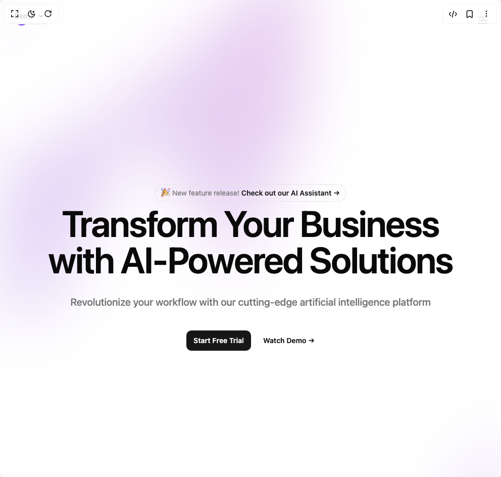

# Build Hero 1 in BuilderStudio

> Build this component in our Agentic IDE: [BuilderStudio](https://builderstudio.dev).
>
> Join the BuilderStudio community on [Discord](https://discord.gg/QdWeSGCqfe) and [Reddit](https://reddit.com/r/builderstudio).



## Component

- Author group: `easemize`
- Component: `hero-1`
- Variant: `default`
- Rendered HTML snapshot: [`rendered.html`](rendered.html)

## BuilderStudio prompt

You are implementing a React component based on a component reference.

## Component identity

- Author: easemize
- Component slug: hero-1
- Demo slug: default
- Title: hero-1
- Description: 

## Goal

Recreate this component in a React + TypeScript + Tailwind CSS project. Preserve the visual layout, spacing, colors, border radius, shadows, interaction behavior, animation behavior, responsive behavior, and dark mode behavior shown in the rendered demo.

## Implementation requirements

- Use React and TypeScript.
- Use Tailwind CSS classes whenever possible.
- Keep the component self-contained unless the source files require helper components.
- If the source uses CSS variables, custom CSS, animations, or keyframes, include them.
- If the source uses external packages, list and use the required packages.
- Preserve accessibility attributes, button semantics, links, keyboard behavior, and ARIA attributes when visible in the source.
- Do not replace the component with a simplified placeholder.
- Return complete production-ready code.

## Dependencies

No reference metadata available.

## Rendered DOM snapshot

This is the rendered demo HTML extracted from the live preview. Use it to verify structure, class names, visible content, and layout.

```html
<div id="root"><div class="fixed top-4 left-4 z-10"><select class="appearance-none h-8 max-w-[200px] text-sm leading-tight rounded-lg pl-3 pr-7 py-0 border bg-background focus:outline-none focus:ring-0"><option value="default_Demo">Demo</option></select><div class="absolute top-1/2 transform -translate-y-1/2 right-2 pointer-events-none"><svg class="w-4 h-4 fill-current" viewBox="0 0 20 20"><path d="M5.516 7.548c.436-.446 1.043-.48 1.576 0L10 10.405l2.908-2.857c.533-.48 1.14-.446 1.576 0 .436.445.408 1.197 0 1.615l-3.734 3.705c-.533.534-1.39.534-1.923 0l-3.734-3.705c-.408-.418-.436-1.17 0-1.615z"></path></svg></div></div><div class="w-screen min-h-screen flex justify-center items-center"><div><div class="min-h-screen w-screen overflow-x-hidden relative min-h-screen"><div aria-hidden="true" class="absolute inset-x-0 -top-40 -z-10 transform-gpu overflow-hidden blur-3xl sm:-top-80 min-h-screen"><div class="relative left-[calc(50%-11rem)] aspect-[1155/678] w-[36.125rem] max-w-none -translate-x-1/2 rotate-[30deg] opacity-30 sm:left-[calc(50%-30rem)] sm:w-[72.1875rem] min-h-screen" style="clip-path: polygon(74.1% 44.1%, 100% 61.6%, 97.5% 26.9%, 85.5% 0.1%, 80.7% 2%, 72.5% 32.5%, 60.2% 62.4%, 52.4% 68.1%, 47.5% 58.3%, 45.2% 34.5%, 27.5% 76.7%, 0.1% 64.9%, 17.9% 100%, 27.6% 76.8%, 76.1% 97.7%, 74.1% 44.1%); background: linear-gradient(to right top, oklch(0.7 0.15 280), oklch(0.6 0.2 320));"></div></div><div aria-hidden="true" class="absolute inset-x-0 top-[calc(100%-13rem)] -z-10 transform-gpu overflow-hidden blur-3xl sm:top-[calc(100%-30rem)] min-h-screen"><div class="relative left-[calc(50%+3rem)] aspect-[1155/678] w-[36.125rem] max-w-none -translate-x-1/2 opacity-30 sm:left-[calc(50%+36rem)] sm:w-[72.1875rem] min-h-screen" style="clip-path: polygon(74.1% 44.1%, 100% 61.6%, 97.5% 26.9%, 85.5% 0.1%, 80.7% 2%, 72.5% 32.5%, 60.2% 62.4%, 52.4% 68.1%, 47.5% 58.3%, 45.2% 34.5%, 27.5% 76.7%, 0.1% 64.9%, 17.9% 100%, 27.6% 76.8%, 76.1% 97.7%, 74.1% 44.1%); background: linear-gradient(to right top, oklch(0.7 0.15 280), oklch(0.6 0.2 320));"></div></div><header class="absolute inset-x-0 top-0 z-1"><nav aria-label="Global" class="flex items-center justify-between p-4 sm:p-6 lg:px-8"><div class="flex lg:flex-1"><a href="#" class="-m-1.5 p-1.5"><span class="sr-only">Acme Corp</span></a></div><div class="flex lg:hidden"><button type="button" class="-m-2.5 inline-flex items-center justify-center rounded-md p-2.5 text-muted-foreground hover:text-foreground transition-colors"><span class="sr-only">Open main menu</span><svg xmlns="http://www.w3.org/2000/svg" width="24" height="24" viewBox="0 0 24 24" fill="none" stroke="currentColor" stroke-width="2" stroke-linecap="round" stroke-linejoin="round" class="lucide lucide-menu size-6" aria-hidden="true"><line x1="4" x2="20" y1="12" y2="12"></line><line x1="4" x2="20" y1="6" y2="6"></line><line x1="4" x2="20" y1="18" y2="18"></line></svg></button></div><div class="hidden lg:flex lg:gap-x-8 xl:gap-x-12"><a href="/solutions" class="text-sm/6 font-semibold text-foreground hover:text-muted-foreground transition-colors">Solutions</a><a href="/pricing" class="text-sm/6 font-semibold text-foreground hover:text-muted-foreground transition-colors">Pricing</a><a href="/resources" class="text-sm/6 font-semibold text-foreground hover:text-muted-foreground transition-colors">Resources</a><a href="/about" class="text-sm/6 font-semibold text-foreground hover:text-muted-foreground transition-colors">About</a><a href="/contact" class="text-sm/6 font-semibold text-foreground hover:text-muted-foreground transition-colors">Contact</a></div><div class="hidden lg:flex lg:flex-1 lg:justify-end"><a href="/login" class="text-sm/6 font-semibold text-foreground hover:text-muted-foreground transition-colors">Sign In <span aria-hidden="true">→</span></a></div></nav></header><div class="relative isolate px-6 pt-4 overflow-hidden min-h-screen flex flex-col justify-center"><div class="mx-auto max-w-4xl pt-20 sm:pt-25"><div class="hidden sm:mb-2 sm:flex sm:justify-center"><div class="relative rounded-full px-2 py-1 text-xs sm:px-3 sm:text-sm/6 text-muted-foreground ring-1 ring-border hover:ring-ring transition-all">🎉 New feature release! <a href="/features/ai-assistant" class="font-semibold text-primary hover:text-primary/80 transition-colors"><span aria-hidden="true" class="absolute inset-0"></span>Check out our AI Assistant <span aria-hidden="true">→</span></a></div></div><div class="text-center"><h1 class="text-3xl sm:text-5xl md:text-7xl font-semibold tracking-tight text-balance text-foreground">Transform Your Business with AI-Powered Solutions</h1><p class="mt-6 sm:mt-8 text-base sm:text-lg font-medium text-pretty text-muted-foreground sm:text-xl/8">Revolutionize your workflow with our cutting-edge artificial intelligence platform</p><div class="mt-8 sm:mt-10 flex items-center justify-center gap-x-4 sm:gap-x-6"><a href="/signup" class="rounded-lg bg-primary px-3 py-2 sm:px-3.5 sm:py-2.5 text-xs sm:text-sm font-semibold text-primary-foreground shadow-sm hover:bg-primary/90 focus-visible:outline-2 focus-visible:outline-offset-2 focus-visible:outline-ring transition-colors">Start Free Trial</a><a href="/demo" class="text-xs sm:text-sm/6 font-semibold text-foreground hover:text-muted-foreground transition-colors">Watch Demo <span aria-hidden="true">→</span></a></div></div></div></div></div></div></div></div>
```

## Reference source files

No reference source files were available.
