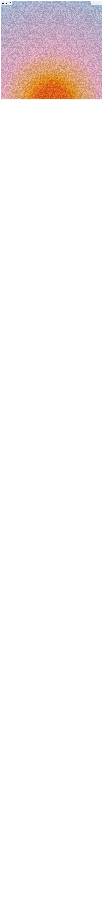

# Build Noisy Gradient Backgrounds in BuilderStudio

> Build this component in our Agentic IDE: [BuilderStudio](https://builderstudio.dev).
>
> Join the BuilderStudio community on [Discord](https://discord.gg/QdWeSGCqfe) and [Reddit](https://reddit.com/r/builderstudio).



## Component

- Author group: `easemize`
- Component: `noisy-gradient-backgrounds`
- Variant: `default`
- Rendered HTML snapshot: [`rendered.html`](rendered.html)

## BuilderStudio prompt

You are implementing a React component based on a component reference.

## Component identity

- Author: easemize
- Component slug: noisy-gradient-backgrounds
- Demo slug: default
- Title: noisy-gradient-backgrounds
- Description: 

## Goal

Recreate this component in a React + TypeScript + Tailwind CSS project. Preserve the visual layout, spacing, colors, border radius, shadows, interaction behavior, animation behavior, responsive behavior, and dark mode behavior shown in the rendered demo.

## Implementation requirements

- Use React and TypeScript.
- Use Tailwind CSS classes whenever possible.
- Keep the component self-contained unless the source files require helper components.
- If the source uses CSS variables, custom CSS, animations, or keyframes, include them.
- If the source uses external packages, list and use the required packages.
- Preserve accessibility attributes, button semantics, links, keyboard behavior, and ARIA attributes when visible in the source.
- Do not replace the component with a simplified placeholder.
- Return complete production-ready code.

## Dependencies

No reference metadata available.

## Rendered DOM snapshot

This is the rendered demo HTML extracted from the live preview. Use it to verify structure, class names, visible content, and layout.

```html
<div id="root"><div class="w-full p-2"> <div class="h-screen w-full relative rounded-2xl border border-white/20 overflow-hidden mb-2"><div class="absolute inset-0 w-full h-full " style="background: radial-gradient(125% 125% at 50% 101%, rgb(245, 87, 2) 10.5%, rgb(245, 120, 2) 16%, rgb(245, 140, 2) 17.5%, rgb(245, 170, 100) 25%, rgb(238, 174, 202) 40%, rgb(202, 179, 214) 65%, rgb(148, 201, 233) 100%);"><canvas class="absolute inset-0 w-full h-full pointer-events-none" width="974" height="942"></canvas></div></div><div class="h-screen w-full relative rounded-2xl border border-white/20 overflow-hidden mb-2"><div class="absolute inset-0 w-full h-full " style="background: radial-gradient(125% 125% at 0% -1%, rgb(0, 20, 30) 0%, rgb(0, 51, 78) 20%, rgb(0, 119, 182) 50%, rgb(3, 169, 244) 75%, rgb(173, 216, 230) 100%);"><canvas class="absolute inset-0 w-full h-full pointer-events-none" width="974" height="942"></canvas></div></div><div class="h-screen w-full relative rounded-2xl border border-white/20 overflow-hidden mb-2"><div class="absolute inset-0 w-full h-full " style="background: radial-gradient(125% 125% at 101% 50%, rgb(10, 38, 10) 0%, rgb(0, 77, 64) 25%, rgb(46, 125, 50) 50%, rgb(129, 199, 132) 75%, rgb(200, 230, 201) 100%);"><canvas class="absolute inset-0 w-full h-full pointer-events-none" width="974" height="942"></canvas></div></div><div class="h-screen w-full relative rounded-2xl border border-white/20 overflow-hidden mb-2"><div class="absolute inset-0 w-full h-full " style="background: radial-gradient(150% 150%, rgb(26, 20, 50) 0%, rgb(76, 17, 88) 25%, rgb(142, 68, 173) 50%, rgb(233, 30, 99) 75%, rgb(255, 110, 199) 100%);"><canvas class="absolute inset-0 w-full h-full pointer-events-none" width="974" height="942"></canvas></div></div><div class="h-screen w-full relative rounded-2xl border border-white/20 overflow-hidden mb-2"><div class="absolute inset-0 w-full h-full " style="background: radial-gradient(125% 125% at 100% 101%, rgb(120, 40, 40) 0%, rgb(188, 71, 73) 30%, rgb(244, 143, 177) 60%, rgb(252, 207, 178) 85%, rgb(255, 235, 215) 100%);"><canvas class="absolute inset-0 w-full h-full pointer-events-none" width="974" height="942"></canvas></div></div><div class="h-screen w-full relative rounded-2xl border border-white/20 overflow-hidden mb-2"><div class="absolute inset-0 w-full h-full " style="background: radial-gradient(125% 125% at -1% 50%, rgb(50, 0, 0) 0%, rgb(183, 28, 28) 30%, rgb(244, 67, 54) 60%, rgb(255, 152, 0) 85%, rgb(255, 235, 59) 100%);"><canvas class="absolute inset-0 w-full h-full pointer-events-none" width="974" height="942"></canvas></div></div><div class="h-screen w-full relative rounded-2xl border border-white/20 overflow-hidden mb-2"><div class="absolute inset-0 w-full h-full " style="background: radial-gradient(125% 125% at 100% -1%, rgb(49, 27, 69) 0%, rgb(94, 53, 177) 30%, rgb(179, 157, 219) 60%, rgb(237, 231, 246) 85%, rgb(250, 250, 250) 100%);"><canvas class="absolute inset-0 w-full h-full pointer-events-none" width="974" height="942"></canvas></div></div><div class="h-screen w-full relative rounded-2xl border border-white/20 overflow-hidden mb-2"><div class="absolute inset-0 w-full h-full " style="background: radial-gradient(125% 125% at 50% -1%, rgb(38, 50, 56) 0%, rgb(84, 110, 122) 30%, rgb(176, 190, 197) 60%, rgb(236, 239, 241) 85%, rgb(255, 255, 255) 100%);"><canvas class="absolute inset-0 w-full h-full pointer-events-none" width="974" height="942"></canvas></div></div><div class="h-screen w-full relative rounded-2xl border border-white/20 overflow-hidden"> <div class="absolute inset-0 w-full h-full " style="background: radial-gradient(125% 125% at 0% 101%, rgb(255, 0, 150) 0%, rgb(200, 0, 200) 30%, rgb(0, 150, 255) 60%, rgb(0, 200, 200) 85%, rgb(255, 255, 100) 100%);"><canvas class="absolute inset-0 w-full h-full pointer-events-none" width="974" height="942"></canvas></div></div></div></div>
```

## Reference source files

No reference source files were available.
