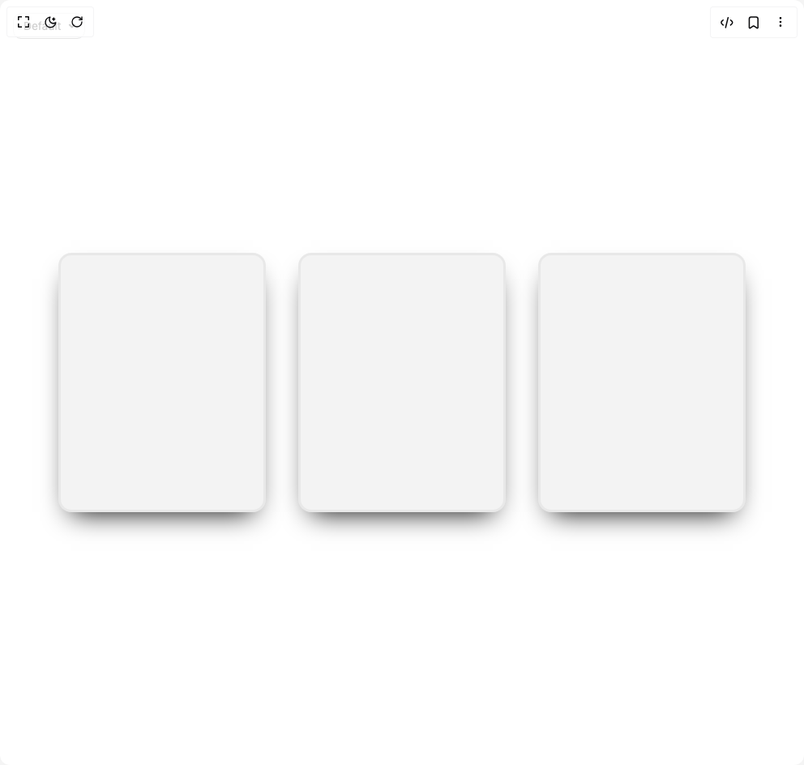

# Build Spotlight Card in BuilderStudio

> Build this component in our Agentic IDE: [BuilderStudio](https://builderstudio.dev).
>
> Join the BuilderStudio community on [Discord](https://discord.gg/QdWeSGCqfe) and [Reddit](https://reddit.com/r/builderstudio).



## Component

- Author group: `easemize`
- Component: `spotlight-card`
- Variant: `default`
- Rendered HTML snapshot: [`rendered.html`](rendered.html)

## BuilderStudio prompt

You are implementing a React component based on a component reference.

## Component identity

- Author: easemize
- Component slug: spotlight-card
- Demo slug: default
- Title: spotlight-card
- Description: 

## Goal

Recreate this component in a React + TypeScript + Tailwind CSS project. Preserve the visual layout, spacing, colors, border radius, shadows, interaction behavior, animation behavior, responsive behavior, and dark mode behavior shown in the rendered demo.

## Implementation requirements

- Use React and TypeScript.
- Use Tailwind CSS classes whenever possible.
- Keep the component self-contained unless the source files require helper components.
- If the source uses CSS variables, custom CSS, animations, or keyframes, include them.
- If the source uses external packages, list and use the required packages.
- Preserve accessibility attributes, button semantics, links, keyboard behavior, and ARIA attributes when visible in the source.
- Do not replace the component with a simplified placeholder.
- Return complete production-ready code.

## Dependencies

No reference metadata available.

## Rendered DOM snapshot

This is the rendered demo HTML extracted from the live preview. Use it to verify structure, class names, visible content, and layout.

```html
<div id="root"><div class="fixed top-4 left-4 z-10"><select class="appearance-none h-8 max-w-[200px] text-sm leading-tight rounded-lg pl-3 pr-7 py-0 border bg-background focus:outline-none focus:ring-0"><option value="named_Default_Default">Default</option></select><div class="absolute top-1/2 transform -translate-y-1/2 right-2 pointer-events-none"><svg class="w-4 h-4 fill-current" viewBox="0 0 20 20"><path d="M5.516 7.548c.436-.446 1.043-.48 1.576 0L10 10.405l2.908-2.857c.533-.48 1.14-.446 1.576 0 .436.445.408 1.197 0 1.615l-3.734 3.705c-.533.534-1.39.534-1.923 0l-3.734-3.705c-.408-.418-.436-1.17 0-1.615z"></path></svg></div></div><div class="w-screen min-h-screen flex justify-center items-center"><div class="w-screen h-screen flex flex-row items-center justify-center gap-10 custom-cursor"><style>
    [data-glow]::before,
    [data-glow]::after {
      pointer-events: none;
      content: "";
      position: absolute;
      inset: calc(var(--border-size) * -1);
      border: var(--border-size) solid transparent;
      border-radius: calc(var(--radius) * 1px);
      background-attachment: fixed;
      background-size: calc(100% + (2 * var(--border-size))) calc(100% + (2 * var(--border-size)));
      background-repeat: no-repeat;
      background-position: 50% 50%;
      mask: linear-gradient(transparent, transparent), linear-gradient(white, white);
      mask-clip: padding-box, border-box;
      mask-composite: intersect;
    }
    
    [data-glow]::before {
      background-image: radial-gradient(
        calc(var(--spotlight-size) * 0.75) calc(var(--spotlight-size) * 0.75) at
        calc(var(--x, 0) * 1px)
        calc(var(--y, 0) * 1px),
        hsl(var(--hue, 210) calc(var(--saturation, 100) * 1%) calc(var(--lightness, 50) * 1%) / var(--border-spot-opacity, 1)), transparent 100%
      );
      filter: brightness(2);
    }
    
    [data-glow]::after {
      background-image: radial-gradient(
        calc(var(--spotlight-size) * 0.5) calc(var(--spotlight-size) * 0.5) at
        calc(var(--x, 0) * 1px)
        calc(var(--y, 0) * 1px),
        hsl(0 100% 100% / var(--border-light-opacity, 1)), transparent 100%
      );
    }
    
    [data-glow] [data-glow] {
      position: absolute;
      inset: 0;
      will-change: filter;
      opacity: var(--outer, 1);
      border-radius: calc(var(--radius) * 1px);
      border-width: calc(var(--border-size) * 20);
      filter: blur(calc(var(--border-size) * 10));
      background: none;
      pointer-events: none;
      border: none;
    }
    
    [data-glow] > [data-glow]::before {
      inset: -10px;
      border-width: 10px;
    }
  </style><div data-glow="true" class="
          w-64 h-80
          aspect-[3/4]
          rounded-2xl 
          relative 
          grid 
          grid-rows-[1fr_auto] 
          shadow-[0_1rem_2rem_-1rem_black] 
          p-4 
          gap-4 
          backdrop-blur-[5px]
          
        " style="--base: 220; --spread: 200; --radius: 14; --border: 3; --backdrop: hsl(0 0% 60% / 0.12); --backup-border: var(--backdrop); --size: 200; --outer: 1; --border-size: calc(var(--border, 2) * 1px); --spotlight-size: calc(var(--size, 150) * 1px); --hue: calc(var(--base) + (var(--xp, 0) * var(--spread, 0))); background-image: radial-gradient(
        var(--spotlight-size) var(--spotlight-size) at
        calc(var(--x, 0) * 1px)
        calc(var(--y, 0) * 1px),
        hsl(var(--hue, 210) calc(var(--saturation, 100) * 1%) calc(var(--lightness, 70) * 1%) / var(--bg-spot-opacity, 0.1)), transparent
      ); background-color: var(--backdrop, transparent); background-size: calc(100% + (2 * var(--border-size))) calc(100% + (2 * var(--border-size))); background-position: 50% 50%; background-attachment: fixed; border: var(--border-size) solid var(--backup-border); position: relative; touch-action: none;"><div data-glow="true"></div></div><style>
    [data-glow]::before,
    [data-glow]::after {
      pointer-events: none;
      content: "";
      position: absolute;
      inset: calc(var(--border-size) * -1);
      border: var(--border-size) solid transparent;
      border-radius: calc(var(--radius) * 1px);
      background-attachment: fixed;
      background-size: calc(100% + (2 * var(--border-size))) calc(100% + (2 * var(--border-size)));
      background-repeat: no-repeat;
      background-position: 50% 50%;
      mask: linear-gradient(transparent, transparent), linear-gradient(white, white);
      mask-clip: padding-box, border-box;
      mask-composite: intersect;
    }
    
    [data-glow]::before {
      background-image: radial-gradient(
        calc(var(--spotlight-size) * 0.75) calc(var(--spotlight-size) * 0.75) at
        calc(var(--x, 0) * 1px)
        calc(var(--y, 0) * 1px),
        hsl(var(--hue, 210) calc(var(--saturation, 100) * 1%) calc(var(--lightness, 50) * 1%) / var(--border-spot-opacity, 1)), transparent 100%
      );
      filter: brightness(2);
    }
    
    [data-glow]::after {
      background-image: radial-gradient(
        calc(var(--spotlight-size) * 0.5) calc(var(--spotlight-size) * 0.5) at
        calc(var(--x, 0) * 1px)
        calc(var(--y, 0) * 1px),
        hsl(0 100% 100% / var(--border-light-opacity, 1)), transparent 100%
      );
    }
    
    [data-glow] [data-glow] {
      position: absolute;
      inset: 0;
      will-change: filter;
      opacity: var(--outer, 1);
      border-radius: calc(var(--radius) * 1px);
      border-width: calc(var(--border-size) * 20);
      filter: blur(calc(var(--border-size) * 10));
      background: none;
      pointer-events: none;
      border: none;
    }
    
    [data-glow] > [data-glow]::before {
      inset: -10px;
      border-width: 10px;
    }
  </style><div data-glow="true" class="
          w-64 h-80
          aspect-[3/4]
          rounded-2xl 
          relative 
          grid 
          grid-rows-[1fr_auto] 
          shadow-[0_1rem_2rem_-1rem_black] 
          p-4 
          gap-4 
          backdrop-blur-[5px]
          
        " style="--base: 220; --spread: 200; --radius: 14; --border: 3; --backdrop: hsl(0 0% 60% / 0.12); --backup-border: var(--backdrop); --size: 200; --outer: 1; --border-size: calc(var(--border, 2) * 1px); --spotlight-size: calc(var(--size, 150) * 1px); --hue: calc(var(--base) + (var(--xp, 0) * var(--spread, 0))); background-image: radial-gradient(
        var(--spotlight-size) var(--spotlight-size) at
        calc(var(--x, 0) * 1px)
        calc(var(--y, 0) * 1px),
        hsl(var(--hue, 210) calc(var(--saturation, 100) * 1%) calc(var(--lightness, 70) * 1%) / var(--bg-spot-opacity, 0.1)), transparent
      ); background-color: var(--backdrop, transparent); background-size: calc(100% + (2 * var(--border-size))) calc(100% + (2 * var(--border-size))); background-position: 50% 50%; background-attachment: fixed; border: var(--border-size) solid var(--backup-border); position: relative; touch-action: none;"><div data-glow="true"></div></div><style>
    [data-glow]::before,
    [data-glow]::after {
      pointer-events: none;
      content: "";
      position: absolute;
      inset: calc(var(--border-size) * -1);
      border: var(--border-size) solid transparent;
      border-radius: calc(var(--radius) * 1px);
      background-attachment: fixed;
      background-size: calc(100% + (2 * var(--border-size))) calc(100% + (2 * var(--border-size)));
      background-repeat: no-repeat;
      background-position: 50% 50%;
      mask: linear-gradient(transparent, transparent), linear-gradient(white, white);
      mask-clip: padding-box, border-box;
      mask-composite: intersect;
    }
    
    [data-glow]::before {
      background-image: radial-gradient(
        calc(var(--spotlight-size) * 0.75) calc(var(--spotlight-size) * 0.75) at
        calc(var(--x, 0) * 1px)
        calc(var(--y, 0) * 1px),
        hsl(var(--hue, 210) calc(var(--saturation, 100) * 1%) calc(var(--lightness, 50) * 1%) / var(--border-spot-opacity, 1)), transparent 100%
      );
      filter: brightness(2);
    }
    
    [data-glow]::after {
      background-image: radial-gradient(
        calc(var(--spotlight-size) * 0.5) calc(var(--spotlight-size) * 0.5) at
        calc(var(--x, 0) * 1px)
        calc(var(--y, 0) * 1px),
        hsl(0 100% 100% / var(--border-light-opacity, 1)), transparent 100%
      );
    }
    
    [data-glow] [data-glow] {
      position: absolute;
      inset: 0;
      will-change: filter;
      opacity: var(--outer, 1);
      border-radius: calc(var(--radius) * 1px);
      border-width: calc(var(--border-size) * 20);
      filter: blur(calc(var(--border-size) * 10));
      background: none;
      pointer-events: none;
      border: none;
    }
    
    [data-glow] > [data-glow]::before {
      inset: -10px;
      border-width: 10px;
    }
  </style><div data-glow="true" class="
          w-64 h-80
          aspect-[3/4]
          rounded-2xl 
          relative 
          grid 
          grid-rows-[1fr_auto] 
          shadow-[0_1rem_2rem_-1rem_black] 
          p-4 
          gap-4 
          backdrop-blur-[5px]
          
        " style="--base: 220; --spread: 200; --radius: 14; --border: 3; --backdrop: hsl(0 0% 60% / 0.12); --backup-border: var(--backdrop); --size: 200; --outer: 1; --border-size: calc(var(--border, 2) * 1px); --spotlight-size: calc(var(--size, 150) * 1px); --hue: calc(var(--base) + (var(--xp, 0) * var(--spread, 0))); background-image: radial-gradient(
        var(--spotlight-size) var(--spotlight-size) at
        calc(var(--x, 0) * 1px)
        calc(var(--y, 0) * 1px),
        hsl(var(--hue, 210) calc(var(--saturation, 100) * 1%) calc(var(--lightness, 70) * 1%) / var(--bg-spot-opacity, 0.1)), transparent
      ); background-color: var(--backdrop, transparent); background-size: calc(100% + (2 * var(--border-size))) calc(100% + (2 * var(--border-size))); background-position: 50% 50%; background-attachment: fixed; border: var(--border-size) solid var(--backup-border); position: relative; touch-action: none;"><div data-glow="true"></div></div></div></div></div>
```

## Reference source files

No reference source files were available.
