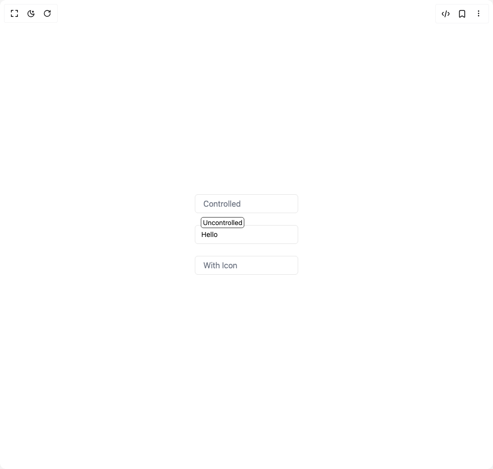
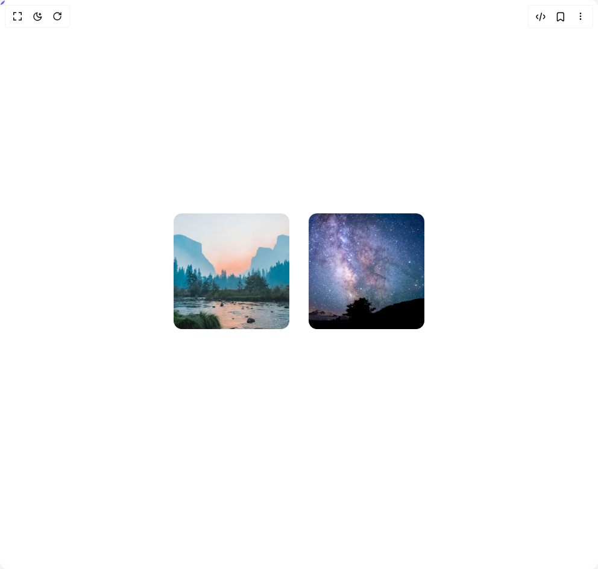
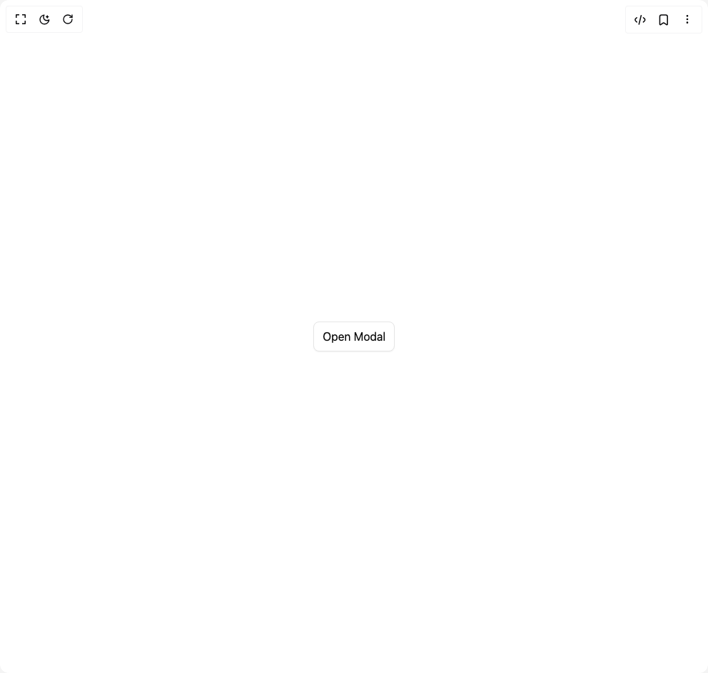
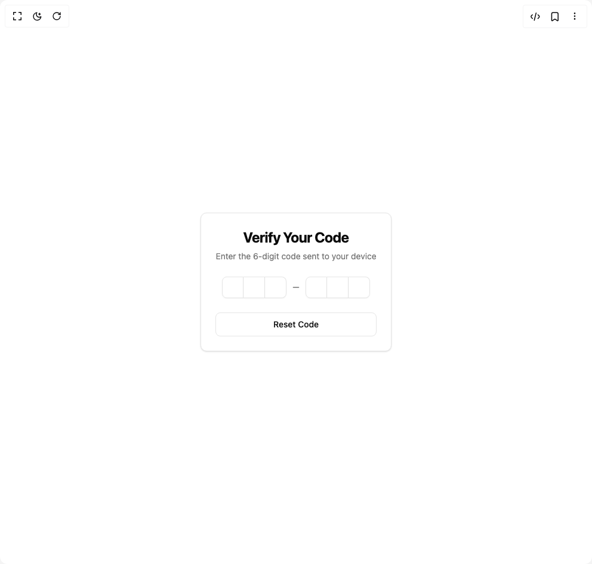
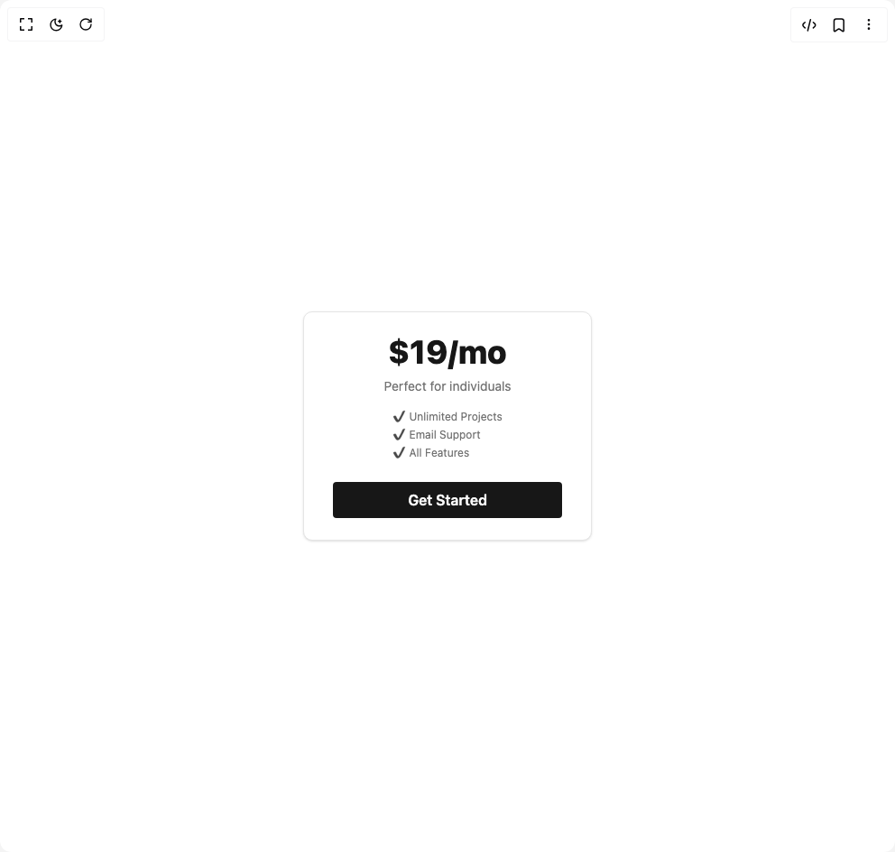
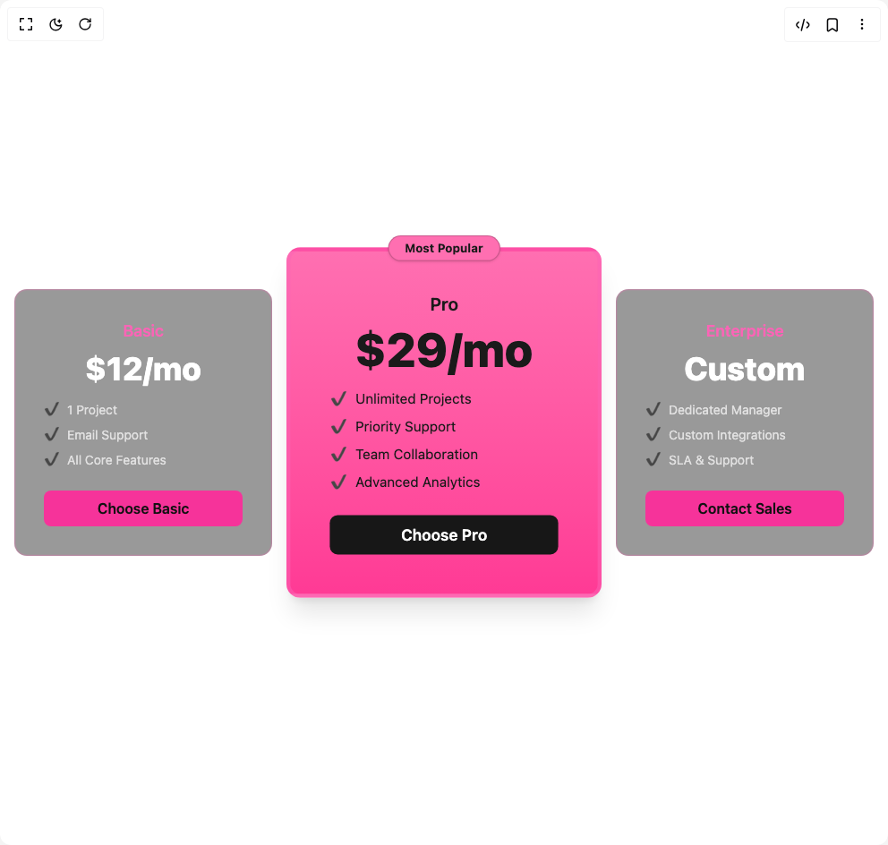

# Educalvolpz Components

10 components are available in this author group.

> Build any component in [BuilderStudio](https://builderstudio.dev), then share improvements with the community on [Discord](https://discord.gg/QdWeSGCqfe) or [Reddit](https://reddit.com/r/builderstudio).

| Preview | Component | Variant |
| --- | --- | --- |
|  | [Accordion 1](accordion-1/default/README.md) | `default` |
|  | [Accordion 2](accordion-2/default/README.md) | `default` |
|  | [Animated Input](animated-input/default/README.md) | `default` |
|  | [Animated Progress Bar](animated-progress-bar/default/README.md) | `default` |
|  | [Cursor Follow](cursor-follow/default/README.md) | `default` |
|  | [Modal](modal/default/README.md) | `default` |
|  | [Otp Input](otp-input/default/README.md) | `default` |
|  | [Pricing Blocks](pricing-blocks/creative-pricing/README.md) | `creative-pricing` |
|  | [Pricing Blocks](pricing-blocks/default/README.md) | `default` |
|  | [Pricing Blocks](pricing-blocks/modern-pricing/README.md) | `modern-pricing` |
