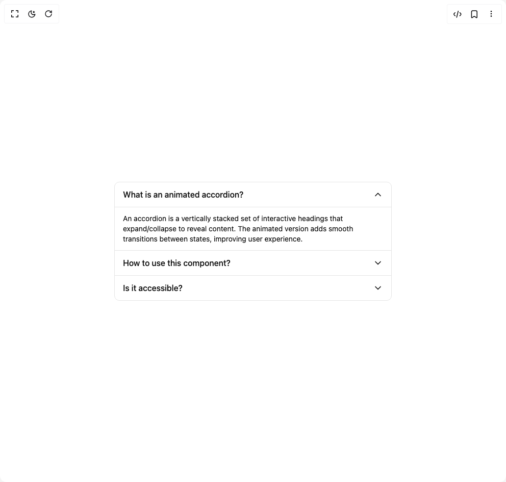

# Build Accordion 1 in BuilderStudio

> Build this component in our Agentic IDE: [BuilderStudio](https://builderstudio.dev).
>
> Join the BuilderStudio community on [Discord](https://discord.gg/QdWeSGCqfe) and [Reddit](https://reddit.com/r/builderstudio).



## Component

- Author group: `educalvolpz`
- Component: `accordion-1`
- Variant: `default`
- Rendered HTML snapshot: [`rendered.html`](rendered.html)

## BuilderStudio prompt

You are implementing a React component based on a component reference.

## Component identity

- Author: educalvolpz
- Component slug: accordion-1
- Demo slug: default
- Title: accordion-1
- Description: 

## Goal

Recreate this component in a React + TypeScript + Tailwind CSS project. Preserve the visual layout, spacing, colors, border radius, shadows, interaction behavior, animation behavior, responsive behavior, and dark mode behavior shown in the rendered demo.

## Implementation requirements

- Use React and TypeScript.
- Use Tailwind CSS classes whenever possible.
- Keep the component self-contained unless the source files require helper components.
- If the source uses CSS variables, custom CSS, animations, or keyframes, include them.
- If the source uses external packages, list and use the required packages.
- Preserve accessibility attributes, button semantics, links, keyboard behavior, and ARIA attributes when visible in the source.
- Do not replace the component with a simplified placeholder.
- Return complete production-ready code.

## Dependencies

No reference metadata available.

## Rendered DOM snapshot

This is the rendered demo HTML extracted from the live preview. Use it to verify structure, class names, visible content, and layout.

```html
<div id="root"><div class="w-screen min-h-screen flex justify-center items-center"><div class="w-screen min-h-screen flex justify-center items-center"><div class="w-full max-w-xl p-4"><div class="divide-border flex w-full flex-col divide-y overflow-hidden rounded-lg border bg-background border"><div class="overflow-hidden"><button class="hover:bg-primary flex w-full items-center justify-between gap-2 px-4 py-3 text-left transition-colors" aria-expanded="true"><h3 class="font-medium">What is an animated accordion?</h3><div class="flex-shrink-0" style="transform: rotate(180deg);"><svg xmlns="http://www.w3.org/2000/svg" width="24" height="24" viewBox="0 0 24 24" fill="none" stroke="currentColor" stroke-width="2" stroke-linecap="round" stroke-linejoin="round" class="lucide lucide-chevron-down h-5 w-5" aria-hidden="true"><path d="m6 9 6 6 6-6"></path></svg></div></button><div class="overflow-hidden" style="height: auto; opacity: 1;"><div class="border-t px-4 py-3"><p class="text-sm">An accordion is a vertically stacked set of interactive headings that expand/collapse to reveal content. The animated version adds smooth transitions between states, improving user experience.</p></div></div></div><div class="overflow-hidden"><button class="hover:bg-primary flex w-full items-center justify-between gap-2 px-4 py-3 text-left transition-colors" aria-expanded="false"><h3 class="font-medium">How to use this component?</h3><div class="flex-shrink-0" style="transform: none;"><svg xmlns="http://www.w3.org/2000/svg" width="24" height="24" viewBox="0 0 24 24" fill="none" stroke="currentColor" stroke-width="2" stroke-linecap="round" stroke-linejoin="round" class="lucide lucide-chevron-down h-5 w-5" aria-hidden="true"><path d="m6 9 6 6 6-6"></path></svg></div></button></div><div class="overflow-hidden"><button class="hover:bg-primary flex w-full items-center justify-between gap-2 px-4 py-3 text-left transition-colors" aria-expanded="false"><h3 class="font-medium">Is it accessible?</h3><div class="flex-shrink-0" style="transform: none;"><svg xmlns="http://www.w3.org/2000/svg" width="24" height="24" viewBox="0 0 24 24" fill="none" stroke="currentColor" stroke-width="2" stroke-linecap="round" stroke-linejoin="round" class="lucide lucide-chevron-down h-5 w-5" aria-hidden="true"><path d="m6 9 6 6 6-6"></path></svg></div></button></div></div></div></div></div></div>
```

## Reference source files

No reference source files were available.
