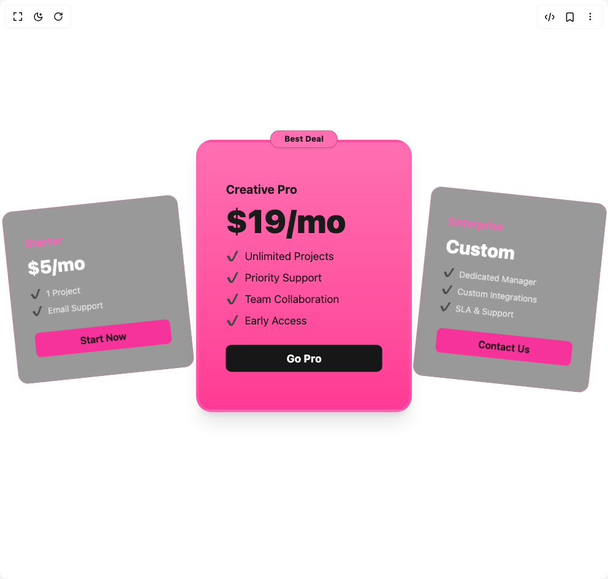

# Build Pricing Blocks in BuilderStudio

> Build this component in our Agentic IDE: [BuilderStudio](https://builderstudio.dev).
>
> Join the BuilderStudio community on [Discord](https://discord.gg/QdWeSGCqfe) and [Reddit](https://reddit.com/r/builderstudio).



## Component

- Author group: `educalvolpz`
- Component: `pricing-blocks`
- Variant: `creative-pricing`
- Rendered HTML snapshot: [`rendered.html`](rendered.html)

## BuilderStudio prompt

You are implementing a React component based on a component reference.

## Component identity

- Author: educalvolpz
- Component slug: pricing-blocks
- Demo slug: creative-pricing
- Title: pricing-blocks
- Description: 

## Goal

Recreate this component in a React + TypeScript + Tailwind CSS project. Preserve the visual layout, spacing, colors, border radius, shadows, interaction behavior, animation behavior, responsive behavior, and dark mode behavior shown in the rendered demo.

## Implementation requirements

- Use React and TypeScript.
- Use Tailwind CSS classes whenever possible.
- Keep the component self-contained unless the source files require helper components.
- If the source uses CSS variables, custom CSS, animations, or keyframes, include them.
- If the source uses external packages, list and use the required packages.
- Preserve accessibility attributes, button semantics, links, keyboard behavior, and ARIA attributes when visible in the source.
- Do not replace the component with a simplified placeholder.
- Return complete production-ready code.

## Dependencies

No reference metadata available.

## Rendered DOM snapshot

This is the rendered demo HTML extracted from the live preview. Use it to verify structure, class names, visible content, and layout.

```html
<div id="root"><div class="w-screen min-h-screen flex justify-center items-center"><div class="w-screen min-h-screen flex justify-center items-center"><section class="relative flex flex-col items-center py-24"><div class="flex flex-col items-center justify-center gap-8 md:flex-row"><div class="relative z-10 w-72 rounded-2xl border border-pink-400/30 bg-black/40 px-8 py-10 text-foreground shadow-[0_0_0_1px_rgba(255,105,180,.08)_inset] backdrop-blur-md transition-transform hover:scale-105" style="opacity: 1; transform: rotate(-6deg);"><div class="mb-2 text-lg font-bold text-pink-400">Starter</div><div class="mb-4 text-3xl font-extrabold text-white">$5/mo</div><ul class="mb-6 space-y-2 text-sm text-white/70"><li><span class="mr-2 text-emerald-400">✔</span>1 Project</li><li><span class="mr-2 text-emerald-400">✔</span>Email Support</li></ul><button class="w-full rounded-md bg-pink-500 py-2 font-semibold text-[#111] hover:bg-pink-400 transition">Start Now</button></div><div class="relative z-20 w-80 scale-110 rounded-3xl border-4 border-pink-400/50 bg-gradient-to-b from-[#ff6fb1] to-[#ff3a95] px-10 py-14 text-[#1a1a1a] shadow-xl transition-transform hover:scale-[1.12]" style="opacity: 1; transform: translateY(-20px);"><div class="absolute -top-6 left-1/2 -translate-x-1/2 rounded-full border border-black/20 bg-[#ff6fb1] px-5 py-1 text-xs font-extrabold text-[#1a1a1a] shadow" style="transform: translateY(6.08217px);">Best Deal</div><div class="mb-2 text-lg font-bold">Creative Pro</div><div class="mb-4 text-5xl font-black">$19/mo</div><ul class="mb-6 space-y-2 text-base"><li><span class="mr-2 text-emerald-600">✔</span>Unlimited Projects</li><li><span class="mr-2 text-emerald-600">✔</span>Priority Support</li><li><span class="mr-2 text-emerald-600">✔</span>Team Collaboration</li><li><span class="mr-2 text-emerald-600">✔</span>Early Access</li></ul><button class="w-full rounded-md bg-neutral-900 py-2 font-bold text-white hover:bg-neutral-800 transition">Go Pro</button></div><div class="relative z-10 w-72 rounded-2xl border border-pink-400/30 bg-black/40 px-8 py-10 text-foreground shadow-[0_0_0_1px_rgba(255,105,180,.08)_inset] backdrop-blur-md transition-transform hover:scale-105" style="opacity: 1; transform: rotate(6deg);"><div class="mb-2 text-lg font-bold text-pink-400">Enterprise</div><div class="mb-4 text-3xl font-extrabold text-white">Custom</div><ul class="mb-6 space-y-2 text-sm text-white/70"><li><span class="mr-2 text-emerald-400">✔</span>Dedicated Manager</li><li><span class="mr-2 text-emerald-400">✔</span>Custom Integrations</li><li><span class="mr-2 text-emerald-400">✔</span>SLA &amp; Support</li></ul><button class="w-full rounded-md bg-pink-500 py-2 font-semibold text-[#111] hover:bg-pink-400 transition">Contact Us</button></div></div></section></div></div></div>
```

## Reference source files

No reference source files were available.
