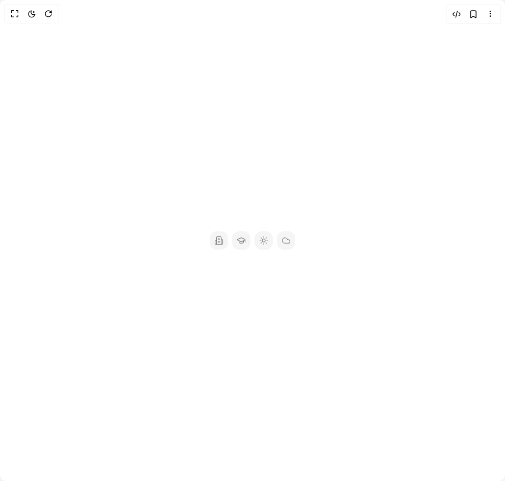

# Build Icon Bar in BuilderStudio

> Build this component in our Agentic IDE: [BuilderStudio](https://builderstudio.dev).
>
> Join the BuilderStudio community on [Discord](https://discord.gg/QdWeSGCqfe) and [Reddit](https://reddit.com/r/builderstudio).



## Component

- Author group: `edwinvakayil`
- Component: `icon-bar`
- Variant: `default`
- Rendered HTML snapshot: [`rendered.html`](rendered.html)

## BuilderStudio prompt

You are implementing a React component based on a component reference.

## Component identity

- Author: edwinvakayil
- Component slug: icon-bar
- Demo slug: default
- Title: icon-bar
- Description: 

## Goal

Recreate this component in a React + TypeScript + Tailwind CSS project. Preserve the visual layout, spacing, colors, border radius, shadows, interaction behavior, animation behavior, responsive behavior, and dark mode behavior shown in the rendered demo.

## Implementation requirements

- Use React and TypeScript.
- Use Tailwind CSS classes whenever possible.
- Keep the component self-contained unless the source files require helper components.
- If the source uses CSS variables, custom CSS, animations, or keyframes, include them.
- If the source uses external packages, list and use the required packages.
- Preserve accessibility attributes, button semantics, links, keyboard behavior, and ARIA attributes when visible in the source.
- Do not replace the component with a simplified placeholder.
- Return complete production-ready code.

## Dependencies

No reference metadata available.

## Rendered DOM snapshot

This is the rendered demo HTML extracted from the live preview. Use it to verify structure, class names, visible content, and layout.

```html
<div id="root"><div class="w-screen min-h-screen flex justify-center items-center"><div class="w-screen min-h-screen flex justify-center items-center"><div aria-orientation="horizontal" class="[--ic-background:#ffffff] [--ic-foreground:#111111] [--ic-primary:#111111] [--ic-secondary:#646b75] [--ic-surface-border:#e9edf2] [--ic-border:#e3e7ec] [--ic-card:#ffffff] [--ic-card-foreground:#111111] [--ic-muted:#f5f7fa] [--ic-muted-foreground:#6d7480] [--ic-accent:#f3f5f8] [--ic-accent-foreground:#111111] [--ic-input:#e3e7ec] [--ic-ring:rgba(17,17,17,0.16)] [--ic-destructive:#dc2626] [--ic-paper:#fcfcfd] [--ic-popover-foreground:#111111] [--ic-brand:#0ea5e9] [--ic-brand-soft:#bae6fd] [--ic-shadow-soft:0_18px_38px_-24px_rgba(15,23,42,0.35)] [--ic-chart-1:oklch(0.52_0.19_254)] [--ic-chart-2:oklch(0.74_0.11_232)] [--ic-chart-3:oklch(0.42_0.16_262)] [--ic-chart-4:oklch(0.84_0.07_228)] [--ic-chart-5:oklch(0.62_0.14_240)] [--color-background:var(--ic-background)] [--color-foreground:var(--ic-foreground)] [--color-primary:var(--ic-primary)] [--color-secondary:var(--ic-secondary)] [--color-border:var(--ic-border)] [--color-card:var(--ic-card)] [--color-card-foreground:var(--ic-card-foreground)] [--color-muted:var(--ic-muted)] [--color-muted-foreground:var(--ic-muted-foreground)] [--color-input:var(--ic-input)] [--color-ring:var(--ic-ring)] [--color-destructive:var(--ic-destructive)] [--color-paper:var(--ic-paper)] [--color-popover-foreground:var(--ic-popover-foreground)] [--color-brand:var(--ic-brand)] [--color-brand-soft:var(--ic-brand-soft)] [--color-chart-1:var(--ic-chart-1)] [--color-chart-2:var(--ic-chart-2)] [--color-chart-3:var(--ic-chart-3)] [--color-chart-4:var(--ic-chart-4)] [--color-chart-5:var(--ic-chart-5)] dark:[--ic-background:#111111] dark:[--ic-foreground:#f6f3ec] dark:[--ic-primary:#f6f3ec] dark:[--ic-secondary:#cbc6bb] dark:[--ic-surface-border:#2a2a25] dark:[--ic-border:#2b2a25] dark:[--ic-card:#111111] dark:[--ic-card-foreground:#f6f3ec] dark:[--ic-muted:#171716] dark:[--ic-muted-foreground:#9a958a] dark:[--ic-accent:#1a1a18] [--color-accent:var(--ic-accent)] [--color-accent-foreground:var(--ic-accent-foreground)] dark:[--ic-accent-foreground:#f6f3ec] dark:[--ic-input:#2b2a25] dark:[--ic-ring:rgba(246,243,236,0.18)] dark:[--ic-destructive:#f87171] dark:[--ic-paper:#171716] dark:[--ic-popover-foreground:#f6f3ec] dark:[--ic-brand:#38bdf8] dark:[--ic-brand-soft:#0c4a6e] dark:[--ic-shadow-soft:0_20px_44px_-28px_rgba(0,0,0,0.6)] dark:[--ic-chart-1:oklch(0.68_0.17_250)] dark:[--ic-chart-2:oklch(0.82_0.09_225)] dark:[--ic-chart-3:oklch(0.58_0.15_260)] dark:[--ic-chart-4:oklch(0.75_0.12_235)] dark:[--ic-chart-5:oklch(0.88_0.06_220)] flex flex-wrap items-center gap-2" role="toolbar"><button aria-expanded="false" aria-label="Office" aria-pressed="false" class="relative inline-flex h-9 shrink-0 items-center overflow-hidden rounded-xl bg-muted text-muted-foreground outline-none transition-[background-color,color] duration-300 ease-[cubic-bezier(0.22,1,0.36,1)] focus-visible:ring-2 focus-visible:ring-ring focus-visible:ring-offset-2 focus-visible:ring-offset-background hover:bg-accent/60 hover:text-foreground disabled:pointer-events-none disabled:opacity-50" type="button"><span class="flex size-9 shrink-0 items-center justify-center"><svg xmlns="http://www.w3.org/2000/svg" width="24" height="24" viewBox="0 0 24 24" fill="none" stroke="currentColor" stroke-width="2" stroke-linecap="round" stroke-linejoin="round" class="lucide lucide-building2 lucide-building-2 size-[18px] stroke-[1.5]" aria-hidden="true"><path d="M6 22V4a2 2 0 0 1 2-2h8a2 2 0 0 1 2 2v18Z"></path><path d="M6 12H4a2 2 0 0 0-2 2v6a2 2 0 0 0 2 2h2"></path><path d="M18 9h2a2 2 0 0 1 2 2v9a2 2 0 0 1-2 2h-2"></path><path d="M10 6h4"></path><path d="M10 10h4"></path><path d="M10 14h4"></path><path d="M10 18h4"></path></svg></span><div class="overflow-hidden" style="width: 0px;"><span class="block whitespace-nowrap pr-3 font-medium text-[14px] tracking-[-0.01em]">Office</span></div><span aria-hidden="true" class="pointer-events-none absolute top-0 whitespace-nowrap pr-3 font-medium text-[14px] tracking-[-0.01em] opacity-0" style="left: 36px;">Office</span></button><button aria-expanded="false" aria-label="School" aria-pressed="false" class="relative inline-flex h-9 shrink-0 items-center overflow-hidden rounded-xl bg-muted text-muted-foreground outline-none transition-[background-color,color] duration-300 ease-[cubic-bezier(0.22,1,0.36,1)] focus-visible:ring-2 focus-visible:ring-ring focus-visible:ring-offset-2 focus-visible:ring-offset-background hover:bg-accent/60 hover:text-foreground disabled:pointer-events-none disabled:opacity-50" type="button"><span class="flex size-9 shrink-0 items-center justify-center"><svg xmlns="http://www.w3.org/2000/svg" width="24" height="24" viewBox="0 0 24 24" fill="none" stroke="currentColor" stroke-width="2" stroke-linecap="round" stroke-linejoin="round" class="lucide lucide-graduation-cap size-[18px] stroke-[1.5]" aria-hidden="true"><path d="M21.42 10.922a1 1 0 0 0-.019-1.838L12.83 5.18a2 2 0 0 0-1.66 0L2.6 9.08a1 1 0 0 0 0 1.832l8.57 3.908a2 2 0 0 0 1.66 0z"></path><path d="M22 10v6"></path><path d="M6 12.5V16a6 3 0 0 0 12 0v-3.5"></path></svg></span><div class="overflow-hidden" style="width: 0px;"><span class="block whitespace-nowrap pr-3 font-medium text-[14px] tracking-[-0.01em]">School</span></div><span aria-hidden="true" class="pointer-events-none absolute top-0 whitespace-nowrap pr-3 font-medium text-[14px] tracking-[-0.01em] opacity-0" style="left: 36px;">School</span></button><button aria-expanded="false" aria-label="Sunny" aria-pressed="false" class="relative inline-flex h-9 shrink-0 items-center overflow-hidden rounded-xl bg-muted text-muted-foreground outline-none transition-[background-color,color] duration-300 ease-[cubic-bezier(0.22,1,0.36,1)] focus-visible:ring-2 focus-visible:ring-ring focus-visible:ring-offset-2 focus-visible:ring-offset-background hover:bg-accent/60 hover:text-foreground disabled:pointer-events-none disabled:opacity-50" type="button"><span class="flex size-9 shrink-0 items-center justify-center"><svg xmlns="http://www.w3.org/2000/svg" width="24" height="24" viewBox="0 0 24 24" fill="none" stroke="currentColor" stroke-width="2" stroke-linecap="round" stroke-linejoin="round" class="lucide lucide-sun size-[18px] stroke-[1.5]" aria-hidden="true"><circle cx="12" cy="12" r="4"></circle><path d="M12 2v2"></path><path d="M12 20v2"></path><path d="m4.93 4.93 1.41 1.41"></path><path d="m17.66 17.66 1.41 1.41"></path><path d="M2 12h2"></path><path d="M20 12h2"></path><path d="m6.34 17.66-1.41 1.41"></path><path d="m19.07 4.93-1.41 1.41"></path></svg></span><div class="overflow-hidden" style="width: 0px;"><span class="block whitespace-nowrap pr-3 font-medium text-[14px] tracking-[-0.01em]">Sunny</span></div><span aria-hidden="true" class="pointer-events-none absolute top-0 whitespace-nowrap pr-3 font-medium text-[14px] tracking-[-0.01em] opacity-0" style="left: 36px;">Sunny</span></button><button aria-expanded="false" aria-label="Cloudy" aria-pressed="false" class="relative inline-flex h-9 shrink-0 items-center overflow-hidden rounded-xl bg-muted text-muted-foreground outline-none transition-[background-color,color] duration-300 ease-[cubic-bezier(0.22,1,0.36,1)] focus-visible:ring-2 focus-visible:ring-ring focus-visible:ring-offset-2 focus-visible:ring-offset-background hover:bg-accent/60 hover:text-foreground disabled:pointer-events-none disabled:opacity-50" type="button"><span class="flex size-9 shrink-0 items-center justify-center"><svg xmlns="http://www.w3.org/2000/svg" width="24" height="24" viewBox="0 0 24 24" fill="none" stroke="currentColor" stroke-width="2" stroke-linecap="round" stroke-linejoin="round" class="lucide lucide-cloud size-[18px] stroke-[1.5]" aria-hidden="true"><path d="M17.5 19H9a7 7 0 1 1 6.71-9h1.79a4.5 4.5 0 1 1 0 9Z"></path></svg></span><div class="overflow-hidden" style="width: 0px;"><span class="block whitespace-nowrap pr-3 font-medium text-[14px] tracking-[-0.01em]">Cloudy</span></div><span aria-hidden="true" class="pointer-events-none absolute top-0 whitespace-nowrap pr-3 font-medium text-[14px] tracking-[-0.01em] opacity-0" style="left: 36px;">Cloudy</span></button></div></div></div></div>
```

## Reference source files

No reference source files were available.
