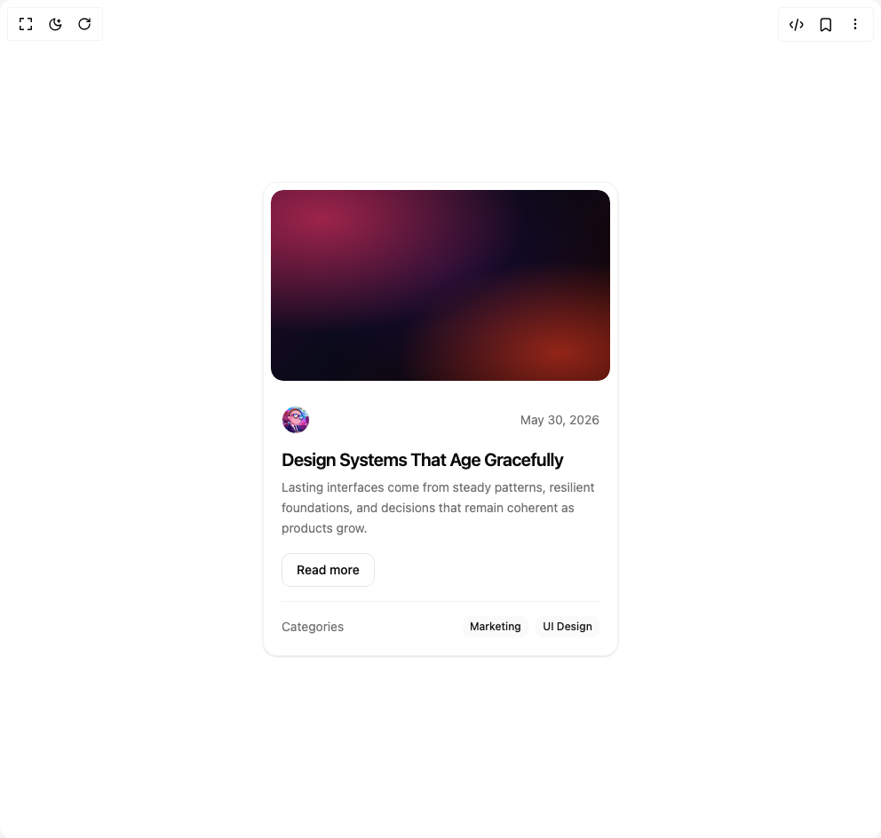

# Build New Card in BuilderStudio

> Build this component in our Agentic IDE: [BuilderStudio](https://builderstudio.dev).
>
> Join the BuilderStudio community on [Discord](https://discord.gg/QdWeSGCqfe) and [Reddit](https://reddit.com/r/builderstudio).



## Component

- Author group: `edwinvakayil`
- Component: `new-card`
- Variant: `default`
- Rendered HTML snapshot: [`rendered.html`](rendered.html)

## BuilderStudio prompt

You are implementing a React component based on a component reference.

## Component identity

- Author: edwinvakayil
- Component slug: new-card
- Demo slug: default
- Title: new-card
- Description: 

## Goal

Recreate this component in a React + TypeScript + Tailwind CSS project. Preserve the visual layout, spacing, colors, border radius, shadows, interaction behavior, animation behavior, responsive behavior, and dark mode behavior shown in the rendered demo.

## Implementation requirements

- Use React and TypeScript.
- Use Tailwind CSS classes whenever possible.
- Keep the component self-contained unless the source files require helper components.
- If the source uses CSS variables, custom CSS, animations, or keyframes, include them.
- If the source uses external packages, list and use the required packages.
- Preserve accessibility attributes, button semantics, links, keyboard behavior, and ARIA attributes when visible in the source.
- Do not replace the component with a simplified placeholder.
- Return complete production-ready code.

## Dependencies

No reference metadata available.

## Rendered DOM snapshot

This is the rendered demo HTML extracted from the live preview. Use it to verify structure, class names, visible content, and layout.

```html
<div id="root"><div class="w-screen min-h-screen flex justify-center items-center"><div class="w-screen min-h-screen flex justify-center items-center"><div class="flex min-h-screen items-center justify-center p-4"><div class="w-full max-w-[400px]" style="opacity: 1; transform: none;"><div data-slot="card" class="border text-card-foreground shadow group relative h-full overflow-hidden rounded-2xl border-border/50 bg-card/30 backdrop-blur-md transition-shadow duration-300 hover:shadow-2xl hover:shadow-primary/15"><div class="relative aspect-[16/9] overflow-hidden rounded-xl m-2"><div class="h-full w-full rounded-xl" style="background: radial-gradient(at 15% 15%, rgba(180, 40, 80, 0.85) 0%, transparent 50%), radial-gradient(at 85% 85%, rgba(200, 50, 30, 0.7) 0%, transparent 40%), radial-gradient(at 50% 40%, rgb(20, 10, 50) 0%, transparent 70%), linear-gradient(135deg, rgb(42, 10, 46) 0%, rgb(10, 10, 26) 40%, rgb(26, 5, 5) 100%);"></div></div><div class="flex flex-col gap-4 p-5"><div class="flex items-center justify-between"><div class="flex items-center gap-2"><span class="relative flex shrink-0 overflow-hidden rounded-full h-8 w-8 border border-border/50"></span></div><span class="text-sm text-muted-foreground">May 30, 2026</span></div><div class="space-y-2"><h3 class="text-xl font-semibold leading-tight tracking-tight text-foreground transition-colors group-hover:text-primary">Design Systems That Age Gracefully</h3><p class="text-sm text-muted-foreground leading-relaxed">Lasting interfaces come from steady patterns, resilient foundations, and decisions that remain coherent as products grow.</p></div><div><button class="rounded-lg border border-border px-4 py-2 text-sm font-medium text-foreground transition-colors hover:bg-accent" tabindex="0">Read more</button></div><div class="flex items-center justify-between border-t border-border/50 pt-4"><span class="text-sm text-muted-foreground">Categories</span><div class="flex gap-2"><span data-slot="badge" class="inline-flex items-center justify-center border border-transparent font-medium focus:outline-hidden focus:ring-2 focus:ring-ring focus:ring-offset-2 [&amp;_svg]:-ms-px [&amp;_svg]:shrink-0 text-secondary-foreground rounded-md px-[0.45rem] h-6 min-w-6 gap-1.5 text-xs [&amp;_svg]:size-3.5 bg-secondary/50">Marketing</span><span data-slot="badge" class="inline-flex items-center justify-center border border-transparent font-medium focus:outline-hidden focus:ring-2 focus:ring-ring focus:ring-offset-2 [&amp;_svg]:-ms-px [&amp;_svg]:shrink-0 text-secondary-foreground rounded-md px-[0.45rem] h-6 min-w-6 gap-1.5 text-xs [&amp;_svg]:size-3.5 bg-secondary/50">UI Design</span></div></div></div></div></div></div></div></div></div>
```

## Reference source files

No reference source files were available.
