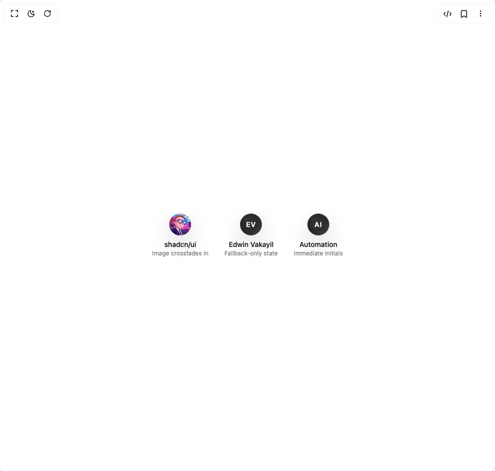

# Build One Avatar in BuilderStudio

> Build this component in our Agentic IDE: [BuilderStudio](https://builderstudio.dev).
>
> Join the BuilderStudio community on [Discord](https://discord.gg/QdWeSGCqfe) and [Reddit](https://reddit.com/r/builderstudio).



## Component

- Author group: `edwinvakayil`
- Component: `one-avatar`
- Variant: `default`
- Rendered HTML snapshot: [`rendered.html`](rendered.html)

## BuilderStudio prompt

You are implementing a React component based on a component reference.

## Component identity

- Author: edwinvakayil
- Component slug: one-avatar
- Demo slug: default
- Title: one-avatar
- Description: 

## Goal

Recreate this component in a React + TypeScript + Tailwind CSS project. Preserve the visual layout, spacing, colors, border radius, shadows, interaction behavior, animation behavior, responsive behavior, and dark mode behavior shown in the rendered demo.

## Implementation requirements

- Use React and TypeScript.
- Use Tailwind CSS classes whenever possible.
- Keep the component self-contained unless the source files require helper components.
- If the source uses CSS variables, custom CSS, animations, or keyframes, include them.
- If the source uses external packages, list and use the required packages.
- Preserve accessibility attributes, button semantics, links, keyboard behavior, and ARIA attributes when visible in the source.
- Do not replace the component with a simplified placeholder.
- Return complete production-ready code.

## Dependencies

No reference metadata available.

## Rendered DOM snapshot

This is the rendered demo HTML extracted from the live preview. Use it to verify structure, class names, visible content, and layout.

```html
<div id="root"><div class="w-screen min-h-screen flex justify-center items-center"><div class="w-screen min-h-screen flex justify-center items-center"><div class="flex items-center gap-8"><div class="flex flex-col items-center gap-2"><div class="relative inline-flex h-11 w-11 shrink-0 items-center justify-center" tabindex="0" style="opacity: 1; transform: none;"><span class="relative flex h-full w-full items-center justify-center overflow-hidden rounded-full bg-linear-to-br from-neutral-950 via-neutral-800 to-neutral-700 text-white shadow-[0_18px_40px_rgba(15,23,42,0.16)] dark:from-neutral-100 dark:via-neutral-200 dark:to-neutral-300 dark:text-neutral-900"><div class="pointer-events-none absolute inset-0 bg-[radial-gradient(circle_at_30%_25%,rgba(255,255,255,0.38),transparent_55%)] dark:bg-[radial-gradient(circle_at_30%_25%,rgba(255,255,255,0.6),transparent_58%)]" style="opacity: 0.18; transform: translateX(2px) translateY(-2px) scale(1.02);"></div><span class="absolute inset-0 flex select-none items-center justify-center font-semibold text-sm uppercase tracking-[0.08em]" style="opacity: 0; transform: scale(0.94);">SU</span><div class="absolute inset-0 overflow-hidden rounded-full" style="opacity: 1; transform: none;"></div><div class="pointer-events-none absolute inset-0 rounded-full ring-1 ring-white/16 ring-inset dark:ring-black/10" style="opacity: 1; transform: none;"></div></span></div><div class="text-center"><div class="text-sm font-medium">shadcn/ui</div><div class="text-xs text-muted-foreground">Image crossfades in</div></div></div><div class="flex flex-col items-center gap-2"><div class="relative inline-flex h-11 w-11 shrink-0 items-center justify-center" tabindex="0" style="opacity: 1; transform: none;"><span class="relative flex h-full w-full items-center justify-center overflow-hidden rounded-full bg-linear-to-br from-neutral-950 via-neutral-800 to-neutral-700 text-white shadow-[0_18px_40px_rgba(15,23,42,0.16)] dark:from-neutral-100 dark:via-neutral-200 dark:to-neutral-300 dark:text-neutral-900"><div class="pointer-events-none absolute inset-0 bg-[radial-gradient(circle_at_30%_25%,rgba(255,255,255,0.38),transparent_55%)] dark:bg-[radial-gradient(circle_at_30%_25%,rgba(255,255,255,0.6),transparent_58%)]" style="opacity: 0.34; transform: none;"></div><span class="absolute inset-0 flex select-none items-center justify-center font-semibold text-sm uppercase tracking-[0.08em]" style="opacity: 1; transform: none;">EV</span><div class="pointer-events-none absolute inset-0 rounded-full ring-1 ring-white/16 ring-inset dark:ring-black/10" style="opacity: 0.85; transform: scale(0.985);"></div></span></div><div class="text-center"><div class="text-sm font-medium">Edwin Vakayil</div><div class="text-xs text-muted-foreground">Fallback-only state</div></div></div><div class="flex flex-col items-center gap-2"><div class="relative inline-flex h-11 w-11 shrink-0 items-center justify-center" tabindex="0" style="opacity: 1; transform: none;"><span class="relative flex h-full w-full items-center justify-center overflow-hidden rounded-full bg-linear-to-br from-neutral-950 via-neutral-800 to-neutral-700 text-white shadow-[0_18px_40px_rgba(15,23,42,0.16)] dark:from-neutral-100 dark:via-neutral-200 dark:to-neutral-300 dark:text-neutral-900"><div class="pointer-events-none absolute inset-0 bg-[radial-gradient(circle_at_30%_25%,rgba(255,255,255,0.38),transparent_55%)] dark:bg-[radial-gradient(circle_at_30%_25%,rgba(255,255,255,0.6),transparent_58%)]" style="opacity: 0.34; transform: none;"></div><span class="absolute inset-0 flex select-none items-center justify-center font-semibold text-sm uppercase tracking-[0.08em]" style="opacity: 1; transform: none;">AI</span><div class="pointer-events-none absolute inset-0 rounded-full ring-1 ring-white/16 ring-inset dark:ring-black/10" style="opacity: 0.85; transform: scale(0.985);"></div></span></div><div class="text-center"><div class="text-sm font-medium">Automation</div><div class="text-xs text-muted-foreground">Immediate initials</div></div></div></div></div></div></div>
```

## Reference source files

No reference source files were available.
