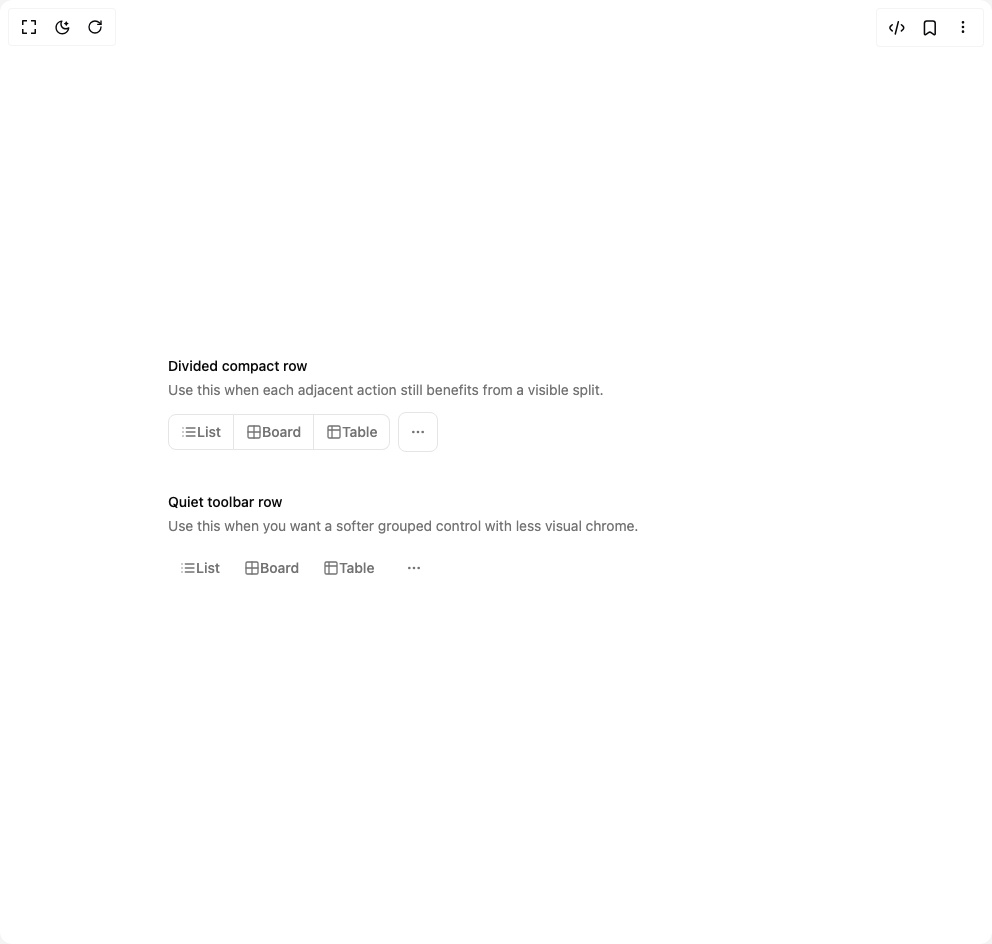

# Build The Button Group in BuilderStudio

> Build this component in our Agentic IDE: [BuilderStudio](https://builderstudio.dev).
>
> Join the BuilderStudio community on [Discord](https://discord.gg/QdWeSGCqfe) and [Reddit](https://reddit.com/r/builderstudio).



## Component

- Author group: `edwinvakayil`
- Component: `the-button-group`
- Variant: `default`
- Rendered HTML snapshot: [`rendered.html`](rendered.html)

## BuilderStudio prompt

You are implementing a React component based on a component reference.

## Component identity

- Author: edwinvakayil
- Component slug: the-button-group
- Demo slug: default
- Title: the-button-group
- Description: 

## Goal

Recreate this component in a React + TypeScript + Tailwind CSS project. Preserve the visual layout, spacing, colors, border radius, shadows, interaction behavior, animation behavior, responsive behavior, and dark mode behavior shown in the rendered demo.

## Implementation requirements

- Use React and TypeScript.
- Use Tailwind CSS classes whenever possible.
- Keep the component self-contained unless the source files require helper components.
- If the source uses CSS variables, custom CSS, animations, or keyframes, include them.
- If the source uses external packages, list and use the required packages.
- Preserve accessibility attributes, button semantics, links, keyboard behavior, and ARIA attributes when visible in the source.
- Do not replace the component with a simplified placeholder.
- Return complete production-ready code.

## Dependencies

No reference metadata available.

## Rendered DOM snapshot

This is the rendered demo HTML extracted from the live preview. Use it to verify structure, class names, visible content, and layout.

```html
<div id="root"><div class="w-screen min-h-screen flex justify-center items-center"><div class="w-screen min-h-screen flex justify-center items-center"><div class="mx-auto flex w-full max-w-2xl flex-col gap-10 px-2"><div class="space-y-3"><div class="space-y-1 text-left"><p class="font-medium text-foreground text-sm">Divided compact row</p><p class="text-muted-foreground text-sm">Use this when each adjacent action still benefits from a visible split.</p></div><div class="flex flex-wrap items-center gap-2"><div role="group" data-slot="button-group" class="flex w-fit items-stretch [&amp;&gt;*]:focus-visible:z-10 [&amp;&gt;*]:focus-visible:relative [&amp;&gt;[data-slot=select-trigger]:not([class*='w-'])]:w-fit [&amp;&gt;input]:flex-1 has-[select[aria-hidden=true]:last-child]:[&amp;&gt;[data-slot=select-trigger]:last-of-type]:rounded-r-md has-[&gt;[data-slot=button-group]]:gap-2 [&amp;&gt;*:not(:first-child)]:rounded-l-none [&amp;&gt;*:not(:first-child)]:border-l-0 [&amp;&gt;*:not(:last-child)]:rounded-r-none"><button class="inline-flex items-center justify-center whitespace-nowrap text-sm font-medium ring-offset-background transition-colors focus-visible:outline-none focus-visible:ring-2 focus-visible:ring-ring focus-visible:ring-offset-2 disabled:pointer-events-none disabled:opacity-50 border border-input bg-background hover:bg-accent hover:text-accent-foreground h-9 rounded-md px-3 text-muted-foreground"><svg xmlns="http://www.w3.org/2000/svg" width="24" height="24" viewBox="0 0 24 24" fill="none" stroke="currentColor" stroke-width="2" stroke-linecap="round" stroke-linejoin="round" class="lucide lucide-list size-4" aria-hidden="true"><path d="M3 12h.01"></path><path d="M3 18h.01"></path><path d="M3 6h.01"></path><path d="M8 12h13"></path><path d="M8 18h13"></path><path d="M8 6h13"></path></svg>List</button><button class="inline-flex items-center justify-center whitespace-nowrap text-sm font-medium ring-offset-background transition-colors focus-visible:outline-none focus-visible:ring-2 focus-visible:ring-ring focus-visible:ring-offset-2 disabled:pointer-events-none disabled:opacity-50 border border-input bg-background hover:bg-accent hover:text-accent-foreground h-9 rounded-md px-3 text-muted-foreground"><svg xmlns="http://www.w3.org/2000/svg" width="24" height="24" viewBox="0 0 24 24" fill="none" stroke="currentColor" stroke-width="2" stroke-linecap="round" stroke-linejoin="round" class="lucide lucide-grid2x2 lucide-grid-2x2 size-4" aria-hidden="true"><path d="M12 3v18"></path><path d="M3 12h18"></path><rect x="3" y="3" width="18" height="18" rx="2"></rect></svg>Board</button><button class="inline-flex items-center justify-center whitespace-nowrap text-sm font-medium ring-offset-background transition-colors focus-visible:outline-none focus-visible:ring-2 focus-visible:ring-ring focus-visible:ring-offset-2 disabled:pointer-events-none disabled:opacity-50 border border-input bg-background hover:bg-accent hover:text-accent-foreground h-9 rounded-md px-3 text-muted-foreground"><svg xmlns="http://www.w3.org/2000/svg" width="24" height="24" viewBox="0 0 24 24" fill="none" stroke="currentColor" stroke-width="2" stroke-linecap="round" stroke-linejoin="round" class="lucide lucide-table2 lucide-table-2 size-4" aria-hidden="true"><path d="M9 3H5a2 2 0 0 0-2 2v4m6-6h10a2 2 0 0 1 2 2v4M9 3v18m0 0h10a2 2 0 0 0 2-2V9M9 21H5a2 2 0 0 1-2-2V9m0 0h18"></path></svg>Table</button></div><button class="inline-flex items-center justify-center whitespace-nowrap rounded-md text-sm font-medium ring-offset-background transition-colors focus-visible:outline-none focus-visible:ring-2 focus-visible:ring-ring focus-visible:ring-offset-2 disabled:pointer-events-none disabled:opacity-50 border border-input bg-background hover:bg-accent hover:text-accent-foreground h-10 w-10 text-muted-foreground" aria-label="More options"><svg xmlns="http://www.w3.org/2000/svg" width="24" height="24" viewBox="0 0 24 24" fill="none" stroke="currentColor" stroke-width="2" stroke-linecap="round" stroke-linejoin="round" class="lucide lucide-ellipsis size-4" aria-hidden="true"><circle cx="12" cy="12" r="1"></circle><circle cx="19" cy="12" r="1"></circle><circle cx="5" cy="12" r="1"></circle></svg></button></div></div><div class="space-y-3"><div class="space-y-1 text-left"><p class="font-medium text-foreground text-sm">Quiet toolbar row</p><p class="text-muted-foreground text-sm">Use this when you want a softer grouped control with less visual chrome.</p></div><div class="flex flex-wrap items-center gap-2"><div role="group" data-slot="button-group" class="flex w-fit items-stretch [&amp;&gt;*]:focus-visible:z-10 [&amp;&gt;*]:focus-visible:relative [&amp;&gt;[data-slot=select-trigger]:not([class*='w-'])]:w-fit [&amp;&gt;input]:flex-1 has-[select[aria-hidden=true]:last-child]:[&amp;&gt;[data-slot=select-trigger]:last-of-type]:rounded-r-md has-[&gt;[data-slot=button-group]]:gap-2 [&amp;&gt;*:not(:first-child)]:rounded-l-none [&amp;&gt;*:not(:first-child)]:border-l-0 [&amp;&gt;*:not(:last-child)]:rounded-r-none"><button class="inline-flex items-center justify-center whitespace-nowrap text-sm font-medium ring-offset-background transition-colors focus-visible:outline-none focus-visible:ring-2 focus-visible:ring-ring focus-visible:ring-offset-2 disabled:pointer-events-none disabled:opacity-50 hover:bg-accent hover:text-accent-foreground h-9 rounded-md px-3 text-muted-foreground"><svg xmlns="http://www.w3.org/2000/svg" width="24" height="24" viewBox="0 0 24 24" fill="none" stroke="currentColor" stroke-width="2" stroke-linecap="round" stroke-linejoin="round" class="lucide lucide-list size-4" aria-hidden="true"><path d="M3 12h.01"></path><path d="M3 18h.01"></path><path d="M3 6h.01"></path><path d="M8 12h13"></path><path d="M8 18h13"></path><path d="M8 6h13"></path></svg>List</button><button class="inline-flex items-center justify-center whitespace-nowrap text-sm font-medium ring-offset-background transition-colors focus-visible:outline-none focus-visible:ring-2 focus-visible:ring-ring focus-visible:ring-offset-2 disabled:pointer-events-none disabled:opacity-50 hover:bg-accent hover:text-accent-foreground h-9 rounded-md px-3 text-muted-foreground"><svg xmlns="http://www.w3.org/2000/svg" width="24" height="24" viewBox="0 0 24 24" fill="none" stroke="currentColor" stroke-width="2" stroke-linecap="round" stroke-linejoin="round" class="lucide lucide-grid2x2 lucide-grid-2x2 size-4" aria-hidden="true"><path d="M12 3v18"></path><path d="M3 12h18"></path><rect x="3" y="3" width="18" height="18" rx="2"></rect></svg>Board</button><button class="inline-flex items-center justify-center whitespace-nowrap text-sm font-medium ring-offset-background transition-colors focus-visible:outline-none focus-visible:ring-2 focus-visible:ring-ring focus-visible:ring-offset-2 disabled:pointer-events-none disabled:opacity-50 hover:bg-accent hover:text-accent-foreground h-9 rounded-md px-3 text-muted-foreground"><svg xmlns="http://www.w3.org/2000/svg" width="24" height="24" viewBox="0 0 24 24" fill="none" stroke="currentColor" stroke-width="2" stroke-linecap="round" stroke-linejoin="round" class="lucide lucide-table2 lucide-table-2 size-4" aria-hidden="true"><path d="M9 3H5a2 2 0 0 0-2 2v4m6-6h10a2 2 0 0 1 2 2v4M9 3v18m0 0h10a2 2 0 0 0 2-2V9M9 21H5a2 2 0 0 1-2-2V9m0 0h18"></path></svg>Table</button></div><button class="inline-flex items-center justify-center whitespace-nowrap rounded-md text-sm font-medium ring-offset-background transition-colors focus-visible:outline-none focus-visible:ring-2 focus-visible:ring-ring focus-visible:ring-offset-2 disabled:pointer-events-none disabled:opacity-50 hover:bg-accent hover:text-accent-foreground h-10 w-10 text-muted-foreground" aria-label="More options"><svg xmlns="http://www.w3.org/2000/svg" width="24" height="24" viewBox="0 0 24 24" fill="none" stroke="currentColor" stroke-width="2" stroke-linecap="round" stroke-linejoin="round" class="lucide lucide-ellipsis size-4" aria-hidden="true"><circle cx="12" cy="12" r="1"></circle><circle cx="19" cy="12" r="1"></circle><circle cx="5" cy="12" r="1"></circle></svg></button></div></div></div></div></div></div>
```

## Reference source files

No reference source files were available.
