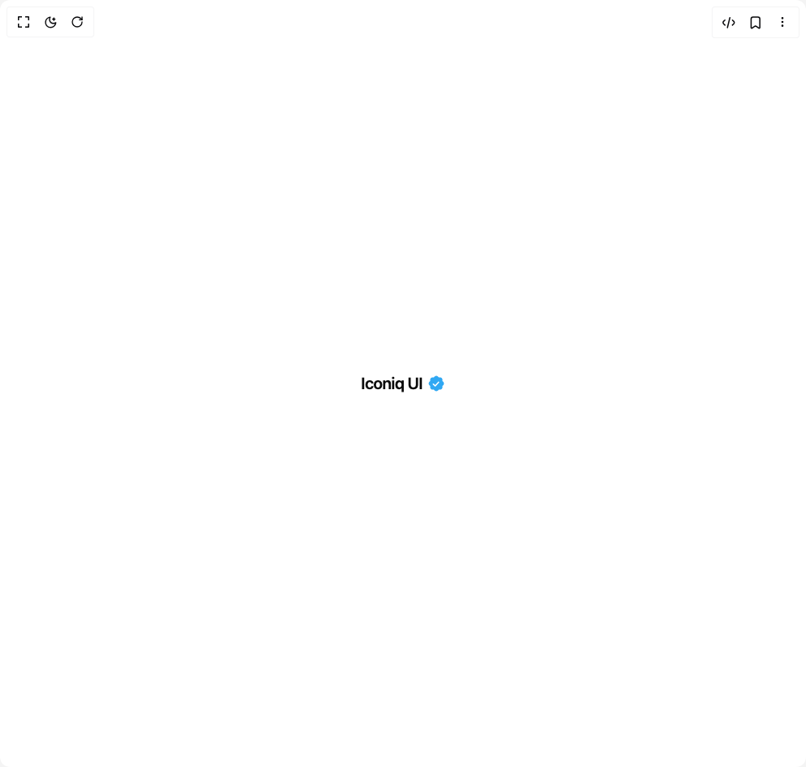

# Build Verified Badge in BuilderStudio

> Build this component in our Agentic IDE: [BuilderStudio](https://builderstudio.dev).
>
> Join the BuilderStudio community on [Discord](https://discord.gg/QdWeSGCqfe) and [Reddit](https://reddit.com/r/builderstudio).



## Component

- Author group: `edwinvakayil`
- Component: `verified-badge`
- Variant: `default`
- Rendered HTML snapshot: [`rendered.html`](rendered.html)

## BuilderStudio prompt

You are implementing a React component based on a component reference.

## Component identity

- Author: edwinvakayil
- Component slug: verified-badge
- Demo slug: default
- Title: verified-badge
- Description: 

## Goal

Recreate this component in a React + TypeScript + Tailwind CSS project. Preserve the visual layout, spacing, colors, border radius, shadows, interaction behavior, animation behavior, responsive behavior, and dark mode behavior shown in the rendered demo.

## Implementation requirements

- Use React and TypeScript.
- Use Tailwind CSS classes whenever possible.
- Keep the component self-contained unless the source files require helper components.
- If the source uses CSS variables, custom CSS, animations, or keyframes, include them.
- If the source uses external packages, list and use the required packages.
- Preserve accessibility attributes, button semantics, links, keyboard behavior, and ARIA attributes when visible in the source.
- Do not replace the component with a simplified placeholder.
- Return complete production-ready code.

## Dependencies

No reference metadata available.

## Rendered DOM snapshot

This is the rendered demo HTML extracted from the live preview. Use it to verify structure, class names, visible content, and layout.

```html
<div id="root"><div class="w-screen min-h-screen flex justify-center items-center"><div class="w-screen min-h-screen flex justify-center items-center"><span class="inline-flex items-center gap-1.5"><span class="font-semibold text-foreground text-xl tracking-tight">Iconiq UI</span><span aria-label="Verified" class="relative inline-block align-middle text-[hsl(203,89%,57%)]" role="img" style="width: 22px; height: 22px;"><svg aria-hidden="true" class="absolute inset-0 h-full w-full" viewBox="0 0 22 22"><path d="M20.396 11c-.018-.646-.215-1.275-.57-1.816-.354-.54-.852-.972-1.438-1.246.223-.607.27-1.264.14-1.897-.131-.634-.437-1.218-.882-1.687-.47-.445-1.053-.75-1.687-.882-.633-.13-1.29-.083-1.897.14-.273-.587-.704-1.086-1.245-1.44S11.647 1.62 11 1.604c-.646.017-1.273.213-1.813.568s-.969.854-1.24 1.44c-.608-.223-1.267-.272-1.902-.14-.635.13-1.22.436-1.69.882-.445.47-.749 1.055-.878 1.688-.13.633-.08 1.29.144 1.896-.587.274-1.087.705-1.443 1.245-.356.54-.555 1.17-.574 1.817.02.647.218 1.276.574 1.817.356.54.856.972 1.443 1.245-.224.606-.274 1.263-.144 1.896.13.634.433 1.218.877 1.688.47.443 1.054.747 1.687.878.633.132 1.29.084 1.897-.136.274.586.705 1.084 1.246 1.439.54.354 1.17.551 1.816.569.647-.016 1.276-.213 1.817-.567s.972-.854 1.245-1.44c.604.239 1.266.296 1.903.164.636-.132 1.22-.447 1.68-.907.46-.46.776-1.044.908-1.681s.075-1.299-.165-1.903c.586-.274 1.084-.705 1.439-1.246.354-.54.551-1.17.569-1.816z" fill="currentColor"></path></svg><span aria-hidden="true" class="pointer-events-none absolute inset-0 overflow-hidden" style="mask-image: url(&quot;data:image/svg+xml,%3Csvg%20xmlns%3D%22http%3A%2F%2Fwww.w3.org%2F2000%2Fsvg%22%20viewBox%3D%220%200%2022%2022%22%3E%3Cpath%20fill%3D%22white%22%20d%3D%22M20.396%2011c-.018-.646-.215-1.275-.57-1.816-.354-.54-.852-.972-1.438-1.246.223-.607.27-1.264.14-1.897-.131-.634-.437-1.218-.882-1.687-.47-.445-1.053-.75-1.687-.882-.633-.13-1.29-.083-1.897.14-.273-.587-.704-1.086-1.245-1.44S11.647%201.62%2011%201.604c-.646.017-1.273.213-1.813.568s-.969.854-1.24%201.44c-.608-.223-1.267-.272-1.902-.14-.635.13-1.22.436-1.69.882-.445.47-.749%201.055-.878%201.688-.13.633-.08%201.29.144%201.896-.587.274-1.087.705-1.443%201.245-.356.54-.555%201.17-.574%201.817.02.647.218%201.276.574%201.817.356.54.856.972%201.443%201.245-.224.606-.274%201.263-.144%201.896.13.634.433%201.218.877%201.688.47.443%201.054.747%201.687.878.633.132%201.29.084%201.897-.136.274.586.705%201.084%201.246%201.439.54.354%201.17.551%201.816.569.647-.016%201.276-.213%201.817-.567s.972-.854%201.245-1.44c.604.239%201.266.296%201.903.164.636-.132%201.22-.447%201.68-.907.46-.46.776-1.044.908-1.681s.075-1.299-.165-1.903c.586-.274%201.084-.705%201.439-1.246.354-.54.551-1.17.569-1.816z%22%2F%3E%3C%2Fsvg%3E&quot;); mask-size: 100% 100%; mask-repeat: no-repeat;"><span class="absolute inset-0" style="background: linear-gradient(105deg, transparent 0%, rgba(255, 255, 255, 0.55) 50%, transparent 100%); transform: translateX(200%);"></span></span><svg aria-hidden="true" class="absolute inset-0 z-10 m-auto" fill="none" stroke="white" stroke-linecap="round" stroke-linejoin="round" stroke-width="3.5" viewBox="0 0 24 24" style="width: 11px; height: 11px;"><polyline points="5 12.5 10 17.5 19 7.5"></polyline></svg></span></span></div></div></div>
```

## Reference source files

No reference source files were available.
