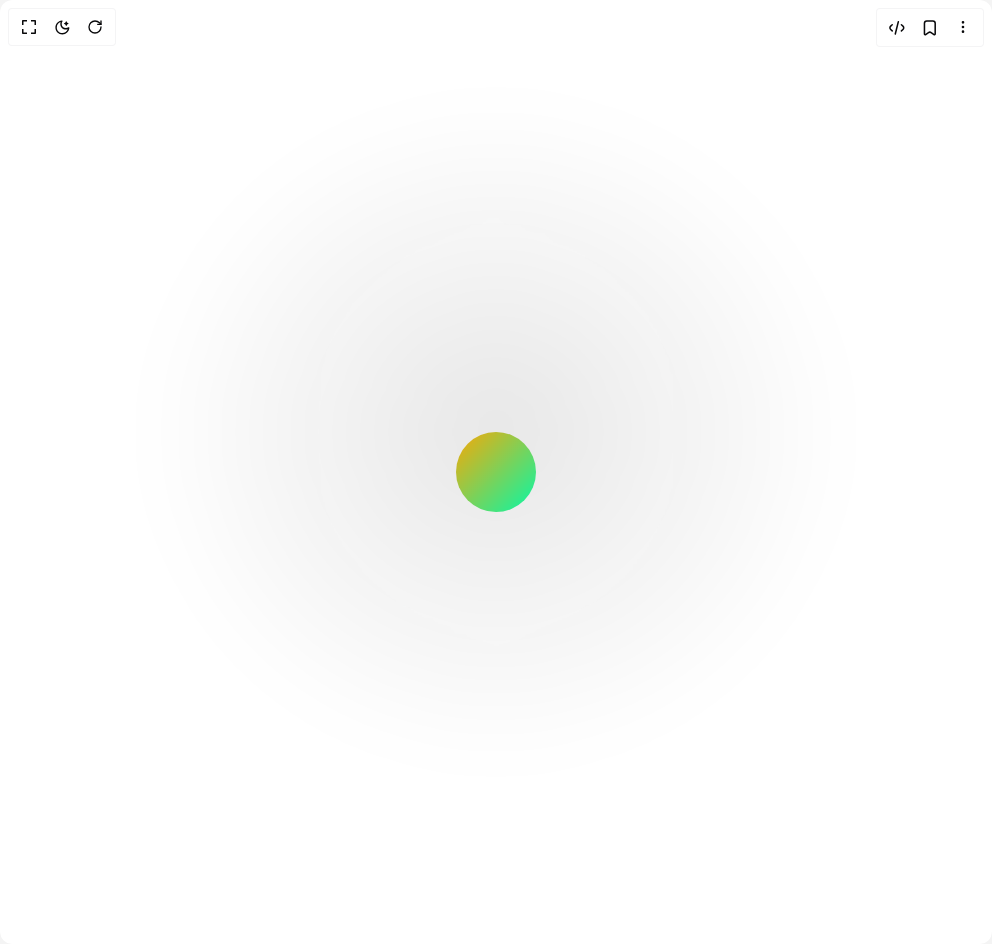

# Build Avatar Uploader in BuilderStudio

> Build this component in our Agentic IDE: [BuilderStudio](https://builderstudio.dev).
>
> Join the BuilderStudio community on [Discord](https://discord.gg/QdWeSGCqfe) and [Reddit](https://reddit.com/r/builderstudio).



## Component

- Author group: `efferd`
- Component: `avatar-uploader`
- Variant: `default`
- Rendered HTML snapshot: [`rendered.html`](rendered.html)

## BuilderStudio prompt

You are implementing a React component based on a component reference.

## Component identity

- Author: efferd
- Component slug: avatar-uploader
- Demo slug: default
- Title: avatar-uploader
- Description: 

## Goal

Recreate this component in a React + TypeScript + Tailwind CSS project. Preserve the visual layout, spacing, colors, border radius, shadows, interaction behavior, animation behavior, responsive behavior, and dark mode behavior shown in the rendered demo.

## Implementation requirements

- Use React and TypeScript.
- Use Tailwind CSS classes whenever possible.
- Keep the component self-contained unless the source files require helper components.
- If the source uses CSS variables, custom CSS, animations, or keyframes, include them.
- If the source uses external packages, list and use the required packages.
- Preserve accessibility attributes, button semantics, links, keyboard behavior, and ARIA attributes when visible in the source.
- Do not replace the component with a simplified placeholder.
- Return complete production-ready code.

## Dependencies

No reference metadata available.

## Rendered DOM snapshot

This is the rendered demo HTML extracted from the live preview. Use it to verify structure, class names, visible content, and layout.

```html
<div id="root"><div class="w-screen min-h-screen flex justify-center items-center"><div class="w-screen min-h-screen flex justify-center items-center"><div class="relative flex min-h-screen w-full flex-col items-center justify-center"><div aria-hidden="true" class="pointer-events-none absolute -top-10 left-1/2 size-full -translate-x-1/2 rounded-full bg-[radial-gradient(ellipse_at_center,--theme(--color-foreground/.1),transparent_50%)] blur-[30px]"></div><span class="flex shrink-0 overflow-hidden rounded-full relative size-20 cursor-pointer hover:opacity-50" type="button" aria-haspopup="dialog" aria-expanded="false" aria-controls="radix-«r0»" data-state="closed" data-slot="dialog-trigger"></span></div></div></div></div>
```

## Reference source files

No reference source files were available.
