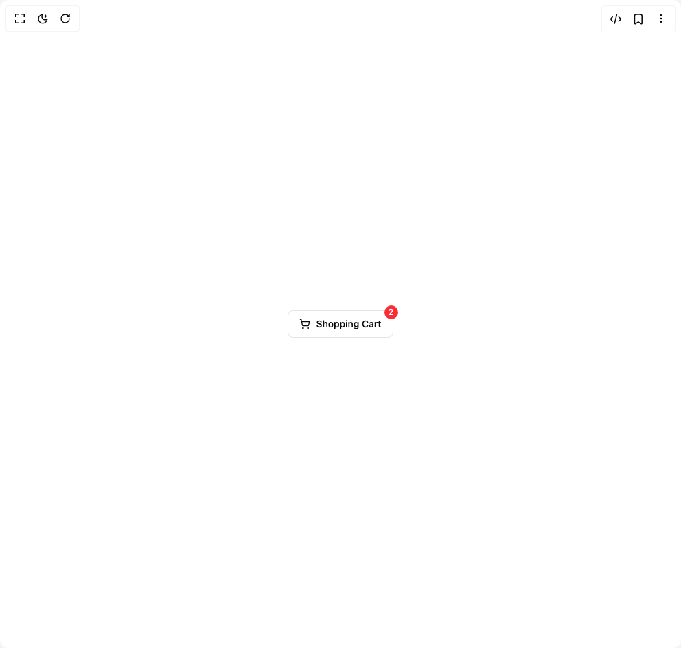

# Build Drawer in BuilderStudio

> Build this component in our Agentic IDE: [BuilderStudio](https://builderstudio.dev).
>
> Join the BuilderStudio community on [Discord](https://discord.gg/QdWeSGCqfe) and [Reddit](https://reddit.com/r/builderstudio).



## Component

- Author group: `efferd`
- Component: `drawer`
- Variant: `shopping-cart`
- Rendered HTML snapshot: [`rendered.html`](rendered.html)

## BuilderStudio prompt

You are implementing a React component based on a component reference.

## Component identity

- Author: efferd
- Component slug: drawer
- Demo slug: shopping-cart
- Title: drawer
- Description: 

## Goal

Recreate this component in a React + TypeScript + Tailwind CSS project. Preserve the visual layout, spacing, colors, border radius, shadows, interaction behavior, animation behavior, responsive behavior, and dark mode behavior shown in the rendered demo.

## Implementation requirements

- Use React and TypeScript.
- Use Tailwind CSS classes whenever possible.
- Keep the component self-contained unless the source files require helper components.
- If the source uses CSS variables, custom CSS, animations, or keyframes, include them.
- If the source uses external packages, list and use the required packages.
- Preserve accessibility attributes, button semantics, links, keyboard behavior, and ARIA attributes when visible in the source.
- Do not replace the component with a simplified placeholder.
- Return complete production-ready code.

## Dependencies

No reference metadata available.

## Rendered DOM snapshot

This is the rendered demo HTML extracted from the live preview. Use it to verify structure, class names, visible content, and layout.

```html
<div id="root"><div class="w-screen min-h-screen flex justify-center items-center"><div class="w-screen min-h-screen flex justify-center items-center"><button class="inline-flex items-center justify-center whitespace-nowrap rounded-md text-sm font-medium ring-offset-background transition-colors focus-visible:outline-none focus-visible:ring-2 focus-visible:ring-ring focus-visible:ring-offset-2 disabled:pointer-events-none disabled:opacity-50 border border-input bg-background hover:bg-accent hover:text-accent-foreground h-10 px-4 py-2 relative" type="button" aria-haspopup="dialog" aria-expanded="false" aria-controls="radix-«r0»" data-state="closed" data-slot="drawer-trigger"><svg xmlns="http://www.w3.org/2000/svg" width="24" height="24" viewBox="0 0 24 24" fill="none" stroke="currentColor" stroke-width="2" stroke-linecap="round" stroke-linejoin="round" class="lucide lucide-shopping-cart w-4 h-4 mr-2" aria-hidden="true"><circle cx="8" cy="21" r="1"></circle><circle cx="19" cy="21" r="1"></circle><path d="M2.05 2.05h2l2.66 12.42a2 2 0 0 0 2 1.58h9.78a2 2 0 0 0 1.95-1.57l1.65-7.43H5.12"></path></svg>Shopping Cart<span class="absolute -top-2 -right-2 bg-red-500 text-white rounded-full w-5 h-5 text-xs flex items-center justify-center">2</span></button></div></div></div>
```

## Reference source files

No reference source files were available.
