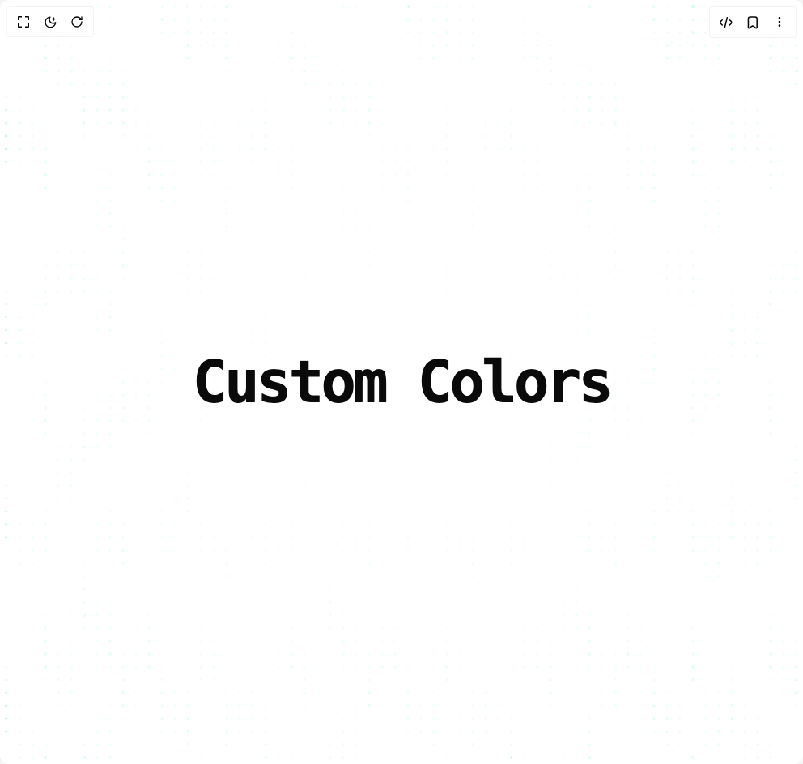

# Build Falling Pattern in BuilderStudio

> Build this component in our Agentic IDE: [BuilderStudio](https://builderstudio.dev).
>
> Join the BuilderStudio community on [Discord](https://discord.gg/QdWeSGCqfe) and [Reddit](https://reddit.com/r/builderstudio).



## Component

- Author group: `efferd`
- Component: `falling-pattern`
- Variant: `custom-colors`
- Rendered HTML snapshot: [`rendered.html`](rendered.html)

## BuilderStudio prompt

You are implementing a React component based on a component reference.

## Component identity

- Author: efferd
- Component slug: falling-pattern
- Demo slug: custom-colors
- Title: falling-pattern
- Description: 

## Goal

Recreate this component in a React + TypeScript + Tailwind CSS project. Preserve the visual layout, spacing, colors, border radius, shadows, interaction behavior, animation behavior, responsive behavior, and dark mode behavior shown in the rendered demo.

## Implementation requirements

- Use React and TypeScript.
- Use Tailwind CSS classes whenever possible.
- Keep the component self-contained unless the source files require helper components.
- If the source uses CSS variables, custom CSS, animations, or keyframes, include them.
- If the source uses external packages, list and use the required packages.
- Preserve accessibility attributes, button semantics, links, keyboard behavior, and ARIA attributes when visible in the source.
- Do not replace the component with a simplified placeholder.
- Return complete production-ready code.

## Dependencies

No reference metadata available.

## Rendered DOM snapshot

This is the rendered demo HTML extracted from the live preview. Use it to verify structure, class names, visible content, and layout.

```html
<div id="root"><div class="w-screen min-h-screen flex justify-center items-center"><div class="w-screen min-h-screen flex justify-center items-center"><div class="w-full relative min-h-screen"><div class="relative w-full p-1 h-screen [mask-image:radial-gradient(ellipse_at_center,transparent,var(--background))]"><div class="size-full" style="opacity: 1;"><div class="relative size-full z-0" style="background-color: var(--background); background-image: radial-gradient(4px 100px at 0px 235px, rgb(0, 255, 136), transparent), radial-gradient(4px 100px at 300px 235px, rgb(0, 255, 136), transparent), radial-gradient(1.5px 1.5px at 150px 117.5px, rgb(0, 255, 136) 100%, transparent 150%), radial-gradient(4px 100px at 0px 252px, rgb(0, 255, 136), transparent), radial-gradient(4px 100px at 300px 252px, rgb(0, 255, 136), transparent), radial-gradient(1.5px 1.5px at 150px 126px, rgb(0, 255, 136) 100%, transparent 150%), radial-gradient(4px 100px at 0px 150px, rgb(0, 255, 136), transparent), radial-gradient(4px 100px at 300px 150px, rgb(0, 255, 136), transparent), radial-gradient(1.5px 1.5px at 150px 75px, rgb(0, 255, 136) 100%, transparent 150%), radial-gradient(4px 100px at 0px 253px, rgb(0, 255, 136), transparent), radial-gradient(4px 100px at 300px 253px, rgb(0, 255, 136), transparent), radial-gradient(1.5px 1.5px at 150px 126.5px, rgb(0, 255, 136) 100%, transparent 150%), radial-gradient(4px 100px at 0px 204px, rgb(0, 255, 136), transparent), radial-gradient(4px 100px at 300px 204px, rgb(0, 255, 136), transparent), radial-gradient(1.5px 1.5px at 150px 102px, rgb(0, 255, 136) 100%, transparent 150%), radial-gradient(4px 100px at 0px 134px, rgb(0, 255, 136), transparent), radial-gradient(4px 100px at 300px 134px, rgb(0, 255, 136), transparent), radial-gradient(1.5px 1.5px at 150px 67px, rgb(0, 255, 136) 100%, transparent 150%), radial-gradient(4px 100px at 0px 179px, rgb(0, 255, 136), transparent), radial-gradient(4px 100px at 300px 179px, rgb(0, 255, 136), transparent), radial-gradient(1.5px 1.5px at 150px 89.5px, rgb(0, 255, 136) 100%, transparent 150%), radial-gradient(4px 100px at 0px 299px, rgb(0, 255, 136), transparent), radial-gradient(4px 100px at 300px 299px, rgb(0, 255, 136), transparent), radial-gradient(1.5px 1.5px at 150px 149.5px, rgb(0, 255, 136) 100%, transparent 150%), radial-gradient(4px 100px at 0px 215px, rgb(0, 255, 136), transparent), radial-gradient(4px 100px at 300px 215px, rgb(0, 255, 136), transparent), radial-gradient(1.5px 1.5px at 150px 107.5px, rgb(0, 255, 136) 100%, transparent 150%), radial-gradient(4px 100px at 0px 281px, rgb(0, 255, 136), transparent), radial-gradient(4px 100px at 300px 281px, rgb(0, 255, 136), transparent), radial-gradient(1.5px 1.5px at 150px 140.5px, rgb(0, 255, 136) 100%, transparent 150%), radial-gradient(4px 100px at 0px 158px, rgb(0, 255, 136), transparent), radial-gradient(4px 100px at 300px 158px, rgb(0, 255, 136), transparent), radial-gradient(1.5px 1.5px at 150px 79px, rgb(0, 255, 136) 100%, transparent 150%), radial-gradient(4px 100px at 0px 210px, rgb(0, 255, 136), transparent), radial-gradient(4px 100px at 300px 210px, rgb(0, 255, 136), transparent), radial-gradient(1.5px 1.5px at 150px 105px, rgb(0, 255, 136) 100%, transparent 150%); background-size: 300px 235px, 300px 235px, 300px 235px, 300px 252px, 300px 252px, 300px 252px, 300px 150px, 300px 150px, 300px 150px, 300px 253px, 300px 253px, 300px 253px, 300px 204px, 300px 204px, 300px 204px, 300px 134px, 300px 134px, 300px 134px, 300px 179px, 300px 179px, 300px 179px, 300px 299px, 300px 299px, 300px 299px, 300px 215px, 300px 215px, 300px 215px, 300px 281px, 300px 281px, 300px 281px, 300px 158px, 300px 158px, 300px 158px, 300px 210px, 300px 210px; background-position: 0px 623.93px, 3px 623.93px, 151.5px 741.43px, 25px 859.361px, 28px 859.361px, 176.5px 985.361px, 50px 347.493px, 53px 347.493px, 201.5px 422.493px, 75px 1264.58px, 78px 1264.58px, 226.5px 1278.45px, 100px 332.076px, 103px 332.076px, 251.5px 434.076px, 125px 630.007px, 128px 630.007px, 276.5px 697.007px, 150px 635.36px, 153px 635.36px, 301.5px 724.86px, 175px 1042.61px, 178px 1042.61px, 326.5px 1192.11px, 200px 1018.49px, 203px 1018.49px, 351.5px 1125.99px, 225px 1362.49px, 228px 1362.49px, 376.5px 1502.99px, 250px 336.375px, 253px 336.375px, 401.5px 415.375px, 275px 461.741px, 278px 461.741px, 426.5px 566.741px;"></div></div><div class="absolute inset-0 z-1 dark:brightness-600" style="backdrop-filter: blur(0.5rem); background-image: radial-gradient(circle at 50% 50%, transparent 0, transparent 2px, var(--background) 2px); background-size: 16px 16px;"></div></div><div class="absolute inset-0 z-10 flex items-center justify-center"><h1 class="font-mono text-7xl font-extrabold tracking-tighter">Custom Colors</h1></div></div></div></div></div>
```

## Reference source files

No reference source files were available.
