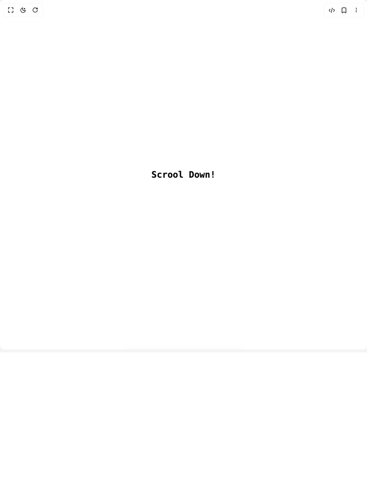

# Build Footer Section in BuilderStudio

> Build this component in our Agentic IDE: [BuilderStudio](https://builderstudio.dev).
>
> Join the BuilderStudio community on [Discord](https://discord.gg/QdWeSGCqfe) and [Reddit](https://reddit.com/r/builderstudio).



## Component

- Author group: `efferd`
- Component: `footer-section`
- Variant: `default`
- Rendered HTML snapshot: [`rendered.html`](rendered.html)

## BuilderStudio prompt

You are implementing a React component based on a component reference.

## Component identity

- Author: efferd
- Component slug: footer-section
- Demo slug: default
- Title: footer-section
- Description: 

## Goal

Recreate this component in a React + TypeScript + Tailwind CSS project. Preserve the visual layout, spacing, colors, border radius, shadows, interaction behavior, animation behavior, responsive behavior, and dark mode behavior shown in the rendered demo.

## Implementation requirements

- Use React and TypeScript.
- Use Tailwind CSS classes whenever possible.
- Keep the component self-contained unless the source files require helper components.
- If the source uses CSS variables, custom CSS, animations, or keyframes, include them.
- If the source uses external packages, list and use the required packages.
- Preserve accessibility attributes, button semantics, links, keyboard behavior, and ARIA attributes when visible in the source.
- Do not replace the component with a simplified placeholder.
- Return complete production-ready code.

## Dependencies

No reference metadata available.

## Rendered DOM snapshot

This is the rendered demo HTML extracted from the live preview. Use it to verify structure, class names, visible content, and layout.

```html
<div id="root"><div class="relative flex min-h-svh flex-col"><div class="min-h-screen flex items-center justify-center"><h1 class="font-mono text-2xl font-bold">Scrool Down!</h1></div><footer class="md:rounded-t-6xl relative w-full max-w-6xl mx-auto flex flex-col items-center justify-center rounded-t-4xl border-t bg-[radial-gradient(35%_128px_at_50%_0%,theme(backgroundColor.white/8%),transparent)] px-6 py-12 lg:py-16"><div class="bg-foreground/20 absolute top-0 right-1/2 left-1/2 h-px w-1/3 -translate-x-1/2 -translate-y-1/2 rounded-full blur"></div><div class="grid w-full gap-8 xl:grid-cols-3 xl:gap-8"><div class="space-y-4" style="filter: blur(4px); opacity: 0; transform: translateY(-8px);"><svg xmlns="http://www.w3.org/2000/svg" width="24" height="24" viewBox="0 0 24 24" fill="none" stroke="currentColor" stroke-width="2" stroke-linecap="round" stroke-linejoin="round" class="lucide lucide-frame size-8" aria-hidden="true"><line x1="22" x2="2" y1="6" y2="6"></line><line x1="22" x2="2" y1="18" y2="18"></line><line x1="6" x2="6" y1="2" y2="22"></line><line x1="18" x2="18" y1="2" y2="22"></line></svg><p class="text-muted-foreground mt-8 text-sm md:mt-0">© 2026 Asme. All rights reserved.</p></div><div class="mt-10 grid grid-cols-2 gap-8 md:grid-cols-4 xl:col-span-2 xl:mt-0"><div style="filter: blur(4px); opacity: 0; transform: translateY(-8px);"><div class="mb-10 md:mb-0"><h3 class="text-xs">Product</h3><ul class="text-muted-foreground mt-4 space-y-2 text-sm"><li><a href="#features" class="hover:text-foreground inline-flex items-center transition-all duration-300">Features</a></li><li><a href="#pricing" class="hover:text-foreground inline-flex items-center transition-all duration-300">Pricing</a></li><li><a href="#testimonials" class="hover:text-foreground inline-flex items-center transition-all duration-300">Testimonials</a></li><li><a href="/" class="hover:text-foreground inline-flex items-center transition-all duration-300">Integration</a></li></ul></div></div><div style="filter: blur(4px); opacity: 0; transform: translateY(-8px);"><div class="mb-10 md:mb-0"><h3 class="text-xs">Company</h3><ul class="text-muted-foreground mt-4 space-y-2 text-sm"><li><a href="/faqs" class="hover:text-foreground inline-flex items-center transition-all duration-300">FAQs</a></li><li><a href="/about" class="hover:text-foreground inline-flex items-center transition-all duration-300">About Us</a></li><li><a href="/privacy" class="hover:text-foreground inline-flex items-center transition-all duration-300">Privacy Policy</a></li><li><a href="/terms" class="hover:text-foreground inline-flex items-center transition-all duration-300">Terms of Services</a></li></ul></div></div><div style="filter: blur(4px); opacity: 0; transform: translateY(-8px);"><div class="mb-10 md:mb-0"><h3 class="text-xs">Resources</h3><ul class="text-muted-foreground mt-4 space-y-2 text-sm"><li><a href="/blog" class="hover:text-foreground inline-flex items-center transition-all duration-300">Blog</a></li><li><a href="/changelog" class="hover:text-foreground inline-flex items-center transition-all duration-300">Changelog</a></li><li><a href="/brand" class="hover:text-foreground inline-flex items-center transition-all duration-300">Brand</a></li><li><a href="/help" class="hover:text-foreground inline-flex items-center transition-all duration-300">Help</a></li></ul></div></div><div style="filter: blur(4px); opacity: 0; transform: translateY(-8px);"><div class="mb-10 md:mb-0"><h3 class="text-xs">Social Links</h3><ul class="text-muted-foreground mt-4 space-y-2 text-sm"><li><a href="#" class="hover:text-foreground inline-flex items-center transition-all duration-300"><svg xmlns="http://www.w3.org/2000/svg" width="24" height="24" viewBox="0 0 24 24" fill="none" stroke="currentColor" stroke-width="2" stroke-linecap="round" stroke-linejoin="round" class="lucide lucide-facebook me-1 size-4" aria-hidden="true"><path d="M18 2h-3a5 5 0 0 0-5 5v3H7v4h3v8h4v-8h3l1-4h-4V7a1 1 0 0 1 1-1h3z"></path></svg>Facebook</a></li><li><a href="#" class="hover:text-foreground inline-flex items-center transition-all duration-300"><svg xmlns="http://www.w3.org/2000/svg" width="24" height="24" viewBox="0 0 24 24" fill="none" stroke="currentColor" stroke-width="2" stroke-linecap="round" stroke-linejoin="round" class="lucide lucide-instagram me-1 size-4" aria-hidden="true"><rect width="20" height="20" x="2" y="2" rx="5" ry="5"></rect><path d="M16 11.37A4 4 0 1 1 12.63 8 4 4 0 0 1 16 11.37z"></path><line x1="17.5" x2="17.51" y1="6.5" y2="6.5"></line></svg>Instagram</a></li><li><a href="#" class="hover:text-foreground inline-flex items-center transition-all duration-300"><svg xmlns="http://www.w3.org/2000/svg" width="24" height="24" viewBox="0 0 24 24" fill="none" stroke="currentColor" stroke-width="2" stroke-linecap="round" stroke-linejoin="round" class="lucide lucide-youtube me-1 size-4" aria-hidden="true"><path d="M2.5 17a24.12 24.12 0 0 1 0-10 2 2 0 0 1 1.4-1.4 49.56 49.56 0 0 1 16.2 0A2 2 0 0 1 21.5 7a24.12 24.12 0 0 1 0 10 2 2 0 0 1-1.4 1.4 49.55 49.55 0 0 1-16.2 0A2 2 0 0 1 2.5 17"></path><path d="m10 15 5-3-5-3z"></path></svg>Youtube</a></li><li><a href="#" class="hover:text-foreground inline-flex items-center transition-all duration-300"><svg xmlns="http://www.w3.org/2000/svg" width="24" height="24" viewBox="0 0 24 24" fill="none" stroke="currentColor" stroke-width="2" stroke-linecap="round" stroke-linejoin="round" class="lucide lucide-linkedin me-1 size-4" aria-hidden="true"><path d="M16 8a6 6 0 0 1 6 6v7h-4v-7a2 2 0 0 0-2-2 2 2 0 0 0-2 2v7h-4v-7a6 6 0 0 1 6-6z"></path><rect width="4" height="12" x="2" y="9"></rect><circle cx="4" cy="4" r="2"></circle></svg>LinkedIn</a></li></ul></div></div></div></div></footer></div></div>
```

## Reference source files

No reference source files were available.
