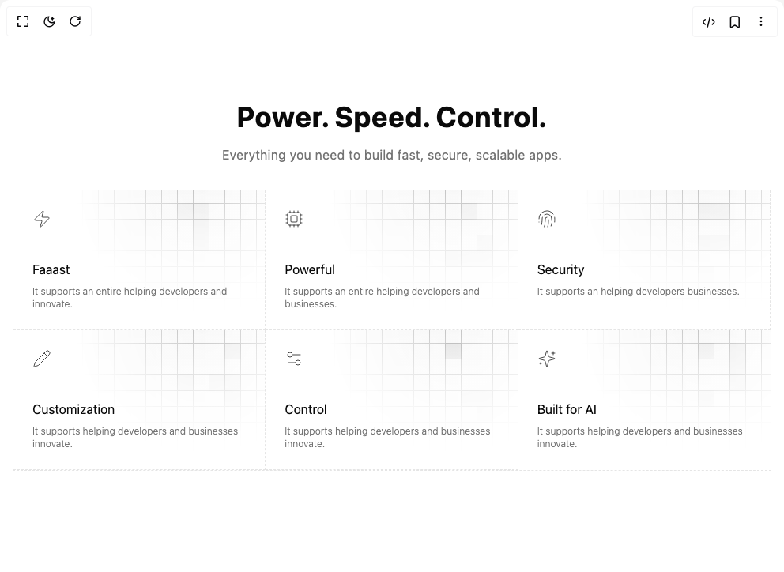

# Build Grid Feature Cards in BuilderStudio

> Build this component in our Agentic IDE: [BuilderStudio](https://builderstudio.dev).
>
> Join the BuilderStudio community on [Discord](https://discord.gg/QdWeSGCqfe) and [Reddit](https://reddit.com/r/builderstudio).



## Component

- Author group: `efferd`
- Component: `grid-feature-cards`
- Variant: `default`
- Rendered HTML snapshot: [`rendered.html`](rendered.html)

## BuilderStudio prompt

You are implementing a React component based on a component reference.

## Component identity

- Author: efferd
- Component slug: grid-feature-cards
- Demo slug: default
- Title: grid-feature-cards
- Description: 

## Goal

Recreate this component in a React + TypeScript + Tailwind CSS project. Preserve the visual layout, spacing, colors, border radius, shadows, interaction behavior, animation behavior, responsive behavior, and dark mode behavior shown in the rendered demo.

## Implementation requirements

- Use React and TypeScript.
- Use Tailwind CSS classes whenever possible.
- Keep the component self-contained unless the source files require helper components.
- If the source uses CSS variables, custom CSS, animations, or keyframes, include them.
- If the source uses external packages, list and use the required packages.
- Preserve accessibility attributes, button semantics, links, keyboard behavior, and ARIA attributes when visible in the source.
- Do not replace the component with a simplified placeholder.
- Return complete production-ready code.

## Dependencies

No reference metadata available.

## Rendered DOM snapshot

This is the rendered demo HTML extracted from the live preview. Use it to verify structure, class names, visible content, and layout.

```html
<div id="root"><section class="py-16 md:py-32"><div class="mx-auto w-full max-w-5xl space-y-8 px-4"><div class="mx-auto max-w-3xl text-center" style="filter: blur(0px); opacity: 1; transform: none;"><h2 class="text-3xl font-bold tracking-wide text-balance md:text-4xl lg:text-5xl xl:font-extrabold">Power. Speed. Control.</h2><p class="text-muted-foreground mt-4 text-sm tracking-wide text-balance md:text-base">Everything you need to build fast, secure, scalable apps.</p></div><div class="grid grid-cols-1 divide-x divide-y divide-dashed border border-dashed sm:grid-cols-2 md:grid-cols-3" style="filter: blur(0px); opacity: 1; transform: none;"><div class="relative overflow-hidden p-6"><div class="pointer-events-none absolute top-0 left-1/2 -mt-2 -ml-20 h-full w-full [mask-image:linear-gradient(white,transparent)]"><div class="from-foreground/5 to-foreground/1 absolute inset-0 bg-gradient-to-r [mask-image:radial-gradient(farthest-side_at_top,white,transparent)] opacity-100"><svg aria-hidden="true" class="fill-foreground/5 stroke-foreground/25 absolute inset-0 h-full w-full mix-blend-overlay"><defs><pattern id="«r0»" width="20" height="20" patternUnits="userSpaceOnUse" x="-12" y="4"><path d="M.5 20V.5H20" fill="none"></path></pattern></defs><rect width="100%" height="100%" stroke-width="0" fill="url(#«r0»)"></rect><svg x="-12" y="4" class="overflow-visible"><rect stroke-width="0" width="21" height="21" x="160" y="60"></rect><rect stroke-width="0" width="21" height="21" x="160" y="20"></rect><rect stroke-width="0" width="21" height="21" x="140" y="20"></rect><rect stroke-width="0" width="21" height="21" x="160" y="40"></rect><rect stroke-width="0" width="21" height="21" x="180" y="120"></rect></svg></svg></div></div><svg xmlns="http://www.w3.org/2000/svg" width="24" height="24" viewBox="0 0 24 24" fill="none" stroke="currentColor" stroke-width="1" stroke-linecap="round" stroke-linejoin="round" class="lucide lucide-zap text-foreground/75 size-6" aria-hidden="true"><path d="M4 14a1 1 0 0 1-.78-1.63l9.9-10.2a.5.5 0 0 1 .86.46l-1.92 6.02A1 1 0 0 0 13 10h7a1 1 0 0 1 .78 1.63l-9.9 10.2a.5.5 0 0 1-.86-.46l1.92-6.02A1 1 0 0 0 11 14z"></path></svg><h3 class="mt-10 text-sm md:text-base">Faaast</h3><p class="text-muted-foreground relative z-20 mt-2 text-xs font-light">It supports an entire helping developers and innovate.</p></div><div class="relative overflow-hidden p-6"><div class="pointer-events-none absolute top-0 left-1/2 -mt-2 -ml-20 h-full w-full [mask-image:linear-gradient(white,transparent)]"><div class="from-foreground/5 to-foreground/1 absolute inset-0 bg-gradient-to-r [mask-image:radial-gradient(farthest-side_at_top,white,transparent)] opacity-100"><svg aria-hidden="true" class="fill-foreground/5 stroke-foreground/25 absolute inset-0 h-full w-full mix-blend-overlay"><defs><pattern id="«r1»" width="20" height="20" patternUnits="userSpaceOnUse" x="-12" y="4"><path d="M.5 20V.5H20" fill="none"></path></pattern></defs><rect width="100%" height="100%" stroke-width="0" fill="url(#«r1»)"></rect><svg x="-12" y="4" class="overflow-visible"><rect stroke-width="0" width="21" height="21" x="200" y="60"></rect><rect stroke-width="0" width="21" height="21" x="160" y="80"></rect><rect stroke-width="0" width="21" height="21" x="200" y="80"></rect><rect stroke-width="0" width="21" height="21" x="180" y="20"></rect><rect stroke-width="0" width="21" height="21" x="180" y="80"></rect></svg></svg></div></div><svg xmlns="http://www.w3.org/2000/svg" width="24" height="24" viewBox="0 0 24 24" fill="none" stroke="currentColor" stroke-width="1" stroke-linecap="round" stroke-linejoin="round" class="lucide lucide-cpu text-foreground/75 size-6" aria-hidden="true"><path d="M12 20v2"></path><path d="M12 2v2"></path><path d="M17 20v2"></path><path d="M17 2v2"></path><path d="M2 12h2"></path><path d="M2 17h2"></path><path d="M2 7h2"></path><path d="M20 12h2"></path><path d="M20 17h2"></path><path d="M20 7h2"></path><path d="M7 20v2"></path><path d="M7 2v2"></path><rect x="4" y="4" width="16" height="16" rx="2"></rect><rect x="8" y="8" width="8" height="8" rx="1"></rect></svg><h3 class="mt-10 text-sm md:text-base">Powerful</h3><p class="text-muted-foreground relative z-20 mt-2 text-xs font-light">It supports an entire helping developers and businesses.</p></div><div class="relative overflow-hidden p-6"><div class="pointer-events-none absolute top-0 left-1/2 -mt-2 -ml-20 h-full w-full [mask-image:linear-gradient(white,transparent)]"><div class="from-foreground/5 to-foreground/1 absolute inset-0 bg-gradient-to-r [mask-image:radial-gradient(farthest-side_at_top,white,transparent)] opacity-100"><svg aria-hidden="true" class="fill-foreground/5 stroke-foreground/25 absolute inset-0 h-full w-full mix-blend-overlay"><defs><pattern id="«r2»" width="20" height="20" patternUnits="userSpaceOnUse" x="-12" y="4"><path d="M.5 20V.5H20" fill="none"></path></pattern></defs><rect width="100%" height="100%" stroke-width="0" fill="url(#«r2»)"></rect><svg x="-12" y="4" class="overflow-visible"><rect stroke-width="0" width="21" height="21" x="160" y="20"></rect><rect stroke-width="0" width="21" height="21" x="180" y="60"></rect><rect stroke-width="0" width="21" height="21" x="180" y="20"></rect><rect stroke-width="0" width="21" height="21" x="160" y="60"></rect><rect stroke-width="0" width="21" height="21" x="160" y="100"></rect></svg></svg></div></div><svg xmlns="http://www.w3.org/2000/svg" width="24" height="24" viewBox="0 0 24 24" fill="none" stroke="currentColor" stroke-width="1" stroke-linecap="round" stroke-linejoin="round" class="lucide lucide-fingerprint text-foreground/75 size-6" aria-hidden="true"><path d="M12 10a2 2 0 0 0-2 2c0 1.02-.1 2.51-.26 4"></path><path d="M14 13.12c0 2.38 0 6.38-1 8.88"></path><path d="M17.29 21.02c.12-.6.43-2.3.5-3.02"></path><path d="M2 12a10 10 0 0 1 18-6"></path><path d="M2 16h.01"></path><path d="M21.8 16c.2-2 .131-5.354 0-6"></path><path d="M5 19.5C5.5 18 6 15 6 12a6 6 0 0 1 .34-2"></path><path d="M8.65 22c.21-.66.45-1.32.57-2"></path><path d="M9 6.8a6 6 0 0 1 9 5.2v2"></path></svg><h3 class="mt-10 text-sm md:text-base">Security</h3><p class="text-muted-foreground relative z-20 mt-2 text-xs font-light">It supports an helping developers businesses.</p></div><div class="relative overflow-hidden p-6"><div class="pointer-events-none absolute top-0 left-1/2 -mt-2 -ml-20 h-full w-full [mask-image:linear-gradient(white,transparent)]"><div class="from-foreground/5 to-foreground/1 absolute inset-0 bg-gradient-to-r [mask-image:radial-gradient(farthest-side_at_top,white,transparent)] opacity-100"><svg aria-hidden="true" class="fill-foreground/5 stroke-foreground/25 absolute inset-0 h-full w-full mix-blend-overlay"><defs><pattern id="«r3»" width="20" height="20" patternUnits="userSpaceOnUse" x="-12" y="4"><path d="M.5 20V.5H20" fill="none"></path></pattern></defs><rect width="100%" height="100%" stroke-width="0" fill="url(#«r3»)"></rect><svg x="-12" y="4" class="overflow-visible"><rect stroke-width="0" width="21" height="21" x="140" y="60"></rect><rect stroke-width="0" width="21" height="21" x="200" y="80"></rect><rect stroke-width="0" width="21" height="21" x="200" y="20"></rect><rect stroke-width="0" width="21" height="21" x="180" y="60"></rect><rect stroke-width="0" width="21" height="21" x="200" y="60"></rect></svg></svg></div></div><svg xmlns="http://www.w3.org/2000/svg" width="24" height="24" viewBox="0 0 24 24" fill="none" stroke="currentColor" stroke-width="1" stroke-linecap="round" stroke-linejoin="round" class="lucide lucide-pencil text-foreground/75 size-6" aria-hidden="true"><path d="M21.174 6.812a1 1 0 0 0-3.986-3.987L3.842 16.174a2 2 0 0 0-.5.83l-1.321 4.352a.5.5 0 0 0 .623.622l4.353-1.32a2 2 0 0 0 .83-.497z"></path><path d="m15 5 4 4"></path></svg><h3 class="mt-10 text-sm md:text-base">Customization</h3><p class="text-muted-foreground relative z-20 mt-2 text-xs font-light">It supports helping developers and businesses innovate.</p></div><div class="relative overflow-hidden p-6"><div class="pointer-events-none absolute top-0 left-1/2 -mt-2 -ml-20 h-full w-full [mask-image:linear-gradient(white,transparent)]"><div class="from-foreground/5 to-foreground/1 absolute inset-0 bg-gradient-to-r [mask-image:radial-gradient(farthest-side_at_top,white,transparent)] opacity-100"><svg aria-hidden="true" class="fill-foreground/5 stroke-foreground/25 absolute inset-0 h-full w-full mix-blend-overlay"><defs><pattern id="«r4»" width="20" height="20" patternUnits="userSpaceOnUse" x="-12" y="4"><path d="M.5 20V.5H20" fill="none"></path></pattern></defs><rect width="100%" height="100%" stroke-width="0" fill="url(#«r4»)"></rect><svg x="-12" y="4" class="overflow-visible"><rect stroke-width="0" width="21" height="21" x="200" y="100"></rect><rect stroke-width="0" width="21" height="21" x="200" y="80"></rect><rect stroke-width="0" width="21" height="21" x="160" y="20"></rect><rect stroke-width="0" width="21" height="21" x="160" y="20"></rect><rect stroke-width="0" width="21" height="21" x="180" y="80"></rect></svg></svg></div></div><svg xmlns="http://www.w3.org/2000/svg" width="24" height="24" viewBox="0 0 24 24" fill="none" stroke="currentColor" stroke-width="1" stroke-linecap="round" stroke-linejoin="round" class="lucide lucide-settings2 lucide-settings-2 text-foreground/75 size-6" aria-hidden="true"><path d="M20 7h-9"></path><path d="M14 17H5"></path><circle cx="17" cy="17" r="3"></circle><circle cx="7" cy="7" r="3"></circle></svg><h3 class="mt-10 text-sm md:text-base">Control</h3><p class="text-muted-foreground relative z-20 mt-2 text-xs font-light">It supports helping developers and businesses innovate.</p></div><div class="relative overflow-hidden p-6"><div class="pointer-events-none absolute top-0 left-1/2 -mt-2 -ml-20 h-full w-full [mask-image:linear-gradient(white,transparent)]"><div class="from-foreground/5 to-foreground/1 absolute inset-0 bg-gradient-to-r [mask-image:radial-gradient(farthest-side_at_top,white,transparent)] opacity-100"><svg aria-hidden="true" class="fill-foreground/5 stroke-foreground/25 absolute inset-0 h-full w-full mix-blend-overlay"><defs><pattern id="«r5»" width="20" height="20" patternUnits="userSpaceOnUse" x="-12" y="4"><path d="M.5 20V.5H20" fill="none"></path></pattern></defs><rect width="100%" height="100%" stroke-width="0" fill="url(#«r5»)"></rect><svg x="-12" y="4" class="overflow-visible"><rect stroke-width="0" width="21" height="21" x="200" y="40"></rect><rect stroke-width="0" width="21" height="21" x="200" y="60"></rect><rect stroke-width="0" width="21" height="21" x="160" y="20"></rect><rect stroke-width="0" width="21" height="21" x="160" y="80"></rect><rect stroke-width="0" width="21" height="21" x="200" y="20"></rect></svg></svg></div></div><svg xmlns="http://www.w3.org/2000/svg" width="24" height="24" viewBox="0 0 24 24" fill="none" stroke="currentColor" stroke-width="1" stroke-linecap="round" stroke-linejoin="round" class="lucide lucide-sparkles text-foreground/75 size-6" aria-hidden="true"><path d="M9.937 15.5A2 2 0 0 0 8.5 14.063l-6.135-1.582a.5.5 0 0 1 0-.962L8.5 9.936A2 2 0 0 0 9.937 8.5l1.582-6.135a.5.5 0 0 1 .963 0L14.063 8.5A2 2 0 0 0 15.5 9.937l6.135 1.581a.5.5 0 0 1 0 .964L15.5 14.063a2 2 0 0 0-1.437 1.437l-1.582 6.135a.5.5 0 0 1-.963 0z"></path><path d="M20 3v4"></path><path d="M22 5h-4"></path><path d="M4 17v2"></path><path d="M5 18H3"></path></svg><h3 class="mt-10 text-sm md:text-base">Built for AI</h3><p class="text-muted-foreground relative z-20 mt-2 text-xs font-light">It supports helping developers and businesses innovate.</p></div></div></div></section></div>
```

## Reference source files

No reference source files were available.
