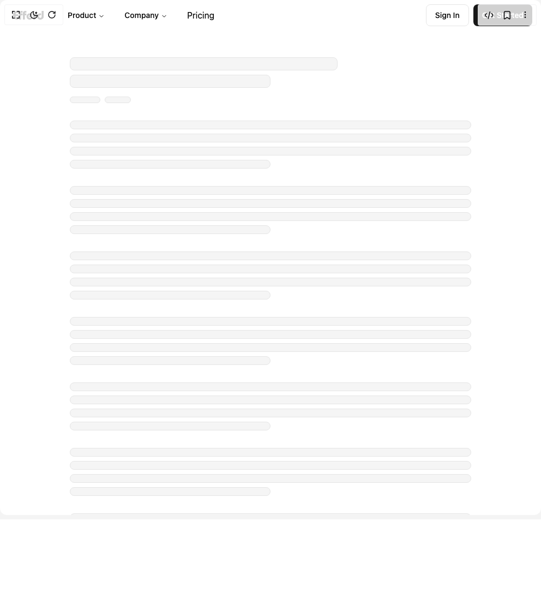

# Build Header 3 in BuilderStudio

> Build this component in our Agentic IDE: [BuilderStudio](https://builderstudio.dev).
>
> Join the BuilderStudio community on [Discord](https://discord.gg/QdWeSGCqfe) and [Reddit](https://reddit.com/r/builderstudio).



## Component

- Author group: `efferd`
- Component: `header-3`
- Variant: `default`
- Rendered HTML snapshot: [`rendered.html`](rendered.html)

## BuilderStudio prompt

You are implementing a React component based on a component reference.

## Component identity

- Author: efferd
- Component slug: header-3
- Demo slug: default
- Title: header-3
- Description: 

## Goal

Recreate this component in a React + TypeScript + Tailwind CSS project. Preserve the visual layout, spacing, colors, border radius, shadows, interaction behavior, animation behavior, responsive behavior, and dark mode behavior shown in the rendered demo.

## Implementation requirements

- Use React and TypeScript.
- Use Tailwind CSS classes whenever possible.
- Keep the component self-contained unless the source files require helper components.
- If the source uses CSS variables, custom CSS, animations, or keyframes, include them.
- If the source uses external packages, list and use the required packages.
- Preserve accessibility attributes, button semantics, links, keyboard behavior, and ARIA attributes when visible in the source.
- Do not replace the component with a simplified placeholder.
- Return complete production-ready code.

## Dependencies

No reference metadata available.

## Rendered DOM snapshot

This is the rendered demo HTML extracted from the live preview. Use it to verify structure, class names, visible content, and layout.

```html
<div id="root"><div class="w-screen min-h-screen flex justify-center items-center"><div class="w-screen min-h-screen flex justify-center items-center"><div class="w-full"><header class="sticky top-0 z-50 w-full border-b border-transparent"><nav class="mx-auto flex h-14 w-full max-w-5xl items-center justify-between px-4"><div class="flex items-center gap-5"><a href="#" class="hover:bg-accent rounded-md p-2"><svg viewBox="0 0 84 24" fill="currentColor" class="h-4"><path d="M45.035 23.984c-1.34-.062-2.566-.441-3.777-1.16-1.938-1.152-3.465-3.187-4.02-5.36-.199-.784-.238-1.128-.234-2.058 0-.691.008-.87.062-1.207.23-1.5.852-2.883 1.852-4.144.297-.371 1.023-1.09 1.41-1.387 1.399-1.082 2.84-1.68 4.406-1.816.536-.047 1.528-.02 2.047.054 1.227.184 2.227.543 3.106 1.121 1.277.84 2.5 2.184 3.367 3.7.098.168.172.308.172.312-.004 0-1.047.723-2.32 1.598l-2.711 1.867c-.61.422-2.91 2.008-2.993 2.062l-.074.047-1-1.574c-.55-.867-1.008-1.594-1.012-1.61-.007-.019.922-.648 2.188-1.476 1.215-.793 2.2-1.453 2.191-1.46-.02-.032-.508-.27-.691-.34a5 5 0 0 0-.465-.13c-.371-.09-1.105-.125-1.426-.07-1.285.219-2.336 1.3-2.777 2.852-.215.761-.242 1.636-.074 2.355.129.527.383 1.102.691 1.543.234.332.727.82 1.047 1.031.664.434 1.195.586 1.969.555.613-.023 1.027-.129 1.64-.426 1.184-.574 2.16-1.554 2.828-2.843.122-.235.208-.372.227-.368.082.032 3.77 1.938 3.79 1.961.034.032-.407.93-.696 1.414a12 12 0 0 1-1.051 1.477c-.36.422-1.102 1.14-1.492 1.445a9.9 9.9 0 0 1-3.23 1.684 9.2 9.2 0 0 1-2.95.351M74.441 23.996c-1.488-.043-2.8-.363-4.066-.992-1.687-.848-2.992-2.14-3.793-3.774-.605-1.234-.863-2.402-.863-3.894.004-1.149.176-2.156.527-3.11.14-.378.531-1.171.75-1.515 1.078-1.703 2.758-2.934 4.805-3.524.847-.242 1.465-.332 2.433-.351 1.032-.024 1.743.055 2.48.277l.31.09.007 2.48c.004 1.364 0 2.481-.008 2.481a1 1 0 0 1-.12-.055c-.688-.347-2.09-.488-2.962-.296-.754.167-1.296.453-1.785.945a3.7 3.7 0 0 0-1.043 2.11c-.047.382-.02 1.109.055 1.437a3.4 3.4 0 0 0 .941 1.738c.75.75 1.715 1.102 2.875 1.05.645-.03 1.118-.14 1.563-.366q1.721-.864 2.02-3.145c.035-.293.042-1.266.042-7.957V0H84l-.012 8.434c-.008 7.851-.011 8.457-.054 8.757-.196 1.274-.586 2.25-1.301 3.243-1.293 1.808-3.555 3.07-6.145 3.437-.664.098-1.43.14-2.047.125M9.848 23.574a14 14 0 0 1-1.137-.152c-2.352-.426-4.555-1.781-6.117-3.774-.27-.335-.75-1.05-.95-1.406-1.156-2.047-1.695-4.27-1.64-6.77.047-1.995.43-3.66 1.23-5.316.524-1.086 1.04-1.87 1.793-2.715C4.567 1.72 6.652.535 8.793.171 9.68.02 10.093 0 12.297 0h1.789v5.441l-.961.016c-2.36.04-3.441.215-4.441.719-.836.414-1.278.879-1.895 1.976-.219.399-.535 1.02-.535 1.063 0 .02 1.285.027 3.918.027h3.914v5.113h-3.914c-2.54 0-3.918.008-3.918.028 0 .05.254.597.441.953.344.656.649 1.086 1.051 1.48.668.657 1.356.985 2.445 1.16.645.106 1.274.145 2.61.16l1.285.016v5.442l-2.055-.004a120 120 0 0 1-2.183-.016M16.469 14.715c0-5.504.011-9.04.031-9.29a5.54 5.54 0 0 1 1.527-3.48c.778-.82 1.922-1.457 3.118-1.734C21.915.035 22.422 0 24.39 0h1.652v4.914h-1.426c-1.324 0-1.445.004-1.644.055-.739.191-1.059.699-1.106 1.754l-.015.355h4.191v4.914h-4.184v11.602h-5.39ZM27.023 14.727c0-5.223.012-9.04.028-9.278.129-1.98 1.234-3.68 3.012-4.62.87-.462 1.777-.716 2.851-.802A61 61 0 0 1 34.945 0h1.649v4.914h-1.426c-1.32 0-1.441.004-1.64.055-.739.191-1.063.699-1.106 1.754l-.02.355h4.192v4.914H32.41v11.602h-5.387ZM55.48 15.406V7.22h4.66v1.363c0 1.3.005 1.363.051 1.363.04 0 .075-.054.133-.203.38-.98.969-1.68 1.711-2.031.563-.266 1.422-.43 2.492-.48l.414-.02v4.914l-.414.035c-.738.063-1.597.195-2.058.313-.297.082-.688.28-.875.449-.324.289-.532.703-.625 1.254-.094.547-.098.879-.098 5.144v4.274h-5.39Zm0 0"></path></svg></a><nav aria-label="Main" data-orientation="horizontal" dir="ltr" class="relative z-10 max-w-max flex-1 items-center justify-center hidden md:flex"><div style="position: relative;"><ul data-orientation="horizontal" class="group flex flex-1 list-none items-center justify-center space-x-1" dir="ltr"><li><button id="radix-«r0»-trigger-radix-«r1»" data-state="closed" aria-expanded="false" aria-controls="radix-«r0»-content-radix-«r1»" class="group inline-flex h-9 w-max items-center justify-center rounded-md px-4 py-2 text-sm font-medium transition-colors hover:bg-accent hover:text-accent-foreground focus:bg-accent focus:text-accent-foreground focus:outline-none disabled:pointer-events-none disabled:opacity-50 data-[active]:bg-accent/50 data-[state=open]:bg-accent/50 group bg-transparent" data-radix-collection-item="">Product <svg width="15" height="15" viewBox="0 0 15 15" fill="none" xmlns="http://www.w3.org/2000/svg" class="relative top-[1px] ml-1 h-3 w-3 transition duration-300 group-data-[state=open]:rotate-180" aria-hidden="true"><path d="M3.13523 6.15803C3.3241 5.95657 3.64052 5.94637 3.84197 6.13523L7.5 9.56464L11.158 6.13523C11.3595 5.94637 11.6759 5.95657 11.8648 6.15803C12.0536 6.35949 12.0434 6.67591 11.842 6.86477L7.84197 10.6148C7.64964 10.7951 7.35036 10.7951 7.15803 10.6148L3.15803 6.86477C2.95657 6.67591 2.94637 6.35949 3.13523 6.15803Z" fill="currentColor" fill-rule="evenodd" clip-rule="evenodd"></path></svg></button></li><li><button id="radix-«r0»-trigger-radix-«r2»" data-state="closed" aria-expanded="false" aria-controls="radix-«r0»-content-radix-«r2»" class="group inline-flex h-9 w-max items-center justify-center rounded-md px-4 py-2 text-sm font-medium transition-colors hover:bg-accent hover:text-accent-foreground focus:bg-accent focus:text-accent-foreground focus:outline-none disabled:pointer-events-none disabled:opacity-50 data-[active]:bg-accent/50 data-[state=open]:bg-accent/50 group bg-transparent" data-radix-collection-item="">Company <svg width="15" height="15" viewBox="0 0 15 15" fill="none" xmlns="http://www.w3.org/2000/svg" class="relative top-[1px] ml-1 h-3 w-3 transition duration-300 group-data-[state=open]:rotate-180" aria-hidden="true"><path d="M3.13523 6.15803C3.3241 5.95657 3.64052 5.94637 3.84197 6.13523L7.5 9.56464L11.158 6.13523C11.3595 5.94637 11.6759 5.95657 11.8648 6.15803C12.0536 6.35949 12.0434 6.67591 11.842 6.86477L7.84197 10.6148C7.64964 10.7951 7.35036 10.7951 7.15803 10.6148L3.15803 6.86477C2.95657 6.67591 2.94637 6.35949 3.13523 6.15803Z" fill="currentColor" fill-rule="evenodd" clip-rule="evenodd"></path></svg></button></li><a href="#" class="px-4 hover:bg-accent rounded-md p-2" data-radix-collection-item="">Pricing</a></ul></div><div class="absolute left-0 top-full flex justify-center"></div></nav></div><div class="hidden items-center gap-2 md:flex"><button class="inline-flex items-center justify-center whitespace-nowrap rounded-md text-sm font-medium ring-offset-background transition-colors focus-visible:outline-none focus-visible:ring-2 focus-visible:ring-ring focus-visible:ring-offset-2 disabled:pointer-events-none disabled:opacity-50 border border-input bg-background hover:bg-accent hover:text-accent-foreground h-10 px-4 py-2">Sign In</button><button class="inline-flex items-center justify-center whitespace-nowrap rounded-md text-sm font-medium ring-offset-background transition-colors focus-visible:outline-none focus-visible:ring-2 focus-visible:ring-ring focus-visible:ring-offset-2 disabled:pointer-events-none disabled:opacity-50 bg-primary text-primary-foreground hover:bg-primary/90 h-10 px-4 py-2">Get Started</button></div><button class="inline-flex items-center justify-center whitespace-nowrap rounded-md text-sm font-medium ring-offset-background transition-colors focus-visible:outline-none focus-visible:ring-2 focus-visible:ring-ring focus-visible:ring-offset-2 disabled:pointer-events-none disabled:opacity-50 border border-input bg-background hover:bg-accent hover:text-accent-foreground h-10 w-10 md:hidden" aria-expanded="false" aria-controls="mobile-menu" aria-label="Toggle menu"><svg stroke-width="2.5" fill="none" stroke="currentColor" viewBox="0 0 32 32" stroke-linecap="round" stroke-linejoin="round" class="transition-transform ease-in-out size-5" style="transition-duration: 300ms;"><path class="transition-all ease-in-out [stroke-dasharray:12_63]" d="M27 10 13 10C10.8 10 9 8.2 9 6 9 3.5 10.8 2 13 2 15.2 2 17 3.8 17 6L17 26C17 28.2 18.8 30 21 30 23.2 30 25 28.2 25 26 25 23.8 23.2 22 21 22L7 22" style="transition-duration: 300ms;"></path><path d="M7 16 27 16"></path></svg></button></nav></header><main class="mx-auto min-h-screen w-full max-w-3xl px-4 py-12"><div class="space-y-2 mb-4"><div class="bg-accent h-6 w-4/6 rounded-md border"></div><div class="bg-accent h-6 w-1/2 rounded-md border"></div></div><div class="flex gap-2 mb-8"><div class="bg-accent h-3 w-14 rounded-md border"></div><div class="bg-accent h-3 w-12 rounded-md border"></div></div><div class="space-y-2 mb-8"><div class="bg-accent h-4 w-full rounded-md border"></div><div class="bg-accent h-4 w-full rounded-md border"></div><div class="bg-accent h-4 w-full rounded-md border"></div><div class="bg-accent h-4 w-1/2 rounded-md border"></div></div><div class="space-y-2 mb-8"><div class="bg-accent h-4 w-full rounded-md border"></div><div class="bg-accent h-4 w-full rounded-md border"></div><div class="bg-accent h-4 w-full rounded-md border"></div><div class="bg-accent h-4 w-1/2 rounded-md border"></div></div><div class="space-y-2 mb-8"><div class="bg-accent h-4 w-full rounded-md border"></div><div class="bg-accent h-4 w-full rounded-md border"></div><div class="bg-accent h-4 w-full rounded-md border"></div><div class="bg-accent h-4 w-1/2 rounded-md border"></div></div><div class="space-y-2 mb-8"><div class="bg-accent h-4 w-full rounded-md border"></div><div class="bg-accent h-4 w-full rounded-md border"></div><div class="bg-accent h-4 w-full rounded-md border"></div><div class="bg-accent h-4 w-1/2 rounded-md border"></div></div><div class="space-y-2 mb-8"><div class="bg-accent h-4 w-full rounded-md border"></div><div class="bg-accent h-4 w-full rounded-md border"></div><div class="bg-accent h-4 w-full rounded-md border"></div><div class="bg-accent h-4 w-1/2 rounded-md border"></div></div><div class="space-y-2 mb-8"><div class="bg-accent h-4 w-full rounded-md border"></div><div class="bg-accent h-4 w-full rounded-md border"></div><div class="bg-accent h-4 w-full rounded-md border"></div><div class="bg-accent h-4 w-1/2 rounded-md border"></div></div><div class="space-y-2 mb-8"><div class="bg-accent h-4 w-full rounded-md border"></div><div class="bg-accent h-4 w-full rounded-md border"></div><div class="bg-accent h-4 w-full rounded-md border"></div><div class="bg-accent h-4 w-1/2 rounded-md border"></div></div></main></div></div></div></div>
```

## Reference source files

No reference source files were available.
