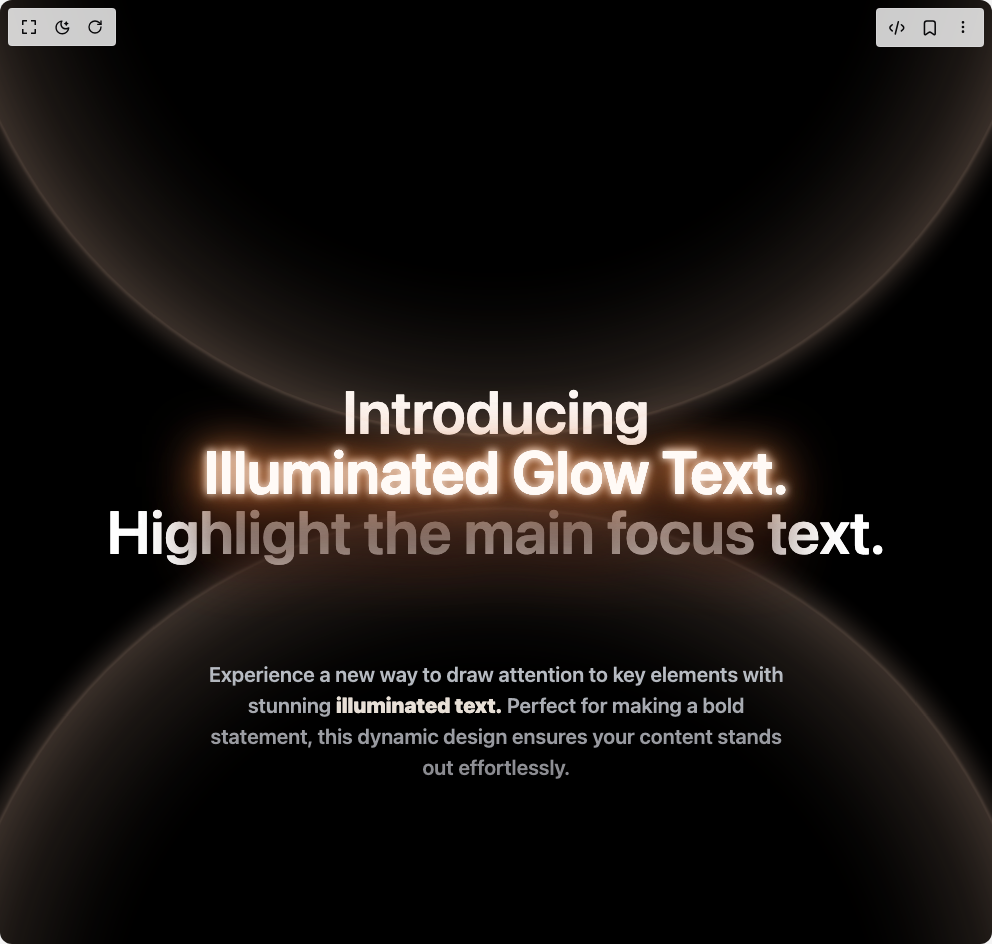

# Build Illuminated Hero in BuilderStudio

> Build this component in our Agentic IDE: [BuilderStudio](https://builderstudio.dev).
>
> Join the BuilderStudio community on [Discord](https://discord.gg/QdWeSGCqfe) and [Reddit](https://reddit.com/r/builderstudio).



## Component

- Author group: `efferd`
- Component: `illuminated-hero`
- Variant: `default`
- Rendered HTML snapshot: [`rendered.html`](rendered.html)

## BuilderStudio prompt

You are implementing a React component based on a component reference.

## Component identity

- Author: efferd
- Component slug: illuminated-hero
- Demo slug: default
- Title: illuminated-hero
- Description: 

## Goal

Recreate this component in a React + TypeScript + Tailwind CSS project. Preserve the visual layout, spacing, colors, border radius, shadows, interaction behavior, animation behavior, responsive behavior, and dark mode behavior shown in the rendered demo.

## Implementation requirements

- Use React and TypeScript.
- Use Tailwind CSS classes whenever possible.
- Keep the component self-contained unless the source files require helper components.
- If the source uses CSS variables, custom CSS, animations, or keyframes, include them.
- If the source uses external packages, list and use the required packages.
- Preserve accessibility attributes, button semantics, links, keyboard behavior, and ARIA attributes when visible in the source.
- Do not replace the component with a simplified placeholder.
- Return complete production-ready code.

## Dependencies

No reference metadata available.

## Rendered DOM snapshot

This is the rendered demo HTML extracted from the live preview. Use it to verify structure, class names, visible content, and layout.

```html
<div id="root"><div class="w-screen min-h-screen flex justify-center items-center"><div class="w-screen min-h-screen flex justify-center items-center"><div class="relative w-full flex h-screen flex-wrap items-center justify-center overflow-hidden bg-black text-[calc(var(--size)*0.022)] text-white [--factor:min(1000px,100vh)] [--size:min(var(--factor),100vw)]"><div class="bg absolute h-full w-full max-w-[44em]"><div class="shadow-bgt absolute size-full translate-[0_-70%] scale-[1.2] animate-[onloadbgt_1s_ease-in-out_forwards] rounded-[100em] opacity-60"></div><div class="shadow-bgb absolute size-full translate-[0_-70%] scale-[1.2] animate-[onloadbgb_1s_ease-in-out_forwards] rounded-[100em] opacity-60"></div></div><div class="text-center text-4xl md:text-6xl font-semibold" aria-hidden="true">Introducing<br><span class="relative inline-block before:absolute before:animate-[onloadopacity_1s_ease-out_forwards] before:opacity-0 before:content-[attr(data-text)] before:bg-[linear-gradient(0deg,#dfe5ee_0%,#fffaf6_50%)] before:bg-clip-text before:text-[#fffaf6] filter-[url(#glow-4)]" data-text="Illuminated Glow Text.">Illuminated Glow Text.</span><br>Highlight the main focus text.<br></div><p class="absolute top-0 bottom-0 m-auto h-fit max-w-[28em] translate-y-[12em] bg-gradient-to-t from-[#86868b] to-[#bdc2c9] bg-clip-text text-center font-semibold text-transparent">Experience a new way to draw attention to key elements with stunning <span class="relative inline-block font-black text-[#e7dfd6]">illuminated text.</span> Perfect for making a bold statement, this dynamic design ensures your content stands out effortlessly.</p><svg class="absolute -z-1 h-0 w-0" width="1440px" height="300px" viewBox="0 0 1440 300" xmlns="http://www.w3.org/2000/svg"><defs><filter id="glow-4" color-interpolation-filters="sRGB" x="-50%" y="-200%" width="200%" height="500%"><feGaussianBlur in="SourceGraphic" data-target-blur="4" stdDeviation="4" result="blur4"></feGaussianBlur><feGaussianBlur in="SourceGraphic" data-target-blur="19" stdDeviation="19" result="blur19"></feGaussianBlur><feGaussianBlur in="SourceGraphic" data-target-blur="9" stdDeviation="9" result="blur9"></feGaussianBlur><feGaussianBlur in="SourceGraphic" data-target-blur="30" stdDeviation="30" result="blur30"></feGaussianBlur><feColorMatrix in="blur4" result="color-0-blur" type="matrix" values="1 0 0 0 0
                      0 0.9803921568627451 0 0 0
                      0 0 0.9647058823529412 0 0
                      0 0 0 0.8 0"></feColorMatrix><feOffset in="color-0-blur" result="layer-0-offsetted" dx="0" dy="0" data-target-offset-y="0"></feOffset><feColorMatrix in="blur19" result="color-1-blur" type="matrix" values="0.8156862745098039 0 0 0 0
                      0 0.49411764705882355 0 0 0
                      0 0 0.2627450980392157 0 0
                      0 0 0 1 0"></feColorMatrix><feOffset in="color-1-blur" result="layer-1-offsetted" dx="0" dy="2" data-target-offset-y="2"></feOffset><feColorMatrix in="blur9" result="color-2-blur" type="matrix" values="1 0 0 0 0
                      0 0.6666666666666666 0 0 0
                      0 0 0.36470588235294116 0 0
                      0 0 0 0.65 0"></feColorMatrix><feOffset in="color-2-blur" result="layer-2-offsetted" dx="0" dy="2" data-target-offset-y="2"></feOffset><feColorMatrix in="blur30" result="color-3-blur" type="matrix" values="1 0 0 0 0
                      0 0.611764705882353 0 0 0
                      0 0 0.39215686274509803 0 0
                      0 0 0 1 0"></feColorMatrix><feOffset in="color-3-blur" result="layer-3-offsetted" dx="0" dy="2" data-target-offset-y="2"></feOffset><feColorMatrix in="blur30" result="color-4-blur" type="matrix" values="0.4549019607843137 0 0 0 0
                      0 0.16470588235294117 0 0 0
                      0 0 0 0 0
                      0 0 0 1 0"></feColorMatrix><feOffset in="color-4-blur" result="layer-4-offsetted" dx="0" dy="16" data-target-offset-y="16"></feOffset><feColorMatrix in="blur30" result="color-5-blur" type="matrix" values="0.4235294117647059 0 0 0 0
                      0 0.19607843137254902 0 0 0
                      0 0 0.11372549019607843 0 0
                      0 0 0 1 0"></feColorMatrix><feOffset in="color-5-blur" result="layer-5-offsetted" dx="0" dy="64" data-target-offset-y="64"></feOffset><feColorMatrix in="blur30" result="color-6-blur" type="matrix" values="0.21176470588235294 0 0 0 0
                      0 0.10980392156862745 0 0 0
                      0 0 0.07450980392156863 0 0
                      0 0 0 1 0"></feColorMatrix><feOffset in="color-6-blur" result="layer-6-offsetted" dx="0" dy="64" data-target-offset-y="64"></feOffset><feColorMatrix in="blur30" result="color-7-blur" type="matrix" values="0 0 0 0 0
                      0 0 0 0 0
                      0 0 0 0 0
                      0 0 0 0.68 0"></feColorMatrix><feOffset in="color-7-blur" result="layer-7-offsetted" dx="0" dy="64" data-target-offset-y="64"></feOffset><feMerge><feMergeNode in="layer-0-offsetted"></feMergeNode><feMergeNode in="layer-1-offsetted"></feMergeNode><feMergeNode in="layer-2-offsetted"></feMergeNode><feMergeNode in="layer-3-offsetted"></feMergeNode><feMergeNode in="layer-4-offsetted"></feMergeNode><feMergeNode in="layer-5-offsetted"></feMergeNode><feMergeNode in="layer-6-offsetted"></feMergeNode><feMergeNode in="layer-7-offsetted"></feMergeNode><feMergeNode in="layer-0-offsetted"></feMergeNode><feMergeNode in="SourceGraphic"></feMergeNode></feMerge></filter></defs></svg></div></div></div></div>
```

## Reference source files

No reference source files were available.
