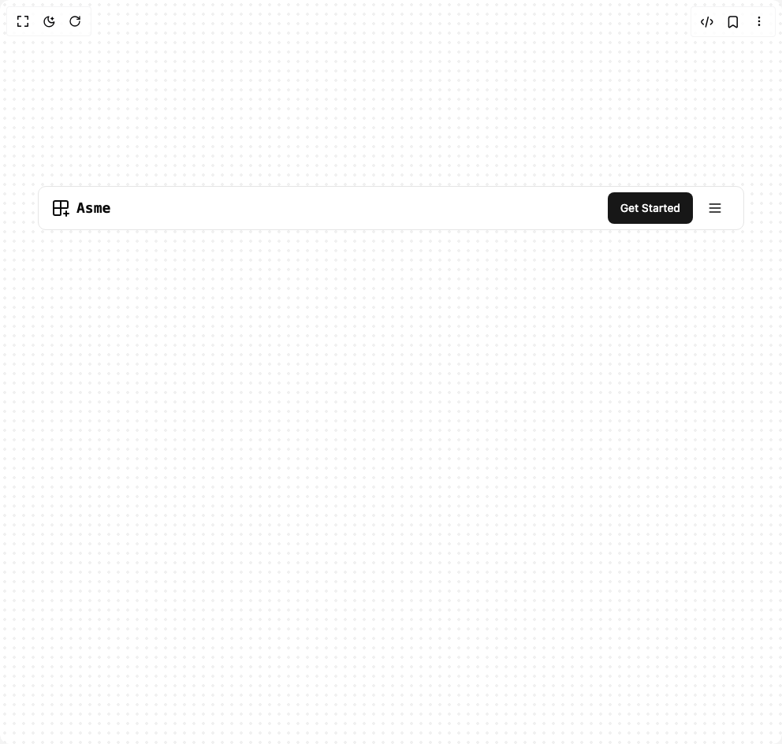

# Build Navigation Menu in BuilderStudio

> Build this component in our Agentic IDE: [BuilderStudio](https://builderstudio.dev).
>
> Join the BuilderStudio community on [Discord](https://discord.gg/QdWeSGCqfe) and [Reddit](https://reddit.com/r/builderstudio).



## Component

- Author group: `efferd`
- Component: `navigation-menu`
- Variant: `default`
- Rendered HTML snapshot: [`rendered.html`](rendered.html)

## BuilderStudio prompt

You are implementing a React component based on a component reference.

## Component identity

- Author: efferd
- Component slug: navigation-menu
- Demo slug: default
- Title: navigation-menu
- Description: 

## Goal

Recreate this component in a React + TypeScript + Tailwind CSS project. Preserve the visual layout, spacing, colors, border radius, shadows, interaction behavior, animation behavior, responsive behavior, and dark mode behavior shown in the rendered demo.

## Implementation requirements

- Use React and TypeScript.
- Use Tailwind CSS classes whenever possible.
- Keep the component self-contained unless the source files require helper components.
- If the source uses CSS variables, custom CSS, animations, or keyframes, include them.
- If the source uses external packages, list and use the required packages.
- Preserve accessibility attributes, button semantics, links, keyboard behavior, and ARIA attributes when visible in the source.
- Do not replace the component with a simplified placeholder.
- Return complete production-ready code.

## Dependencies

No reference metadata available.

## Rendered DOM snapshot

This is the rendered demo HTML extracted from the live preview. Use it to verify structure, class names, visible content, and layout.

```html
<div id="root"><div class="w-screen min-h-screen flex justify-center items-center"><div class="w-screen min-h-screen flex justify-center items-center"><div class="relative min-h-screen w-full px-4"><div aria-hidden="true" class="absolute inset-0 -z-10 size-full bg-[radial-gradient(color-mix(in_oklab,--theme(--color-foreground/.2)30%,transparent)_2px,transparent_2px)] bg-[size:12px_12px]"></div><div class="bg-background sticky top-1/4 z-50 mx-auto h-14 w-full max-w-4xl border px-4  rounded-lg"><div class="flex h-full items-center justify-between"><div class="flex items-center gap-2"><svg xmlns="http://www.w3.org/2000/svg" width="24" height="24" viewBox="0 0 24 24" fill="none" stroke="currentColor" stroke-width="2" stroke-linecap="round" stroke-linejoin="round" class="lucide lucide-grid2x2-plus lucide-grid-2x2-plus size-6" aria-hidden="true"><path d="M12 3v17a1 1 0 0 1-1 1H5a2 2 0 0 1-2-2V5a2 2 0 0 1 2-2h14a2 2 0 0 1 2 2v6a1 1 0 0 1-1 1H3"></path><path d="M16 19h6"></path><path d="M19 22v-6"></path></svg><p class="font-mono text-lg font-bold">Asme</p></div><nav aria-label="Main" data-orientation="horizontal" dir="ltr" data-slot="navigation-menu" data-viewport="true" class="group/navigation-menu max-w-max flex-1 items-center justify-center hidden lg:block"><div style="position: relative;"><ul data-orientation="horizontal" data-slot="navigation-menu-list" class="group flex flex-1 list-none items-center justify-center gap-1" dir="ltr"><li data-slot="navigation-menu-item" class="relative"><button id="radix-«r0»-trigger-radix-«r1»" data-state="closed" aria-expanded="false" aria-controls="radix-«r0»-content-radix-«r1»" data-slot="navigation-menu-trigger" class="group hover:bg-accent hover:text-accent-foreground focus:bg-accent focus:text-accent-foreground data-[state=open]:hover:bg-accent data-[state=open]:text-accent-foreground data-[state=open]:focus:bg-accent data-[state=open]:bg-accent/50 focus-visible:ring-ring/50 inline-flex w-max items-center justify-center rounded-md px-4 py-1 text-sm font-medium transition-[color,box-shadow] outline-none focus-visible:ring-[3px] focus-visible:outline-1 disabled:pointer-events-none disabled:opacity-50" data-radix-collection-item="">Product <svg xmlns="http://www.w3.org/2000/svg" width="24" height="24" viewBox="0 0 24 24" fill="none" stroke="currentColor" stroke-width="2" stroke-linecap="round" stroke-linejoin="round" class="lucide lucide-chevron-down relative top-[1px] ml-1 size-3 transition duration-300 group-data-[state=open]:rotate-180" aria-hidden="true"><path d="m6 9 6 6 6-6"></path></svg></button></li><li data-slot="navigation-menu-item" class="relative"><button id="radix-«r0»-trigger-radix-«r2»" data-state="closed" aria-expanded="false" aria-controls="radix-«r0»-content-radix-«r2»" data-slot="navigation-menu-trigger" class="group hover:bg-accent hover:text-accent-foreground focus:bg-accent focus:text-accent-foreground data-[state=open]:hover:bg-accent data-[state=open]:text-accent-foreground data-[state=open]:focus:bg-accent data-[state=open]:bg-accent/50 focus-visible:ring-ring/50 inline-flex w-max items-center justify-center rounded-md px-4 py-1 text-sm font-medium transition-[color,box-shadow] outline-none focus-visible:ring-[3px] focus-visible:outline-1 disabled:pointer-events-none disabled:opacity-50" data-radix-collection-item="">Company <svg xmlns="http://www.w3.org/2000/svg" width="24" height="24" viewBox="0 0 24 24" fill="none" stroke="currentColor" stroke-width="2" stroke-linecap="round" stroke-linejoin="round" class="lucide lucide-chevron-down relative top-[1px] ml-1 size-3 transition duration-300 group-data-[state=open]:rotate-180" aria-hidden="true"><path d="m6 9 6 6 6-6"></path></svg></button></li><li data-slot="navigation-menu-item" class="relative"><a data-slot="navigation-menu-link" class="data-[active=true]:focus:bg-accent data-[active=true]:hover:bg-accent data-[active=true]:bg-accent/50 data-[active=true]:text-accent-foreground hover:bg-accent hover:text-accent-foreground focus:bg-accent focus:text-accent-foreground focus-visible:ring-ring/50 [&amp;_svg:not([class*='text-'])]:text-muted-foreground flex flex-col justify-center gap-1 rounded-sm px-4 py-1 text-sm transition-all outline-none focus-visible:ring-[3px] focus-visible:outline-1 [&amp;_svg:not([class*='size-'])]:size-4 cursor-pointer" data-radix-collection-item="">Pricing</a></li></ul></div><div class="absolute top-full left-0 isolate z-50 flex justify-center"></div></nav><div class="flex items-center gap-2"><button class="inline-flex items-center justify-center whitespace-nowrap rounded-md text-sm font-medium ring-offset-background transition-colors focus-visible:outline-none focus-visible:ring-2 focus-visible:ring-ring focus-visible:ring-offset-2 disabled:pointer-events-none disabled:opacity-50 bg-primary text-primary-foreground hover:bg-primary/90 h-10 px-4 py-2">Get Started</button><button class="inline-flex items-center justify-center whitespace-nowrap text-sm font-medium ring-offset-background transition-colors focus-visible:outline-none focus-visible:ring-2 focus-visible:ring-ring focus-visible:ring-offset-2 disabled:pointer-events-none disabled:opacity-50 hover:bg-accent hover:text-accent-foreground h-10 w-10 rounded-full lg:hidden" type="button" aria-haspopup="dialog" aria-expanded="false" aria-controls="radix-«r4»" data-state="closed" data-slot="sheet-trigger"><svg xmlns="http://www.w3.org/2000/svg" width="24" height="24" viewBox="0 0 24 24" fill="none" stroke="currentColor" stroke-width="2" stroke-linecap="round" stroke-linejoin="round" class="lucide lucide-menu size-5" aria-hidden="true"><line x1="4" x2="20" y1="12" y2="12"></line><line x1="4" x2="20" y1="6" y2="6"></line><line x1="4" x2="20" y1="18" y2="18"></line></svg></button></div></div></div></div></div></div></div>
```

## Reference source files

No reference source files were available.
