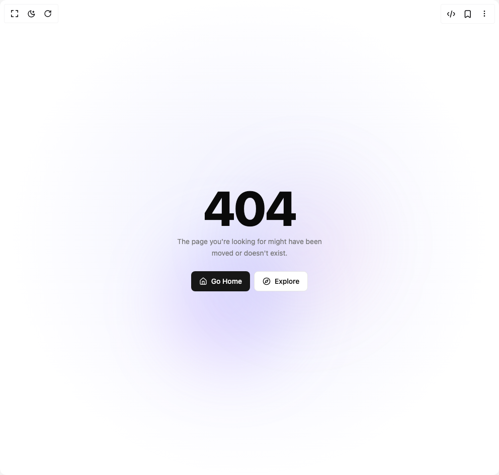

# Build Not Found Page 2 in BuilderStudio

> Build this component in our Agentic IDE: [BuilderStudio](https://builderstudio.dev).
>
> Join the BuilderStudio community on [Discord](https://discord.gg/QdWeSGCqfe) and [Reddit](https://reddit.com/r/builderstudio).



## Component

- Author group: `efferd`
- Component: `not-found-page-2`
- Variant: `default`
- Rendered HTML snapshot: [`rendered.html`](rendered.html)

## BuilderStudio prompt

You are implementing a React component based on a component reference.

## Component identity

- Author: efferd
- Component slug: not-found-page-2
- Demo slug: default
- Title: not-found-page-2
- Description: 

## Goal

Recreate this component in a React + TypeScript + Tailwind CSS project. Preserve the visual layout, spacing, colors, border radius, shadows, interaction behavior, animation behavior, responsive behavior, and dark mode behavior shown in the rendered demo.

## Implementation requirements

- Use React and TypeScript.
- Use Tailwind CSS classes whenever possible.
- Keep the component self-contained unless the source files require helper components.
- If the source uses CSS variables, custom CSS, animations, or keyframes, include them.
- If the source uses external packages, list and use the required packages.
- Preserve accessibility attributes, button semantics, links, keyboard behavior, and ARIA attributes when visible in the source.
- Do not replace the component with a simplified placeholder.
- Return complete production-ready code.

## Dependencies

No reference metadata available.

## Rendered DOM snapshot

This is the rendered demo HTML extracted from the live preview. Use it to verify structure, class names, visible content, and layout.

```html
<div id="root"><div class="w-screen min-h-screen flex justify-center items-center"><div class="w-screen min-h-screen flex justify-center items-center"><div class="w-full relative flex min-h-screen items-center justify-center overflow-hidden bg-[radial-gradient(circle_at_center,rgba(99,102,241,0.1),transparent_70%)] text-[var(--foreground)]"><div aria-hidden="true" class="-z-10 absolute inset-0 overflow-hidden"><div class="absolute top-1/2 left-1/3 h-64 w-64 rounded-full bg-gradient-to-tr from-purple-500/20 to-blue-500/20 blur-3xl" style="transform: translateX(-0.905826px) translateY(-0.452913px) rotate(-0.226456deg);"></div><div class="absolute right-1/4 bottom-1/3 h-72 w-72 rounded-full bg-gradient-to-br from-indigo-400/10 to-pink-400/10 blur-3xl" style="transform: translateX(0.905826px) translateY(0.452913px);"></div></div><div data-slot="empty" class="flex min-w-0 flex-1 flex-col items-center justify-center gap-6 rounded-lg border-dashed p-6 text-center text-balance md:p-12"><div data-slot="empty-header" class="flex max-w-sm flex-col items-center gap-2 text-center"><div data-slot="empty-title" class="tracking-tight font-extrabold text-8xl">404</div><div data-slot="empty-description" class="text-muted-foreground [&amp;&gt;a:hover]:text-primary text-sm/relaxed [&amp;&gt;a]:underline [&amp;&gt;a]:underline-offset-4 text-nowrap">The page you're looking for might have been <br>moved or doesn't exist.</div></div><div data-slot="empty-content" class="flex w-full max-w-sm min-w-0 flex-col items-center gap-4 text-sm text-balance"><div class="flex gap-2"><a href="#" class="inline-flex items-center justify-center whitespace-nowrap rounded-md text-sm font-medium ring-offset-background transition-colors focus-visible:outline-none focus-visible:ring-2 focus-visible:ring-ring focus-visible:ring-offset-2 disabled:pointer-events-none disabled:opacity-50 bg-primary text-primary-foreground hover:bg-primary/90 h-10 px-4 py-2"><svg xmlns="http://www.w3.org/2000/svg" width="24" height="24" viewBox="0 0 24 24" fill="none" stroke="currentColor" stroke-width="2" stroke-linecap="round" stroke-linejoin="round" class="lucide lucide-house mr-2 h-4 w-4" aria-hidden="true"><path d="M15 21v-8a1 1 0 0 0-1-1h-4a1 1 0 0 0-1 1v8"></path><path d="M3 10a2 2 0 0 1 .709-1.528l7-5.999a2 2 0 0 1 2.582 0l7 5.999A2 2 0 0 1 21 10v9a2 2 0 0 1-2 2H5a2 2 0 0 1-2-2z"></path></svg> Go Home</a><a href="#" class="inline-flex items-center justify-center whitespace-nowrap rounded-md text-sm font-medium ring-offset-background transition-colors focus-visible:outline-none focus-visible:ring-2 focus-visible:ring-ring focus-visible:ring-offset-2 disabled:pointer-events-none disabled:opacity-50 border border-input bg-background hover:bg-accent hover:text-accent-foreground h-10 px-4 py-2"><svg xmlns="http://www.w3.org/2000/svg" width="24" height="24" viewBox="0 0 24 24" fill="none" stroke="currentColor" stroke-width="2" stroke-linecap="round" stroke-linejoin="round" class="lucide lucide-compass mr-2 h-4 w-4" aria-hidden="true"><path d="m16.24 7.76-1.804 5.411a2 2 0 0 1-1.265 1.265L7.76 16.24l1.804-5.411a2 2 0 0 1 1.265-1.265z"></path><circle cx="12" cy="12" r="10"></circle></svg> Explore</a></div></div></div></div></div></div></div>
```

## Reference source files

No reference source files were available.
