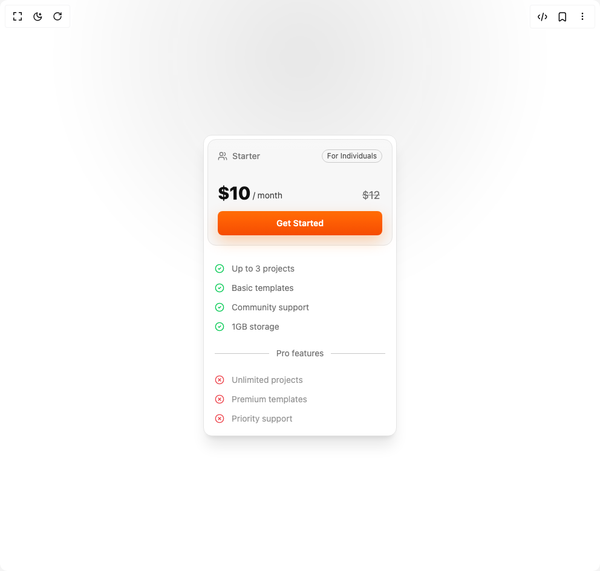

# Build Pricing Card in BuilderStudio

> Build this component in our Agentic IDE: [BuilderStudio](https://builderstudio.dev).
>
> Join the BuilderStudio community on [Discord](https://discord.gg/QdWeSGCqfe) and [Reddit](https://reddit.com/r/builderstudio).



## Component

- Author group: `efferd`
- Component: `pricing-card`
- Variant: `default`
- Rendered HTML snapshot: [`rendered.html`](rendered.html)

## BuilderStudio prompt

You are implementing a React component based on a component reference.

## Component identity

- Author: efferd
- Component slug: pricing-card
- Demo slug: default
- Title: pricing-card
- Description: 

## Goal

Recreate this component in a React + TypeScript + Tailwind CSS project. Preserve the visual layout, spacing, colors, border radius, shadows, interaction behavior, animation behavior, responsive behavior, and dark mode behavior shown in the rendered demo.

## Implementation requirements

- Use React and TypeScript.
- Use Tailwind CSS classes whenever possible.
- Keep the component self-contained unless the source files require helper components.
- If the source uses CSS variables, custom CSS, animations, or keyframes, include them.
- If the source uses external packages, list and use the required packages.
- Preserve accessibility attributes, button semantics, links, keyboard behavior, and ARIA attributes when visible in the source.
- Do not replace the component with a simplified placeholder.
- Return complete production-ready code.

## Dependencies

No reference metadata available.

## Rendered DOM snapshot

This is the rendered demo HTML extracted from the live preview. Use it to verify structure, class names, visible content, and layout.

```html
<div id="root"><div class="w-screen min-h-screen flex justify-center items-center"><div class="w-screen min-h-screen flex justify-center items-center"><main class="relative min-h-svh w-full overflow-hidden flex items-center justify-center p-4"><div aria-hidden="true" class="pointer-events-none absolute inset-0" style="background-image: radial-gradient(rgba(255, 255, 255, 0.08) 0.8px, transparent 0.8px); background-size: 14px 14px; mask-image: radial-gradient(circle at 50% 10%, rgb(0, 0, 0), rgba(0, 0, 0, 0.2) 40%, rgba(0, 0, 0, 0) 70%);"></div><div aria-hidden="true" class="pointer-events-none absolute -top-1/2 left-1/2 h-[120vmin] w-[120vmin] -translate-x-1/2 rounded-full bg-[radial-gradient(ellipse_at_center,--theme(--color-foreground/.1),transparent_50%)] blur-[30px]"></div><div class="bg-card relative w-full max-w-xs rounded-xl dark:bg-transparent p-1.5 shadow-xl backdrop-blur-xl dark:border-border/80 border"><div class="bg-muted/80 dark:bg-muted/50 relative mb-4 rounded-xl border p-4"><div aria-hidden="true" class="absolute inset-x-0 top-0 h-48 rounded-[inherit]" style="background: linear-gradient(rgba(255, 255, 255, 0.07) 0%, rgba(255, 255, 255, 0.03) 40%, rgba(0, 0, 0, 0) 100%);"></div><div class="mb-8 flex items-center justify-between"><div class="text-muted-foreground flex items-center gap-2 text-sm font-medium [&amp;_svg:not([class*='size-'])]:size-4"><svg xmlns="http://www.w3.org/2000/svg" width="24" height="24" viewBox="0 0 24 24" fill="none" stroke="currentColor" stroke-width="2" stroke-linecap="round" stroke-linejoin="round" class="lucide lucide-users" aria-hidden="true"><path d="M16 21v-2a4 4 0 0 0-4-4H6a4 4 0 0 0-4 4v2"></path><circle cx="9" cy="7" r="4"></circle><path d="M22 21v-2a4 4 0 0 0-3-3.87"></path><path d="M16 3.13a4 4 0 0 1 0 7.75"></path></svg><span class="text-muted-foreground">Starter</span></div><span class="border-foreground/20 text-foreground/80 rounded-full border px-2 py-0.5 text-xs">For Individuals</span></div><div class="mb-3 flex items-end gap-1"><span class="text-3xl font-extrabold tracking-tight">$10</span><span class="text-foreground/80 pb-1 text-sm">/ month</span><span class="text-muted-foreground mr-1 text-lg line-through ml-auto">$12</span></div><button class="inline-flex items-center justify-center whitespace-nowrap rounded-md text-sm ring-offset-background transition-colors focus-visible:outline-none focus-visible:ring-2 focus-visible:ring-ring focus-visible:ring-offset-2 disabled:pointer-events-none disabled:opacity-50 hover:bg-primary/90 h-10 px-4 py-2 w-full font-semibold text-white bg-gradient-to-b from-orange-500 to-orange-600 shadow-[0_10px_25px_rgba(255,115,0,0.3)]">Get Started</button></div><div class="space-y-6 p-3"><ul class="space-y-3"><li class="text-muted-foreground flex items-start gap-3 text-sm"><span class="mt-0.5"><svg xmlns="http://www.w3.org/2000/svg" width="24" height="24" viewBox="0 0 24 24" fill="none" stroke="currentColor" stroke-width="2" stroke-linecap="round" stroke-linejoin="round" class="lucide lucide-circle-check h-4 w-4 text-green-500" aria-hidden="true"><circle cx="12" cy="12" r="10"></circle><path d="m9 12 2 2 4-4"></path></svg></span><span>Up to 3 projects</span></li><li class="text-muted-foreground flex items-start gap-3 text-sm"><span class="mt-0.5"><svg xmlns="http://www.w3.org/2000/svg" width="24" height="24" viewBox="0 0 24 24" fill="none" stroke="currentColor" stroke-width="2" stroke-linecap="round" stroke-linejoin="round" class="lucide lucide-circle-check h-4 w-4 text-green-500" aria-hidden="true"><circle cx="12" cy="12" r="10"></circle><path d="m9 12 2 2 4-4"></path></svg></span><span>Basic templates</span></li><li class="text-muted-foreground flex items-start gap-3 text-sm"><span class="mt-0.5"><svg xmlns="http://www.w3.org/2000/svg" width="24" height="24" viewBox="0 0 24 24" fill="none" stroke="currentColor" stroke-width="2" stroke-linecap="round" stroke-linejoin="round" class="lucide lucide-circle-check h-4 w-4 text-green-500" aria-hidden="true"><circle cx="12" cy="12" r="10"></circle><path d="m9 12 2 2 4-4"></path></svg></span><span>Community support</span></li><li class="text-muted-foreground flex items-start gap-3 text-sm"><span class="mt-0.5"><svg xmlns="http://www.w3.org/2000/svg" width="24" height="24" viewBox="0 0 24 24" fill="none" stroke="currentColor" stroke-width="2" stroke-linecap="round" stroke-linejoin="round" class="lucide lucide-circle-check h-4 w-4 text-green-500" aria-hidden="true"><circle cx="12" cy="12" r="10"></circle><path d="m9 12 2 2 4-4"></path></svg></span><span>1GB storage</span></li></ul><div class="text-muted-foreground flex items-center gap-3 text-sm"><span class="bg-muted-foreground/40 h-[1px] flex-1"></span><span class="text-muted-foreground shrink-0">Pro features</span><span class="bg-muted-foreground/40 h-[1px] flex-1"></span></div><ul class="space-y-3"><li class="text-muted-foreground flex items-start gap-3 text-sm opacity-75"><span class="mt-0.5"><svg xmlns="http://www.w3.org/2000/svg" width="24" height="24" viewBox="0 0 24 24" fill="none" stroke="currentColor" stroke-width="2" stroke-linecap="round" stroke-linejoin="round" class="lucide lucide-circle-x text-destructive h-4 w-4" aria-hidden="true"><circle cx="12" cy="12" r="10"></circle><path d="m15 9-6 6"></path><path d="m9 9 6 6"></path></svg></span><span>Unlimited projects</span></li><li class="text-muted-foreground flex items-start gap-3 text-sm opacity-75"><span class="mt-0.5"><svg xmlns="http://www.w3.org/2000/svg" width="24" height="24" viewBox="0 0 24 24" fill="none" stroke="currentColor" stroke-width="2" stroke-linecap="round" stroke-linejoin="round" class="lucide lucide-circle-x text-destructive h-4 w-4" aria-hidden="true"><circle cx="12" cy="12" r="10"></circle><path d="m15 9-6 6"></path><path d="m9 9 6 6"></path></svg></span><span>Premium templates</span></li><li class="text-muted-foreground flex items-start gap-3 text-sm opacity-75"><span class="mt-0.5"><svg xmlns="http://www.w3.org/2000/svg" width="24" height="24" viewBox="0 0 24 24" fill="none" stroke="currentColor" stroke-width="2" stroke-linecap="round" stroke-linejoin="round" class="lucide lucide-circle-x text-destructive h-4 w-4" aria-hidden="true"><circle cx="12" cy="12" r="10"></circle><path d="m15 9-6 6"></path><path d="m9 9 6 6"></path></svg></span><span>Priority support</span></li></ul></div></div></main></div></div></div>
```

## Reference source files

No reference source files were available.
