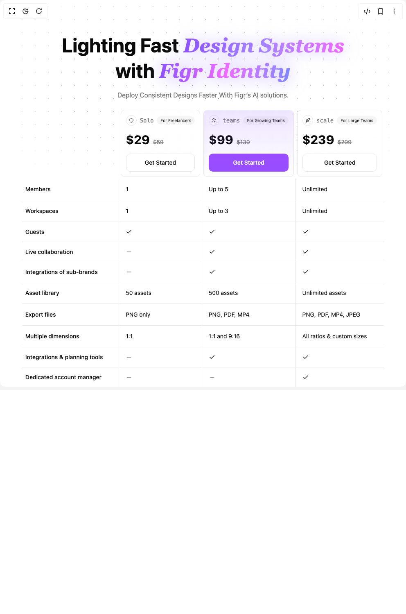

# Build Pricing Table in BuilderStudio

> Build this component in our Agentic IDE: [BuilderStudio](https://builderstudio.dev).
>
> Join the BuilderStudio community on [Discord](https://discord.gg/QdWeSGCqfe) and [Reddit](https://reddit.com/r/builderstudio).



## Component

- Author group: `efferd`
- Component: `pricing-table`
- Variant: `default`
- Rendered HTML snapshot: [`rendered.html`](rendered.html)

## BuilderStudio prompt

You are implementing a React component based on a component reference.

## Component identity

- Author: efferd
- Component slug: pricing-table
- Demo slug: default
- Title: pricing-table
- Description: 

## Goal

Recreate this component in a React + TypeScript + Tailwind CSS project. Preserve the visual layout, spacing, colors, border radius, shadows, interaction behavior, animation behavior, responsive behavior, and dark mode behavior shown in the rendered demo.

## Implementation requirements

- Use React and TypeScript.
- Use Tailwind CSS classes whenever possible.
- Keep the component self-contained unless the source files require helper components.
- If the source uses CSS variables, custom CSS, animations, or keyframes, include them.
- If the source uses external packages, list and use the required packages.
- Preserve accessibility attributes, button semantics, links, keyboard behavior, and ARIA attributes when visible in the source.
- Do not replace the component with a simplified placeholder.
- Return complete production-ready code.

## Dependencies

No reference metadata available.

## Rendered DOM snapshot

This is the rendered demo HTML extracted from the live preview. Use it to verify structure, class names, visible content, and layout.

```html
<div id="root"><div class="w-screen min-h-screen flex justify-center items-center"><div class="w-screen min-h-screen flex justify-center items-center"><div class="relative min-h-screen overflow-hidden px-4 py-20"><div class="absolute inset-0 z-[-10] size-full max-h-102 opacity-50 [mask-image:radial-gradient(ellipse_at_center,var(--background),transparent)]" style="background-image: radial-gradient(var(--foreground) 1px, transparent 1px); background-size: 32px 32px;"></div><div class="relative mx-auto flex max-w-4xl flex-col items-center text-center"><h1 class="text-3xl leading-tight font-bold text-balance sm:text-5xl">Lighting Fast <i class="bg-gradient-to-r from-violet-500 via-violet-400 to-fuchsia-400 bg-clip-text font-serif font-extrabold text-transparent drop-shadow-[0_0_18px_rgba(167,139,250,0.55)]">Design Systems</i><br>with <i class="bg-gradient-to-r from-violet-500 via-fuchsia-400 to-indigo-400 bg-clip-text font-serif font-extrabold text-transparent drop-shadow-[0_0_22px_rgba(167,139,250,0.75)]">Figr Identity</i></h1><p class="text-muted-foreground mt-4 max-w-2xl text-pretty">Deploy Consistent Designs Faster With Figr’s AI solutions.</p></div><div data-slot="table-container" class="relative w-full overflow-x-auto"><table class="w-full text-sm mx-auto my-5 max-w-5xl"><thead data-slot="table-header"><tr data-slot="table-row"><th></th><th class="p-1"><div class="bg-background supports-[backdrop-filter]:bg-background/40 relative h-full overflow-hidden rounded-lg border p-3 font-normal backdrop-blur-xs"><div class="flex items-center gap-2"><div class="flex items-center justify-center rounded-full border p-1.5"><svg xmlns="http://www.w3.org/2000/svg" width="24" height="24" viewBox="0 0 24 24" fill="none" stroke="currentColor" stroke-width="2" stroke-linecap="round" stroke-linejoin="round" class="lucide lucide-shield h-3 w-3" aria-hidden="true"><path d="M20 13c0 5-3.5 7.5-7.66 8.95a1 1 0 0 1-.67-.01C7.5 20.5 4 18 4 13V6a1 1 0 0 1 1-1c2 0 4.5-1.2 6.24-2.72a1.17 1.17 0 0 1 1.52 0C14.51 3.81 17 5 19 5a1 1 0 0 1 1 1z"></path></svg></div><h3 class="text-muted-foreground font-mono text-sm">Solo</h3><div class="inline-flex items-center transition-colors focus:outline-none focus:ring-2 focus:ring-ring focus:ring-offset-2 border-transparent bg-secondary text-secondary-foreground hover:bg-secondary/80 ml-auto rounded-full border px-2 py-0.5 text-[10px] font-normal">For Freelancers</div></div><div class="mt-4 flex items-baseline gap-2"><span class="text-3xl font-bold">$29</span><span class="text-muted-foreground text-sm line-through">$59</span></div><div class="relative z-10 mt-4"><button class="inline-flex items-center justify-center whitespace-nowrap text-sm font-medium ring-offset-background transition-colors focus-visible:outline-none focus-visible:ring-2 focus-visible:ring-ring focus-visible:ring-offset-2 disabled:pointer-events-none disabled:opacity-50 border border-input bg-background hover:bg-accent hover:text-accent-foreground h-11 px-8 w-full rounded-lg">Get Started</button></div></div></th><th class="p-1"><div class="bg-background supports-[backdrop-filter]:bg-background/40 relative h-full overflow-hidden rounded-lg border p-3 font-normal backdrop-blur-xs after:pointer-events-none after:absolute after:-inset-0.5 after:rounded-[inherit] after:bg-gradient-to-b after:from-violet-500/15 after:to-transparent after:blur-[2px]"><div class="flex items-center gap-2"><div class="flex items-center justify-center rounded-full border p-1.5"><svg xmlns="http://www.w3.org/2000/svg" width="24" height="24" viewBox="0 0 24 24" fill="none" stroke="currentColor" stroke-width="2" stroke-linecap="round" stroke-linejoin="round" class="lucide lucide-users h-3 w-3" aria-hidden="true"><path d="M16 21v-2a4 4 0 0 0-4-4H6a4 4 0 0 0-4 4v2"></path><circle cx="9" cy="7" r="4"></circle><path d="M22 21v-2a4 4 0 0 0-3-3.87"></path><path d="M16 3.13a4 4 0 0 1 0 7.75"></path></svg></div><h3 class="text-muted-foreground font-mono text-sm">teams</h3><div class="inline-flex items-center transition-colors focus:outline-none focus:ring-2 focus:ring-ring focus:ring-offset-2 border-transparent bg-secondary text-secondary-foreground hover:bg-secondary/80 ml-auto rounded-full border px-2 py-0.5 text-[10px] font-normal">For Growing Teams</div></div><div class="mt-4 flex items-baseline gap-2"><span class="text-3xl font-bold">$99</span><span class="text-muted-foreground text-sm line-through">$139</span></div><div class="relative z-10 mt-4"><button class="inline-flex items-center justify-center whitespace-nowrap text-sm font-medium ring-offset-background transition-colors focus-visible:outline-none focus-visible:ring-2 focus-visible:ring-ring focus-visible:ring-offset-2 disabled:pointer-events-none disabled:opacity-50 h-11 px-8 w-full rounded-lg border-violet-700/60 bg-violet-600/80 text-white hover:bg-violet-600">Get Started</button></div></div></th><th class="p-1"><div class="bg-background supports-[backdrop-filter]:bg-background/40 relative h-full overflow-hidden rounded-lg border p-3 font-normal backdrop-blur-xs"><div class="flex items-center gap-2"><div class="flex items-center justify-center rounded-full border p-1.5"><svg xmlns="http://www.w3.org/2000/svg" width="24" height="24" viewBox="0 0 24 24" fill="none" stroke="currentColor" stroke-width="2" stroke-linecap="round" stroke-linejoin="round" class="lucide lucide-rocket h-3 w-3" aria-hidden="true"><path d="M4.5 16.5c-1.5 1.26-2 5-2 5s3.74-.5 5-2c.71-.84.7-2.13-.09-2.91a2.18 2.18 0 0 0-2.91-.09z"></path><path d="m12 15-3-3a22 22 0 0 1 2-3.95A12.88 12.88 0 0 1 22 2c0 2.72-.78 7.5-6 11a22.35 22.35 0 0 1-4 2z"></path><path d="M9 12H4s.55-3.03 2-4c1.62-1.08 5 0 5 0"></path><path d="M12 15v5s3.03-.55 4-2c1.08-1.62 0-5 0-5"></path></svg></div><h3 class="text-muted-foreground font-mono text-sm">scale</h3><div class="inline-flex items-center transition-colors focus:outline-none focus:ring-2 focus:ring-ring focus:ring-offset-2 border-transparent bg-secondary text-secondary-foreground hover:bg-secondary/80 ml-auto rounded-full border px-2 py-0.5 text-[10px] font-normal">For Large Teams</div></div><div class="mt-4 flex items-baseline gap-2"><span class="text-3xl font-bold">$239</span><span class="text-muted-foreground text-sm line-through">$299</span></div><div class="relative z-10 mt-4"><button class="inline-flex items-center justify-center whitespace-nowrap text-sm font-medium ring-offset-background transition-colors focus-visible:outline-none focus-visible:ring-2 focus-visible:ring-ring focus-visible:ring-offset-2 disabled:pointer-events-none disabled:opacity-50 border border-input bg-background hover:bg-accent hover:text-accent-foreground h-11 px-8 w-full rounded-lg">Get Started</button></div></div></th></tr></thead><tbody data-slot="table-body" class="[&amp;_tr]:divide-x [&amp;_tr]:border-b"><tr data-slot="table-row"><th data-slot="table-head" class="p-2 text-left align-middle font-medium whitespace-nowrap">Members</th><td data-slot="table-cell" class="p-4 align-middle whitespace-nowrap">1</td><td data-slot="table-cell" class="p-4 align-middle whitespace-nowrap">Up to 5</td><td data-slot="table-cell" class="p-4 align-middle whitespace-nowrap">Unlimited</td></tr><tr data-slot="table-row"><th data-slot="table-head" class="p-2 text-left align-middle font-medium whitespace-nowrap">Workspaces</th><td data-slot="table-cell" class="p-4 align-middle whitespace-nowrap">1</td><td data-slot="table-cell" class="p-4 align-middle whitespace-nowrap">Up to 3</td><td data-slot="table-cell" class="p-4 align-middle whitespace-nowrap">Unlimited</td></tr><tr data-slot="table-row"><th data-slot="table-head" class="p-2 text-left align-middle font-medium whitespace-nowrap">Guests</th><td data-slot="table-cell" class="p-4 align-middle whitespace-nowrap"><svg xmlns="http://www.w3.org/2000/svg" width="24" height="24" viewBox="0 0 24 24" fill="none" stroke="currentColor" stroke-width="2" stroke-linecap="round" stroke-linejoin="round" class="lucide lucide-check size-4" aria-hidden="true"><path d="M20 6 9 17l-5-5"></path></svg></td><td data-slot="table-cell" class="p-4 align-middle whitespace-nowrap"><svg xmlns="http://www.w3.org/2000/svg" width="24" height="24" viewBox="0 0 24 24" fill="none" stroke="currentColor" stroke-width="2" stroke-linecap="round" stroke-linejoin="round" class="lucide lucide-check size-4" aria-hidden="true"><path d="M20 6 9 17l-5-5"></path></svg></td><td data-slot="table-cell" class="p-4 align-middle whitespace-nowrap"><svg xmlns="http://www.w3.org/2000/svg" width="24" height="24" viewBox="0 0 24 24" fill="none" stroke="currentColor" stroke-width="2" stroke-linecap="round" stroke-linejoin="round" class="lucide lucide-check size-4" aria-hidden="true"><path d="M20 6 9 17l-5-5"></path></svg></td></tr><tr data-slot="table-row"><th data-slot="table-head" class="p-2 text-left align-middle font-medium whitespace-nowrap">Live collaboration</th><td data-slot="table-cell" class="p-4 align-middle whitespace-nowrap"><svg xmlns="http://www.w3.org/2000/svg" width="24" height="24" viewBox="0 0 24 24" fill="none" stroke="currentColor" stroke-width="2" stroke-linecap="round" stroke-linejoin="round" class="lucide lucide-minus text-muted-foreground size-4" aria-hidden="true"><path d="M5 12h14"></path></svg></td><td data-slot="table-cell" class="p-4 align-middle whitespace-nowrap"><svg xmlns="http://www.w3.org/2000/svg" width="24" height="24" viewBox="0 0 24 24" fill="none" stroke="currentColor" stroke-width="2" stroke-linecap="round" stroke-linejoin="round" class="lucide lucide-check size-4" aria-hidden="true"><path d="M20 6 9 17l-5-5"></path></svg></td><td data-slot="table-cell" class="p-4 align-middle whitespace-nowrap"><svg xmlns="http://www.w3.org/2000/svg" width="24" height="24" viewBox="0 0 24 24" fill="none" stroke="currentColor" stroke-width="2" stroke-linecap="round" stroke-linejoin="round" class="lucide lucide-check size-4" aria-hidden="true"><path d="M20 6 9 17l-5-5"></path></svg></td></tr><tr data-slot="table-row"><th data-slot="table-head" class="p-2 text-left align-middle font-medium whitespace-nowrap">Integrations of sub-brands</th><td data-slot="table-cell" class="p-4 align-middle whitespace-nowrap"><svg xmlns="http://www.w3.org/2000/svg" width="24" height="24" viewBox="0 0 24 24" fill="none" stroke="currentColor" stroke-width="2" stroke-linecap="round" stroke-linejoin="round" class="lucide lucide-minus text-muted-foreground size-4" aria-hidden="true"><path d="M5 12h14"></path></svg></td><td data-slot="table-cell" class="p-4 align-middle whitespace-nowrap"><svg xmlns="http://www.w3.org/2000/svg" width="24" height="24" viewBox="0 0 24 24" fill="none" stroke="currentColor" stroke-width="2" stroke-linecap="round" stroke-linejoin="round" class="lucide lucide-check size-4" aria-hidden="true"><path d="M20 6 9 17l-5-5"></path></svg></td><td data-slot="table-cell" class="p-4 align-middle whitespace-nowrap"><svg xmlns="http://www.w3.org/2000/svg" width="24" height="24" viewBox="0 0 24 24" fill="none" stroke="currentColor" stroke-width="2" stroke-linecap="round" stroke-linejoin="round" class="lucide lucide-check size-4" aria-hidden="true"><path d="M20 6 9 17l-5-5"></path></svg></td></tr><tr data-slot="table-row"><th data-slot="table-head" class="p-2 text-left align-middle font-medium whitespace-nowrap">Asset library</th><td data-slot="table-cell" class="p-4 align-middle whitespace-nowrap">50 assets</td><td data-slot="table-cell" class="p-4 align-middle whitespace-nowrap">500 assets</td><td data-slot="table-cell" class="p-4 align-middle whitespace-nowrap">Unlimited assets</td></tr><tr data-slot="table-row"><th data-slot="table-head" class="p-2 text-left align-middle font-medium whitespace-nowrap">Export files</th><td data-slot="table-cell" class="p-4 align-middle whitespace-nowrap">PNG only</td><td data-slot="table-cell" class="p-4 align-middle whitespace-nowrap">PNG, PDF, MP4</td><td data-slot="table-cell" class="p-4 align-middle whitespace-nowrap">PNG, PDF, MP4, JPEG</td></tr><tr data-slot="table-row"><th data-slot="table-head" class="p-2 text-left align-middle font-medium whitespace-nowrap">Multiple dimensions</th><td data-slot="table-cell" class="p-4 align-middle whitespace-nowrap">1:1</td><td data-slot="table-cell" class="p-4 align-middle whitespace-nowrap">1:1 and 9:16</td><td data-slot="table-cell" class="p-4 align-middle whitespace-nowrap">All ratios &amp; custom sizes</td></tr><tr data-slot="table-row"><th data-slot="table-head" class="p-2 text-left align-middle font-medium whitespace-nowrap">Integrations &amp; planning tools</th><td data-slot="table-cell" class="p-4 align-middle whitespace-nowrap"><svg xmlns="http://www.w3.org/2000/svg" width="24" height="24" viewBox="0 0 24 24" fill="none" stroke="currentColor" stroke-width="2" stroke-linecap="round" stroke-linejoin="round" class="lucide lucide-minus text-muted-foreground size-4" aria-hidden="true"><path d="M5 12h14"></path></svg></td><td data-slot="table-cell" class="p-4 align-middle whitespace-nowrap"><svg xmlns="http://www.w3.org/2000/svg" width="24" height="24" viewBox="0 0 24 24" fill="none" stroke="currentColor" stroke-width="2" stroke-linecap="round" stroke-linejoin="round" class="lucide lucide-check size-4" aria-hidden="true"><path d="M20 6 9 17l-5-5"></path></svg></td><td data-slot="table-cell" class="p-4 align-middle whitespace-nowrap"><svg xmlns="http://www.w3.org/2000/svg" width="24" height="24" viewBox="0 0 24 24" fill="none" stroke="currentColor" stroke-width="2" stroke-linecap="round" stroke-linejoin="round" class="lucide lucide-check size-4" aria-hidden="true"><path d="M20 6 9 17l-5-5"></path></svg></td></tr><tr data-slot="table-row"><th data-slot="table-head" class="p-2 text-left align-middle font-medium whitespace-nowrap">Dedicated account manager</th><td data-slot="table-cell" class="p-4 align-middle whitespace-nowrap"><svg xmlns="http://www.w3.org/2000/svg" width="24" height="24" viewBox="0 0 24 24" fill="none" stroke="currentColor" stroke-width="2" stroke-linecap="round" stroke-linejoin="round" class="lucide lucide-minus text-muted-foreground size-4" aria-hidden="true"><path d="M5 12h14"></path></svg></td><td data-slot="table-cell" class="p-4 align-middle whitespace-nowrap"><svg xmlns="http://www.w3.org/2000/svg" width="24" height="24" viewBox="0 0 24 24" fill="none" stroke="currentColor" stroke-width="2" stroke-linecap="round" stroke-linejoin="round" class="lucide lucide-minus text-muted-foreground size-4" aria-hidden="true"><path d="M5 12h14"></path></svg></td><td data-slot="table-cell" class="p-4 align-middle whitespace-nowrap"><svg xmlns="http://www.w3.org/2000/svg" width="24" height="24" viewBox="0 0 24 24" fill="none" stroke="currentColor" stroke-width="2" stroke-linecap="round" stroke-linejoin="round" class="lucide lucide-check size-4" aria-hidden="true"><path d="M20 6 9 17l-5-5"></path></svg></td></tr><tr data-slot="table-row"><th data-slot="table-head" class="p-2 text-left align-middle font-medium whitespace-nowrap">Access to help center</th><td data-slot="table-cell" class="p-4 align-middle whitespace-nowrap"><svg xmlns="http://www.w3.org/2000/svg" width="24" height="24" viewBox="0 0 24 24" fill="none" stroke="currentColor" stroke-width="2" stroke-linecap="round" stroke-linejoin="round" class="lucide lucide-check size-4" aria-hidden="true"><path d="M20 6 9 17l-5-5"></path></svg></td><td data-slot="table-cell" class="p-4 align-middle whitespace-nowrap"><svg xmlns="http://www.w3.org/2000/svg" width="24" height="24" viewBox="0 0 24 24" fill="none" stroke="currentColor" stroke-width="2" stroke-linecap="round" stroke-linejoin="round" class="lucide lucide-check size-4" aria-hidden="true"><path d="M20 6 9 17l-5-5"></path></svg></td><td data-slot="table-cell" class="p-4 align-middle whitespace-nowrap"><svg xmlns="http://www.w3.org/2000/svg" width="24" height="24" viewBox="0 0 24 24" fill="none" stroke="currentColor" stroke-width="2" stroke-linecap="round" stroke-linejoin="round" class="lucide lucide-check size-4" aria-hidden="true"><path d="M20 6 9 17l-5-5"></path></svg></td></tr><tr data-slot="table-row"><th data-slot="table-head" class="p-2 text-left align-middle font-medium whitespace-nowrap">Priority support</th><td data-slot="table-cell" class="p-4 align-middle whitespace-nowrap"><svg xmlns="http://www.w3.org/2000/svg" width="24" height="24" viewBox="0 0 24 24" fill="none" stroke="currentColor" stroke-width="2" stroke-linecap="round" stroke-linejoin="round" class="lucide lucide-minus text-muted-foreground size-4" aria-hidden="true"><path d="M5 12h14"></path></svg></td><td data-slot="table-cell" class="p-4 align-middle whitespace-nowrap">Business hours</td><td data-slot="table-cell" class="p-4 align-middle whitespace-nowrap">24/7 priority</td></tr><tr data-slot="table-row"><th data-slot="table-head" class="p-2 text-left align-middle font-medium whitespace-nowrap">Brand kit &amp; custom colors</th><td data-slot="table-cell" class="p-4 align-middle whitespace-nowrap"><svg xmlns="http://www.w3.org/2000/svg" width="24" height="24" viewBox="0 0 24 24" fill="none" stroke="currentColor" stroke-width="2" stroke-linecap="round" stroke-linejoin="round" class="lucide lucide-minus text-muted-foreground size-4" aria-hidden="true"><path d="M5 12h14"></path></svg></td><td data-slot="table-cell" class="p-4 align-middle whitespace-nowrap"><svg xmlns="http://www.w3.org/2000/svg" width="24" height="24" viewBox="0 0 24 24" fill="none" stroke="currentColor" stroke-width="2" stroke-linecap="round" stroke-linejoin="round" class="lucide lucide-check size-4" aria-hidden="true"><path d="M20 6 9 17l-5-5"></path></svg></td><td data-slot="table-cell" class="p-4 align-middle whitespace-nowrap"><svg xmlns="http://www.w3.org/2000/svg" width="24" height="24" viewBox="0 0 24 24" fill="none" stroke="currentColor" stroke-width="2" stroke-linecap="round" stroke-linejoin="round" class="lucide lucide-check size-4" aria-hidden="true"><path d="M20 6 9 17l-5-5"></path></svg></td></tr><tr data-slot="table-row"><th data-slot="table-head" class="p-2 text-left align-middle font-medium whitespace-nowrap">Advanced analytics</th><td data-slot="table-cell" class="p-4 align-middle whitespace-nowrap"><svg xmlns="http://www.w3.org/2000/svg" width="24" height="24" viewBox="0 0 24 24" fill="none" stroke="currentColor" stroke-width="2" stroke-linecap="round" stroke-linejoin="round" class="lucide lucide-minus text-muted-foreground size-4" aria-hidden="true"><path d="M5 12h14"></path></svg></td><td data-slot="table-cell" class="p-4 align-middle whitespace-nowrap"><svg xmlns="http://www.w3.org/2000/svg" width="24" height="24" viewBox="0 0 24 24" fill="none" stroke="currentColor" stroke-width="2" stroke-linecap="round" stroke-linejoin="round" class="lucide lucide-check size-4" aria-hidden="true"><path d="M20 6 9 17l-5-5"></path></svg></td><td data-slot="table-cell" class="p-4 align-middle whitespace-nowrap"><svg xmlns="http://www.w3.org/2000/svg" width="24" height="24" viewBox="0 0 24 24" fill="none" stroke="currentColor" stroke-width="2" stroke-linecap="round" stroke-linejoin="round" class="lucide lucide-check size-4" aria-hidden="true"><path d="M20 6 9 17l-5-5"></path></svg></td></tr><tr data-slot="table-row"><th data-slot="table-head" class="p-2 text-left align-middle font-medium whitespace-nowrap">Storage space</th><td data-slot="table-cell" class="p-4 align-middle whitespace-nowrap">1 GB</td><td data-slot="table-cell" class="p-4 align-middle whitespace-nowrap">20 GB</td><td data-slot="table-cell" class="p-4 align-middle whitespace-nowrap">1 TB</td></tr><tr data-slot="table-row"><th data-slot="table-head" class="p-2 text-left align-middle font-medium whitespace-nowrap">User roles &amp; permissions</th><td data-slot="table-cell" class="p-4 align-middle whitespace-nowrap"><svg xmlns="http://www.w3.org/2000/svg" width="24" height="24" viewBox="0 0 24 24" fill="none" stroke="currentColor" stroke-width="2" stroke-linecap="round" stroke-linejoin="round" class="lucide lucide-minus text-muted-foreground size-4" aria-hidden="true"><path d="M5 12h14"></path></svg></td><td data-slot="table-cell" class="p-4 align-middle whitespace-nowrap"><svg xmlns="http://www.w3.org/2000/svg" width="24" height="24" viewBox="0 0 24 24" fill="none" stroke="currentColor" stroke-width="2" stroke-linecap="round" stroke-linejoin="round" class="lucide lucide-check size-4" aria-hidden="true"><path d="M20 6 9 17l-5-5"></path></svg></td><td data-slot="table-cell" class="p-4 align-middle whitespace-nowrap"><svg xmlns="http://www.w3.org/2000/svg" width="24" height="24" viewBox="0 0 24 24" fill="none" stroke="currentColor" stroke-width="2" stroke-linecap="round" stroke-linejoin="round" class="lucide lucide-check size-4" aria-hidden="true"><path d="M20 6 9 17l-5-5"></path></svg></td></tr><tr data-slot="table-row"><th data-slot="table-head" class="p-2 text-left align-middle font-medium whitespace-nowrap">Custom integrations (API access)</th><td data-slot="table-cell" class="p-4 align-middle whitespace-nowrap"><svg xmlns="http://www.w3.org/2000/svg" width="24" height="24" viewBox="0 0 24 24" fill="none" stroke="currentColor" stroke-width="2" stroke-linecap="round" stroke-linejoin="round" class="lucide lucide-minus text-muted-foreground size-4" aria-hidden="true"><path d="M5 12h14"></path></svg></td><td data-slot="table-cell" class="p-4 align-middle whitespace-nowrap"><svg xmlns="http://www.w3.org/2000/svg" width="24" height="24" viewBox="0 0 24 24" fill="none" stroke="currentColor" stroke-width="2" stroke-linecap="round" stroke-linejoin="round" class="lucide lucide-minus text-muted-foreground size-4" aria-hidden="true"><path d="M5 12h14"></path></svg></td><td data-slot="table-cell" class="p-4 align-middle whitespace-nowrap"><svg xmlns="http://www.w3.org/2000/svg" width="24" height="24" viewBox="0 0 24 24" fill="none" stroke="currentColor" stroke-width="2" stroke-linecap="round" stroke-linejoin="round" class="lucide lucide-check size-4" aria-hidden="true"><path d="M20 6 9 17l-5-5"></path></svg></td></tr><tr data-slot="table-row"><th data-slot="table-head" class="p-2 text-left align-middle font-medium whitespace-nowrap">White-label option</th><td data-slot="table-cell" class="p-4 align-middle whitespace-nowrap"><svg xmlns="http://www.w3.org/2000/svg" width="24" height="24" viewBox="0 0 24 24" fill="none" stroke="currentColor" stroke-width="2" stroke-linecap="round" stroke-linejoin="round" class="lucide lucide-minus text-muted-foreground size-4" aria-hidden="true"><path d="M5 12h14"></path></svg></td><td data-slot="table-cell" class="p-4 align-middle whitespace-nowrap"><svg xmlns="http://www.w3.org/2000/svg" width="24" height="24" viewBox="0 0 24 24" fill="none" stroke="currentColor" stroke-width="2" stroke-linecap="round" stroke-linejoin="round" class="lucide lucide-minus text-muted-foreground size-4" aria-hidden="true"><path d="M5 12h14"></path></svg></td><td data-slot="table-cell" class="p-4 align-middle whitespace-nowrap"><svg xmlns="http://www.w3.org/2000/svg" width="24" height="24" viewBox="0 0 24 24" fill="none" stroke="currentColor" stroke-width="2" stroke-linecap="round" stroke-linejoin="round" class="lucide lucide-check size-4" aria-hidden="true"><path d="M20 6 9 17l-5-5"></path></svg></td></tr><tr data-slot="table-row"><th data-slot="table-head" class="p-2 text-left align-middle font-medium whitespace-nowrap">Training &amp; onboarding sessions</th><td data-slot="table-cell" class="p-4 align-middle whitespace-nowrap"><svg xmlns="http://www.w3.org/2000/svg" width="24" height="24" viewBox="0 0 24 24" fill="none" stroke="currentColor" stroke-width="2" stroke-linecap="round" stroke-linejoin="round" class="lucide lucide-minus text-muted-foreground size-4" aria-hidden="true"><path d="M5 12h14"></path></svg></td><td data-slot="table-cell" class="p-4 align-middle whitespace-nowrap">1 session</td><td data-slot="table-cell" class="p-4 align-middle whitespace-nowrap">Unlimited sessions</td></tr></tbody></table></div></div></div></div></div>
```

## Reference source files

No reference source files were available.
