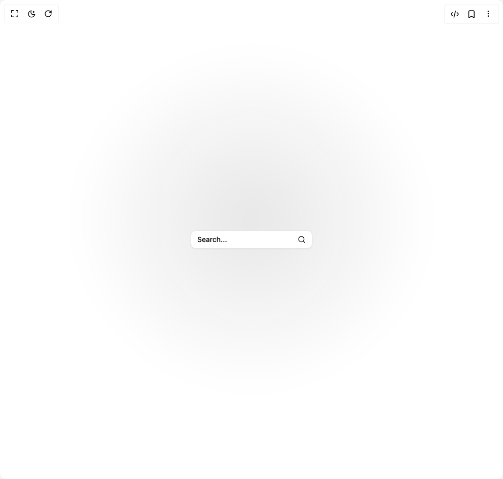

# Build Search Modal in BuilderStudio

> Build this component in our Agentic IDE: [BuilderStudio](https://builderstudio.dev).
>
> Join the BuilderStudio community on [Discord](https://discord.gg/QdWeSGCqfe) and [Reddit](https://reddit.com/r/builderstudio).



## Component

- Author group: `efferd`
- Component: `search-modal`
- Variant: `default`
- Rendered HTML snapshot: [`rendered.html`](rendered.html)

## BuilderStudio prompt

You are implementing a React component based on a component reference.

## Component identity

- Author: efferd
- Component slug: search-modal
- Demo slug: default
- Title: search-modal
- Description: 

## Goal

Recreate this component in a React + TypeScript + Tailwind CSS project. Preserve the visual layout, spacing, colors, border radius, shadows, interaction behavior, animation behavior, responsive behavior, and dark mode behavior shown in the rendered demo.

## Implementation requirements

- Use React and TypeScript.
- Use Tailwind CSS classes whenever possible.
- Keep the component self-contained unless the source files require helper components.
- If the source uses CSS variables, custom CSS, animations, or keyframes, include them.
- If the source uses external packages, list and use the required packages.
- Preserve accessibility attributes, button semantics, links, keyboard behavior, and ARIA attributes when visible in the source.
- Do not replace the component with a simplified placeholder.
- Return complete production-ready code.

## Dependencies

No reference metadata available.

## Rendered DOM snapshot

This is the rendered demo HTML extracted from the live preview. Use it to verify structure, class names, visible content, and layout.

```html
<div id="root"><div class="w-screen min-h-screen flex justify-center items-center"><div class="w-screen min-h-screen flex justify-center items-center"><div class="relative flex min-h-screen w-full items-center justify-center px-4"><button class="inline-flex items-center whitespace-nowrap rounded-lg text-sm font-medium transition-colors outline-offset-2 focus-visible:outline-2 focus-visible:outline-ring/70 disabled:pointer-events-none disabled:opacity-50 [&amp;_svg]:pointer-events-none [&amp;_svg]:shrink-0 border border-input bg-background shadow-sm shadow-black/5 hover:bg-accent hover:text-accent-foreground relative h-9 w-60 justify-between px-3 py-2" type="button" aria-haspopup="dialog" aria-expanded="false" aria-controls="radix-«r0»" data-state="closed" data-slot="dialog-trigger"><span class="inline-flex">Search...</span><span class="sr-only">Search</span><svg xmlns="http://www.w3.org/2000/svg" width="24" height="24" viewBox="0 0 24 24" fill="none" stroke="currentColor" stroke-width="2" stroke-linecap="round" stroke-linejoin="round" class="lucide lucide-search size-4" aria-hidden="true"><circle cx="11" cy="11" r="8"></circle><path d="m21 21-4.3-4.3"></path></svg></button><div aria-hidden="true" class="pointer-events-none absolute -top-10 left-1/2 -z-10 size-full -translate-x-1/2 rounded-full bg-[radial-gradient(ellipse_at_center,--theme(--color-foreground/.1),transparent_50%)] blur-[30px]"></div></div></div></div></div>
```

## Reference source files

No reference source files were available.
